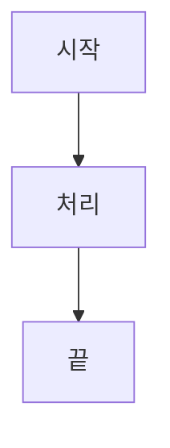

# CLAUDE.md

이 파일은 Claude Code (claude.ai/code)가 이 저장소에서 작업할 때 참고하는 가이드이다.

## 프로젝트 개요

Next.js 15 (App Router) 기반의 **완전한 정적 사이트**로 구축된 한국어 투자 인사이트 블로그. 모든 콘텐츠는 빌드 시점에 생성되며, 백엔드 서버 없이 CDN/정적 호스팅으로 배포된다.

## 개발 명령어

### 애플리케이션 실행
```bash
# 개발 서버 (정적 데이터 자동 생성 후 Next.js dev 서버 시작)
npm run dev

# 프로덕션 빌드 (정적 데이터 생성, 사이트 빌드, sitemap/RSS/robots 생성)
npm run build

# 프로덕션 빌드 로컬 미리보기
npm run start
# 참고: 'npx serve out'으로 out/ 디렉토리의 정적 파일을 서빙한다
```

### 코드 품질
```bash
# 타입 검사
npm run check

# 린트
npm run lint
```

### 성능 테스트
```bash
# Lighthouse CI 성능 테스트 실행
npm run test:performance
```

### README 생성
```bash
# Docker를 사용하여 로컬에서 README.md 생성
make generate-readme

# Makefile 명령어 목록 확인
make help
```

**요구사항**:
- Docker가 설치되어 있고 실행 중이어야 한다
- GitHub Actions와 동일한 Docker 이미지 사용 (`kenshin579/readme-generator:latest`)
- `contents/` 디렉토리의 블로그 글 기반으로 README.md를 생성한다

**에러 시나리오**:
- **Docker 미설치**: Mac/Windows는 Docker Desktop, Linux는 Docker Engine 설치
- **Docker 데몬 미실행**: Docker Desktop을 시작하거나 `sudo systemctl start docker` 실행

### Playwright 로컬 테스트
`npm run start` 실행 후 MCP Playwright로 빌드를 검증한다:

**기본 네비게이션 테스트**:
- `http://localhost:3000`으로 이동
- 카테고리 페이지 탐색
- 블로그 글 상세 페이지 확인
- 검색 및 필터 기능 테스트

**시각적 검증**:
- 주요 페이지 스크린샷 캡처
- 반응형 디자인 확인
- 한글 텍스트 렌더링 확인 (UTF-8 인코딩)

**접근성 테스트**:
- 자동 접근성 검사 실행
- 키보드 네비게이션 확인
- ARIA 라벨 및 역할 확인

**Playwright 명령어 예시**:
```typescript
// 홈페이지 이동 및 확인
await mcp_playwright.navigate({ url: 'http://localhost:3000' })
await mcp_playwright.screenshot({ name: 'homepage', fullPage: true })

// 블로그 글 페이지 테스트
await mcp_playwright.click({ selector: 'a[href*="/stock/"]' })
await mcp_playwright.screenshot({ name: 'blog-post' })

// 검색 기능 확인
await mcp_playwright.fill({ selector: 'input[type="search"]', value: '투자' })
```

## 아키텍처 개요

### 정적 사이트 아키텍처

이 애플리케이션은 **Next.js Static Export** (`output: 'export'`)를 사용한다:

- **빌드 시점 데이터 생성** (`scripts/`):
  - `generateStaticData.ts`: 마크다운 파일을 JSON 데이터 파일로 변환
  - `generateSitemap.ts`: sitemap.xml 생성
  - `generateRssFeed.ts`: RSS 피드 생성
  - `generateRobots.ts`: robots.txt 생성

- **Next.js 정적 생성** (`src/app/`):
  - 모든 페이지가 빌드 시점에 HTML로 사전 렌더링
  - 서버 사이드 런타임 불필요
  - CDN/정적 호스팅(Netlify)으로 배포

- **빌드 출력** (`out/`):
  - 모든 페이지의 정적 HTML 파일
  - `public/data/`의 JSON 데이터 파일
  - 모든 에셋 번들링 및 최적화

이 아키텍처의 장점:
- 서버 비용 제로 (Node.js 서버 불필요)
- CDN을 통한 무한 확장성
- 빠른 로딩 속도 (정적 파일)
- 간단한 배포 프로세스

### 콘텐츠 관리 시스템

블로그 글은 frontmatter가 포함된 **마크다운 기반**이다:
- 위치: `contents/{category}/{slug}/index.md`
- 카테고리: `etc/`, `etf/`, `stock/`, `weekly/`
- Frontmatter 필드:
  ```yaml
  title: string
  description: string
  date: YYYY-MM-DD
  update: YYYY-MM-DD (선택)
  category: string
  tags: array
  series: string (선택)
  ```

**빌드 시점 데이터 생성 흐름**:
1. `npm run dev` 또는 `npm run build`가 `scripts/generateStaticData.ts`를 실행
2. 스크립트가 `contents/` 디렉토리의 모든 마크다운 파일을 스캔
3. `gray-matter`로 마크다운 파일 파싱
4. 콘텐츠를 JSON으로 변환하여 `public/data/`에 저장:
   - `posts.json`: 모든 블로그 글의 메타데이터와 콘텐츠
   - `categories.json`: 카테고리 목록과 글 수
   - `series.json`: 시리즈 정보와 관련 글
   - `tags.json`: 태그 클라우드 데이터
5. 페이지에서 JSON 파일을 import하거나 클라이언트 컴포넌트에서 fetch로 접근

### Path Aliases

TypeScript 경로 해석:
- `@/*` → `./src/*`

### 데이터 레이어

**정적 JSON 파일** (데이터베이스 불필요):
- `scripts/generateStaticData.ts`에 의해 빌드 시점에 생성
- `public/data/` 디렉토리에 저장
- 직접 import 또는 클라이언트 컴포넌트에서 fetch()로 접근
- 파일 목록:
  - `posts.json`: 모든 블로그 글 (~103개)
  - `categories.json`: 카테고리 메타데이터
  - `series.json`: 시리즈 정보
  - `tags.json`: 태그 메타데이터

### UI 컴포넌트

**shadcn/ui** 컴포넌트 (`src/components/ui/`):
- Tailwind 스타일이 적용된 Radix UI 프리미티브
- 이 파일들은 수동으로 수정하지 않는다
- 새 컴포넌트 추가 시 `npx shadcn@latest add {component}` 사용

**커스텀 컴포넌트** (`src/components/`):
- `blog-post-card.tsx`: 블로그 글 미리보기 카드
- `markdown-renderer.tsx`: 구문 강조가 포함된 마크다운 렌더러
- `series-navigation.tsx`: 시리즈 글 네비게이션
- `related-posts.tsx`: 관련 콘텐츠 추천

### 데이터 접근 패턴

**API 라우트 없음** - 모든 데이터는 정적:

**정적 파일** (빌드 시점에 생성):
- `/data/posts.json` - 모든 블로그 글과 메타데이터
- `/data/categories.json` - 카테고리 정보
- `/data/series.json` - 시리즈 정보
- `/data/tags.json` - 태그 메타데이터
- `/rss.xml` - RSS 피드 (`scripts/generateRssFeed.ts`로 생성)
- `/sitemap.xml` - 사이트맵 (`scripts/generateSitemap.ts`로 생성)
- `/robots.txt` - robots.txt (`scripts/generateRobots.ts`로 생성)

**데이터 접근 방식**:
- Server Components: `src/lib/blog-server.ts`를 통한 파일 시스템 직접 접근
- Client Components: JSON 파일 fetch 또는 직접 import
- 모든 필터링/검색은 클라이언트 사이드에서 처리

### 주요 라이브러리 (`src/lib/`)

- `blog-server.ts`: 파일 시스템에서 서버 사이드 데이터 페칭
- `blog-client.ts`: JSON 파일에서 클라이언트 사이드 데이터 페칭
- `markdown.ts`: remark/rehype를 사용한 마크다운 처리
- `json-ld-schema.ts`: SEO용 구조화 데이터
- `content-management.ts`: 콘텐츠 유틸리티
- `image-utils.ts`: 이미지 최적화 헬퍼
- `date-utils.ts`: 날짜 포맷팅 유틸리티
- `error-handling.ts` / `error-boundary.tsx`: 에러 관리

### 빌드 스크립트 (`scripts/`)

- `generateStaticData.ts`: 마크다운을 JSON으로 변환하는 메인 스크립트
- `generateSitemap.ts`: SEO용 sitemap.xml 생성
- `generateRssFeed.ts`: RSS 피드 생성
- `generateRobots.ts`: robots.txt 생성

## Git 커밋 규칙

**중요**: 모든 커밋은 `.github/git-commit-instructions.md`의 한국어 커밋 메시지 형식을 따른다:

```
[#이슈번호] <간결한 설명>

* 추가 세부 정보 (선택사항)
* 변경 사항의 동기나 맥락 설명
```

**커밋 타입** (선택):
- `feat`: 새로운 기능 추가
- `fix`: 버그 수정
- `docs`: 문서 수정
- `style`: 코드 포맷팅 (코드 변경 없음)
- `refactor`: 코드 리팩토링
- `test`: 테스트 코드
- `chore`: 빌드/도구 변경, 의존성 관리

**예시**:
```
[#3000] 주식 가격 조회 API 구현

* REST API 엔드포인트 `/api/v1/stocks/{symbol}/price` 추가
* KIS API 연동하여 실시간 주식 가격 데이터 조회 기능 구현
```

```
[#3001] fix: 주식 정보 조회 시 발생하는 NullPointerException 수정
```

## 콘텐츠 작성 규칙

### 다이어그램 형식

**중요**: 블로그 콘텐츠(`contents/` 내 `index.md`)에 다이어그램을 작성할 때 ASCII art를 절대 사용하지 않는다. 항상 Mermaid 코드 블록을 사용한다.

**예시**:
````markdown

````

**지원 다이어그램 유형**:
- `graph TD/LR` - 플로우차트
- `sequenceDiagram` - 시퀀스 다이어그램
- `classDiagram` - 클래스 다이어그램
- `stateDiagram-v2` - 상태 다이어그램
- `pie` - 파이 차트
- `gantt` - 간트 차트

### 마지막 섹션 제목

블로그 글의 마지막 본문 섹션(참고 자료 직전)은 "정리"가 아닌 **"마무리"**로 작성한다.

### 이모지 사용 금지

**중요**: 블로그 콘텐츠(`contents/`, `docs/`)에 이모지(😰, 😊, 🎉, ✅ 등)를 사용하지 않는다. AI가 생성한 느낌을 주어 신뢰도가 떨어지므로, 텍스트만으로 표현한다.

- Mermaid 다이어그램 노드 라벨에 이모지 금지
- 테이블 셀에 이모지 금지
- 본문 텍스트에 이모지 금지

## 주요 참고사항

### TypeScript 설정
- 프로덕션 빌드에서 빌드 에러와 TypeScript 에러는 **무시**된다 (`ignoreBuildErrors: true`)
- 개발 중에는 `npm run check`를 실행하여 문제를 조기에 발견한다

### 콘텐츠 업데이트
- 마크다운 파일은 **빌드 시점에만** JSON으로 변환된다
- 콘텐츠 변경 사항을 확인하려면:
  - **개발 환경**: `npm run dev`를 재시작하여 JSON 파일 재생성
  - **프로덕션**: `npm run build`를 실행하여 전체 사이트 재빌드
- 콘텐츠 업데이트는 전체 재빌드와 재배포가 필요하다

### 이미지 최적화
- `public/contents/`의 이미지는 1년 캐시 헤더로 제공된다
- Next.js Image 컴포넌트는 `unoptimized: true` 설정
- WebP/AVIF 형식 권장

### 환경 변수
선택적 변수 (필요 시 `.env.local` 생성):
```bash
SITE_URL=https://investment.advenoh.pe.kr # SEO/사이트맵 생성에 사용 (기본값: localhost)
```

**참고**: 데이터베이스나 백엔드 설정 불필요 - 완전한 정적 사이트이다.

### SEO 및 애널리틱스
- 구조화 데이터: `src/lib/json-ld-schema.ts`의 JSON-LD 스키마
- Google Analytics: 태그 ID `G-9LNH27K1YS`
- 페이지별 Open Graph 태그 설정
- 블로그 글 기반 사이트맵 자동 생성

### 성능 최적화
- Radix UI 및 아이콘 라이브러리의 패키지 import 최적화
- 정적 에셋 캐싱 (`/contents` 및 `/_next/static`에 1년)
- `next.config.ts`에 보안 헤더 설정
- 압축 활성화

### 텍스트 인코딩 (한글 콘텐츠)

**인코딩 표준**: 모든 파일은 반드시 UTF-8로 인코딩되어야 한다

**Claude Code로 한글/이모지 콘텐츠 생성 시**:

1. **파일 생성 후 인코딩 확인**:
   ```bash
   file -I path/to/file.md
   # 정상: text/plain; charset=utf-8
   # 문제: application/octet-stream; charset=binary
   ```

2. **인코딩이 깨진 경우 (charset=binary)**:
   ```bash
   # 방법 1: Bash heredoc 사용 (가장 안정적)
   cat > file.md << 'EOF'
   한글 내용...
   EOF

   # 방법 2: Write tool로 재생성
   # (대부분 정상 작동하지만, file -I로 확인 필요)
   ```

3. **예방 팁**:
   - Write tool은 일반적으로 UTF-8을 정상 처리한다
   - 매우 큰 파일(>5000줄)은 인코딩을 확인한다
   - Cursor/VSCode 사용 시 기본 인코딩은 UTF-8이어야 한다
   - 시스템 로케일(`.zshrc` 설정)은 Claude Code 도구에 영향을 주지 않는다

4. **빠른 인코딩 확인**:
   ```bash
   # 인코딩 확인
   file -I docs/**/*.md

   # 한글 콘텐츠 확인
   cat file.md | head -20
   ```

**참고**: 이 프로젝트의 한글 콘텐츠 위치:
- 문서 (`docs/`)
- 마크다운 블로그 글 (`contents/`)
- 코드 주석 및 커밋 메시지

## 파일 구조

```
/
├── src/                   # Next.js 소스
│   ├── app/              # App Router 페이지
│   │   ├── [category]/  # 동적 카테고리 페이지
│   │   └── series/      # 시리즈 페이지
│   ├── components/       # React 컴포넌트
│   │   └── ui/          # shadcn/ui 컴포넌트 (수동 수정 금지)
│   ├── lib/             # 유틸리티 및 헬퍼
│   └── middleware.ts    # Next.js 미들웨어
├── scripts/              # 빌드 시점 스크립트
│   ├── generateStaticData.ts  # 마크다운 → JSON 변환
│   ├── generateSitemap.ts     # 사이트맵 생성
│   ├── generateRssFeed.ts     # RSS 피드 생성
│   └── generateRobots.ts      # robots.txt 생성
├── contents/             # 마크다운 블로그 글
│   ├── etc/
│   ├── etf/
│   ├── stock/
│   └── weekly/
├── docs/                 # 기획 및 작업 문서
│   ├── start/           # 작업 중인 PRD/초안
│   └── done/            # 완료된 문서
├── public/               # 정적 에셋
│   ├── contents/        # 블로그 글 이미지
│   └── data/            # 생성된 JSON 파일 (gitignored)
│       ├── posts.json
│       ├── categories.json
│       ├── series.json
│       └── tags.json
└── out/                  # 빌드 출력 (gitignored)
    └── (정적 HTML 파일)
```

**참고**: `server/`, `shared/`, `src/app/api/` 디렉토리는 정적 사이트 전환 시 제거되었다.

## 개발 워크플로우

1. **블로그 글 추가** (3단계 프로세스):
   - **Step 1: PRD 작성** — `docs/start/`에 PRD(기획 문서)를 작성하여 목차, 논의사항 등을 정리
   - **Step 2: 초안 작성** — PRD 기반으로 `docs/start/{slug}/index.md` 형태로 블로그 초안을 작성 (리뷰 후 `contents/{category}/`로 이동 용이). 이 단계에서는 `contents/`에 직접 넣지 않는다
   - **Step 3: 최종 반영** — 사용자가 리뷰 완료 후 `contents/{category}/{slug}/index.md`로 이동. 완료된 PRD는 `docs/done/`으로 이동
   - `npm run dev` 재시작 또는 빌드를 실행하여 JSON 데이터 재생성

2. **컴포넌트 추가**:
   - `src/components/`에 생성하거나 CLI로 shadcn 컴포넌트 추가

3. **빌드 스크립트 수정**:
   - `scripts/` 디렉토리의 파일 수정
   - `npm run build`로 출력 확인

4. **타입 검사**:
   - 커밋 전 `npm run check` 실행

5. **테스트**:
   - `npm run build`로 정적 사이트 생성
   - `npm run start`로 로컬 미리보기 (http://localhost:3000에서 서빙)
   - **Playwright로 검증**: MCP Playwright를 사용하여 로컬 빌드 테스트
     - 페이지 이동 및 렌더링 확인
     - 인터랙티브 기능 테스트 (검색, 필터, 네비게이션)
     - 스크린샷 캡처를 통한 시각적 검증
     - 접근성 및 성능 확인

6. **배포**:
   - main 브랜치에 push
   - CI/CD가 자동으로 빌드 후 Netlify에 배포

## 공통 작업

### 새 블로그 카테고리 추가
1. 디렉토리 생성: `contents/{new-category}/`
2. 적절한 frontmatter가 포함된 마크다운 파일 추가
3. `npm run dev` 또는 `npm run build`를 실행하여 데이터 재생성
4. 카테고리는 콘텐츠에서 자동 검색된다

### 빌드 스크립트 수정
1. `scripts/` 디렉토리의 파일 수정
2. 주로 수정하는 스크립트:
   - `generateStaticData.ts`: 데이터 생성 로직
   - `generateSitemap.ts`: 사이트맵 생성 규칙
   - `generateRssFeed.ts`: RSS 피드 커스터마이징
3. `npm run build`로 테스트

### 시리즈 작업
1. 글의 frontmatter에 `series: "series-name"` 추가
2. 같은 시리즈 이름을 가진 모든 글이 자동으로 그룹핑된다
3. 시리즈 데이터는 `public/data/series.json`에 생성
4. `src/lib/blog-server.ts` 또는 `blog-client.ts`를 통해 접근

### 정적 데이터 구조 업데이트
1. `scripts/generateStaticData.ts` 수정
2. 필요 시 TypeScript 타입 업데이트
3. 데이터를 사용하는 컴포넌트 업데이트
4. 전체 재빌드로 테스트: `npm run build`

### Playwright 로컬 테스트 워크플로우
1. **빌드 및 서빙**:
   ```bash
   npm run build
   npm run start  # http://localhost:3000에서 서빙
   ```

2. **Playwright 자동 테스트**:
   - 주요 페이지 이동 및 콘텐츠 렌더링 확인
   - 인터랙티브 기능 테스트 (검색, 필터, 카테고리 네비게이션)
   - 스크린샷 캡처를 통한 시각적 회귀 테스트
   - 한글 텍스트 인코딩(UTF-8) 확인
   - 접근성 준수 확인

3. **공통 테스트 시나리오**:
   ```typescript
   // 홈페이지 확인
   navigate → screenshot → 한글 텍스트 확인

   // 블로그 글 페이지
   navigate → 글 링크 클릭 → 콘텐츠 확인 → screenshot

   // 카테고리 필터링
   navigate → 카테고리 선택 → 필터링 결과 확인

   // 검색 기능
   navigate → 검색 입력 → 결과 확인

   // 시리즈 네비게이션
   시리즈 글로 이동 → 이전/다음 링크 확인
   ```

4. **성능 검증**:
   - Playwright를 사용하여 페이지 로드 시간 측정
   - 콘솔 에러 또는 경고 확인
   - 모든 이미지 정상 로드 확인
