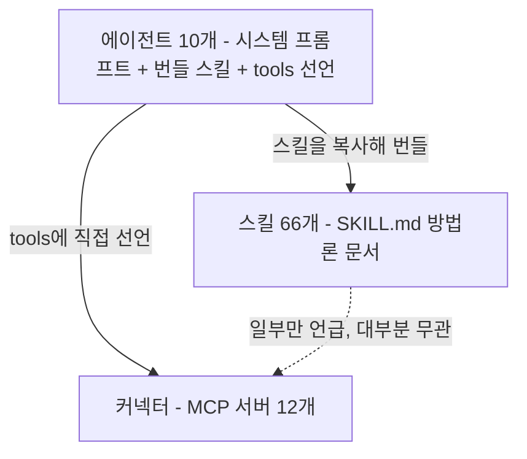

# 1. 들어가며

Anthropic이 `anthropics/financial-services`라는 저장소를 공개했다. 투자은행, 주식 리서치, 사모펀드, 자산관리 업무를 Claude Code에서 돌리도록 만든 플러그인 묶음이다. 설치는 명령어 두 줄이면 끝난다.

문제는 그다음이다. 이 도구가 FactSet이나 Capital IQ 같은 유료 데이터 구독을 전제하고 만들어졌다면 개인 투자자에게는 그림의 떡이고, 유료 데이터 없이도 돌아간다면 그렇게 나온 리포트를 얼마나 믿을 수 있는지가 다시 문제가 된다.

그래서 두 개를 골라 실제로 돌렸다. 미국 반도체 섹터 리포트 하나(`equity-research:sector-overview`), 구글 피어 비교 하나(`financial-analysis:comps-analysis`). 유료 커넥터는 하나도 붙이지 않았고, 나온 결과물의 수치를 각각 62개·70개 항목으로 쪼개 SEC 공시 원문과 대조했다.

이 글은 시리즈의 첫 글이지만 **가장 마지막에 썼다.** 두 번 돌려보기 전에는 쓸 재료가 없었기 때문이다. 어떤 스킬이 있는지는 저장소 목록만 봐도 알 수 있지만, 프롬프트 한 줄이 결과를 어떻게 바꾸는지, 어디서 막히는지, 무엇이 어떤 식으로 틀리는지는 돌려봐야 나온다.

독자는 Claude Code를 이미 쓰고 있는 사람으로 잡았다. 그래서 설치 과정은 명령어 수준으로 압축하고, 지면은 5장부터 7장에 쓴다. 확인 기준일은 2026년 7월 26일이고, 마켓플레이스 저장소는 2026년 7월 22일 커밋 기준이다.

# 2. Claude 금융 스킬이란

## 2.1 anthropics/financial-services 저장소

Anthropic이 직접 운영하는 플러그인 마켓플레이스다. 마켓플레이스 이름은 `claude-for-financial-services`이고, 등록된 플러그인은 **20개**다. `.claude-plugin/marketplace.json`의 `plugins` 배열을 세면 정확히 20개가 나온다.

구성은 이렇다.

| 구분 | 개수 | 위치 |
|---|---|---|
| 업종별 플러그인 | 7 | `plugins/vertical-plugins/` |
| 에이전트 플러그인 | 10 | `plugins/agent-plugins/` |
| 파트너 제작 플러그인 | 2 | `plugins/partner-built/` |
| 기타 | 1 | 저장소 루트 |

기타 1개는 `claude-for-msft-365-install`인데, 리서치용 스킬이 아니라 Claude Microsoft 365 애드인을 프로비저닝하는 설치 도구다. 나머지 19개와 성격이 다르고 저장소 루트에 따로 놓여 있다.

스킬 디렉토리는 전부 세면 117개인데, **고유한 이름은 66개다.** 나머지 51개는 복사본이다. 스킬은 업종별 플러그인에서 한 번 작성하고, 에이전트 플러그인이 자기가 쓰는 것만 골라 복사해 번들로 갖고 있는 구조다. README도 이렇게 설명한다.

> Authored once in the verticals; each agent bundles a synced copy of the ones it needs.

빌드 단계는 없다. 전부 마크다운과 JSON 파일이고, 설치하면 `~/.claude/plugins/marketplaces/claude-for-financial-services/` 아래에 그대로 내려온다. **이건 나중에 중요해진다.** 이 글의 6장과 7장에서 하는 이야기 대부분이 `SKILL.md`를 직접 열어 읽은 결과다.

## 2.2 스킬 · 에이전트 · 커넥터 3층 구조

저장소는 세 층으로 나뉘어 있고, 층마다 성격이 다르다.



**스킬**은 `SKILL.md` 한 파일이다. 어떤 순서로 무엇을 조사하고 어떤 표를 만들라는 방법론이 적혀 있다. frontmatter의 `description`에 트리거 문구가 들어 있어서, 대화에서 관련된 요청이 나오면 자동으로 발동한다.

**에이전트**는 시스템 프롬프트 + 자기가 쓸 스킬 복사본 + `tools` 선언으로 이뤄진다. 워크플로 하나를 처음부터 끝까지 책임지는 단위다.

**커넥터**는 MCP 서버다. `financial-analysis` 플러그인의 `.mcp.json` 한 곳에 몰아넣고 나머지가 공유하는 구조이며, Daloopa · Morningstar · S&P Global(Kensho) · FactSet · Moody's · MT Newswires · Aiera · LSEG · PitchBook · Chronograph · Egnyte · Box **12개**가 선언돼 있다. README는 "MCP access may require a subscription or API key from the provider"라고 적어놨다. 즉 커넥터는 붙일 곳만 마련해둔 것이고, 실제로 붙이려면 각 벤더 계약이 필요하다.

사소하지만 확인한 김에 적어둔다. 이 `.mcp.json`은 **파싱되지 않는다.** `egnyte` 항목 뒤에 쉼표가 빠져 있어 JSON 문법 오류가 난다.

```
    "egnyte": {
      "type": "http",
      "url": "https://mcp-server.egnyte.com/mcp"
    }
    "box": {
```

README 본문은 커넥터를 11개라고 적어놨는데 표에는 12행이 있고 `.mcp.json`에도 12개가 들어 있다. 어차피 유료 계약 없이는 쓸 일이 없는 파일이라 이번 실행에는 영향이 없었지만, 커넥터를 실제로 붙일 사람은 이 파일부터 고쳐야 한다.

# 3. 설치하기

## 3.1 마켓플레이스 등록

Claude Code 세션 안에서 슬래시 명령으로 등록한다.

```
/plugin marketplace add anthropics/financial-services
```

터미널에서 하려면 CLI 형태도 있다.

```bash
claude plugin marketplace add anthropics/financial-services
```

## 3.2 플러그인 설치

필요한 것만 골라 설치한다. README는 `financial-analysis`를 먼저 깔라고 권한다. 공용 모델링 스킬과 커넥터 정의가 전부 여기 들어 있기 때문이다.

```
/plugin install financial-analysis@claude-for-financial-services
/plugin install equity-research@claude-for-financial-services
```

이 글에서 다루는 두 스킬은 각각 여기서 나온다. `comps-analysis`는 `financial-analysis`에, `sector-overview`는 `equity-research`에 있다.

## 3.3 설치 확인

```
/plugin
```

설치된 플러그인 목록이 나온다. 활성화 상태는 `~/.claude/settings.json`의 `enabledPlugins`에도 기록된다.

```json
"enabledPlugins": {
  "financial-analysis@claude-for-financial-services": true,
  "equity-research@claude-for-financial-services": true
}
```

설치 확인보다 중요한 건 **파일이 어디 내려왔는지 알아두는 것**이다.

```bash
ls ~/.claude/plugins/marketplaces/claude-for-financial-services/plugins/
# agent-plugins  partner-built  vertical-plugins
```

스킬 정의는 평범한 마크다운이라 그냥 읽힌다.

```bash
cat ~/.claude/plugins/marketplaces/claude-for-financial-services/plugins/\
vertical-plugins/financial-analysis/skills/comps-analysis/SKILL.md
```

이 글에서 가장 실용적인 조언 하나를 미리 꺼내자면, **처음 쓰는 스킬은 돌리기 전에 `SKILL.md`를 한 번 읽으라는 것**이다. 이번 시리즈에서 얻은 발견 중 여러 개가 산출물이 아니라 스킬 정의 파일에서 나왔다. 어떤 데이터 소스를 쓰라고 규정하는지, 산출물 형식이 무엇인지, 어떤 품질 규칙을 갖고 있는지는 전부 여기 적혀 있고, 그중 하나는 **아예 틀린 규칙**이었다.

# 4. 어떤 스킬이 있나

이 장은 지도다. 100개 넘는 스킬을 하나씩 설명하는 건 의미가 없고, 어느 묶음에 무엇이 있는지만 알면 필요할 때 찾아갈 수 있다.

## 4.1 업종별 스킬 묶음

7개다. 실제로 설치해 `ls`로 센 스킬 개수를 함께 적는다.

| 플러그인 | 스킬 | 대표 스킬 |
|---|---|---|
| `financial-analysis` | 13 | `comps-analysis`(피어 비교), `dcf-model`(현금흐름할인), `lbo-model`(차입매수), `audit-xls`(스프레드시트 수식 감사) |
| `equity-research` | 9 | `sector-overview`(섹터 리포트), `earnings-analysis`(실적 업데이트), `initiating-coverage`(커버리지 개시 리포트) |
| `investment-banking` | 9 | `cim-builder`(투자설명서), `teaser`(티저), `merger-model`(합병 모델), `pitch-deck` |
| `private-equity` | 10 | `deal-screening`(딜 스크리닝), `ic-memo`(투자심의 메모), `returns-analysis`(수익률 분석) |
| `wealth-management` | 6 | `portfolio-rebalance`(리밸런싱), `tax-loss-harvesting`(손실 수확), `financial-plan` |
| `fund-admin` | 6 | `gl-recon`(총계정원장 대사), `nav-tieout`(NAV 대조), `roll-forward` |
| `operations` | 2 | `kyc-doc-parse`, `kyc-rules` |

개인 투자자가 실제로 쓸 만한 건 앞의 두 개다. `investment-banking` 아래쪽은 사내 데이터와 템플릿이 있어야 굴러가는 것들이다.

## 4.2 전문 에이전트

10개다. 각 에이전트는 `agents/<이름>.md` 한 파일에 시스템 프롬프트를 갖고 있고, frontmatter의 `tools`에 쓸 도구를 선언한다. **여기가 이 글에서 두 번째로 중요한 표다.**

| 에이전트 | 하는 일 | `tools` 선언 |
|---|---|---|
| `pitch-agent` | 피치덱 초안 전 과정 | `mcp__capiq__*` |
| `market-researcher` | 섹터·테마 리서치 | `mcp__capiq__*`, `mcp__factset__*` |
| `earnings-reviewer` | 실적 발표 처리 | `mcp__factset__*`, `mcp__daloopa__*` |
| `meeting-prep-agent` | 고객 미팅 브리핑 | `mcp__crm__*`, `mcp__capiq__*` |
| `model-builder` | 엑셀 모델 신규 구축 | `mcp__capiq__*`, `mcp__daloopa__*` |
| `gl-reconciler` | 원장 대사 | `mcp__internal-gl__*`, `mcp__subledger__*` |
| `kyc-screener` | 온보딩 서류 심사 | `mcp__screening__*` |
| `month-end-closer` | 월마감 | `mcp__internal-gl__*` |
| `statement-auditor` | LP 명세서 감사 | `mcp__nav__*` |
| `valuation-reviewer` | 분기 밸류에이션 검토 | `mcp__portfolio__*` |

**10개 전부가 `tools`에 MCP 커넥터를 선언한다.** 예외가 없다. 6.1절에서 이 표로 다시 돌아온다.

에이전트는 자기가 쓰는 스킬을 복사해 번들로 갖고 있다. 예를 들어 `market-researcher`는 `sector-overview`, `comps-analysis`, `competitive-analysis`, `idea-generation`, `pptx-author` 다섯 개를 안에 담고 있다. 스킬 디렉토리가 117개인데 고유 이름은 66개인 이유가 이것이다.

## 4.3 파트너 제작 스킬

두 개는 데이터 벤더가 직접 만들었다.

- **`lseg`** (8개) — `bond-relative-value`, `swap-curve-strategy`, `fx-carry-trade`, `option-vol-analysis`, `macro-rates-monitor`, `bond-futures-basis`, `fixed-income-portfolio`, `equity-research`. 채권·금리·FX·옵션 쪽에 몰려 있다.
- **`sp-global`** (3개) — `tear-sheet`(기업 한 장 요약), `earnings-preview-beta`, `funding-digest`.

파트너 스킬은 유료 의존이 감춰져 있지 않다. `tear-sheet`의 description은 아예 이렇게 시작한다.

> Generate professional company tear sheets using S&P Capital IQ data via the Kensho LLM-ready API MCP server.

벤더 이름과 MCP 서버가 설명문에 그대로 박혀 있으니 계약 없이는 못 쓴다는 게 명확하다. 애매한 쪽은 오히려 업종별 스킬이고, 그 이야기가 다음 장 다음이다.

# 5. 사용하는 방법

## 5.1 스킬 호출하기

스킬은 두 가지로 발동한다. `description`에 적힌 트리거 문구가 대화에 나오면 자동으로 걸리고, 이름으로 직접 부를 수도 있다. `sector-overview`의 description을 보면 트리거가 나열돼 있다.

> Triggers on "sector overview", "industry report", "market landscape", "sector analysis", "industry deep dive", or "thematic research".

이번에는 두 번 모두 이름을 지정해 호출했고, 인자를 한 번 넘겼다.

```
US semiconductor sector overview. Data as of 2026-07-26.
No paid MCP connectors (FactSet/CapIQ/Daloopa) are available — use SEC EDGAR
filings, company IR pages, and web search instead. Cite a source for every
number. If a figure cannot be sourced, mark it UNSOURCED rather than estimating.
Output as markdown.
```

**두 번 다 중간에 아무것도 묻지 않고 끝까지 달렸다.** 이게 무조건 좋은 건 아니다. `comps-analysis`의 `SKILL.md`에는 "사용자와 단계별로 확인하라"는 섹션이 따로 있고, 헤더 배치 후 / 원시 입력 후 / 영업지표 계산 후 / 멀티플 계산 후 **네 번** 확인받으라고 명시한다. 마지막 줄은 대문자로 강조까지 돼 있다.

> `Do NOT build the entire sheet end-to-end and then present it`

실제 실행은 정확히 그 금지된 방식이었고, 확인 요청은 0회였다. 스킬 정의에 적힌 상호작용 규정에 강제력이 없다는 뜻이다.

실무적으로는 이렇게 정리된다. **스킬은 되묻지 않으므로 제약 조건을 인자에 전부 넣어야 한다.** 데이터 기준일, 쓸 수 있는 소스, 산출물 형식, 출처 규칙을 처음 한 번에 다 적어야 한다. 나중에 고치려면 다시 돌려야 한다.

## 5.2 프롬프트 한 줄이 결과를 바꾼다

위 인자에서 결과를 가장 크게 바꾼 건 이 두 문장이었다.

```
Cite a source for every number. If a figure cannot be sourced, mark it
UNSOURCED rather than estimating.
```

`sector-overview`는 이 지시를 지켰다. 출처를 못 찾은 고유 항목 11건을 `UNSOURCED`로 남겼고, 재무 표에서 값을 못 가져온 칸은 `not retrieved`로 비워뒀다. **0으로 채우거나 그럴듯한 숫자를 지어내지 않았다.** `UNSOURCED`가 붙은 항목 중에는 섹터 히스토리컬 P/E 밴드처럼 리포트의 결론을 좌우하는 것도 있었는데, 없다고 표시하고 넘어갔다.

`comps-analysis`도 마찬가지로 10건을 남겼는데 형태가 달랐다. 본문 여기저기에 인라인 태그를 박는 대신 **번호를 매긴 등록표 10행**으로 모으고, 각 행에 "왜 못 구했는지"와 "그래서 무엇을 말할 수 없는지"를 적었다. 같은 지시를 받고도 스킬에 따라 표현이 갈린다.

여기서 조심할 게 있다. **대조 실험을 하지 않았으므로 "스킬이 알아서 출처를 붙인다"고 말할 수 없다.** 이 지시를 뺐을 때 어떻게 동작하는지는 이번 두 번의 실행으로는 알 수 없다. 확인된 건 "지시하면 지킨다"까지다.

그래도 이 한 줄의 가치는 분명하다. 검증 단계에서 확인해야 할 목록을 산출물이 스스로 만들어준다. 무엇을 모르는지 아는 리포트와 모르는 걸 채워 넣은 리포트는 검증 비용이 완전히 다르다.

## 5.3 산출물 형태를 지정하면 잃는 것

두 번 다 `Output as markdown`을 지시했다. 블로그에 실으려면 마크다운이 편하니까. 그런데 이게 생각보다 비싼 선택이었다.

`comps-analysis`의 `SKILL.md`는 661줄인데, description 첫 줄부터 산출물을 "in Excel/spreadsheet format"이라고 못박는다. 그리고 **최소 161줄이 엑셀 전용 지시다.** 셀 주소 기반 레이아웃, Office JS와 openpyxl 수식 작성법, 폰트와 색상 코드(`#1F4E79`, `#D9E1F2`), 서식 체크리스트, 엑셀 수식 레퍼런스가 줄줄이 들어 있다.

마크다운으로 달라고 하면 이게 전부 사장된다. 그중 아깝게 사라지는 것이 하나 있다.

> Every derived value (margin, multiple, statistic) MUST be an Excel formula referencing input cells — never a pre-computed number pasted in
>
> Why: the model must update automatically when an input changes. A hardcoded margin is a silent bug waiting to happen.

마크다운 표에는 수식이 없다. 그래서 나온 모든 값이 **계산이 끝난 상수**다. 스킬이 "언제 터질지 모르는 조용한 버그"라고 부른 바로 그 상태로 산출된다. 엑셀이었으면 입력 셀 하나만 고쳐도 표 전체가 다시 계산되고 원가를 어떻게 잡았는지 셀을 클릭해 확인할 수 있었을 텐데, 마크다운에서는 숫자 하나하나를 손으로 재현해야 검증이 된다.

`sector-overview`는 다른 방식으로 같은 일을 겪었다. 이 스킬의 Step 6은 산출물을 Word 또는 PowerPoint + Excel 부록 + 차트 3종(시장규모 워터폴, 경쟁 포지셔닝 매트릭스, 밸류에이션 스캐터)으로 규정하고, Important Notes에 "차트는 필수(Charts are essential)"라고까지 적어놨다. 마크다운으로 요청하자 **차트가 하나도 생성되지 않았다.**

정리하면 이렇다. **산출물 형식은 스킬 정의의 일부이고, 형식을 바꾸면 그 형식에 붙어 있던 품질 장치가 같이 빠진다.** 마크다운으로 받고 싶으면 빠지는 장치가 무엇인지 알고, 필요하면 프롬프트로 되살려야 한다. `comps-analysis`라면 "각 파생값의 계산식을 표 아래에 명시하라" 정도를 덧붙이는 식이다.

# 6. 유료 데이터라는 벽

## 6.1 커넥터 의존은 스킬이 아니라 에이전트 층에 있다

"금융 스킬은 유료 데이터 구독이 있어야 쓸 수 있다"는 말을 흔히 하는데, 직접 읽어보니 부정확하다. **층에 따라 다르다.**

`sector-overview`의 `SKILL.md`는 88줄이다. 여기서 데이터 소스 관련 단어를 전수 검색해봤다.

```bash
grep -i "mcp\|bloomberg\|edgar\|factset\|capiq\|kensho" \
  .../equity-research/skills/sector-overview/SKILL.md
# 결과 없음
```

**한 건도 안 나온다.** 이 스킬은 어떤 API를 쓸지, 어떤 데이터베이스에 붙을지를 아예 언급하지 않는다. Step 1부터 Step 6까지 전부 조사 항목 목록과 빈 표 템플릿이다. TAM을 조사하라, 밸류체인을 그려라, 상위 5~10개사 프로필 표를 채워라 — 데이터를 어디서 가져올지는 실행하는 쪽이 알아서 정한다.

즉 이 스킬은 **MCP가 없어서 실패한 게 아니라 애초에 MCP를 전제하지 않는다.**

반면 에이전트 정의는 다르다. 4.2절 표에 적은 대로 10개 전부가 frontmatter에 커넥터를 선언한다.

```
market-researcher.md  ->  tools: Read, Write, Edit, mcp__capiq__*, mcp__factset__*
earnings-reviewer.md  ->  tools: Read, Write, Edit, mcp__factset__*, mcp__daloopa__*
kyc-screener.md       ->  tools: Read, Grep, Glob, mcp__screening__*
```

여기서 재미있는 건 `market-researcher`가 번들로 담고 있는 스킬 중 하나가 바로 `sector-overview`라는 점이다. **같은 스킬인데 스킬 층에서 부르면 커넥터를 요구하지 않고, 에이전트 층에서 부르면 에이전트가 커넥터를 요구한다.**

실무적 결론은 이렇다. **유료 데이터 없이 쓰려면 에이전트가 아니라 스킬을 직접 호출한다.** 이번 두 번의 실행은 전부 스킬 직접 호출이었고, 커넥터 없이 끝까지 돌았다.

다만 확인하지 않은 것도 분명히 적어둔다. **에이전트는 이번에 한 번도 실행하지 않았다.** 선언된 MCP 도구가 없을 때 에이전트가 어떻게 동작하는지 — 그냥 도구 없이 진행하는지, 멈추는지 — 는 확인하지 못했다. 유료 커넥터를 붙였을 때 결과가 얼마나 달라지는지도 모른다. 위 서술은 파일에 적힌 선언을 읽은 것까지다.

## 6.2 스킬마다 데이터 소스 규정이 다르다

같은 마켓플레이스 안에서도 스킬 성격이 크게 갈린다. 두 스킬을 나란히 놓으면 이렇다.

| | `sector-overview` | `comps-analysis` |
|---|---|---|
| `SKILL.md` 분량 | 88줄 | 661줄 |
| 데이터 소스 규정 | **없음.** 조사 항목 목록과 빈 표 템플릿뿐 | **첫 섹션이 데이터 소스 위계.** `CRITICAL` + `READ FIRST` |
| 위계 | - | MCP → 블룸버그 → SEC EDGAR, **웹 검색을 1차 소스로 금지** |
| 실제 결과 | 2차·3차 웹 출처 혼재. SEC 공시와 X 게시물이 같은 문서 안에 근거로 공존 | 재무 수치는 웹 검색을 한 번도 거치지 않음. 전부 EDGAR 원문 |
| 검증 통과율 | 62개 중 33개 = **53%** | 70개 중 66개 = **94%** |

`comps-analysis`가 첫 섹션에 박아둔 규정은 이렇다.

> 1. FIRST: Check for MCP data sources - If S&P Kensho MCP, FactSet MCP, or Daloopa MCP are available, use them exclusively
> 2. DO NOT use web search if the above MCP data sources are available
> 3. ONLY if MCPs are unavailable: Then use Bloomberg Terminal, SEC EDGAR filings, or other institutional sources
> 4. NEVER use web search as a primary data source

**이 스킬은 MCP 부재 상황에 대한 설계된 답을 갖고 있고, 그 답이 실제로 작동했다.** MCP가 없음을 확인하고 3번 폴백으로 내려가 SEC EDGAR로 실행했다. 재무 수치 전체가 1차 자료라 접수번호로 원문 대조가 된다.

`sector-overview` 쪽에 품질 가드레일이 아예 없는 건 아니다. 워크플로 뒤에 `Important Notes` 다섯 줄이 있고, 그중 두 개는 이번 산출물에 실제로 반영됐다. 2026년 시장 전망치 3종의 편차를 두고 "평균내지 말라"고 경고한 부분과, "섹터 리포트는 빨리 낡는다, 외부 사용 전 날짜를 다시 확인하라"는 문구다. 프롬프트에 없던 내용이 산출물에 들어온 경로는 이 둘뿐이었다.

**하지만 규모가 다르다.** 다섯 줄짜리 참고 문구와 대문자로 시작하는 위계 규정은 결과에서 41%포인트 차이로 나타났다.

그래서 스킬을 처음 쓸 때의 순서는 이렇게 잡는다.

1. `SKILL.md`를 열어 데이터 소스 규정이 있는지 확인한다
2. 있으면 그 위계에서 내가 쓸 수 있는 등급이 어디인지 본다
3. 없으면 프롬프트로 직접 지정한다. "SEC EDGAR와 회사 IR만 쓰고 웹 검색은 보조로만" 같은 식이다

## 6.3 SEC EDGAR로 대체하기

유료 커넥터가 없을 때 실제로 쓸 수 있는 건 SEC EDGAR다. 두 번의 실행과 두 번의 검증에서 얻은 실무 지식을 정리한다. 전부 실측이다.

**인증이 필요 없다.** XBRL `companyfacts` API는 User-Agent 헤더만 붙이면 응답한다. API 키도 등록도 없다.

```bash
curl -s -H "User-Agent: your-email@example.com" \
  "https://data.sec.gov/api/xbrl/companyfacts/CIK0001045810.json"
```

이걸로 반도체 14개사, 빅테크 5개사의 분기 재무를 받았고 대조 결과 사실상 전부 정확했다. **미국 신고사의 재무제표 구간은 무료로도 1차 자료 품질이 나온다.**

문제는 그 바깥이다. 함정을 여섯 가지로 정리한다.

**첫째, 택소노미를 바꿔 재시도한다.** GlobalFoundries는 `us-gaap` 태그로 조회하면 아무것도 안 나온다. 외국 사기업이라 XBRL 팩트가 **`ifrs-full`**에 들어 있기 때문이다. `ifrs-full:Revenue`로 다시 조회하면 과거 분기가 나온다.

**둘째, 서식을 바꿔 재시도한다.** TSMC는 XBRL 팩트가 연간분까지만 태깅돼 있어 분기 조회가 안 된다. 그런데 **분기 실적 발표문 전문이 6-K로 EDGAR에 올라와 있다.** 접수번호 `0001046179-26-000451`이 2026년 2분기분이고, 회사가 직접 발표한 손익 표가 그대로 들어 있다. "XBRL에 없다"와 "EDGAR에 없다"는 다른 말이다.

**셋째, 태그가 조용히 낡는다. 이게 제일 위험하다.** 구글 매출은 `RevenueFromContractWithCustomerExcludingAssessedTax`로 태깅되다가 2025년 3월 분기를 마지막으로 `Revenues`로 옮겨갔다. **옛 태그를 조회하면 HTTP 200에 정상 JSON이 오는데, 최신값이 15개월 전 것이다.** 에러도 경고도 없다. 아마존 `GrossProfit`은 더 심하다. 최신 팩트가 **2009년**이다. 그대로 믿으면 최근 12개월 매출총이익이 57억 달러로 나온다(실제는 3,759억).

그래서 규칙은 하나다. **XBRL 값을 쓸 때는 반드시 `end` 날짜를 확인한다.** 값만 꺼내 쓰면 안 된다.

**넷째, 회사마다 태그가 다르다.** 감가상각비가 대표적이다. 아마존·메타·애플은 `DepreciationDepletionAndAmortization` 하나에 들어 있는데, 구글과 마이크로소프트는 `Depreciation`과 `AmortizationOfIntangibleAssets`로 분리돼 있다. 단일 태그로 5개사를 긁으면 **2개사의 EBITDA가 과소계상된다.** 매출도 마찬가지로 NVIDIA와 퀄컴은 `Revenues`, 나머지는 긴 태그를 쓴다.

**다섯째, XBRL에 아예 없는 것도 있다.** 메타의 발행주식수는 `dei`에도 `us-gaap`에도 없다. 결국 10-Q 원문 재무상태표에서 Class A 2,196M + Class B 342M을 읽어냈다. 자동화 파이프라인이었다면 메타는 시가총액도 멀티플도 산출 불가였을 것이다.

**여섯째, 4분기가 빠진다.** 대부분의 회사가 4분기를 별도 분기로 태깅하지 않고 연간 표기로만 낸다. 최근 12개월을 만들려면 **연간에서 9개월 누계를 빼는 역산**이 필요하다. 이번 comps 실행에서 5개사 전부가 이 뺄셈에 의존했다.

그리고 원리적 한계 하나. **SEC는 주가를 발행하지 않는다.** 모든 밸류에이션 멀티플의 분자는 시가총액이나 EV이고 둘 다 주가에서 나온다. 그래서 EDGAR만으로는 멀티플 표를 못 만든다. 이번에는 주가만 애그리게이터에서 받고, 시가총액은 애그리게이터 값을 가져다 쓰는 대신 **EDGAR 주식수 × 주가**로 직접 계산해 제3의 공표 시총과 대조했다. 그래도 남는 사실은 이렇다. **무료 경로에서 재무제표는 1차 자료인데 밸류에이션은 3차 자료에 걸린다.** 절반은 감사 추적이 되고 절반은 안 된다.

컨센서스 추정치와 히스토리컬 멀티플 밴드도 EDGAR로는 안 된다. 애널리스트 추정치는 공시 대상이 아니고, 과거 멀티플 시계열은 주가 시계열이 있어야 만들어진다. 그래서 두 번의 실행 모두 같은 자리에서 막혔다. **"오늘 피어 대비 비싸다"까지는 무료로 갈 수 있고, "자기 과거 대비 비싼가"는 못 간다.**

## 6.4 한국 종목은 왜 더 어려운가

**이번 시리즈에서 한국 종목은 시도하지 않았다.** 그래서 이 절은 실측이 아니라 예상되는 벽을 적는 것이다.

우선 무료 공시 데이터 자체는 있다. 금융감독원 DART OpenAPI가 재무제표와 공시 원문을 무료로 제공한다. 다만 EDGAR와 달리 **API 키 발급이 필요하다.** User-Agent 헤더만으로 되는 EDGAR보다 진입 단계가 하나 더 있다.

더 큰 문제는 스킬 쪽에 있을 것으로 본다.

- **스킬이 기대하는 항목이 국내 공시 체계와 다르다.** `comps-analysis`의 폴백 경로는 "SEC EDGAR filings"를 명시하고, 산출물은 접수번호(accession number)로 출처를 표기한다. 이 구조가 DART의 접수번호 체계와 자동으로 맞물리지는 않는다
- **XBRL 택소노미가 다르다.** 6.3절에서 본 태그 함정은 미국 `us-gaap` 기준으로 쌓은 지식이다. 한국 IFRS 공시에 그대로 적용되지 않는다
- **컨센서스와 섹터 멀티플은 국내에서도 유료 영역이다.** 미국에서 막힌 것과 같은 자리에서 똑같이 막힐 가능성이 높다

그래서 지금 시점의 정직한 서술은 이렇다. **미국 상장사는 이 스킬들의 무료 경로가 실제로 작동하는 것을 확인했고, 한국 종목은 확인하지 않았다.** 시도한다면 DART API를 감싸는 별도의 스킬이나 MCP 서버를 직접 만드는 쪽이 현실적일 것으로 보이지만, 이 역시 해보지 않은 추측이다.

# 7. AI 리포트 검증하기

## 7.1 환각보다 위험한 것

먼저 좋은 소식이다. **두 번의 실행 모두 출처 없이 숫자를 지어내지 않았다.** 못 구한 값은 `UNSOURCED`나 `not retrieved`로 남겼고 0으로 채우지 않았다. 흔히 걱정하는 종류의 환각은 나오지 않았다.

진짜 위험은 다른 데 있었다. **출처가 멀쩡히 달려 있는데 틀린 경우다.**

가장 극적인 사례 하나만 먼저 보자. `sector-overview` 산출물에는 "2026년 하이퍼스케일러 capex 약 $600B, 전년비 +70%"라는 문장이 있었고, 각주로 기사 링크가 달려 있었다. 블로그에 인용될 확률이 가장 높은 헤드라인 수치였다.

링크를 열었다. 없었다.

두 가지 방법으로 확인했다. 페이지를 자동으로 읽었더니 해당 언급이 없었고, 다시 `curl`로 원문 HTML 97,823바이트를 직접 받아 태그를 벗기고 본문 14,353자에서 `hyperscal`, `capex`, `capital expenditure`, `600`, `70%`를 전수 검색했다. `hyperscal`은 메모리 가격 이야기에서 한 번, `capex`는 정성적 서술로 한 번 나올 뿐 **달러 금액도 증가율도 없었다.** 값 자체도 맞지 않았다. 다른 출처들의 2026년 추정 범위는 $630B~$900B로, $600B는 그 아래였다.

각주가 붙어 있고 URL이 클릭되면 검증된 것처럼 보인다. **이게 함정이다.** 링크는 검증의 증거가 아니라 검증해야 할 대상이다.

## 7.2 틀리는 방식에는 유형이 있다

132개 항목(62 + 70)을 검증하면서 나온 실패를 유형으로 묶으면 여섯 가지다. 무작위로 틀리는 게 아니라 패턴이 있다.

**1. 인용된 기사에 그 숫자가 없다.** 위의 $600B 사례다. 같은 문장에 붙어 있던 "분기 capex 사상 첫 $100B 돌파"도 그 기사에 없었다. 다만 이건 별도 자료로 부분 확인은 됐다(Synergy Research 집계로 해당 분기 $142B).

**2. 낡은 판을 현재로 인용한다.** TSMC 파운드리 점유율 67.6%는 **1년 전 기사**의 값이었다. 산출물은 이걸 다른 곳의 72.3%와 나란히 놓고 "출처 간 충돌"이라 부르며 "상위 10사 기준 대 전체 시장 기준" 차이일 것이라는 주석까지 달았다. **있지도 않은 방법론 차이를 설명한 것이다.** 실제로는 그냥 연도가 달랐다.

전망치에서도 같은 일이 났다. SEMI 반도체 장비 시장 전망 중 2026년 값 $139B는 2024년 12월 발표된 구판이고, 2027년 값 $156B는 2025년 12월 신판에서 가져왔다. **서로 다른 빈티지의 전망을 같은 문단에 나란히 놓았다.** 신판의 2026년 값은 $145B로 상향돼 있었다.

**3. 다른 기관 수치에 엉뚱한 출처를 달았다.** $975B라는 2026년 전망치는 WSTS 전망으로 표기됐는데, 인용된 기사 본문에서는 Deloitte 전망으로 귀속돼 있었다. 값은 실재하고 기사도 실재하는데 기관 이름이 바뀌었다.

**4. 이상치는 잡았는데 원인 진단이 틀렸다.** 퀄컴의 분기 순이익($7,370M)이 영업이익($2,309M)보다 큰 것을 산출물이 정확히 짚어내고 "대규모 영업외 이익으로 추정"이라 적었다. 10-Q를 열어보니 **영업외 이익이 아니었다.** 세전이익은 오히려 영업이익보다 작았고, 원인은 이연법인세 평가충당금 환입 **$5.7B**였다. 비현금 세금 항목이다.

**공정하게 적자면 3건 중 2건은 맞았다.** NXP의 비정상적인 영업이익률은 "비경상 항목 포함" 추정이 맞았고(MEMS 사업부 매각차익 $627M), 인텔의 영업흑자·순손실 괴리도 "대규모 영업외 항목" 추정이 맞았다(미 정부 에스크로 주식 파생부채 평가손 $12.5B). **이상 탐지는 작동한다. 원인 확인이 작동하지 않는다.**

**5. 단일 태그만 믿고 성격을 오판한다.** `comps-analysis` 산출물은 아마존의 영업외수익 30,044을 두고 "주로 이자수익과 지분법이익이지 증권 평가이익이 아니다(평가이익은 522뿐)"라고 썼다. 10-Q 주석이 정반대를 말한다. 30,044의 93.6%인 28,127이 기타영업외손익이고, 그 대부분이 **앤스로픽 비상장 지분 평가이익**이다. 지분법손익은 아예 이 라인에 있지도 않고 법인세 아래 별도 라인이며 값도 마이너스다.

원인은 명확하다. `EquitySecuritiesFvNiGainLoss` 태그 하나만 조회했는데 앤스로픽 투자가 그 태그로 태깅되지 않아 522밖에 안 잡힌 것이다. 아이러니한 건 **같은 산출물이 다른 절에서 "태그 하나만 믿으면 안 된다"고 스스로 경고했다는 점**이다. 자기가 쓴 경고에 자기가 걸렸다.

**6. 스킬의 품질 규칙 자체가 틀렸다.** `comps-analysis`의 새너티 체크 항목은 이렇게 단언한다.

> **Margin test**: Gross margin > EBITDA margin > Net margin (always true by definition)

**"정의상 항상 참"은 거짓이다.** 구글이 반례다. 매출총이익률 60.9% > EBITDA 마진 38.9%까지는 맞는데 순이익률이 54.8%로 EBITDA 마진 위로 올라간다. 영업외수익이 크면 깨진다. 정의상 참인 것은 매출총이익 > 영업이익까지고 순이익은 영업외 항목 때문에 얼마든지 위로 튄다.

**하필 이 규칙을 믿었으면 그 실행의 최대 발견을 놓쳤을 것이다.** 항상 참이라고 하면 검사할 이유가 없고, 검사하지 않으면 구글 P/E가 왜곡돼 있다는 걸 모른 채 지나간다. 실제로 그 왜곡을 파고든 결과가 시리즈 세 번째 글의 본론이 됐다.

## 7.3 검증 체크리스트

위 여섯 유형에서 뽑아낸 실행 규칙이다. 순서대로 하면 된다.

**1. 스킬이 스스로 남긴 경고 목록부터 읽는다.** 두 산출물 모두 말미에 "검증 대기 목록"과 `UNSOURCED` 등록표를 남겼다. 검증에서 발견한 심각한 오류 상당수가 이미 그 목록에 올라 있었다. 가장 싼 검증이다.

**2. 헤드라인 수치는 링크를 열어 원문에서 문자열로 검색한다.** 페이지 요약을 믿지 말고 본문을 받아 숫자 자체를 찾는다. 인용하고 싶어지는 숫자일수록 1차 출처가 없고, 그래서 틀릴 확률이 높다.

**3. 전망치는 발행일과 기관명을 한 쌍으로 확인한다.** 값이 실재하고 기사도 실재하는데 연도가 다르거나 기관이 다른 경우가 여섯 유형 중 둘이었다. 같은 기관이 매년 전망을 갱신하므로 **"어느 판인지"까지 확인해야 한다.**

**4. 순이익이 영업이익보다 크면 거기서 멈춘다.** 이 한 줄만으로 이번에 세 건(구글·아마존·퀄컴)을 잡았다. 확인은 10-Q 손익계산서와 주석을 여는 것으로 끝난다.

**5. 재무 이상치는 추정에서 멈추지 말고 원문을 연다.** "대규모 영업외 항목으로 추정" 같은 문장이 산출물에 있으면 그건 미완의 작업이다. 원본 손익계산서와 주석까지 가면 대부분 그 자리에서 풀린다. 이번에는 세 건 다 풀렸고, 그 과정에서 산출물에 없던 설명을 얻었다.

**6. 판정이 하나만 나오면 다른 지표로 교차 확인한다.** P/E 하나만 봤으면 "구글이 제일 싸다"로 끝났을 것이다. EV/EBITDA를 나란히 놓았기 때문에 두 지표가 정반대를 가리키는 게 보였고, 그게 실마리가 됐다. **결론이 하나뿐인 표는 검증이 덜 된 표다.**

**7. XBRL은 `end` 날짜와 태그 구성을 확인한다.** 값만 꺼내면 15년 묵은 숫자를 받을 수 있다. 여러 회사를 비교할 때는 같은 항목에 회사마다 다른 태그가 쓰였는지도 봐야 한다.

**8. 스킬의 규칙도 검증 대상이다.** `SKILL.md`에 "always true by definition"이라 적혀 있어도 반례가 있을 수 있다. 스킬은 사람이 쓴 문서고 사람은 틀린다.

마지막으로 정직하게 덧붙일 것이 있다. **검증 자체도 한 번에 되지 않았다.**

이번 검증에서 판정이 세 번 번복됐다. 그중 하나는 "산술 모순"이라고 확신했던 항목이었는데, 다시 원문을 보니 모순이 아니라 **한 문장에 붙어 있던 2026년 성장률과 2027년 금액을 붙여 읽은 것**이었다. 판정 결과는 그대로 유지됐지만 이유가 완전히 틀렸었다. 같은 성격의 오류를 앞에서는 통과, 뒤에서는 불일치로 판정한 일관성 결함도 나와서 기준을 다시 잡고 재집계했다.

그리고 비용이 싸지 않다. **스킬 실행은 9분과 12분이었고, 검증은 그보다 훨씬 오래 걸렸다.** 그래도 이 비용을 치르지 않으면 표의 절반은 인용할 수 없다. 반대로 말하면, **확인 가능한 것을 확인하는 비용은 생각보다 싸다.** SEC EDGAR로 대조 가능한 구간은 두 번 다 사실상 전부 정확했고, 그 구간을 확인하는 데 드는 건 `curl` 몇 번이다.

# 8. 실제로 돌려본 결과

두 실행의 전체 기록은 각각 별도 글로 정리했다.

- [Claude로 반도체 섹터 리포트를 뽑고 수치 62개를 검증해봤다](/stock/us-semiconductor-sector-overview/) — `equity-research:sector-overview`. 출처가 달려 있는데 틀린 수치들의 유형을 사례로 다룬다
- [구글은 지금 싼가 - Claude comps 스킬로 빅테크 피어 비교](/stock/alphabet-comps-analysis/) — `financial-analysis:comps-analysis`. P/E와 EV/EBITDA가 정반대 판정을 내는 이유를 공시로 추적한다

실행 메트릭과 검증 결과를 나란히 놓으면 이렇다.

| | `sector-overview` | `comps-analysis` |
|---|---|---|
| 대상 | 미국 반도체 섹터 | 알파벳 + 피어 4사 |
| 소요 시간 | 8분 45초 | 11분 40초 |
| 도구 호출 | WebSearch 16, WebFetch 20, EDGAR 6 | EDGAR 14, Yahoo Finance 5, WebFetch 5 |
| 실패한 호출 | 3건 | 0건 |
| 산출물 | 마크다운 320줄 | 마크다운 432줄 |
| 검증 항목 | 62개 | 70개 |
| 일치 + 근사 | 33개 (**53%**) | 66개 (**94%**) |
| 불일치 | 15개 (24%) | 3개 (4%) |
| 스킬 자체 `UNSOURCED` | 11건 | 10건 |

**같은 마켓플레이스의 두 스킬인데 통과율이 53%와 94%로 갈린다.**

차이의 원인은 스킬의 똑똑함이 아니라 **6.2절에서 본 데이터 소스 규정**이다. `sector-overview`의 실패는 전부 2차·3차 웹 출처 구간에 몰려 있었고, `comps-analysis`는 그 구간을 애초에 밟지 않도록 설계돼 있었다. 그리고 그건 `SKILL.md`를 열어보면 실행 전에 알 수 있는 정보다.

주제 탓도 있다. 섹터 리포트는 시장 규모, 점유율, 전망치처럼 **공시에 존재하지 않는 항목**을 요구한다. 이런 건 아무리 잘 지시해도 협회·리서치 릴리스와 언론 보도에 의존할 수밖에 없다. 반대로 피어 비교는 요구 항목의 대부분이 공시에 있다. 즉 **주제에 따라 도달 가능한 정확도의 상한이 다르다.**

# 9. 마무리

처음에 던진 질문 두 개로 돌아간다.

**유료 데이터 없이 쓸 만한가.** 재무제표까지는 된다. SEC EDGAR는 무료이고 인증도 없으며, 미국 상장사의 분기 재무를 1차 자료로 받아올 수 있다. 택소노미와 서식을 바꿔 재시도하면 커버리지가 더 늘어난다. 대신 주가는 3차 출처에 걸리고, 컨센서스 추정치와 히스토리컬 멀티플 밴드는 아예 없다. **"피어 대비 비싸다"까지는 무료로 갈 수 있고 "그래서 사야 하나"는 못 간다.**

**어디까지 믿을 수 있나.** 1차 자료 구간은 믿을 만하고 그 바깥은 아니다. 두 번의 검증에서 EDGAR와 협회 릴리스로 확인 가능한 구간은 사실상 전부 정확했고, 문제는 언제나 그 바깥에서 나왔다. 그리고 어느 구간이 어디에 걸릴지는 **돌리기 전에 `SKILL.md`를 열어보면 대체로 알 수 있다.**

그래서 이 도구를 이렇게 쓰기로 했다.

**첫째, 에이전트가 아니라 스킬을 직접 부른다.** 커넥터 의존은 에이전트 층에 있다.

**둘째, 처음 쓰는 스킬은 `SKILL.md`부터 읽는다.** 데이터 소스 규정이 있는지, 산출물 형식이 무엇인지, 어떤 품질 규칙을 갖고 있는지를 본다. 이번 시리즈의 발견 중 절반은 산출물이 아니라 이 파일에서 나왔다.

**셋째, 제약을 인자에 전부 넣는다.** 스킬은 되묻지 않는다. 특히 "출처를 못 대면 UNSOURCED로 표기하고 추정하지 말라"는 한 줄은 검증 비용을 크게 줄여준다.

**넷째, 결과물을 초안이 아니라 체크리스트로 본다.** 밸류체인 6단계, 세그먼트 구분, 멀티플 표, 지정학·사이클로 나뉜 리스크 섹션 같은 뼈대는 사람이 처음부터 짜려면 반나절이 걸린다. 스킬이 가장 확실하게 잘하는 건 **무엇을 봐야 하는지 빠뜨리지 않고 나열하는 일**이다. 그 칸을 채운 숫자는 별개의 문제다.

한 줄로 줄이면 이렇다. **AI가 붙인 출처는 출처가 아니라 확인해야 할 후보다.** 그리고 인용하고 싶어지는 숫자일수록 먼저 열어봐야 한다.

# 10. 참고

**스킬 저장소**

- [anthropics/financial-services](https://github.com/anthropics/financial-services) — 이 글에서 다룬 마켓플레이스
- [Model Context Protocol](https://modelcontextprotocol.io/) — 커넥터 층이 쓰는 프로토콜

**데이터 소스**

- [SEC EDGAR 전문 검색](https://www.sec.gov/edgar/search/) — 공시 원문 조회
- [SEC XBRL API 문서](https://www.sec.gov/edgar/sec-api-documentation) — `companyfacts` / `companyconcept` 엔드포인트. User-Agent 헤더만 붙이면 인증 없이 사용할 수 있다
- [DART OpenAPI](https://opendart.fss.or.kr/) — 국내 공시. 6.4절에서 다룬 대로 이번 시리즈에서는 시도하지 않았다

**시리즈**

- [Claude로 반도체 섹터 리포트를 뽑고 수치 62개를 검증해봤다](/stock/us-semiconductor-sector-overview/)
- [구글은 지금 싼가 - Claude comps 스킬로 빅테크 피어 비교](/stock/alphabet-comps-analysis/)
