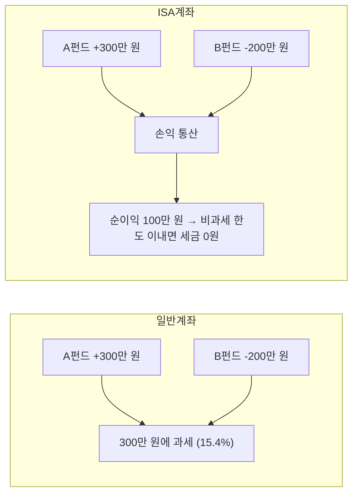

ISA(Individual Savings Account, 개인종합자산관리계좌)라는 이름은 들어봤는데, 정확히 뭐가 좋은 건지 모르겠다는 사람이 많다. 이 글은 ISA의 핵심 혜택과 기본 구조를 한 번에 정리하는 스터디 노트다.

핵심 혜택을 한 줄로 요약하면 이렇다:

> **손익 통산 후 비과세 + 초과분 분리과세 9.9%**

**이 글을 읽으면 알 수 있는 것:**
- ISA 계좌의 종류(중개형·신탁형·일임형)와 선택 기준
- 비과세 한도와 9.9% 분리과세 구조
- 손익 통산이 왜 강력한 혜택인지
- ISA 기본 스펙(납입 한도, 의무 가입 기간, 중도 인출 규칙)

> ISA 만기 후 연금계좌로 전환하면 추가 세액공제 300만 원을 받을 수 있다. 전환 전략은 다음 글 [ISA 만기 자금, 연금계좌로 옮기면 세액공제 300만 원이 더 생긴다](/etc/isa-pension-transfer-strategy/)에서 다룬다.

---

# 1. ISA란?

## 1.1 ISA의 정의

ISA는 하나의 계좌에서 예금, 펀드, ETF, 리츠 등 다양한 금융상품에 투자할 수 있는 **만능 절세 계좌**다. 2016년에 도입되어 현재까지 631만 명 이상이 가입하고 있다.

일반 증권 계좌에서 ETF에 투자하면 수익에 대해 15.4%의 배당소득세를 낸다. 하지만 ISA 계좌에서 같은 ETF에 투자하면 **일정 금액까지 세금이 0원**이다.

그렇다면 ISA는 단순히 "세금을 덜 내는 계좌"일까? 그 이상이다. ISA에는 세 가지 핵심 혜택이 있다:

1. **손익 통산**: 여러 상품의 이익과 손실을 합산하여 순이익에만 과세
2. **비과세**: 순이익 중 일정 금액(200~400만 원)까지 세금 0원
3. **분리과세**: 비과세 한도 초과분도 15.4%가 아닌 **9.9%** 저율 과세

이 세 가지 혜택이 결합되면, 같은 투자를 하더라도 일반 계좌 대비 세금이 절반 이하로 줄어든다.

## 1.2 ISA는 누가 가입할 수 있나?

만 19세 이상이면 누구나 가입할 수 있다. 직장인, 자영업자, 프리랜서 모두 가능하다. 단, 직전 3개 과세기간 중 1회 이상 금융소득종합과세 대상자(연간 이자·배당소득 2,000만 원 초과)였다면 가입이 제한된다.

가입 조건 요약:
- **만 19세 이상** (근로소득이 있으면 만 15세부터 가능)
- **금융소득종합과세 대상자가 아닐 것**
- **전 금융기관 통틀어 1인 1계좌**만 개설 가능

---

# 2. ISA 종류

ISA는 **운용 방식**과 **소득 수준** 두 가지 기준으로 나뉜다. 어떤 유형을 선택하느냐에 따라 투자 자유도와 비과세 한도가 달라지므로, 본인 상황에 맞는 조합을 선택하는 것이 중요하다.

## 2.1 운용 방식에 따른 분류

| 유형 | 설명 | 특징 | 가입처 |
|------|------|------|--------|
| 중개형 | 투자자가 직접 국내 상장주식·ETF 거래 | 수수료 최소, 가장 인기 | 증권사 |
| 신탁형 | 정기예금, 펀드 등 금융사에 운용 지시 | 중개형보다 수수료 높음 | 은행·증권사 |
| 일임형 | 투자 전문가에게 전액 위임 | 직접 운용 부담 없음, 수수료 가장 높음 | 은행·증권사 |

### 중개형이 가장 인기 있는 이유

2021년 도입된 중개형 ISA는 국내 상장주식과 ETF를 직접 매매할 수 있어 투자 자유도가 가장 높다. 수수료도 가장 낮기 때문에, ETF 위주로 투자하는 사람이라면 중개형을 선택하는 것이 유리하다.

신탁형은 은행에서 주로 가입하는데, 정기예금 위주로 안전하게 운용하고 싶은 사람에게 적합하다. 다만 중개형보다 수수료가 높고 투자 가능한 상품이 제한적이다.

일임형은 투자 전문가에게 운용을 맡기는 방식이다. 직접 투자할 시간이 없거나 투자에 자신이 없는 사람에게 적합하지만, 수수료가 가장 높다.

> 특별한 이유가 없다면 **증권사에서 중개형 ISA**를 개설하는 것을 추천한다.

## 2.2 소득 수준에 따른 분류

| 구분 | 가입 조건 | 비과세 한도 | 초과분 세율 |
|------|---------|-----------|-----------|
| 일반형 | 만 19세 이상 | **200만 원** | 9.9% 분리과세 |
| 서민형 | 총급여 5,000만 원 이하 또는 종합소득 3,800만 원 이하 | **400만 원** | 9.9% 분리과세 |
| 농어민형 | 농어업 종사자 | **400만 원** | 9.9% 분리과세 |

서민형은 일반형보다 비과세 한도가 **2배**이므로, 총급여가 5,000만 원 이하라면 반드시 서민형으로 가입해야 한다. 가입 시 소득 요건은 금융기관에서 자동으로 검증되므로 별도 서류를 제출할 필요는 없다.

주의할 점은 소득이 올라서 서민형 기준을 넘기더라도, **가입 당시 기준**으로 서민형이었다면 만기까지 서민형 혜택이 유지된다는 것이다. 단, 만기 연장 시에는 소득 재검증이 이루어져 일반형으로 강등될 수 있다.

---

# 3. ISA 기본 스펙

| 항목 | 내용 |
|------|------|
| 의무 가입 기간 | 3년 |
| 연간 납입 한도 | 2,000만 원 (미사용분 이월 가능) |
| 총 납입 한도 | 1억 원 |
| 투자 가능 상품 | 예금, 펀드, ETF, 리츠 등 |
| 계좌 수 | 전 금융기관 통틀어 **1인 1계좌** |
| 중도 인출 | 납입 원금 범위 내에서 인출 가능 (수익금은 만기까지 유지) |

## 3.1 미사용분 이월

올해 2,000만 원 한도를 다 채우지 못하면, 남은 금액이 다음 해로 이월된다. 예를 들어 1년차에 1,000만 원만 넣었다면, 2년차에는 최대 3,000만 원(올해 한도 2,000만 원 + 이월분 1,000만 원)까지 납입할 수 있다.

| 연차 | 납입액 | 이월분 | 해당 연도 납입 가능 한도 |
|------|-------|--------|---------------------|
| 1년차 | 1,000만 원 | - | 2,000만 원 |
| 2년차 | 3,000만 원 | +1,000만 원 | 3,000만 원 |
| 3년차 | 2,000만 원 | 0 | 2,000만 원 |
| **합계** | **6,000만 원** | | 총 한도 1억 원 이내 |

이월은 자동으로 적용되며, 별도 신청이 필요 없다. 단, 총 납입 한도는 1억 원이다.

## 3.2 중도 인출

ISA에서 중도 인출은 가능하지만, 몇 가지 제약이 있다.

- **납입 원금 범위 내**에서만 인출 가능 (수익금은 인출 불가)
- 인출하면 해당 금액만큼 **납입 한도가 줄어든다**
- 의무 가입 기간(3년)을 채우지 못한 상태에서 전액 인출하면 **해지**로 처리되어 비과세 혜택이 소멸

예를 들어 3,000만 원을 넣고 1,000만 원을 인출하면, 이후 추가 납입 가능 금액은 원래 한도에서 1,000만 원을 뺀 금액이 된다. 따라서 가능하면 만기까지 유지하는 것이 가장 유리하다.

## 3.3 의무 가입 기간 3년

ISA의 비과세·분리과세 혜택은 **3년 의무 가입 기간을 채워야** 적용된다. 3년이 되기 전에 해지하면:

- 비과세 혜택이 소멸되고, 일반 과세(15.4%)가 적용된다
- 손익 통산 혜택도 소멸된다

단, 의무 가입 기간 중에도 원금 범위 내에서 중도 인출은 가능하다(해지와 인출은 다르다).

---

# 4. 손익 통산

ISA의 가장 큰 장점은 **손익 통산**이다. 일반 계좌에서는 이익이 난 상품에만 세금이 붙지만, ISA에서는 여러 상품에서 발생한 이익과 손실을 합산하여 **순이익에만** 세금을 부과한다.

## 4.1 손익 통산 예시

- **일반 계좌**: B펀드에서 200만 원 손해를 봤지만, 세금은 A펀드 수익 300만 원에 대해 15.4% 부과 → **약 46만 원 세금**. 손실은 세금 계산에 전혀 반영되지 않는다.
- **ISA 계좌**: A펀드 수익 300만 원에서 B펀드 손실 200만 원을 빼고, 순이익 100만 원에 대해서만 과세. 비과세 한도 200만 원 이내이므로 → **세금 0원**

같은 투자를 하더라도 ISA 계좌 하나로 **46만 원의 세금 차이**가 발생한다. 투자 규모가 커지고 투자 기간이 길어질수록 이 차이는 더 벌어진다.

## 4.2 손익 통산이 중요한 이유

투자를 하다 보면 모든 상품이 수익을 내는 것은 아니다. 어떤 ETF는 오르고, 어떤 펀드는 내린다. 일반 계좌에서는 손실이 난 상품과 무관하게 수익이 난 상품에 대해서만 세금을 내야 한다. 이것은 투자자에게 불리한 구조다.

ISA에서는 계좌 내 모든 상품의 손익을 합산하여 **순이익**에만 과세하므로, 손실이 발생하더라도 세금 부담이 줄어든다. 특히 여러 상품에 분산 투자하는 사람에게 손익 통산은 큰 혜택이다.

---

# 5. 비과세와 분리과세

## 5.1 비과세 한도

3년간 운용한 ISA의 순이익에 대해 비과세 한도까지는 세금이 0원이다.

| 유형 | 비과세 한도 |
|------|-----------|
| 일반형 | 200만 원 |
| 서민형·농어민형 | 400만 원 |

예를 들어 일반형 기준으로 3년간 순이익이 200만 원 이하라면 세금이 아예 없다.

## 5.2 비과세 한도를 초과하면?

3년간 운용하다 보면 순이익이 비과세 한도를 넘는 경우도 있다. 이 경우에도 초과분에 대해 일반 계좌의 15.4%가 아닌 **9.9% 분리과세**가 적용된다. "분리과세"란 다른 소득과 합산하지 않고 ISA 계좌 내에서 별도로 세금을 매기는 것이므로, 종합소득세율이 높은 사람에게 특히 유리하다.

| 상황 (일반형 기준) | ISA 계좌 | 일반 계좌 | 절세 효과 |
|---|---|---|---|
| 순이익 200만 원 이하 | **세금 0원** | 약 31만 원 (15.4%) | 31만 원 절세 |
| 순이익 500만 원 | 200만 원 비과세 + 300만 원 × 9.9% = **29.7만 원** | 약 77만 원 (15.4%) | 약 47만 원 절세 |
| 순이익 1,000만 원 | 200만 원 비과세 + 800만 원 × 9.9% = **79.2만 원** | 약 154만 원 (15.4%) | 약 75만 원 절세 |

비과세 한도를 넘기더라도 일반 계좌 대비 세금이 **절반 수준**이다. ISA를 활용하지 않을 이유가 없다.

## 5.3 비과세 한도는 언제 적용되나?

비과세 한도는 ISA를 **만기 해지하거나 의무 가입 기간(3년)을 채운 후 해지할 때** 적용된다. 3년을 채우기 전에 해지하면 비과세 혜택이 소멸되므로, 반드시 3년은 유지해야 한다.

또한 비과세 한도는 ISA 가입 기간 **전체 순이익**에 대해 한 번만 적용된다. 매년 200만 원씩이 아니라, 3년간 총 순이익에서 200만 원(또는 400만 원)까지 비과세라는 뜻이다.

---

# 6. 정리

## 6.1 ISA 핵심 요약

| 항목 | 내용 |
|------|------|
| **무엇?** | 다양한 금융상품을 담을 수 있는 만능 절세 계좌 |
| **핵심 혜택** | 손익 통산 + 비과세(200~400만 원) + 초과분 9.9% 분리과세 |
| **추천 유형** | 중개형 (증권사, ETF 직접 투자 가능) |
| **의무 기간** | 3년 |
| **연간 납입** | 최대 2,000만 원 (미사용분 이월 가능) |
| **1인 제한** | 전 금융기관 통틀어 1계좌 |

## 6.2 ISA를 활용한 다음 단계

ISA의 진짜 가치는 비과세·분리과세 혜택에서 그치지 않는다. **ISA 만기 후 연금계좌로 전환하면 추가 세액공제 300만 원**을 받을 수 있고, 전환 금액의 대부분이 연금계좌 내 **비과세 재원**이 되어 은퇴 후 세금 없이 인출할 수 있다.

> 다음 글: [ISA 만기 자금, 연금계좌로 옮기면 세액공제 300만 원이 더 생긴다](/etc/isa-pension-transfer-strategy/)

---

# 7. 참고

- [ISA 계좌 총정리 - 토스피드](https://toss.im/tossfeed/article/isa)
- [ISA 계좌란? - KB Think](https://kbthink.com/main/asset-management/wealth-manage-tip/tutorial/isa/isa-1.html)
- [ISA 주요정책문답 - 금융위원회](https://www.fsc.go.kr/po020201/27339)
- [ISA 만기 연장 vs 해지 vs 연금 전환 - 한국투자증권 블로그](https://blog.koreainvestment.com/isa-%EB%A7%8C%EA%B8%B0-%EC%97%B0%EC%9E%A5-vs-%ED%95%B4%EC%A7%80-vs-%EC%97%B0%EA%B8%88-%EC%A0%84%ED%99%98-%EB%82%B4%EA%B2%8C-%EB%A7%9E%EB%8A%94-%EC%84%A0%ED%83%9D%EC%A7%80/)
- [연금계좌 세액공제 - 국세청](https://www.nts.go.kr/nts/cm/cntnts/cntntsView.do?cntntsId=7875)
