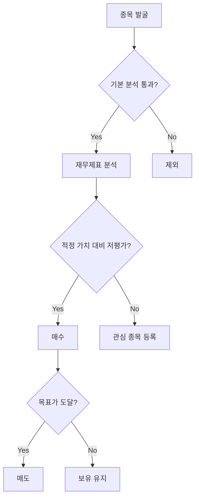
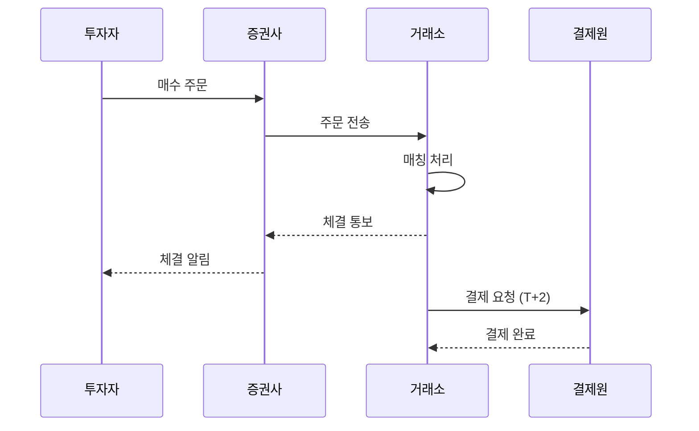
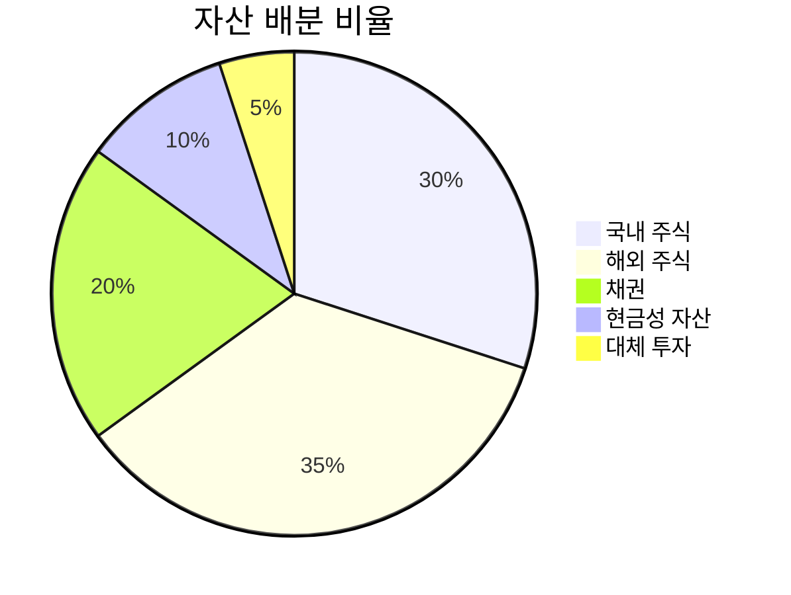
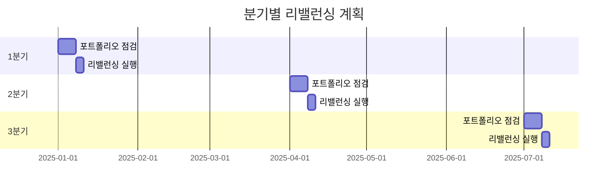
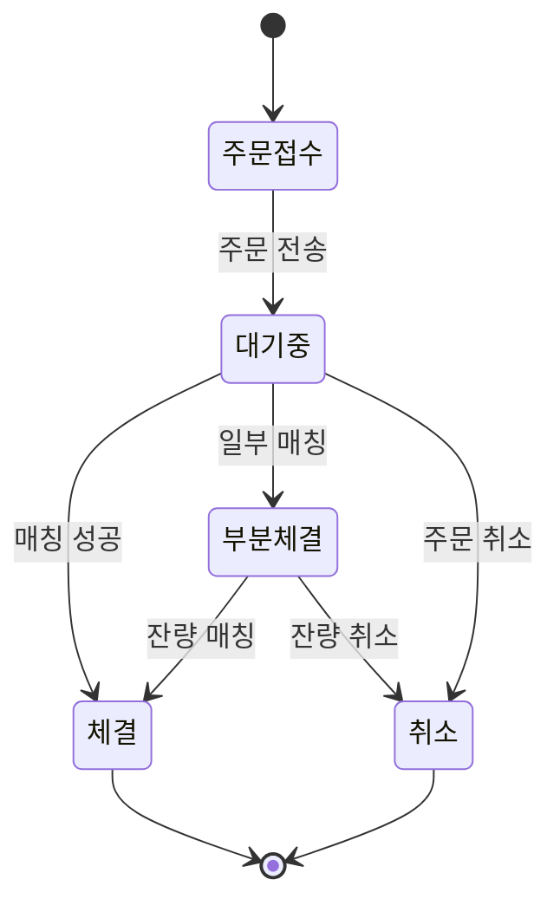

## Flowchart (흐름도)

투자 의사결정 흐름도:



## Sequence Diagram (시퀀스 다이어그램)

주식 주문 처리 과정:



## Pie Chart (파이 차트)

포트폴리오 자산 배분:



## Gantt Chart (간트 차트)

투자 리밸런싱 일정:



## State Diagram (상태 다이어그램)

주식 주문 상태 변화:



## 에러 케이스 (잘못된 문법)

아래는 의도적으로 잘못된 Mermaid 문법입니다. 에러 메시지가 표시되어야 합니다:

```mermaid
invalid diagram syntax !!!
this should show an error message
```
