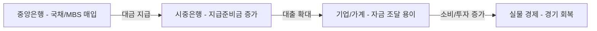
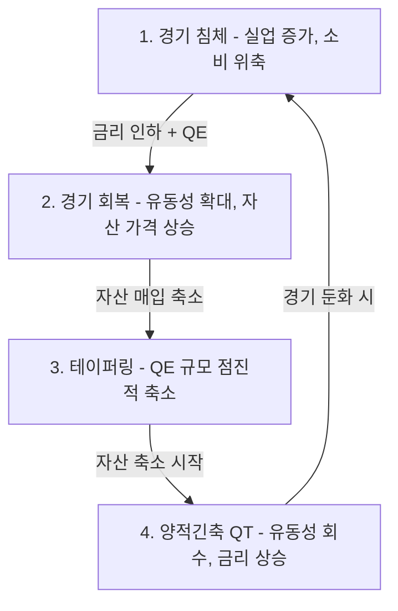
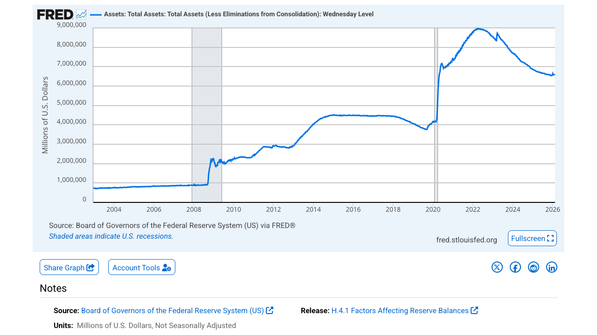
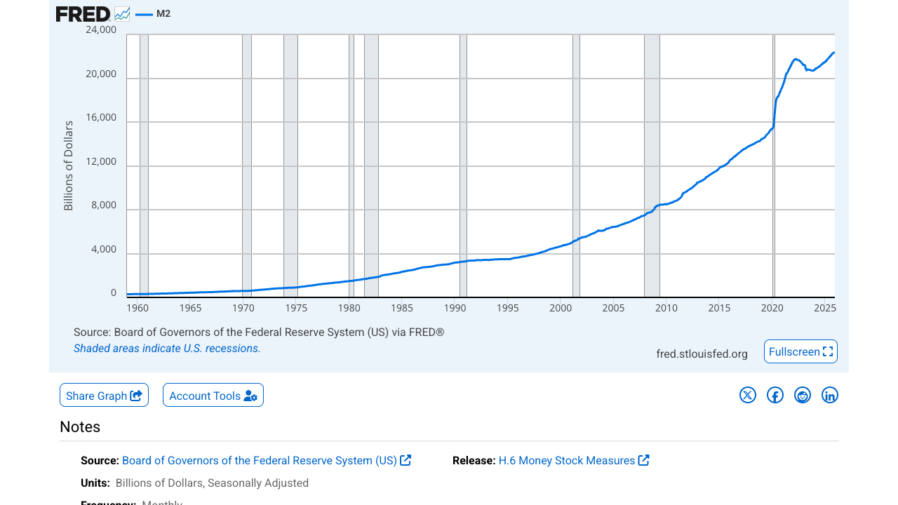
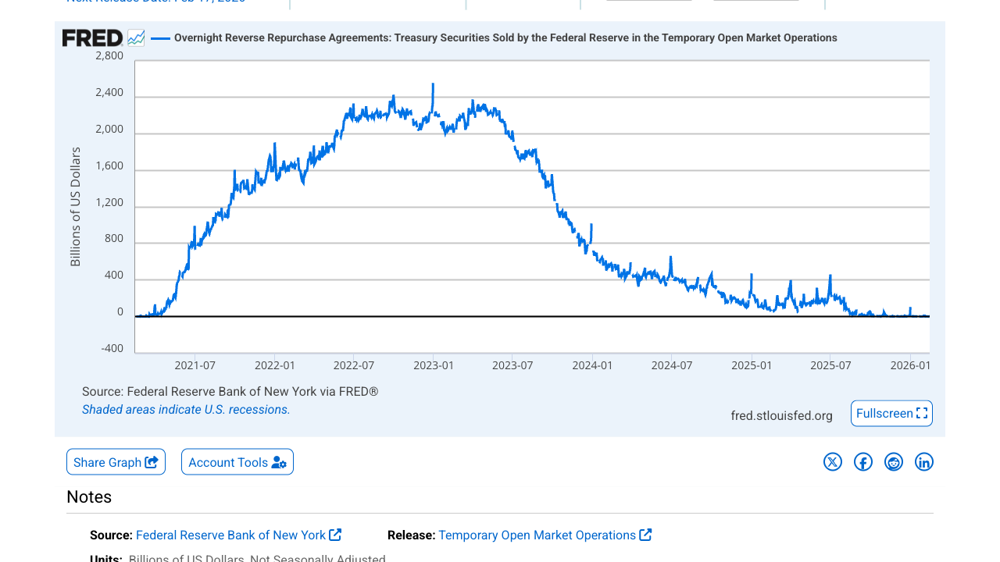

# 1. 개요

뉴스에서 "연준이 양적완화를 시작했다", "양적긴축에 돌입했다"는 말을 자주 듣지만, 정확히 무슨 뜻인지 설명하기는 쉽지 않다. 양적완화(QE)와 양적긴축(QT)은 현대 통화정책의 핵심 도구이며, 금융시장과 자산 가격에 직접적인 영향을 미친다.

이 두 정책은 독립적으로 존재하는 것이 아니라, **경기 침체 → QE → 회복 → 테이퍼링 → QT**로 이어지는 하나의 사이클을 형성한다. 따라서 QE만 따로, QT만 따로 이해하면 전체 그림을 놓치게 된다.

이 글을 읽으면 알 수 있는 것:

- 양적완화와 양적긴축의 정확한 정의와 작동 원리
- QE → 테이퍼링 → QT로 이어지는 통화정책 사이클
- 2008 금융위기, 2020 코로나 등 실제 글로벌 사례
- 투자자 관점에서 QE·QT 환경별 대응 전략

# 2. 통화정책 기초

양적완화와 양적긴축을 이해하려면 먼저 중앙은행이 경제를 어떻게 조절하는지 기본 구조를 알아야 한다.

## 2.1 중앙은행의 역할

중앙은행은 한 나라의 통화정책을 담당하는 기관이다. 미국의 연방준비제도(Federal Reserve, Fed), 한국의 한국은행, 유럽의 유럽중앙은행(ECB), 일본의 일본은행(BOJ) 등이 대표적이다.

중앙은행의 핵심 역할:

- **물가 안정**: 인플레이션을 적정 수준(보통 2%)으로 유지
- **고용 극대화**: 경제 성장을 통해 일자리 창출 지원
- **금융 시스템 안정**: 은행 시스템의 건전성 유지

## 2.2 기준금리 정책과 한계

중앙은행이 경제를 조절하는 가장 기본적인 도구는 **기준금리(Policy Rate)**다.

- **경기 침체 시**: 기준금리를 **인하** → 대출 이자 하락 → 기업·가계의 소비·투자 증가 → 경기 부양
- **경기 과열 시**: 기준금리를 **인상** → 대출 이자 상승 → 소비·투자 억제 → 인플레이션 억제

그런데 문제가 있다. 기준금리에는 **바닥**이 존재한다. 금리가 0%에 가까워지면 더 이상 낮출 수 없는 상황, 즉 **제로금리 하한(Zero Lower Bound, ZLB)**에 도달한다. 이때 경기가 여전히 침체 상태라면 기준금리만으로는 대응이 불가능하다.

바로 이 지점에서 등장하는 것이 **양적완화(QE)**다.

## 2.3 전통적 vs 비전통적 통화정책

| 구분 | 전통적 통화정책 | 비전통적 통화정책 |
|------|----------------|------------------|
| 주요 수단 | 기준금리 조절 | 자산 매입(QE), 포워드 가이던스 |
| 적용 시기 | 평상시 경기 조절 | 금리가 0%에 근접했을 때 |
| 작동 방식 | 단기금리에 직접 영향 | 장기금리에 간접 영향 |
| 사례 | 일반적인 금리 인상/인하 | 2008년 이후 연준 QE |

양적완화와 양적긴축은 모두 **비전통적 통화정책**에 해당한다.

비전통적 통화정책의 또 다른 핵심 수단이 **포워드 가이던스(Forward Guidance)**다. 포워드 가이던스란 **중앙은행이 향후 통화정책 방향을 미리 시장에 알려주는 커뮤니케이션 전략**이다. QE가 자산 매입이라는 **행동**으로 시장에 영향을 준다면, 포워드 가이던스는 **말**로 시장에 영향을 준다.

예를 들어 연준이 "인플레이션이 2%에 안정적으로 도달할 때까지 금리를 올리지 않겠다"고 선언하면, 시장 참여자들은 당분간 저금리가 유지될 것으로 예상하고 그에 맞게 투자·소비 결정을 내린다. 실제로 금리를 움직이지 않아도 **기대(expectation)만으로 장기금리가 하락**하고 경제 활동이 촉진되는 효과가 있다.

| 유형 | 설명 | 예시 |
|------|------|------|
| **시간 기반** | 특정 시점까지 정책 유지를 약속 | "2024년까지 금리를 올리지 않겠다" |
| **조건 기반** | 경제 지표가 특정 조건을 충족할 때까지 유지 | "실업률이 6.5% 이하가 될 때까지 제로금리 유지" |

포워드 가이던스는 QE와 함께 사용되는 경우가 많다. 2020년 코로나 위기 때 연준은 "제로금리를 유지하면서 매달 1,200억 달러의 자산을 매입하겠다"고 발표하여, 행동과 말을 동시에 활용했다.

# 3. 양적완화(QE)란?

## 3.1 정의와 등장 배경

양적완화(Quantitative Easing, QE)란 **중앙은행이 국채나 모기지담보증권(MBS) 등 금융자산을 대규모로 매입하여 시중에 유동성을 공급하는 정책**이다.

QE가 본격적으로 등장한 것은 2008년 글로벌 금융위기 때다. 당시 미국 연준은 기준금리를 0~0.25%까지 낮췄지만 경기가 회복되지 않았다. 금리를 더 낮출 수 없는 상황에서 경기를 부양하기 위해 선택한 것이 바로 양적완화였다.

## 3.2 "돈을 푼다"의 실제 의미

"중앙은행이 돈을 찍어낸다"는 표현을 자주 듣지만, 실제로 지폐를 인쇄하는 것은 아니다.

QE의 실제 과정:

1. 중앙은행이 시중은행이나 금융기관이 보유한 **국채·MBS를 매입**한다
2. 매입 대금을 해당 금융기관의 **중앙은행 지급준비금 계좌에 입금**한다
3. 금융기관은 늘어난 지급준비금으로 **대출을 늘리거나 다른 자산에 투자**한다
4. 이렇게 시중에 돈이 흘러들어가는 것이 "돈을 푼다"의 실제 의미다

즉, 물리적인 화폐를 찍는 것이 아니라 **전자적으로 지급준비금을 생성**하는 것이다.

## 3.3 QE 대상 자산

중앙은행이 매입하는 대표적인 자산:

| 자산 유형 | 설명 |
|-----------|------|
| **국채(Treasury Bonds)** | 정부가 발행한 채권. 가장 안전한 자산으로 QE의 주요 매입 대상 |
| **모기지담보증권(MBS)** | 주택담보대출을 기초자산으로 한 증권. 2008년 위기 때 연준이 대규모 매입 |
| **회사채** | 일부 중앙은행(ECB, BOJ)이 기업 회사채까지 매입한 사례 |
| **ETF** | 일본은행이 주식 ETF를 직접 매입한 특수 사례 |

# 4. 양적완화 작동 원리

## 4.1 중앙은행의 자산 매입 과정

QE의 전체 흐름을 단계별로 정리하면 다음과 같다.

**핵심**: 중앙은행이 자산을 사들이면 그 대금이 금융 시스템에 유입되고, 이 돈이 경제 전반으로 퍼져나간다.

## 4.2 시중 유동성 증가와 장기금리 하락

중앙은행이 국채를 대규모로 매입하면 두 가지 효과가 동시에 발생한다.

**유동성 효과:**
- 금융기관의 지급준비금이 증가한다
- 은행이 보유한 현금이 늘어나 대출 여력이 확대된다
- 기업과 가계가 자금을 빌리기 쉬워진다

**금리 효과:**
- 국채 수요 증가 → 국채 가격 상승 → 국채 금리(수익률) 하락
- 국채 금리는 모든 장기금리의 기준이 되므로, 주택담보대출 금리, 회사채 금리 등도 함께 하락한다
- 낮아진 금리가 기업의 투자와 가계의 소비를 촉진한다

> 채권 가격과 금리는 반대로 움직인다. 채권을 많이 사면 가격이 오르고 금리는 내려간다.

## 4.3 자산 가격 상승과 신용 확대

QE는 금리 하락 외에도 다양한 경로로 경제에 영향을 미친다.

**포트폴리오 재조정 효과:**
- 중앙은행이 국채를 매입하면 금융기관은 국채 대신 다른 자산(주식, 회사채, 부동산 등)에 투자한다
- 이로 인해 위험자산 전반의 가격이 상승한다

**자산 효과:**
- 주식·부동산 가격이 오르면 보유자의 자산이 늘어난다
- 자산이 늘어나면 소비 심리가 개선되고 실제 소비가 증가한다

**신용 확대:**
- 은행의 유동성이 풍부해지면 대출 심사가 완화된다
- 기업은 낮은 금리로 자금을 조달하여 설비 투자를 늘린다

## 4.4 중앙은행 대차대조표 변화

QE를 실행하면 중앙은행의 대차대조표(Balance Sheet)가 확대된다.

| 항목 | QE 이전 | QE 이후 |
|------|---------|---------|
| **자산** (국채, MBS 등) | 작음 | 크게 증가 |
| **부채** (지급준비금 등) | 작음 | 크게 증가 |
| **대차대조표 규모** | 작음 | 확대 |

미국 연준의 대차대조표는 2008년 약 9,000억 달러에서 2022년 약 9조 달러까지 10배 이상 확대되었다. 이 숫자가 QE의 규모를 보여준다.

# 5. 양적완화의 효과와 부작용

## 5.1 긍정적 효과

| 효과 | 설명 |
|------|------|
| **경기 부양** | 낮은 금리와 풍부한 유동성으로 소비·투자 촉진 |
| **금융시장 안정** | 위기 시 자산 매입을 통해 시장의 공포를 진정시킴 |
| **디플레이션 방지** | 통화 공급 확대로 물가 하락 압력을 완화 |
| **고용 증가** | 기업 투자 확대와 경기 회복을 통한 일자리 창출 |

## 5.2 부작용

| 부작용 | 설명 |
|--------|------|
| **자산 버블** | 풍부한 유동성이 주식·부동산 등 자산 가격을 과도하게 끌어올림 |
| **빈부격차 확대** | 자산을 보유한 사람은 부유해지고, 없는 사람과의 격차가 벌어짐 |
| **인플레이션 위험** | 과도한 유동성이 결국 물가 상승으로 이어질 수 있음 |
| **정책 의존성** | 시장이 QE에 의존하게 되어 정책 종료 시 충격 발생 (중독 효과) |
| **좀비 기업 양산** | 초저금리로 경쟁력 없는 기업이 연명하게 됨 |

> 2020~2021년 코로나 이후 초대형 QE의 부작용으로 2022년 미국 인플레이션이 9%를 넘기며, QE의 부작용이 현실로 나타났다.

# 6. 테이퍼링(Tapering) — QE에서 QT로의 전환

## 6.1 테이퍼링 정의

테이퍼링(Tapering)이란 **중앙은행이 자산 매입 규모를 점진적으로 줄여나가는 것**이다. QE를 갑자기 중단하면 시장에 충격을 줄 수 있기 때문에, 매입 규모를 단계적으로 축소하는 과정을 거친다.

- QE: 매달 자산을 매입 (예: 월 1,200억 달러)
- 테이퍼링: 매입 규모를 점차 축소 (예: 월 1,050억 → 900억 → ... → 0)
- QT: 자산 매입을 완전히 중단하고, 보유 자산을 줄여나감

즉 테이퍼링은 **QE의 종료 과정이자 QT로 가기 전 전환 단계**다.

## 6.2 시장 충격 사례 — Taper Tantrum (2013)

2013년 5월, 당시 연준 의장 벤 버냉키가 "곧 자산 매입을 줄이기 시작할 수 있다"고 발언했다. 이 한마디에 글로벌 금융시장이 요동쳤다.

- 미국 10년물 국채 금리: 1.6% → 3.0%로 급등 (약 2개월 만에)
- 신흥국 통화·주식 급락
- 글로벌 자금이 신흥국에서 이탈

이 사건을 **테이퍼 탠트럼(Taper Tantrum)**이라 부르며, QE 축소 신호만으로도 시장에 큰 충격을 줄 수 있다는 것을 보여줬다.

## 6.3 왜 중요한 신호인가

투자자 입장에서 테이퍼링은 다음을 의미한다:

- **유동성 공급 축소의 시작**: 시장에 풀리는 돈이 줄어들기 시작한다
- **금리 상승의 전조**: 자산 매입 축소 → 채권 가격 하락 → 금리 상승
- **위험자산 조정 신호**: 성장주, 고위험 자산에 불리한 환경으로 전환
- **통화정책 정상화의 첫걸음**: QE → 테이퍼링 → 금리 인상 → QT 순서로 진행

# 7. 양적긴축(QT)이란?

## 7.1 정의와 필요성

양적긴축(Quantitative Tightening, QT)이란 **중앙은행이 보유한 자산(국채, MBS 등)을 줄여 시중 유동성을 회수하는 정책**이다. QE의 반대 방향이다.

QT가 필요한 이유:

- QE로 풍부해진 유동성이 **인플레이션**을 유발할 수 있다
- 비정상적으로 커진 대차대조표를 **정상 수준으로 되돌려야** 한다
- 금융시장의 **과열과 버블을 억제**해야 한다
- **통화정책의 여력을 확보**해야 한다 (다음 위기 시 다시 QE를 할 수 있도록)

## 7.2 QE와 정반대인가?

방향은 반대지만, 실행 방식에는 차이가 있다.

| 비교 | QE | QT |
|------|----|----|
| 방향 | 자산 매입 (유동성 공급) | 자산 축소 (유동성 회수) |
| 속도 | 빠르게 실행 가능 | 느리고 점진적으로 진행 |
| 시장 영향 | 즉각적 (자산 가격 상승) | 점진적 (서서히 긴축 효과) |
| 실행 난이도 | 상대적으로 쉬움 | 시장 충격 관리가 어려움 |

흔히 QT를 "QE를 되감기(unwinding)"라고 표현하지만, 실제로는 QE처럼 빠르게 실행하지 않는다. 시장 충격을 최소화하기 위해 매우 조심스럽게 진행한다.

## 7.3 자산 매각 vs 만기 미재투자

중앙은행이 보유 자산을 줄이는 방법은 크게 두 가지다.

**만기 미재투자 (Run-off) — 주로 사용:**
- 보유 중인 국채가 만기에 도달하면 원금을 회수한다
- 회수한 원금으로 새 국채를 사지 않고 그냥 소멸시킨다
- 시장에 직접 매도하지 않으므로 충격이 적다

**직접 매각 (Outright Sale) — 드물게 사용:**
- 보유 자산을 시장에 직접 매도한다
- 빠르게 대차대조표를 줄일 수 있지만 시장 충격이 크다
- 실제로 연준은 이 방식을 거의 사용하지 않았다

> 연준의 QT는 주로 만기 미재투자 방식으로 진행되었으며, 월별 축소 한도를 정해서 속도를 조절했다.

# 8. 양적긴축 작동 원리

## 8.1 중앙은행 대차대조표 축소

QT의 핵심은 대차대조표를 줄이는 것이다. 그 과정은 다음과 같다.

1. 중앙은행이 보유한 국채가 만기에 도달하면 정부가 원금을 상환한다
2. 중앙은행은 이 돈으로 새 국채를 매입하지 않는다 (미재투자)
3. 결과적으로 중앙은행의 자산과 부채(지급준비금)가 동시에 줄어든다
4. 시중은행의 지급준비금이 감소하면서 유동성이 축소된다

## 8.2 시중 유동성 감소와 금리 상승 압력

QT가 진행되면 시장에 다음과 같은 변화가 나타난다.

**유동성 축소:**
- 시중은행의 지급준비금이 줄어든다
- 은행 간 자금 시장에서 자금이 타이트해진다
- 전체적으로 금융 시스템의 유동성이 감소한다

**금리 상승 압력:**
- 중앙은행이 국채를 더 이상 사지 않으면 국채 수요가 줄어든다
- 국채 가격 하락 → 국채 금리 상승
- 장기금리 상승은 주택담보대출, 회사채 등 전반적인 차입 비용을 높인다

## 8.3 금융시장 긴축 효과

QT는 금리를 직접 올리지 않아도 시장에 긴축 효과를 만들어낸다.

- **채권 시장**: 국채 공급 증가(중앙은행이 사지 않으므로) → 금리 상승
- **주식 시장**: 유동성 감소 + 금리 상승 → 성장주 중심으로 밸류에이션 하락
- **신용 시장**: 은행의 대출 여력 축소 → 기업의 차입 비용 증가
- **부동산 시장**: 주택담보대출 금리 상승 → 주택 수요 감소

# 9. 양적긴축의 효과와 리스크

## 9.1 기대 효과

| 효과 | 설명 |
|------|------|
| **인플레이션 억제** | 유동성 회수로 과도한 수요를 줄여 물가 상승 압력을 완화 |
| **금융 과열 완화** | 자산 버블과 투기적 투자 행위를 억제 |
| **통화 정상화** | 비정상적으로 커진 대차대조표를 적정 수준으로 되돌림 |
| **정책 여력 확보** | 향후 위기 시 다시 QE를 실행할 수 있는 공간 확보 |

## 9.2 리스크

| 리스크 | 설명 |
|--------|------|
| **시장 급락** | 유동성 축소가 빠르면 자산 가격이 급락할 수 있음 |
| **유동성 경색** | 시중 자금이 부족해져 금융기관 간 자금 조달이 어려워짐 |
| **경기 둔화** | 금리 상승과 유동성 감소가 기업 투자와 소비를 위축시킴 |
| **금융 시스템 불안** | 2019년 미국 레포 시장 금리 급등 사태처럼 예상치 못한 충격 발생 가능 |

> 2019년 9월 미국 레포(Repo) 시장에서 하루짜리 금리가 10%까지 치솟는 사태가 발생했다. 연준의 QT로 시중 유동성이 예상보다 빠르게 줄어든 것이 원인으로, 연준은 QT를 조기 종료하고 다시 유동성을 공급해야 했다.

# 10. QE vs QT 핵심 비교

| 항목 | 양적완화(QE) | 양적긴축(QT) |
|------|-------------|-------------|
| **정책 목적** | 경기 부양, 디플레이션 방지 | 인플레이션 억제, 과열 완화 |
| **정책 방향** | 자산 매입 (유동성 공급) | 자산 축소 (유동성 회수) |
| **대차대조표** | 확대 | 축소 |
| **시중 유동성** | 증가 | 감소 |
| **금리 영향** | 장기금리 하락 | 장기금리 상승 압력 |
| **주식 시장** | 상승 경향 (특히 성장주) | 조정 압력 (특히 성장주) |
| **부동산 시장** | 상승 압력 | 하락 압력 |
| **채권 가격** | 상승 (금리 하락) | 하락 (금리 상승) |
| **투자 심리** | 위험자산 선호 (Risk-on) | 안전자산 선호 (Risk-off) |
| **실행 속도** | 빠름 (위기 대응) | 느림 (점진적 진행) |
| **적용 시기** | 경기 침체·위기 | 경기 회복·과열 |

# 11. 통화정책 사이클 이해

## 11.1 침체 → QE → 회복 → 테이퍼링 → QT → 반복

통화정책은 일직선이 아니라 순환 구조다. 경제 상황에 따라 다음 사이클을 반복한다.

각 단계의 특징:

| 단계 | 통화정책 | 시장 환경 |
|------|----------|-----------|
| **경기 침체** | 금리 인하 + QE 시작 | 위기, 공포, 자산 가격 하락 |
| **경기 회복** | QE 지속, 저금리 유지 | 자산 가격 상승, 낙관론 확대 |
| **테이퍼링** | QE 축소 시작 | 변동성 증가, 차익 실현 |
| **양적긴축** | QT + 금리 인상 | 유동성 감소, 조정 압력 |

## 11.2 최근 사이클 (2020~2025)

| 시기 | 정책 | 배경 |
|------|------|------|
| 2020.3 | 제로금리 + 초대형 QE | 코로나 팬데믹 |
| 2021 | QE 지속 | 경기 회복 + 인플레이션 조짐 |
| 2021.11 | 테이퍼링 시작 | 인플레이션 상승 |
| 2022.3 | 금리 인상 시작 | 인플레이션 8% 돌파 |
| 2022.6 | QT 시작 | 대차대조표 축소 개시 |
| 2024~2025 | 금리 인하 시작 + QT 감속 | 인플레이션 둔화 |

# 12. 글로벌 사례 분석

## 12.1 2008 글로벌 금융위기 — 미국 연준 QE

미국 연준은 2008년부터 2014년까지 총 3차례의 QE를 실시했다.

| 구분 | 기간 | 규모 | 주요 매입 자산 |
|------|------|------|----------------|
| **QE1** | 2008.11 ~ 2010.3 | 약 1.75조 달러 | MBS, 국채 |
| **QE2** | 2010.11 ~ 2011.6 | 약 6,000억 달러 | 국채 |
| **QE3** | 2012.9 ~ 2014.10 | 월 850억 달러 (무기한) | MBS, 국채 |

**결과:**
- 대차대조표: 9,000억 달러 → 4.5조 달러 (약 5배 확대)
- 경기 회복과 고용 개선에 기여
- 주식 시장 대폭 상승 (S&P 500: 2009년 저점 대비 약 4배 상승)
- 장기 저금리 환경이 자산 가격 상승을 견인

## 12.2 2020 코로나 팬데믹 — 초대형 QE

코로나 팬데믹은 역사상 가장 빠르고 대규모의 QE를 이끌어냈다.

- **2020년 3월**: 연준이 기준금리를 0~0.25%로 긴급 인하
- **자산 매입**: 월 1,200억 달러 (국채 800억 + MBS 400억)
- **대차대조표**: 4조 달러 → 9조 달러 (2년 만에 2배 이상 확대)
- **추가 조치**: 회사채, 지방채까지 매입 범위 확대

**결과:**
- 금융시장 급락 후 빠른 회복 (V자 반등)
- 주식·부동산·암호화폐 등 자산 가격 급등
- 2021~2022년 심각한 인플레이션으로 이어짐

## 12.3 2022~2023 인플레이션 대응 QT

2022년 미국 인플레이션이 9.1%까지 치솟자 연준은 공격적인 긴축을 시작했다.

- **2022년 6월**: QT 시작 (월 475억 달러 축소)
- **2022년 9월**: QT 가속 (월 950억 달러 축소)
- **동시에 금리 인상**: 0.25% → 5.5% (2022~2023년 가장 가파른 금리 인상 사이클)

**결과:**
- 대차대조표: 약 9조 달러 → 약 7조 달러로 축소
- 인플레이션 점진적 하락 (9.1% → 3%대)
- 주식 시장: 2022년 S&P 500 약 20% 하락 후 2023년 회복
- 2023~2024년 은행 위기 (SVB 파산 등) 일부 발생

## 12.4 일본은행·유럽중앙은행 사례

**일본은행(BOJ):**
- 2001년부터 세계 최초로 QE를 실시한 중앙은행
- 2013년부터 "양적·질적 금융완화(QQE)"로 대규모 국채·ETF 매입
- 일본은행은 일본 국채의 약 50%, 주식 ETF의 최대 보유자가 됨
- 디플레이션 탈출이 목표였으나 수십 년간 물가 상승이 제한적

**유럽중앙은행(ECB):**
- 2015년부터 QE 시작 (월 600억 유로 자산 매입)
- 유로존 각국의 국채를 GDP 비중에 따라 매입
- 2022년 QE 종료 후 금리 인상 시작
- 유로존 특유의 국가 간 경제 격차로 정책 운영이 복잡

# 13. QE·QT와 인플레이션

## 13.1 통화량과 물가의 관계

경제학의 기본 원칙 중 하나인 **화폐수량설(Quantity Theory of Money)**에 따르면, 통화량이 늘면 물가가 오른다. 공식으로 표현하면:

> **MV = PY** (통화량 x 화폐 유통속도 = 물가 x 실질 GDP)

이 공식대로라면 QE로 통화량(M)이 늘면 물가(P)가 올라야 한다. 하지만 현실은 그렇게 단순하지 않다.

## 13.2 QE 했는데 물가가 안 오른 이유

2008년 이후 대규모 QE를 했지만 미국의 인플레이션은 오랫동안 2% 이하에 머물렀다. 그 이유:

**화폐 유통속도(V) 하락:**
- QE로 풀린 돈이 실물 경제까지 도달하지 못하고 금융 시스템 내에 머물렀다
- 은행이 늘어난 지급준비금을 대출로 전환하지 않고 중앙은행에 예치해 둔 경우가 많았다

**글로벌 구조적 요인:**
- 중국의 저가 제조업으로 인한 수입 물가 하락
- 기술 발전에 따른 생산 비용 감소
- 고령화로 인한 소비 위축

**왜 2020년 QE는 인플레이션을 유발했나:**
- 코로나 QE는 재정정책(정부 보조금)과 동시에 실행되어 돈이 가계에 직접 전달됨
- 공급망 차질로 공급이 줄어든 상태에서 수요가 폭증
- 이전 QE와 달리 돈이 실물 경제에 직접 흘러들어감

## 13.3 유동성 함정

**유동성 함정(Liquidity Trap)**이란 중앙은행이 아무리 돈을 풀어도 경제가 반응하지 않는 상태를 말한다.

- 금리가 이미 0%에 근접하여 더 낮출 수 없다
- 기업과 가계가 불확실성으로 인해 돈을 빌려 쓰지 않는다
- QE로 은행에 돈을 공급해도 대출로 이어지지 않는다

일본이 대표적인 사례다. 수십 년간 QE를 지속했지만 디플레이션에서 벗어나기 어려웠다. 이는 통화정책만으로는 경제 문제를 해결하는 데 한계가 있다는 것을 보여준다.

# 14. 투자 관점에서 보는 QE vs QT

## 14.1 QE 환경 — 위험자산에 유리

QE가 진행되는 환경에서는 다음과 같은 투자 특성이 나타난다.

| 자산 | QE 환경에서의 경향 | 이유 |
|------|-------------------|------|
| **주식 (성장주)** | 강세 | 저금리로 미래 수익의 현재 가치 상승 |
| **주식 (가치주)** | 보통 | 경기 회복 초기에는 뒤처지다가 중반부터 상승 |
| **부동산** | 상승 | 주택담보대출 금리 하락 → 수요 증가 |
| **채권** | 가격 상승 (금리 하락) | 중앙은행의 대규모 매입 |
| **금** | 상승 경향 | 통화 가치 하락 우려, 인플레이션 헤지 |
| **달러** | 약세 경향 | 통화 공급 증가 → 화폐 가치 하락 |

## 14.2 QT 환경 — 방어적 전략 필요

QT가 진행되는 환경에서는 투자 전략을 방어적으로 전환해야 한다.

| 자산 | QT 환경에서의 경향 | 이유 |
|------|-------------------|------|
| **주식 (성장주)** | 약세 | 금리 상승으로 미래 수익의 현재 가치 하락 |
| **주식 (가치주/배당주)** | 상대적 강세 | 실적 기반 투자로 방어력 있음 |
| **부동산** | 하락 압력 | 주택담보대출 금리 상승 → 수요 감소 |
| **채권** | 가격 하락 (금리 상승) | 중앙은행의 매입 중단 + 공급 증가 |
| **단기 채권/현금** | 상대적 매력 | 금리 상승으로 수익률 개선 |
| **달러** | 강세 경향 | 유동성 축소 → 달러 수요 증가 |

## 14.3 정책 전환 시점 포착 전략

투자에서 가장 중요한 것은 **정책 전환 시점**을 감지하는 것이다.

**QE → QT 전환 신호 (매도/방어 전환):**
- 연준 위원들의 테이퍼링 발언 증가
- 인플레이션 지표(CPI, PCE) 상승 추세
- 고용 지표 개선 (실업률 하락)
- 연준 점도표(Dot Plot)에서 금리 인상 전망 상향

**QT → QE 전환 신호 (매수 기회):**
- 금융시장 불안 확대 (신용 스프레드 급등)
- 경기 지표 급격한 악화
- 연준의 비둘기파(dovish) 발언 증가
- 금리 인하 기대감 확산 (선물 시장의 금리 전망)

> 시장은 항상 중앙은행의 정책보다 **먼저 움직인다**. 실제로 정책이 바뀌는 시점이 아니라, 정책이 바뀔 것이라는 **기대**가 형성되는 시점에 자산 가격이 반응한다.

# 15. 유동성 모니터링 — 실시간 확인 지표와 사이트

투자자 입장에서 "지금이 QE 환경인지 QT 환경인지"를 판단하려면, 실제 데이터를 직접 확인할 수 있어야 한다. 핵심 지표와 확인 방법을 정리한다.

## 15.1 연준 대차대조표 (WALCL)

가장 직접적인 QE/QT 지표다. 자산 총액이 늘면 QE(유동성 공급), 줄면 QT(유동성 회수)를 의미한다.

- **확인**: [FRED - WALCL](https://fred.stlouisfed.org/series/WALCL)
- **업데이트**: 매주 목요일
- **읽는 법**: 2008년 이전 약 9,000억 달러 → 2022년 약 9조 달러 → 현재 QT 진행 중 약 6.6조 달러로 축소

## 15.2 M2 통화량

시중에 풀린 돈의 총량을 나타낸다. 현금, 예금, MMF 등을 포함한 넓은 의미의 통화량이다.

- **확인**: [FRED - M2SL](https://fred.stlouisfed.org/series/M2SL)
- **업데이트**: 월간
- **읽는 법**: 2020년 코로나 QE 시기에 수직 상승, 이후 QT와 함께 일시적으로 감소했다가 다시 증가 추세

## 15.3 역레포(Reverse Repo)

금융기관이 연준에 단기 예치한 자금이다. 역레포 잔액이 크면 시중에서 돈이 빠져 있다는 의미이고, 줄면 시중에 유동성이 풀리는 효과가 있다.

- **확인**: [FRED - RRPONTSYD](https://fred.stlouisfed.org/series/RRPONTSYD)
- **업데이트**: 일간
- **읽는 법**: 2022~2023년 최대 2.5조 달러까지 쌓였다가, 2024년 이후 급격히 감소하며 시중 유동성으로 전환

## 15.4 순유동성 계산법

실제 시장에 영향을 미치는 유동성은 단순히 대차대조표만으로 판단할 수 없다. 다음 공식으로 **순유동성(Net Liquidity)**을 계산한다.

> **순유동성 = 연준 대차대조표(WALCL) - TGA(재무부 계좌) - 역레포(RRP)**

| 항목 | FRED 코드 | 의미 |
|------|-----------|------|
| 연준 대차대조표 | [WALCL](https://fred.stlouisfed.org/series/WALCL) | 연준 보유 자산 총액 |
| TGA (재무부 일반계좌) | [WTREGEN](https://fred.stlouisfed.org/series/WTREGEN) | 정부가 연준에 예치한 돈 (시중에서 빠진 돈) |
| 역레포 (Reverse Repo) | [RRPONTSYD](https://fred.stlouisfed.org/series/RRPONTSYD) | 금융기관이 연준에 맡긴 돈 (시중에서 빠진 돈) |

QT가 진행 중이라도 TGA나 역레포가 줄면 순유동성은 오히려 증가할 수 있다. 2023년 하반기~2024년에 QT 중에도 주식 시장이 상승한 이유 중 하나가 역레포 잔액의 급감이었다.

## 15.5 금리 전망 확인

| 지표 | 사이트 | 용도 |
|------|--------|------|
| CME FedWatch Tool | [CME Group](https://www.cmegroup.com/markets/interest-rates/cme-fedwatch-tool.html) | 시장의 금리 인상/인하 확률 실시간 확인 |
| 연준 점도표 (Dot Plot) | [Federal Reserve](https://www.federalreserve.gov/monetarypolicy/fomcprojtabl20241218.htm) | FOMC 위원들의 향후 금리 전망 |
| 미국 10년물 국채 금리 | [FRED - DGS10](https://fred.stlouisfed.org/series/DGS10) | 장기금리 방향 (QE/QT 영향 확인) |

# 16. 자주 헷갈리는 개념 정리

| 헷갈리는 표현 | 실제 의미 |
|---------------|-----------|
| **"돈을 찍는다" vs QE** | QE는 지폐를 인쇄하는 것이 아니라 전자적으로 지급준비금을 생성하는 것이다. 물리적 화폐 발행과는 다르다. |
| **금리 인상 vs QT** | 금리 인상은 기준금리를 올리는 것이고, QT는 보유 자산을 줄이는 것이다. 둘 다 긴축 정책이지만 작동 방식이 다르며, 동시에 진행될 수도 있다. |
| **재정정책 vs 통화정책** | 재정정책은 정부가 세금·지출을 조절하는 것이고, 통화정책은 중앙은행이 금리·유동성을 조절하는 것이다. QE는 통화정책에 해당한다. |
| **통화량 vs 유동성** | 통화량은 시중에 존재하는 돈의 총량(M1, M2)이고, 유동성은 자산을 현금으로 전환할 수 있는 용이성을 포함하는 더 넓은 개념이다. |

# 17. 마무리

양적완화(QE)와 양적긴축(QT)은 현대 경제에서 반복되는 통화정책 사이클의 핵심이다.

핵심 정리:

- **QE**: 경기 침체 시 중앙은행이 자산을 매입하여 유동성을 공급하고 금리를 낮추는 정책
- **QT**: 경기 회복/과열 시 보유 자산을 줄여 유동성을 회수하고 정상화하는 정책
- **사이클**: 침체 → QE → 회복 → 테이퍼링 → QT → 반복
- **투자 핵심**: 정책 전환 시점을 감지하고 그에 맞게 포트폴리오를 조정하는 것이 중요

2008년 이후 이 사이클은 더욱 뚜렷해졌고, 중앙은행의 통화정책은 금융시장에 가장 큰 영향을 미치는 변수가 되었다. 투자자라면 연준의 대차대조표 변화와 정책 방향을 항상 주시해야 한다.

# 18. 참고

- [양적완화 - 위키백과](https://ko.wikipedia.org/wiki/%EC%96%91%EC%A0%81_%EC%99%84%ED%99%94)
- [양적 긴축 - 위키백과](https://ko.wikipedia.org/wiki/%EC%96%91%EC%A0%81_%EA%B8%B4%EC%B6%95)
- [Quantitative Easing - Investopedia](https://www.investopedia.com/terms/q/quantitative-easing.asp)
- [Quantitative Tightening - Investopedia](https://www.investopedia.com/quantitative-tightening-6361876)
- [연준 대차대조표 데이터 - Federal Reserve](https://www.federalreserve.gov/monetarypolicy/bst_recenttrends.htm)
- [Taper Tantrum - Investopedia](https://www.investopedia.com/terms/t/taboretantrum.asp)
- [양적완화(QE)와 양적긴축(QT) 이해 - 한국은행 경제교육](https://www.bok.or.kr/portal/main/main.do)
- [What is Quantitative Easing? - Bank of England](https://www.bankofengland.co.uk/monetary-policy/quantitative-easing)
