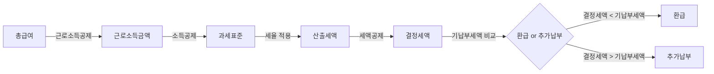

# 1. 개요

매년 1~2월이 되면 직장인들은 연말정산을 한다. 하지만 해마다 하면서도 "소득공제가 뭐고 세액공제가 뭐지?", "카드를 많이 쓰면 좋은 건가?" 같은 질문이 반복된다.

이 글은 연말정산의 기본 개념을 한번 정리하고, 실제로 연말 전에 미리 챙겨야 할 절세 항목들을 정리하려고 한다.

연말정산의 전체 흐름은 다음과 같다.

핵심은 간단하다. **소득공제**로 과세표준을 줄이고, **세액공제**로 세금 자체를 줄이면 환급을 더 많이 받을 수 있다.

# 2. 기본 개념 정리

## 2.1 연말정산이란?

직장인은 매달 급여에서 소득세를 원천징수당한다. 하지만 이 금액은 대략적인 예상치이기 때문에 1년간 실제 소득과 공제 항목을 종합해서 세금을 다시 계산하는 과정이 연말정산이다.

- **기납부세액**(매달 원천징수한 세금 합계)과 **결정세액**(실제 내야 할 세금)을 비교한다
- 기납부세액 > 결정세액이면 차액을 **환급** 받는다
- 기납부세액 < 결정세액이면 차액을 **추가 납부** 한다

## 2.2 연말정산 핵심 용어 정리

개요의 다이어그램 흐름을 따라 각 단계별 핵심 용어를 정리한다.

먼저 **공제**란 세금을 계산할 때 일정 금액을 빼주는 것을 의미한다. 소득에서 빼주면 소득공제, 세금에서 빼주면 세액공제다. 공제를 많이 받을수록 내야 할 세금이 줄어든다.

**1) 총급여**

연간 급여 총액에서 비과세 소득(식대, 차량유지비 등)을 뺀 금액이다. 연말정산의 출발점이 되는 숫자다.

**2) 근로소득공제 → 근로소득금액**

총급여에서 자동으로 차감되는 공제로, 별도 신청이 필요 없다. 총급여 구간에 따라 공제율이 정해져 있다.

- 근로소득금액 = 총급여 - 근로소득공제

**3) 소득공제 → 과세표준**

근로소득금액에서 각종 소득공제를 빼면 **과세표준**이 된다. 과세표준이 낮을수록 적용되는 세율이 낮아진다.

- 과세표준 = 근로소득금액 - 소득공제
- 대표 항목: 인적공제, 국민연금, 건강보험료, 카드 소비 공제
- **인적공제**: 본인·배우자·부양가족 1인당 150만 원 공제. 배우자는 연 소득 100만 원 이하, 부양가족은 직계존속(만 60세 이상)·직계비속(만 20세 이하) 등 조건 충족 시 적용

**4) 세율 적용 → 산출세액**

과세표준에 구간별 누진세율을 적용하면 산출세액이 나온다.

| 과세표준 | 세율 | 누진공제 |
|----------|------|----------|
| 1,400만 원 이하 | 6% | - |
| 1,400만 원 ~ 5,000만 원 | 15% | 126만 원 |
| 5,000만 원 ~ 8,800만 원 | 24% | 576만 원 |
| 8,800만 원 ~ 1.5억 원 | 35% | 1,544만 원 |
| 1.5억 원 ~ 3억 원 | 38% | 1,994만 원 |
| 3억 원 ~ 5억 원 | 40% | 2,594만 원 |
| 5억 원 ~ 10억 원 | 42% | 3,594만 원 |
| 10억 원 초과 | 45% | 6,594만 원 |

예시: 과세표준 4,000만 원이면 → 4,000만 원 x 15% - 126만 원 = **474만 원** 산출세액

**5) 세액공제·세액감면 → 결정세액**

산출세액에서 세액공제와 세액감면을 빼면 최종적으로 내야 할 **결정세액**이 된다.

- **세액공제**: 연금계좌, 의료비, 월세, 기부금, 교육비 등
- **세액감면**: 중소기업 취업 청년 감면 등 (해당자만 적용)

**6) 소득공제 vs 세액공제 비교**

| 구분 | 소득공제 | 세액공제 |
|------|----------|----------|
| 정의 | 과세 대상 소득을 줄여주는 것 | 산출된 세금에서 직접 차감하는 것 |
| 효과 | 과세표준이 낮아짐 | 내야 할 세금이 직접 줄어듦 |
| 대표 항목 | 인적공제, 국민연금, 카드 소비 | 연금계좌, 의료비, 월세, 기부금 |
| 절세 체감 | 소득 구간(세율)에 따라 다름 | 공제율만큼 직접 절세 |

쉽게 말하면 소득공제는 "세금 매기는 기준 금액을 깎아주는 것"이고, 세액공제는 "이미 나온 세금에서 빼주는 것"이다.

## 2.3 환급 vs 추가 납부가 생기는 이유

매달 원천징수하는 세금은 **간이세액표** 기준으로 대략적으로 떼는 것이다. 실제 공제 항목(부양가족, 카드 사용, 의료비 등)은 연말정산 때 반영되므로 차이가 발생한다.

- **환급이 많은 경우**: 공제 항목이 많거나, 원천징수 비율을 높게 설정한 경우
- **추가 납부가 생기는 경우**: 공제 항목이 적거나, 원천징수 비율을 낮게 설정한 경우 (80%)

# 3. 연금계좌 활용

연금계좌는 연말정산에서 세액공제를 받을 수 있는 가장 확실한 수단이다.

## 3.1 세액공제 한도 (최대 900만원)

| 구분                | 납입 한도     | 세액공제율 (총급여 5,500만 원 이하) | 세액공제율 (총급여 5,500만 원 초과) |
| ------------------- | ------------- | ----------------------------------- | ----------------------------------- |
| 연금저축            | 최대 600만 원 | 16.5%                               | 13.2%                               |
| IRP (연금저축 포함) | 최대 900만 원 | 16.5%                               | 13.2%                               |

- 총급여 5,500만 원 이하: 최대 **148.5만 원** 세액공제 (900만 원 x 16.5%)
- 총급여 5,500만 원 초과: 최대 **118.8만 원** 세액공제 (900만 원 x 13.2%)

연금저축만으로 600만 원까지, IRP를 추가하면 합산 900만 원까지 세액공제 한도를 채울 수 있다.

## 3.2 납입 마감일과 확인 방법

- **납입 마감**: 해당 연도 **12월 31일**까지 입금해야 해당 연도 세액공제 대상이 된다
- 증권사 앱에서 납입금액을 확인할 수 있다. 자세한 방법은 [연금계좌 납입금액 확인하는 방법](/stock/how-to-check-pension-account-contribution-amount)을 참고하자
- 자동이체를 설정해두면 매달 일정 금액이 입금되므로 관리가 편하다
- 연말에 남은 한도를 확인하고 여유 자금이 있으면 추가 납입하는 것을 추천한다

# 4. 소비 전략 (카드 공제)

## 4.1 총급여 대비 최저사용금액 기준

카드 소비 공제는 **총급여의 25%를 초과한 금액**부터 공제 대상이 된다. 즉, 총급여의 25% 이하로 사용하면 공제 혜택이 전혀 없다.

예시: 총급여 5,000만 원인 경우

- 최저사용금액: 5,000만 원 x 25% = **1,250만 원**
- 연간 카드 사용액이 1,250만 원을 넘어야 공제가 시작된다

## 4.2 신용카드 vs 체크카드 vs 현금영수증 공제율

| 결제 수단        | 공제율 | 비고                   |
| ---------------- | ------ | ---------------------- |
| 신용카드         | 15%    | 가장 낮음              |
| 체크카드         | 30%    | 신용카드의 2배         |
| 현금영수증       | 30%    | 체크카드와 동일        |
| 도서/공연/미술관 | 30%    | 총급여 7,000만 원 이하 |
| 전통시장         | 40%    | 가장 높음              |
| 대중교통         | 80%    | 2024년 한시 적용       |

공제 한도는 총급여 구간에 따라 다르다.

| 총급여                | 기본 공제 한도 |
| --------------------- | -------------- |
| 7,000만 원 이하       | 300만 원       |
| 7,000만 원 ~ 1.2억 원 | 250만 원       |
| 1.2억 원 초과         | 200만 원       |

전통시장, 대중교통, 도서/공연 사용분은 기본 한도와 별도로 각각 추가 한도가 있다.

## 4.3 신용카드 vs 체크카드 사용 전략

카드 소비 공제에서 25% 최저사용금액 구간에는 **신용카드 사용분이 먼저 차감**된다. 이 구조를 활용한 전략이 "황금비율" 전략이다.

**전략: 25% 이하는 신용카드, 25% 초과는 체크카드**

- 총급여 25%까지는 어차피 공제가 안 되므로, 이 구간은 **신용카드**(포인트/할인 혜택)로 채우는 것이 유리하다
- 25%를 넘긴 후부터는 공제율이 높은 **체크카드/현금영수증(30%)** 위주로 전환하면 절세 효과가 크다

**실행 방법은 두 가지가 있다:**

1. **시기 분리**: 상반기에 신용카드로 25% 기준을 채우고, 하반기부터 체크카드로 전환
2. **매월 분리**: 매달 소비의 일정 비율을 신용카드로, 나머지를 체크카드로 사용

두 방법 모두 결과적으로 동일한 공제 효과를 얻을 수 있다. 본인의 소비 패턴에 맞는 방식을 선택하면 된다.

예시: 총급여 4,000만 원인 경우
- 최저사용금액: 4,000만 원 x 25% = **1,000만 원**
- 신용카드로 1,000만 원 사용 (포인트/할인 혜택 확보)
- 이후 체크카드로 500만 원 사용 → 500만 원 x 30% = **150만 원** 소득공제

단, 공제 한도(최대 300만 원)가 있으므로 공제만을 위해 무리하게 소비를 늘릴 필요는 없다. 10월부터 홈택스 **연말정산 미리보기**에서 1~9월 사용 금액을 확인할 수 있으니, 남은 기간의 카드 전략을 조정하는 것도 좋은 방법이다.

# 5. 의료비 공제

## 5.1 공제 시작 기준 (총급여의 3%)

의료비 세액공제는 총급여의 **3%를 초과한 금액**부터 적용된다. 공제율은 **15%**이다.

예시: 총급여 5,000만 원인 경우

- 기준 금액: 5,000만 원 x 3% = **150만 원**
- 연간 의료비가 200만 원이라면: (200만 원 - 150만 원) x 15% = **7.5만 원** 세액공제

## 5.2 공제 가능 항목

- 병원 진료비, 치료비
- 약국 약제비 (처방전 기반)
- 안경/콘택트렌즈 구입비 (1인당 50만 원 한도)
- 보청기, 휠체어 등 장애인 보장구
- 산후조리원 비용 (출산 1회당 200만 원 한도)
- 난임 시술비 (공제율 30%, 한도 없음)

## 5.3 공제 불가능 항목

- 미용/성형 수술비
- 건강증진 목적 의약품 (영양제, 보약 등)
- 간병비
- 보험회사에서 보전받은 의료비
- 외국 의료기관 지출 비용

# 6. 월세 세액공제

## 6.1 공제 조건

월세 세액공제는 조건을 모두 충족해야 받을 수 있다.

| 조건        | 내용                                                       |
| ----------- | ---------------------------------------------------------- |
| 총급여      | 8,000만 원 이하 (종합소득 7,000만 원 이하)                 |
| 주택 요건   | 국민주택규모(전용면적 85m2) 이하 또는 기준시가 4억 원 이하 |
| 세대주 요건 | 무주택 세대의 세대주 (세대원도 일정 조건 시 가능)          |
| 계약 요건   | 임대차계약서상 주소와 주민등록등본 주소가 일치             |

공제율은 총급여에 따라 다르다.

| 총급여                  | 공제율 | 연간 한도 |
| ----------------------- | ------ | --------- |
| 5,500만 원 이하         | 17%    | 750만 원  |
| 5,500만 원 ~ 8,000만 원 | 15%    | 750만 원  |

예시: 월세 50만 원 x 12개월 = 연 600만 원, 총급여 5,000만 원인 경우

- 600만 원 x 17% = **102만 원** 세액공제

## 6.2 필요 서류

- 임대차계약서 사본
- 주민등록등본
- 월세 이체 내역 (계좌이체 증빙)
- 집주인의 동의는 필요 없음

## 6.3 흔한 실수

- **전입신고 누락**: 임대차계약서 주소와 주민등록등본 주소가 다르면 공제 불가
- **현금 납부**: 계좌이체 기록이 없으면 증빙이 어렵다. 반드시 계좌이체로 납부하자
- **공제 신청 누락**: 홈택스 간소화 서비스에 자동 반영되지 않으므로 직접 증빙 서류를 제출해야 한다

# 7. 기부금 공제

기부금도 세액공제 대상이다. 기부금 종류에 따라 공제율과 한도가 다르다.

## 7.1 기부금 종류별 공제율

| 기부금 종류 | 공제율 | 공제 한도 |
|-------------|--------|-----------|
| 정치자금 기부금 | 10만 원 이하 100%, 초과분 15% (3,000만 원 초과 시 25%) | 근로소득금액 전액 |
| 법정 기부금 (국가/지자체, 사회복지공동모금회 등) | 1,000만 원 이하 15%, 초과분 30% | 근로소득금액 전액 |
| 지정 기부금 (비영리단체, 종교단체 등) | 1,000만 원 이하 15%, 초과분 30% | 근로소득금액의 30% (종교단체 10%) |

- 본인뿐 아니라 소득이 없는 부양가족(배우자, 자녀 등)이 낸 법정·지정 기부금도 합산 공제 가능하다
- 해당 연도에 공제받지 못한 기부금은 **10년간 이월 공제**할 수 있다

## 7.2 고향사랑기부제

고향사랑기부제는 본인의 주민등록상 거주지를 제외한 다른 지자체에 기부하면 세액공제를 받을 수 있는 제도이다. 특히 **10만 원까지는 전액 세액공제**되기 때문에 사실상 공짜로 기부할 수 있다.

| 기부 금액 | 세액공제율 | 실질 부담 |
|-----------|-----------|-----------|
| 10만 원 이하 | 100% | 0원 (전액 환급) |
| 10만 원 초과 ~ 500만 원 | 16.5% | 초과분의 83.5% |

- 연간 기부 한도: **500만 원**
- 10만 원 기부 시: 세액공제 10만 원 + 답례품(약 3만 원 상당) = **13만 원 상당의 혜택**
- 답례품은 기부금의 30% 이내에서 지역 농산물, 특산품, 지역상품권 등을 받을 수 있다
- 기부는 [고향사랑e음](https://ilovegohyang.go.kr) 플랫폼에서 할 수 있다

# 8. FAQ

**Q. 카드를 많이 쓰면 무조건 좋은가?**

아니다. 카드 소비 공제에는 **한도**(최대 300만 원)가 있고, 공제를 위해 불필요한 지출을 늘리면 오히려 손해다. 총급여 25%를 넘긴 후의 추가 사용분만 공제 대상이므로 자연스러운 소비 범위 안에서 결제 수단만 전략적으로 바꾸는 것이 현명하다.

**Q. 연금저축 꼭 해야 하나?**

의무는 아니지만 세액공제 효과가 가장 확실하고 예측 가능한 항목이다. 900만 원 납입 시 최대 148.5만 원(총급여 5,500만 원 이하 기준)을 돌려받을 수 있으니 여유 자금이 있다면 적극 활용하는 것을 추천한다.

**Q. 환급은 언제 받나?**

회사마다 다르지만 보통 **2~3월 급여**에 환급금이 포함되어 지급된다. 일부 회사는 별도로 환급금만 따로 입금하기도 한다.

# 9. 마무리

연말정산 핵심을 5줄로 요약하면 다음과 같다.

1. **연금계좌**(연금저축 + IRP)에 최대 900만 원 납입하면 최대 148.5만 원 세액공제
2. **카드 소비**는 총급여 25% 초과분부터 공제 — 신용카드(15%)보다 체크카드/현금영수증(30%)이 유리
3. **의료비**는 총급여 3% 초과분부터 15% 세액공제
4. **월세**는 조건 충족 시 최대 17% 세액공제 (연 750만 원 한도)
5. **고향사랑기부제** 10만 원 기부하면 전액 세액공제 + 답례품까지 수령

# 10. 참고

- [국세청 연말정산 안내](https://www.nts.go.kr/nts/cm/cntnts/cntntsView.do?mi=2304&cntntsId=238938)
- [홈택스 연말정산 간소화 서비스](https://www.hometax.go.kr)
- [고향사랑e음](https://ilovegohyang.go.kr)
- [연금계좌 세액공제 납입한도 안내 (네이버)](https://finsupport.naver.com/contentsGuide/1181/YEAR_END_TAX/exposureOrder)
