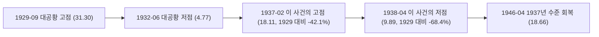

# 1. 회복 도중에 다시 반토막

1937년 2월 고점에서 1938년 4월 저점까지 14개월 동안, S&P 500은 **45.39% 빠졌다.** 같은 기간 미 10년물은 0.16%p 내렸고, 물가는 오히려 0.71% 올랐다. 숫자만 보면 흔한 침체 하나가 더 있는 것처럼 보인다.

그런데 이 "고점" 자체가 문제다. 1937년 2월의 지수 18.11은 [대공황](/history/1929-great-depression) 고점(1929년 9월, 31.30) 대비 여전히 **42.1% 낮은 자리였다.** 1932년 6월 대공황 저점(4.77)에서는 **279.7% 올랐지만,** 1929년 수준과는 거리가 멀었다. 다시 무너진 1938년 4월의 9.89는 1929년 고점 대비 **68.4% 낮았다.**

그러니 "시장이 회복한 뒤 다시 절반이 빠졌다"는 설명은 틀렸다. 회복이 절반을 조금 넘긴 지점에서, 그 회복이 끝나기 전에 다시 절반 가까이 빠진 것이다. 연준 사료는 이 사건을 대공황 안에 있었던 또 다른 침체("recession within the Depression")라고 부른다. S&P 500이 1937년 2월 수준을 되찾은 건 **1946년 4월, 9.2년(110개월) 뒤다.** 그마저도 1929년 고점에는 한참 못 미치는 수준이었다. 금은 이 구간에서도 온스당 35달러에 묶여 있었다 — [대공황](/history/1929-great-depression) 편에서 다룬 1934년 금준비법의 법정가다.

이 글 위 차트는 사건 구간만 잘라서 보여준다. 그래서 지수 선이 새 고점을 찍고 무너지는 것처럼 보이지만, 실제로는 대공황에서 회복하던 도중, 그 회복이 끝나기도 전에 다시 무너진 것이다. 나스닥은 1971년 이후 데이터라 이 구간엔 없고, 한국 데이터도 없다.

# 2. 두 번의 긴축 — 통화와 재정

## 2.1 지급준비율을 두 배로, 그리고 금 불태화

이 사건의 정책금리 배지는 **1937년 하반기에 -0.50%p로 표시된다.** 이 시대의 정책금리 지표는 재할인율인데, 재할인율만 보면 연준이 완화로 돌아선 것처럼 읽힌다. 하지만 이 침체를 만든 긴축의 실제 수단은 재할인율이 아니었다.

1933년 이후 은행들은 초과지급준비금을 크게 쌓아뒀다. 1933년 12월 8억 5,900만 달러였던 초과지급준비금은 1935년 12월 33억 달러를 넘겼다. 연준은 이 돈이 "과도한 신용 팽창"으로 번질 걸 우려해, **1936년 8월 16일, 1937년 3월 1일, 5월 1일** 세 차례에 걸쳐 지급준비율을 법정 상한까지 사실상 두 배로 올렸다.

같은 시기 재무부도 움직였다. **1936년 6월 말부터** 금 유입분을 불태화(sterilize)해, 금이 들어와도 통화 기반이 늘지 않도록 막았다. 프리드먼과 슈워츠는 지급준비율 인상과 금 불태화가 겹치며 통화량 증가율이 급격히 꺾이고 이내 감소로 돌아섰다고 봤다. 다만 연준 사료조차 두 정책 중 무엇이 더 결정적이었는지는 "여전히 논쟁 중"이라고 적는다. 이 사건은 원인을 하나로 단정할 수 없는 사건이다.

이 위 차트의 정책금리 선이 하반기에 꺾여 내려가는 모습을 보고 "연준이 풀어서 시장이 안정됐다"고 읽으면 정반대다. 그 인하는 이미 벌어진 침체에 대한 뒤늦은 대응이었을 뿐, 애초에 침체를 부른 긴축은 재할인율 밖에서 벌어졌다.

## 2.2 재정에서도 지출을 줄였다

통화만이 아니었다. **1937년 사회보장세 징수가 시작됐고,** 여기에 1935년 세입법에 따른 증세까지 겹쳤다. 당시 연준 의장 매리너 에클스는 1939년 라디오 연설에서, 정부 부양책을 너무 빨리 거둬들인 것이 다른 요인들과 겹치며 1937년 가을의 급격한 디플레이션으로 이어졌다고 진단했다.

# 3. 되돌리자 불황이 끝났다

연준 사료는 이 침체가 끝난 계기를 세 가지로 정리한다. 연준이 지급준비율을 다시 낮췄고, 재무부가 금 불태화를 멈추고 1936년 12월 이후 쌓인 불태화 금을 모두 풀었고, 루스벨트 행정부가 확장적 재정정책으로 돌아섰다.

NBER 기준으로 이 침체는 **1937년 5월부터 1938년 6월까지, 13개월** 이어졌다. 20세기 세 번째로 깊은 침체였고 — 1920년, 1929년 침체보다는 얕았다 — 실질GDP는 10%, 산업생산은 32% 줄었으며 실업률은 다시 20%까지 올라갔다.

정책을 되돌리자 회복은 오히려 극적이었다. 1938년부터 1942년까지 실질 산출은 **49% 늘었다.** 전쟁을 피해 유럽에서 들어온 금과 미국의 방위산업 확충이 그 동력이었다 — [2차 세계대전](/history/1941-pearl-harbor-wwii) 편이 다루는 확장이 여기서 이미 시작되고 있었다.

# 4. 마무리

1937년 불황이 이 타임라인에서 갖는 자리는 분명하다. **너무 일찍 조이면 어떻게 되는지 보여주는 사례다.** [대공황](/history/1929-great-depression)이 33개월에 걸쳐 무너지고 25년 만에 고점을 되찾았다면, 1937년 불황은 그 회복이 채 끝나기도 전에 통화와 재정을 동시에 조여 다시 절반 가까이 무너뜨린 사건이다. 이 타임라인에서 회복 도중에 다시 무너진 건 이 사건이 유일하다.

[볼커 쇼크](/history/1980-volcker-shock)와 [코로나](/history/2020-covid-pandemic)는 정반대 사례다. 볼커는 인플레이션을 잡으려 의도적으로 침체를 감수했고, 코로나 때 연준은 머뭇거림 없이 풀었다. 1937년엔 물가가 오히려 낮았는데도 초과지급준비금이 쌓였다는 이유로 먼저 조였다. 이코노미스트 크리스티나 로머가 이 사건을 경고성 사례라 부르고, 2012년 시카고 연은 총재 찰스 에번스가 "실질금리가 충분히 낮아지기도 전에 완화를 너무 일찍 거둬들이는" 정책 실수의 예로 1937년을 든 이유가 여기 있다.

# 5. 참고 자료

- [연준 사료 — Recession of 1937-38](https://www.federalreservehistory.org/essays/recession-of-1937-38) — 초과지급준비금 규모, 지급준비율 인상과 금 불태화, 사회보장세, 침체 종료 경로, 1938~42년 회복 배경
- [NBER 경기순환 기준일](https://www.nber.org/research/data/us-business-cycle-expansions-and-contractions) — 1937년 5월부터 1938년 6월까지, 13개월 침체
- [NBER Working Paper 16688 — Calomiris, Mason, Wheelock](https://www.nber.org/papers/w16688) — 지급준비율 인상의 정확한 시행일(1936-08-16, 1937-03-01, 1937-05-01)
- Robert Shiller, [Online Data](http://www.econ.yale.edu/~shiller/data.htm) — 이 글의 S&P 500·물가·장기금리 데이터
- FRED — [NY연은 재할인율](https://fred.stlouisfed.org/series/M13009USM156NNBR) — 이 시기의 정책금리 지표. Fed Funds 금리는 1954년 7월부터라 이 구간을 덮지 못한다
- [금준비법(Gold Reserve Act)](https://en.wikipedia.org/wiki/Gold_Reserve_Act) — 1934년, 금 공정가격을 1온스 35달러로 고정
