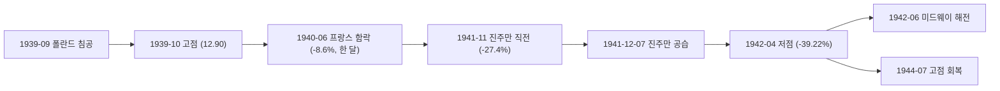

# 1. 숫자로 본 진주만과 2차 세계대전

1939년 10월 고점에서 1942년 4월 저점까지, 30개월 동안 S&P 500은 **39.22% 빠졌다.**

| 지표 | 값 |
|---|---|
| S&P 500 | -39.22% |
| 美10년물 | +0.21%p |
| 정책금리 | 0.00%p (1.0% 고정) |
| 물가(CPI) | +15.00% |
| 금 | 고정 $35/oz |
| 나스닥 | 데이터 없음(1971년 이후) |
| 한국(코스피) | 데이터 없음 |

고점 회복은 **1944년 7월, 4.8년(57개월) 뒤다.** 전쟁이 아직 끝나지 않은 시점이다. 유럽 전선은 1945년 5월까지, 태평양 전선은 그해 9월까지 이어진다.

# 2. 하락은 진주만 이전에 이미 끝나 있었다

슬러그와 표제는 "진주만"이지만, 낙폭의 대부분은 진주만 이전에 이미 발생했다. 고점(1939년 10월, 12.90)에서 진주만 직전인 1941년 11월(9.37)까지 지수는 이미 **27.4% 빠져 있었다.** 진주만 공습 이후 저점인 1942년 4월(7.84)까지 남은 하락은 **16.3%다.** 30개월 낙폭의 3분의 2 이상이 진주만이 일어나기 전에 끝났다는 뜻이다.

## 2.1 가장 가파른 한 달은 프랑스 함락 때였다

이 구간에서 지수가 한 달 만에 가장 크게 빠진 건 1940년 5월과 6월 사이다. 10.58에서 9.67로 **8.6% 빠졌다.** 독일이 서유럽을 침공하고 프랑스가 무너진 시점이다. 이 위 차트에서 지수 선이 가장 가파르게 꺾이는 구간도 여기다. 진주만이 있는 1941년 12월 한 달의 낙폭(9.37→8.76, -6.5%)보다 크다.

## 2.2 진주만 이후, 그리고 미드웨이보다 앞선 저점

진주만 공습 이후에도 하락은 넉 달 더 이어져 1942년 4월에 바닥을 찍었다. 이 저점은 태평양 전세를 처음 뒤집은 미드웨이 해전(1942년 6월)보다 두 달 앞선다.

데이터가 보여주는 건 이 시점의 선후 관계뿐이다. 전황이 뒤집히기 전에 시장이 먼저 바닥을 쳤다는 사실은 확인되지만, 시장이 전황을 미리 반영해서 돌아섰다고 단정할 근거는 이 데이터만으로는 없다.

# 3. 30개월 동안 금리가 한 번도 움직이지 않았다

이 구간 30개월 동안 정책금리(재할인율)는 1.0%에서 단 한 번도 움직이지 않았다. 열네 개 사건 가운데 정책금리 변화가 정확히 **0.00%p인 건 이 사건뿐이다.** 美10년물도 2.25%에서 2.46%로 **0.21%p** 오른 게 전부다.

10년물만 놓고 보면 더 작은 사건도 있다. [대공황](/history/1929-great-depression)이 **+0.14%p,** [1937 불황](/history/1937-roosevelt-recession)이 **-0.16%p,** [블랙먼데이](/history/1987-black-monday)가 **-0.17%p로** 이 사건보다 작다. 하지만 앞의 두 사건은 정책금리가 크게 움직였다 — 대공황은 **-3.12%p다.** 블랙먼데이는 두 금리 모두 잠잠했지만 사건 자체가 넉 달짜리다. **30개월 내내 두 금리가 함께 제자리였던 건 이 사건뿐이다.**

## 3.1 이미 1937년에 바닥이었다

이유는 이 구간 이전에 있다. 재할인율은 이미 **1937년 9월** 1.5%에서 1.0%로 내려가 있었다 — [1937 불황](/history/1937-roosevelt-recession) 편에서 다룬 긴축과는 반대 방향의 움직임이다. 전쟁이 시작되기 2년 전 이미 대공황 이후 최저 수준에 도달해 있었으니, 이 사건 구간 동안에는 정책금리가 더 내려갈 자리가 남아 있지 않았다.

## 3.2 전시 페그는 이 구간이 끝날 때 시작됐다

"전쟁이라 금리를 묶어뒀다"는 설명은 절반만 맞다. 연준 사료에 따르면, 국채 단기물(T-bill) 금리를 연 0.375%로 고정하는 공식 페그는 **1942년 7월부터** 발효됐다. 이 사건의 저점(1942년 4월)보다 석 달 뒤다. 다만 재할인율을 1%로 통일하고 단기 국채 담보 대출에 0.5% 우대금리를 적용하는 조치는 **1942년 봄**, 즉 이 구간이 끝나갈 무렵 이미 각 준비은행에서 시행되고 있었다. 이 페그 체제는 1947년까지 이어졌고, 1951년 트레저리-페드 협정으로 완전히 풀린다.

즉 이 구간에서 금리가 조용했던 건 전시 정책이 새로 만들어낸 결과라기보다, 대공황 끝자락에 이미 바닥까지 내려간 금리가 전쟁 발발과 함께 공식 페그 체제로 넘어가는 길목에 있었기 때문이다.

# 4. 물가는 오르는데 침체는 아니었다

물가(CPI)는 이 구간 30개월 동안 **15% 올랐고,** 저점인 1942년 4월 기준 전년비로는 **12.6%다.** 1942년 1월 30일 긴급물가통제법이 서명되며 물가관리국(OPA)이 생겼고, 연준도 소비자 할부 대출에 큰 계약금과 짧은 만기를 강제하는 규제(Regulation W)로 힘을 보탰다. 물가는 올랐지만 완전한 폭주로 이어지지는 않았다.

그런데 NBER 기준으로 이 30개월은 침체가 아니다. NBER은 **1938년 6월부터 1945년 2월까지, 80개월을** 하나의 확장 국면으로 기록한다. 이 사건의 고점(1939년 10월)과 저점(1942년 4월) 모두 이 확장 국면 안에 있다. S&P 500이 39% 넘게 빠지는 동안, 미국 경제는 공식적으로는 계속 확장하고 있었던 셈이다.

# 5. 마무리

이 사건이 이 타임라인에서 갖는 자리는 두 가지다.

하나는 최악의 뉴스가 나온 시점과 바닥의 관계다. 진주만이라는, 이 시기 최악의 뉴스가 나오기 훨씬 전에 낙폭의 대부분은 이미 끝나 있었다. 진주만 이후 저점까지는 넉 달, 남은 낙폭은 16.3%뿐이었다.

다른 하나는 금리다. [대공황](/history/1929-great-depression), [1937 불황](/history/1937-roosevelt-recession), [오일쇼크](/history/1973-oil-shock)까지 이 타임라인의 다른 사건들에서는 금리가 오르내리며 하락을 설명하는 한 축이 됐다. 이 사건은 다르다. 금리는 이미 바닥에 있었고, 30개월 내내 그 자리를 지켰다. [코로나](/history/2020-covid-pandemic) 편에서는 대응 속도가 회복 기간을 갈랐다고 썼는데, 이 사건에서는 애초에 더 움직일 금리가 남아 있지 않았다.

# 6. 참고 자료

- [연준 사료 — The Federal Reserve's Role During WWII](https://www.federalreservehistory.org/essays/feds-role-during-wwii) — 독일의 폴란드 침공(1939-09), 진주만 공습(1941-12), 국채 단기물 페그(연 0.375%, 1942-07 발효), 재할인율 1% 통일과 우대금리 0.5%(1942년 봄), 가격·임금 통제와 배급 프로그램
- [NBER 경기순환 기준일](https://www.nber.org/research/data/us-business-cycle-expansions-and-contractions) — 1938-06 ~ 1945-02, 80개월 확장. 이 구간 전체가 그 안에 포함된다
- [긴급물가통제법(Emergency Price Control Act of 1942)](https://en.wikipedia.org/wiki/Emergency_Price_Control_Act_of_1942) — 1942-01-30 서명, 물가관리국(OPA) 설립
- Robert Shiller, [Online Data](http://www.econ.yale.edu/~shiller/data.htm) — 이 글의 S&P 500·물가·장기금리 데이터
- FRED — [NY연은 재할인율](https://fred.stlouisfed.org/series/M13009USM156NNBR) — 이 시기의 정책금리 지표. Fed Funds 금리는 1954년 7월부터라 이 구간을 덮지 못하고, 10년물도 1962년 이전은 Shiller 데이터다
- [금준비법(Gold Reserve Act)](https://en.wikipedia.org/wiki/Gold_Reserve_Act) — 1934년, 금 공정가격을 1온스 35달러로 고정. 이 구간에도 그대로 적용된다
