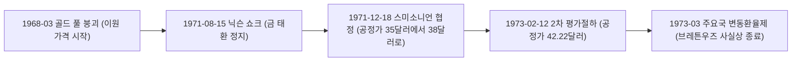

# 1. 숫자로 본 닉슨 쇼크

이 페이지의 다른 사건들과 배지 값을 나란히 놓으면 닉슨 쇼크는 이질적으로 보인다. 지수(S&P 500)가 **42.45%** 올랐다. 하락장이 아니라서다.

이 사건은 `kind: moment`, 즉 한 시점에 찍힌 사건이다. 배지 값은 그 시점 기준 앞뒤 12개월, **1970년 8월부터 1972년 8월까지** 24개월 구간으로 계산된다. 대공황이나 금융위기처럼 고점에서 저점까지 시장이 무너진 구간이 아니라, 1971년 8월 15일이라는 특정 발표를 가운데 두고 그 전후를 자른 것이다. 그래서 지수가 오른 채로 나온다.

| 지표 | 값 |
|---|---|
| 지수(S&P 500) | **+42.45%** |
| 금 | **+86.82%** |
| 美10년물 | **-1.07%p** |
| 정책금리 | **-1.81%p** |
| 물가 | **+7.69%** |

나스닥과 코스피는 이 배지에 없다. 나스닥 지수는 1971년 2월에야 시작됐고, 코스피 데이터는 1981년 이후만 있어서다.

가장 눈에 띄는 숫자는 금이다. **86.82%.** 이 페이지의 다른 어떤 사건보다 크다. 그런데 이 숫자를 읽는 방법이 다른 사건들과는 다르다. 그 이야기가 이 글의 핵심이다.

# 2. 1971년 8월 15일, 무엇을 발표했나

## 2.1 브레튼우즈 체제와 이미 벌어져 있던 균열

1944년 브레튼우즈 체제는 달러를 금 1온스당 35달러에 고정하고, 다른 나라 통화는 다시 달러에 고정하는 구조였다. 미국만 금을 지키면 전체 환율 체계가 유지되는 설계였다.

균열은 1971년보다 훨씬 먼저 시작됐다. 베트남전 지출과 국내 재정 확대로 달러가 해외에 계속 쌓이자, 각국 중앙은행이 보유한 달러를 금으로 바꿔달라고 요구하는 압력이 커졌다. **1968년 3월 17일** 미국과 영국은 런던 금 풀(Gold Pool)을 접었고, 그 결과로 이원 가격 체계가 생겼다. 중앙은행 간 거래는 여전히 1온스 35달러였지만, 민간이 거래하는 자유시장 가격은 별도로 움직이기 시작했다. 우리 데이터의 금 계열이 1968년 4월부터 런던 자유시장가(LBMA)를 쓰는 이유다.

## 2.2 캠프 데이비드의 세 가지 조치

**1971년 8월 13일부터 15일까지**, 닉슨은 연준 의장 아서 번스, 재무장관 존 코널리, 국제통화 담당 차관 폴 볼커를 포함한 참모 15명과 캠프 데이비드에 모였다. 8월 15일 저녁 닉슨은 TV 연설로 새 경제정책(New Economic Policy)을 발표했다. 세 가지였다.

1. **금 태환 정지** — 외국 정부가 보유한 달러를 더 이상 금으로 바꿔줄 수 없다고 선언했다. "금 창구를 닫는다"는 표현이 이것이다.
2. **90일 임금·물가 동결** — 행정명령 11615호로, 평시 최초의 전면적 임금·물가 통제였다. 이후 페이즈 II, III로 이어졌다.
3. **10% 수입 부과금** — 무역수지를 개선하려는 조치였다.

세 조치 모두 같은 문제, 즉 달러에 대한 압력을 겨냥했다. 물가 상승과 국제수지 악화, 그리고 금으로 몰리는 달러 태환 요구를 하루아침에 끊어낸 것이다.

# 3. 금은 발표 전부터 이미 움직이고 있었다

여기서 틀리기 쉬운 지점이 있다. "닉슨의 발표로 금값이 오르기 시작했다"는 서술은 사실과 다르다.

발표 시점인 1971년 8월 자유시장 금값은 이미 **1온스 40달러를 넘어 있었다.** 공정가 35달러보다 16% 높았다. 아래는 이 구간 금값의 실제 경로다.

| 시점 | 금 (LBMA, $/oz) |
|---|---|
| 1970-08 | 35.80 |
| 1971-06 | 40.10 |
| 1971-08 (발표) | 40.65 |
| 1971-09 | 42.60 |
| 1971-12 | 43.63 |
| 1972-03 | 48.38 |
| 1972-06 | 64.65 |
| 1972-08 | 66.88 |
| 1972-09 | 64.20 |
| 1972-12 | 64.90 |
| 1973-03 | 90.00 |
| 1973-06 | 123.25 |

1968년 골드 풀 붕괴로 이미 갈라져 있던 공정가와 자유시장가가, 1971년 여름에는 이미 크게 벌어져 있었다. 닉슨의 발표는 이 이탈을 만든 게 아니라 **공식화**한 것이다. 그때까지 금 태환은 법적으로는 살아 있었고, 각국 중앙은행이 공정가로 달러를 금으로 바꿔달라고 요구하는 것도 가능했다. 8월 15일 이후에는 그 통로 자체가 사라졌다.

이 글 위 차트에서 금 선이 발표일 이전부터 이미 위로 꺾여 있는 것도 같은 이유다. 차트에서 봐야 할 건 "발표 이후 급등"이 아니라, **발표 전후로 기울기가 거의 바뀌지 않는다는 사실**이다. 이미 벌어지고 있던 이탈이 발표 이후에도 같은 속도로 계속됐다.

# 4. 봉합하려던 체제는 15개월 만에 다시 무너졌다

**1971년 12월 18일**, G10 재무장관·중앙은행 총재들이 워싱턴 스미소니언 협회에 모여 스미소니언 협정을 맺었다. 금 공정가를 1온스 35달러에서 **38달러로** 올리고(달러 약 7.9% 평가절하), 통화 변동폭을 기존 ±1%에서 **±2.25%로** 넓혔다. 수입 부과금은 철회했다.

이 협정은 오래가지 못했다. 자유시장 금값은 새 공정가 38달러를 가볍게 넘어 계속 올랐다. 우리 데이터로도 **1972년 6월 64.65달러, 1973년 3월 90.00달러**다. 시장이 새 공정가를 신뢰하지 않는다는 뜻이었다. **1973년 2월 12일** 미국은 두 번째 평가절하를 단행해 공정가를 **42.22달러로** 올렸지만 이번에도 시장을 잠재우지 못했다. 그달 안에 주요국이 외환시장을 일시 폐쇄했고, 다시 열렸을 때는 달러에 대해 변동환율제로 넘어가 있었다. 고정환율이라는 브레튼우즈의 핵심 장치가 이때 사실상 끝났다.

그래서 "브레튼우즈 체제의 종말"은 한 날짜가 아니라 두 단계로 나눠 보는 게 정확하다. **1971년 8월**에 금 태환이라는 핵심 연결고리가 끊어졌고, **1973년 3월**에 고정환율이라는 나머지 뼈대까지 무너졌다.

# 5. 침체가 아니었다

이 페이지의 다른 사건 대부분은 경기 침체와 겹친다. 닉슨 쇼크는 다르다. [NBER](https://www.nber.org/research/data/us-business-cycle-expansions-and-contractions) 기준으로 1970년 11월 저점에서 1973년 11월 고점까지는 **36개월짜리 확장기**였다. 1971년 8월은 이 확장기 한가운데다.

지수 배지가 +42.45%로 뜨는 이유가 여기 있다. 통화 체제의 근간이 흔들린 사건인데도 주식시장은 경기 확장을 타고 올랐다. 다음 침체는 **1973년 11월부터 1975년 3월까지 16개월**이며, 이 페이지의 다음 사건인 [오일쇼크](/history/1973-oil-shock)와 겹친다. 통화 체제의 균열과 실물 경기의 균열 사이에는 2년 넘는 시차가 있었다.

# 6. 그때 다른 자산은 어땠나

## 6.1 금리는 오히려 내렸다

미 10년물은 7.49%에서 6.42%로 **1.07%p** 내렸고, 정책금리는 6.62%에서 4.81%로 **1.81%p** 내렸다. 물가 압력이 쌓이던 시기에 금리가 내렸다는 건 언뜻 어색하다.

여기엔 정치적 배경이 있다. 닉슨 녹음테이프와 번스의 개인 일기를 분석한 연구([Abrams, 2006](https://fraser.stlouisfed.org/files/docs/meltzer/jep_2006_abrams_how_richard_nixon.pdf))는 닉슨이 1972년 재선을 앞두고 번스 의장에게 완화적 통화정책을 지속하도록 압박했다고 기록한다. 이 압박을 계량화한 후속 연구([Drechsel, NBER Working Paper 32461](https://www.nber.org/papers/w32461))는 1971년 4분기에만 정치적 압력에 따른 완화 효과가 150bp를 넘는 것으로 추정한다. 우리 데이터의 정책금리(월평균)도 같은 모양이다. 1970년 8월 6.62%에서 내려와 **1972년 2월 3.30%로** 바닥을 찍는다. 그리고 선거가 끝나자 정반대로 움직였다. 1972년 8월 4.81%에서 **1973년 7월 10.40%까지,** 열한 달 만에 5.59%p 뛴다. 이 글의 24개월 창은 하필 그 반전이 막 시작되는 1972년 8월에서 끝난다. 배지의 **-1.81%p는** 완화 구간만 잘라낸 숫자다.

## 6.2 물가는 이미 달아오르고 있었다

물가는 이 구간에서 **7.69%** 올랐다. 24개월 누적으로는 대공황의 디플레이션이나 2008년의 거의 정지 상태와는 분명히 다른, 이미 상승 추세로 들어선 물가다.

임금·물가 통제가 시행되던 구간이 이 24개월 중 일부 겹쳐 있다는 점도 함께 봐야 한다. 통제는 측정된 물가 상승을 일시적으로 눌렀을 뿐 원인을 없애지는 못했고, 통제가 단계적으로 풀리면서 물가는 더 가파르게 올랐다. 이 흐름은 1973년 오일쇼크에서 유가 충격과 겹쳐 본격적인 스태그플레이션으로 이어진다.

# 7. 금이 자산이 되는 순간

이 페이지의 다른 글에서 금이 어떻게 다뤄졌는지 나란히 놓으면 이 사건의 위치가 분명해진다.

| 글 | 금 |
|---|---|
| [대공황](/history/1929-great-depression) | 법정 고정가. 1934년 1온스 20.67달러 → 35달러 |
| [닷컴](/history/2000-dotcom-bubble) | +14.5% |
| [금융위기](/history/2008-financial-crisis) | +16.1% |
| [코로나](/history/2020-covid-pandemic) | -0.06% |
| [2022 긴축](/history/2022-inflation-tightening) | -8.7% |

대공황 편에서 금은 지표가 아니라 법이었다. 1934년 금준비법으로 공정가가 35달러로 오른 것도 금이 오른 게 아니라 달러가 41% 깎인 것이었다고 썼다. 그 고정가 체제가 이 글에서 끝난다.

닷컴·금융위기·코로나·2022는 전부 금이 그 시기의 금리, 물가, 위험 선호에 반응해 오르내린 결과다. 그 반응이 가능하려면 금에 시장가격이 있어야 한다. 닉슨 쇼크의 +86.82%는 그런 반응이 아니다. 시장가격이라는 게 처음으로 공식 인정받는 순간, 그리고 그 위에서 반응이 시작되는 출발점이다. 다른 글의 금이 지표라면, 이 글의 금은 지표가 **생겨나는 사건**이다.

# 8. 마무리

닉슨 쇼크에서 가져갈 건 두 가지다.

하나는 **발표와 원인을 구분해야 한다**는 것이다. 1971년 8월 15일은 금값 상승의 출발점이 아니라 이미 벌어지고 있던 이탈의 공식 인정이었다. 정책 발표가 항상 흐름을 만드는 건 아니다. 이미 진행 중인 흐름을 뒤늦게 인정하는 경우도 있다.

다른 하나는 **이 사건 이후 금이 다른 자산과 같은 방식으로 값이 매겨지기 시작했다**는 것이다. 이 페이지의 다른 다섯 사건에서 금값이 등락으로 표시되는 건 당연해 보이지만, 그 당연함은 1971년 8월 이전에는 존재하지 않았다. 이 글이 이 타임라인에서 짧지만 결절점인 이유다.

# 9. 참고 자료

- [연준 사료 — Nixon Ends Convertibility of U.S. Dollars to Gold and Announces Wage/Price Controls](https://www.federalreservehistory.org/essays/gold-convertibility-ends) — 캠프 데이비드 회의(1971-08-13~15)와 발표 내용
- [연준 사료 — The Smithsonian Agreement](https://www.federalreservehistory.org/essays/smithsonian-agreement) — 1971년 12월 협정과 그 실패
- [연준 공개시장조작 기록](https://www.federalreserve.gov/monetarypolicy/openmarket.htm)
- [NBER 경기순환 기준일](https://www.nber.org/research/data/us-business-cycle-expansions-and-contractions) — 1970-11 ~ 1973-11 확장기(36개월). 다음 침체는 1973-11부터 1975-03까지 16개월
- [Nixon shock — Wikipedia](https://en.wikipedia.org/wiki/Nixon_shock) — 새 경제정책 3대 조치, 행정명령 11615호
- [Smithsonian Agreement — Wikipedia](https://en.wikipedia.org/wiki/Smithsonian_Agreement) — 1971-12-18, 공정가 $35→$38, 변동폭 ±2.25%
- [London Gold Pool — Wikipedia](https://en.wikipedia.org/wiki/London_Gold_Pool) — 1968-03-17 붕괴와 이원 가격 체계
- Burton Abrams, [How Richard Nixon Pressured Arthur Burns: Evidence from the Nixon Tapes](https://fraser.stlouisfed.org/files/docs/meltzer/jep_2006_abrams_how_richard_nixon.pdf) (Journal of Economic Perspectives, 2006) — 닉슨 녹음테이프·번스 일기 기반 압박 정황
- Thomas Drechsel, [Estimating the Effects of Political Pressure on the Fed](https://www.nber.org/papers/w32461) (NBER Working Paper 32461) — 1971년 4분기 150bp 넘는 정치적 완화 효과 추정치
- Robert Shiller, [Online Data](http://www.econ.yale.edu/~shiller/data.htm) — 이 글의 S&P 500·물가 데이터
- FRED — [미 10년물](https://fred.stlouisfed.org/series/DGS10), [정책금리](https://fred.stlouisfed.org/series/FEDFUNDS)
- [LBMA 금 현물](https://www.lbma.org.uk/prices-and-data/precious-metal-prices) — 1968년 이후 자유시장 가격
