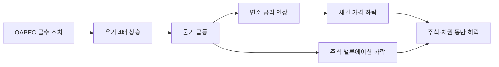

# 1. 숫자로 본 오일쇼크

1973년 1월 고점에서 1974년 10월 저점까지, S&P 500은 **41.35% 빠졌다.** 21개월 걸렸다. 나스닥은 더 크게 빠져 **49.20%다.**

| 지표 | 값 |
|---|---|
| S&P 500 | -41.35% |
| 나스닥 | -49.20% |
| 금 | +153.03% |
| 美10년물 | +1.25%p |
| 정책금리 | +4.12%p |
| 물가(CPI) | +19.95% |
| 한국(코스피) | 데이터 없음(1981년 이후) |

[NBER](https://www.nber.org/research/data/us-business-cycle-expansions-and-contractions) 기준으로 이 시기의 공식 침체는 **1973년 11월부터 1975년 3월까지 16개월이다.** 주가는 경기보다 먼저 움직였다. S&P 500은 침체가 시작되기 10개월 전인 1973년 1월에 이미 고점을 찍었고, 저점도 침체가 끝나기 5개월 전인 1974년 10월에 먼저 찍었다. 시장이 경기보다 먼저 꺾이고 먼저 돌아선다는, 이 타임라인에서 되풀이되는 패턴이 여기서도 나타난다.

회복은 오래 걸렸다. S&P 500이 1973년 1월 수준을 되찾은 건 **1980년 7월이다.** 7.5년이다.

| 사건 | 고점 회복까지 |
|---|---|
| 대공황 | 25년 |
| 오일쇼크 | **7.5년** |
| 닷컴(나스닥) | 14년 |
| 금융위기 | 5.4년 |

# 2. 유가가 왜 4배가 됐나

## 2.1 욤키푸르 전쟁과 금수 조치

1973년 10월 6일 이집트와 시리아가 이스라엘을 기습 공격하며 욤키푸르 전쟁이 시작됐다. 미국이 이스라엘에 22억 달러 규모의 긴급 군사 지원을 요청하자, [연준 사료](https://www.federalreservehistory.org/essays/oil-shock-of-1973-74)에 따르면 **1973년 10월 19일** 아랍석유수출국기구(OAPEC)가 미국을 겨냥한 석유 금수 조치를 발동했다. 조치는 OAPEC 내부에서 지속 기간을 두고 이견이 컸고, 결국 **1974년 3월에 풀렸다.**

그사이 유가는 배럴당 2.90달러에서 1974년 1월 11.65달러까지, **4배 가까이 뛰었다.** [미 국무부 사료](https://history.state.gov/milestones/1969-1976/oil-embargo)도 이 구간의 가격 인상을 같은 규모로 정리한다.

## 2.2 이미 물가는 뛰고 있었다

유가가 오르기 전부터 물가는 이미 문제였다. 당시 연준 의장이었던 아서 번스는 [금수 조치가 "공교로운 시점"에 터졌다고 설명했다](https://www.federalreservehistory.org/essays/oil-shock-of-1973-74). 이미 산업용 원자재 도매가격이 연 10%가 넘게 오르고 있었고, 공장은 완전 가동 중이었으며, 여러 원자재가 품귀 상태였다.

닉슨 행정부는 이보다 2년 앞선 **1971년 8월 15일부터** 임금·물가를 강제로 묶어뒀다. [국립문서기록관리청 기록](https://www.archives.gov/research/guide-fed-records/groups/432.html)에 따르면 이 경제안정화 프로그램은 1971년부터 1974년까지 여러 단계를 거쳤고, 마지막 통제는 **1974년 4월 30일에 끝났다.** 오일쇼크가 한창이던 시점과 겹친다. 통제가 풀리자 억눌려 있던 인상 압력이 한꺼번에 반영됐다.

물가 지표는 이 흐름을 보여준다. 소비자물가 전년 대비 상승률은 1973년 1월 **3.6%에서** 1974년 10월 **12.1%로,** 두 달 뒤인 12월에는 **12.3%로 올라갔다.**

# 3. 주식과 채권이 함께 무너졌다

이 사건의 핵심은 낙폭이 아니라 무엇이 함께 움직였는가다.

주가가 41.35% 빠지는 동안 미 10년물 금리는 6.54%에서 7.79%로 **1.25%p 올랐다.** 금리가 올랐다는 건 채권 가격이 내렸다는 뜻이다. 오일쇼크는 주식과 채권이 함께 빠진 사건이다.

이 타임라인 열네 개 사건 가운데 주가가 빠지는 동안 10년물 금리가 오히려 오른 경우는 여섯이다. 다만 1907년(+0.25%p), 1929년(+0.14%p), 1941년(+0.21%p)은 상승폭이 0.3%p에도 못 미쳐 사실상 제자리였다. 채권이 주식과 함께 뚜렷하게 빠진 건 셋뿐이다.

| | 지수 | 美10년물 |
|---|---|---|
| 닷컴(2000-02) | -49.1% | -2.10%p |
| 금융위기(2007-09) | -56.8% | -1.77%p |
| 코로나(2020) | -33.9% | -0.43%p |
| **오일쇼크(1973-74)** | **-41.35%** | **+1.25%p** |
| [볼커 쇼크](/history/1980-volcker-shock)(1980-82) | -19.4% | **+0.96%p** |
| [2022 긴축](/history/2022-inflation-tightening) | -18.5% | **+2.31%p** |

닷컴·금융위기·코로나에서는 금리가 내렸다. 주식에서 빠져나온 돈이 채권으로 들어가 한쪽이 다른 쪽을 받쳐줬다는 뜻이다. 오일쇼크와 볼커 쇼크, 2022년은 반대다. 세 사건의 원인은 같다. **물가다.** 물가가 오르면 중앙은행은 금리를 올릴 수밖에 없고, 금리가 오르면 채권도 주식과 함께 빠진다. 전통적인 주식·채권 분산이 통하지 않는 조건이다.

# 4. 그런데 금은 2022년과 정반대로 움직였다

[2022년 긴축](/history/2022-inflation-tightening) 편은 "주식·채권·금이 동시에 빠진 유일한 해"라고 썼다. 오일쇼크는 그 문장의 절반만 맞다. 채권은 2022년처럼 같이 빠졌지만, 금은 정반대로 움직여 **153.03% 올랐다.**

금 가격은 두 번에 걸쳐 크게 뛰었다.

| 시점 | 가격(달러/온스) |
|---|---|
| 1973-01 | 66.00 |
| 1973-05 | 114.75 |
| 1973-09 | 100.00 |
| 1974-01 | 132.50 |
| 1974-05 | 156.75 |
| 1974-09 | 151.25 |
| 1974-10 | 167.00 |

첫 급등은 1973년 1월 66달러에서 5월 114.75달러까지, 다섯 달 만에 **73.9% 올랐다.** 금수 조치가 시작되기도 전인 상반기의 일이라 오일쇼크와는 무관하다. 이 무렵 금은 [달러의 금태환이 끝난](/history/1971-nixon-shock) 지 2년이 채 안 된, 막 시장가격을 갖기 시작한 자산이었다.

두 번째는 1973년 9월 100달러에서 1974년 1월 132.50달러까지, **32.5% 오른 구간이다.** 이번엔 금수 조치 발동과 겹친다. 이후로도 오르내림을 반복하며 구간 전체로는 **153.03% 상승했다.**

이 구간 정책금리도 한 방향이 아니었다. 1973년 1월 5.94%에서 8월 10.50%까지 올랐다가 12월 9.95%로 내렸고, 1974년 7월 12.92%까지 다시 올랐다가 연말 8.53%로 내려간다. 물가는 그동안 3.6%에서 12%대까지 계속 올랐다. 금리가 오르내리는 사이에도 물가 불안은 가시지 않았고, 금은 그 불안을 타고 계속 올랐다.

2022년은 달랐다. 연준은 [일곱 번, 그중 네 번을 연속 75bp씩 올리며](/history/2022-inflation-tightening) 사실상 제로 금리에서 4.25~4.50%까지 한 방향으로만 움직였다. 금리가 오르면 이자를 주지 않는 금을 들고 있는 기회비용이 커진다. 흔들림 없이 한 방향으로 가는 긴축 앞에서 금은 밀렸다. 같은 물가발 하락장이라도 금리가 오르내렸는지, 한 방향으로 갔는지에 따라 금의 역할은 달라졌다.

# 5. 마무리

오일쇼크가 이 타임라인에서 갖는 자리는 분명하다. 주식과 채권이 함께 빠진 첫 사례이자, 스태그플레이션이 실감 나게 체감되기 시작한 사건이다.

[대공황](/history/1929-great-depression)은 정반대였다. 물가가 27% 넘게 내려가는 디플레이션 속에서 주가가 무너졌다. 오일쇼크는 물가가 20% 가까이 오르는 인플레이션 속에서 주가가 무너졌다. 원인은 정반대였지만, 주식이 갈 곳을 잃었다는 결과는 같았다.

[닷컴](/history/2000-dotcom-bubble)과 [금융위기](/history/2008-financial-crisis), [코로나](/history/2020-covid-pandemic)에서는 금리가 내리며 채권이 완충 역할을 했다. 오일쇼크와 [2022년 긴축](/history/2022-inflation-tightening)은 물가가 원인이라 금리가 오히려 올랐고, 채권도 같이 빠졌다. 다만 둘 사이에도 차이가 있다. 2022년은 금까지 빠지며 숨을 곳이 없었다. 오일쇼크는 금이 153% 넘게 오르며 그나마 도피처 역할을 했다.

지수 하나만 보면 이 차이는 보이지 않는다. 이 페이지가 금리와 금을 함께 그리는 이유다.

# 6. 참고 자료

- [연준 사료 — 오일쇼크(1973-74)](https://www.federalreservehistory.org/essays/oil-shock-of-1973-74) — 금수 조치 시작(1973-10-19), 유가 2.90달러 → 11.65달러(1974-01), 아서 번스의 "공교로운 시점" 설명
- [미 국무부 사료실 — 오일 금수(1973-1974)](https://history.state.gov/milestones/1969-1976/oil-embargo) — 금수 조치 배경과 1974년 3월 해제
- [NBER 경기순환 기준일](https://www.nber.org/research/data/us-business-cycle-expansions-and-contractions) — 1973-11 ~ 1975-03, 16개월
- [국립문서기록관리청 — 경제안정화 프로그램 기록(1971-1974)](https://www.archives.gov/research/guide-fed-records/groups/432.html) — 닉슨 임금·물가 통제, 1974-04-30 종료
- [연준 사료 — 대인플레이션](https://www.federalreservehistory.org/essays/great-inflation) — 1965년부터 1982년까지 이어진 대인플레이션 개관
- [닉슨 쇼크](https://en.wikipedia.org/wiki/Nixon_shock) — 1971년 8월, 달러의 금태환 정지
- Robert Shiller, [Online Data](http://www.econ.yale.edu/~shiller/data.htm) — 이 글의 S&P 500·물가·장기금리 데이터
- FRED — [나스닥 종합](https://fred.stlouisfed.org/series/NASDAQCOM), [미 10년물](https://fred.stlouisfed.org/series/DGS10), [정책금리](https://fred.stlouisfed.org/series/FEDFUNDS), [한국 주가지수](https://fred.stlouisfed.org/series/SPASTT01KRM661N)
- [LBMA 금 현물](https://www.lbma.org.uk/prices-and-data/precious-metal-prices)
