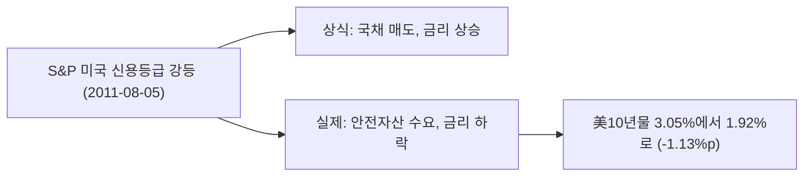

# 1. 숫자로 본 유럽 재정위기

이 페이지의 월평균 데이터로 보면 S&P 500은 2011년 5월 고점에서 9월 저점까지 **12.29% 빠졌다.** 그런데 그해 여름 시장은 한 달 안에서도 급등락을 반복해서, 월평균은 실제 낙폭을 크게 뭉갠다. 일간 종가로 다시 재면 2011년 4월 29일 종가 1363.61에서 10월 3일 종가 1099.23까지 **19.4% 빠졌다.** 두 계산이 7%p 넘게 벌어져서, 이 글의 지수 배지와 본문은 **-19.4%를** 기준으로 쓴다.

trough 자리도 어긋난다. 월평균으로는 9월이 가장 낮지만, 일간 종가의 진짜 저점은 **10월 3일이다.** 9월 안에서 저점을 찍고 반등했다가 10월 초에 다시 밀린 구간을, 월평균이 하나의 숫자로 합쳐 버린 탓이다.

그래도 **-19.4%는** 이 페이지의 다른 위기들과 비교하면 얕은 축에 속한다. [금융위기](/history/2008-financial-crisis)의 -56.8%나 [대공황](/history/1929-great-depression)의 -84.8%와는 비교가 안 된다. 회복도 **2012년 2월,** 고점에서 9개월 만에 끝났다. 이 사건이 이 타임라인에서 갖는 자리는 낙폭의 크기가 아니라 "위기라고 다 같은 크기가 아니다"라는 사실 그 자체다.

# 2. 강등당한 국채가 팔린 역설

**2011년 8월 5일,** 신용평가사 S&P가 미국의 국가신용등급을 사상 처음으로 **AAA에서 AA+로** 낮췄다. 나흘 전인 **8월 2일** 오바마 대통령은 부채한도를 올리는 예산통제법(Budget Control Act of 2011)에 서명했는데, S&P는 그 협상 과정 자체를 문제 삼았다. 재정 지출을 통제하고 세수를 늘리는 합의에 이르기까지 앞으로도 진통이 이어질 것이라는 이유였다.

상식대로면 강등당한 나라의 국채는 팔려야 한다. 그런데 반대 일이 벌어졌다. 美10년물 금리는 5월 3.05%에서 9월 1.92%로 **1.13%p 내렸다.** 금리가 내렸다는 건 국채 가격이 올랐다는 뜻이다. 강등당한 자산으로 오히려 돈이 몰렸다.

이 구간에서 [NBER](https://www.nber.org/research/data/us-business-cycle-expansions-and-contractions)은 미국을 침체로 기록하지 않았다. 2009년 6월부터 2020년 2월까지 128개월 이어진 확장기 한가운데였다. 신용등급이 깎이고 주가가 흔들리는 와중에도 미국 경제 자체는 성장하고 있었다는 뜻이다.

# 3. 유럽의 대응과 연준의 트위스트

위기의 진원지는 유럽이었다. 그리스는 2010년 1차 구제금융을 받았지만 부채는 줄지 않았다. 유로존 정상들은 **10월 26일** 브뤼셀 정상회의에서 2차 구제금융의 틀에 합의했다. 민간 채권단이 그리스 국채 원금의 **약 50%를** 손실로 떠안는 채무 재조정이 핵심이었다.

ECB는 그 뒤를 받쳤다. **12월 8일** 만기 36개월짜리 장기대출프로그램(LTRO)을 발표했고, 유로존 은행은 사실상 무제한으로 저금리 자금을 빌릴 수 있게 됐다. 12월 21일 첫 실행에서만 은행 523곳이 4,892억 유로를 가져갔다.

연준은 이미 제로 금리였다. 2008년처럼 내릴 여지가 없었다. 대신 **9월 21일** FOMC는 오퍼레이션 트위스트를 발표했다. 단기 국채 4,000억 달러를 팔고 그만큼 장기 국채를 사들여, 대차대조표를 불리지 않고 장기 금리를 눌렀다. 위 차트의 10년물 하락에는 이 결정도 함께 들어가 있다. 물가는 구간 동안 0.41% 오르는 데 그쳐, 인플레이션 부담 없이 이런 우회로를 택할 여유가 있었다.

# 4. 금도 안전하지 않았다

금 배지는 **+5.43%지만,** 구간 안에서는 훨씬 험하게 움직였다. 5월 1,536.5달러였던 금은 8월 **1,813.5달러까지** 올라 고점 대비 **18%를** 웃돌았다. 그런데 9월 한 달 만에 **1,620달러로** 10% 넘게 밀렸다. 배지의 +5.43%는 이 급등과 급락을 다 지나온 뒤의 순변화일 뿐이다.

[금융위기](/history/2008-financial-crisis) 편에서 유동성이 급해지면 안전자산인 금도 함께 팔린다고 썼다. 2011년 9월이 그 장면이다. "금이 위기에 오른다"는 말은 방향은 맞아도 그 안의 경로까지 설명해 주지는 않는다.

# 5. 한국이 더 빠졌다 - 어느 잣대로 재느냐

월평균 기준으로 한국 지수는 **15.64% 빠져,** 미국의 월평균 낙폭(-12.29%)보다 깊었다. 진원지는 유럽인데 한국이 더 맞은 셈이다. 그런데 미국을 일간 종가로 다시 재면 얘기가 바뀐다. 이 글의 headline인 **-19.4%는** 한국의 월평균 낙폭보다 오히려 크다. 어느 쪽이 "더 빠진" 걸까. 둘 다 맞다. 잣대가 다를 뿐이다.

[IMF 외환위기](/history/1997-asian-financial-crisis) 편은 "어느 시장이 진원지냐에 따라 결과가 갈린다"고 썼다. 1997년에는 한국이 진원지여서 한국만 무너지고 미국은 올랐다. 2011년은 다르다. 진원지는 유럽인데 정작 가장 크게 흔들린 자산은 강등당한 미국 국채(가격 상승)였고, 한국은 진원지가 아니면서도 월평균 기준으로는 미국보다 더 흔들렸다. 위기가 국경을 넘으면 어디로 튈지는 매번 다르다.

# 6. 마무리

2011년에서 가져갈 건 두 가지다.

하나는 **낙폭이 사건의 크기를 다 말해주지 않는다**는 것이다. 월평균으로 -12.29%, 일간으로 -19.4%. 같은 사건인데 재는 잣대에 따라 이 페이지에서 가장 얕은 축에 들 수도, 1980년 볼커 쇼크(월평균 기준 약 -19.4%)와 비슷한 자리로 올라갈 수도 있다.

다른 하나는 **신용등급과 안전자산은 같은 말이 아니라는 것**이다. 미국은 등급이 깎였는데 미국 국채로 돈이 몰렸다. 시장이 산 건 등급이 아니라, 그 순간 가장 확실한 유동성이었다.

회복은 9개월로 짧았다. [금융위기](/history/2008-financial-crisis)의 5.4년, [코로나](/history/2020-covid-pandemic)의 6개월과 나란히 놓으면, 낙폭이 얕다고 회복이 항상 가장 빠른 것도 아니라는 걸 알 수 있다. 코로나는 낙폭이 이 사건의 갑절 가까이(-33.9%) 깊었는데도 더 빨리 돌아왔다. 대응의 속도와 성격이 회복 기간을 갈랐다.

# 7. 참고 자료

- [ABC News — S&P, 미국 신용등급 AAA에서 AA+로 강등(2011-08-05)](https://abcnews.go.com/Business/standard-poors-downgrades-us-credit-rating-aaa-aa/story?id=14220820) — 강등 사유와 배경
- [미 의회 — 예산통제법 원문, Public Law 112-25(2011-08-02)](https://www.congress.gov/112/plaws/publ25/PLAW-112publ25.pdf) — 부채한도 인상과 재정 지출 통제 조항
- [FOMC 성명 2011-09-21](https://www.federalreserve.gov/newsevents/pressreleases/monetary20110921a.htm) — 오퍼레이션 트위스트(만기 연장 프로그램), 단기 국채 4,000억 달러 매도·장기 국채 매입
- [ECB — 은행 대출 지원 조치 발표(2011-12-08)](https://www.ecb.europa.eu/press/pr/date/2011/html/pr111208_1.en.html) — 36개월 LTRO, 지급준비율 인하
- [ESM — 그리스 2차 구제금융 경위](https://www.esm.europa.eu/publications/safeguarding-euro/bailout-bail-towards-new-programme-greece) — 2011-10-26 정상회의 합의, 민간 채권단 헤어컷
- [NBER 경기순환 기준일](https://www.nber.org/research/data/us-business-cycle-expansions-and-contractions) — 2009-06 ~ 2020-02, 128개월 확장기. 이 시기는 침체 아님
- Robert Shiller, [Online Data](http://www.econ.yale.edu/~shiller/data.htm) — 이 글의 S&P 500·물가 데이터
- Yahoo Finance — [S&P 500(^GSPC) 일별 시세](https://query1.finance.yahoo.com/v8/finance/chart/%5EGSPC?period1=1303776000&period2=1318032000&interval=1d) — 2011-04-29 1363.61, 2011-10-03 1099.23 일간 종가
- FRED — [나스닥 종합](https://fred.stlouisfed.org/series/NASDAQCOM), [미 10년물](https://fred.stlouisfed.org/series/DGS10), [정책금리](https://fred.stlouisfed.org/series/FEDFUNDS), [한국 주가지수](https://fred.stlouisfed.org/series/SPASTT01KRM661N)
- [LBMA 금 현물](https://www.lbma.org.uk/prices-and-data/precious-metal-prices)
