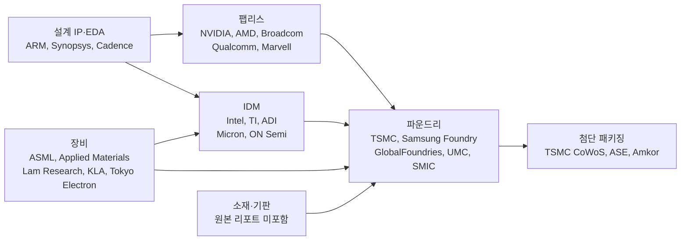

> 이 글은 Claude Code의 `equity-research:sector-overview` 스킬로 미국 반도체 섹터 리포트를 생성한 뒤, 거기 등장하는 수치 62개를 하나씩 검증한 기록이다.
>
> - **사용 스킬**: `equity-research:sector-overview` ([anthropics/financial-services](https://github.com/anthropics/financial-services))
> - **데이터 출처**: SEC EDGAR 공시, 각 사 IR 자료, 웹 검색
> - **데이터 기준일**: 2026년 7월 26일
>
> 본문에는 검증을 통과한 수치만 실었다. 판정이 `불일치`·`출처확인불가`인 29건과 스킬이 스스로 `UNSOURCED`로 표기한 11건, 합계 40건은 제외했다. 그래도 투자 판단에 쓰기 전 출처를 직접 확인하기 바란다.

---

# 1. 이 글은 이렇게 만들었다

Claude Code에 `equity-research:sector-overview` 스킬을 설치하고 인자 한 줄을 넘겼다.

```
US semiconductor sector overview. Data as of 2026-07-26.
No paid MCP connectors (FactSet/CapIQ/Daloopa) are available — use SEC EDGAR
filings, company IR pages, and web search instead. Cite a source for every
number. If a figure cannot be sourced, mark it UNSOURCED rather than estimating.
Output as markdown.
```

여기서 마지막에서 두 번째 문장이 결과를 크게 바꿨다. **"출처를 못 대면 UNSOURCED로 표기하고 추정하지 말라"**는 지시가 없었다면 이 글은 성립하지 않았을 것이다. 실제로 스킬은 출처를 찾지 못한 항목 11건을 `UNSOURCED`로 남겼고, 재무 표에서 값을 못 가져온 칸은 `not retrieved`로 비워뒀다. 0으로 채우거나 그럴듯한 숫자를 지어내지 않았다.

다만 이건 프롬프트가 강제해서 나온 결과다. 지시를 빼면 어떻게 동작하는지는 대조 실험을 하지 않아 알 수 없다. "스킬이 알아서 출처를 붙인다"가 아니라 "지시하면 지킨다"가 정확한 서술이다.

실행은 한 번에 끝났다. 스킬이 중간에 추가 입력을 요구한 적은 없다.

| 항목 | 실측 |
|---|---|
| 소요 시간 | 8분 45초 |
| 웹 검색 | WebSearch 16회 |
| 웹 페이지 조회 | WebFetch 20회 (1회 실패) |
| SEC EDGAR API 호출 | 6회 (2회 실패 후 재시도) |
| 산출물 | 마크다운 1개 파일, 320줄 |

실패 3건의 내역도 적어둔다. SIA 보도자료 원문은 HTTP 403으로 막혔고, macOS 기본 bash 3.2가 `declare -A`를 지원하지 않아 스크립트가 한 번 죽었으며, EDGAR 배치 조회 1회가 무응답이었다.

산출물 형태에는 짚어둘 점이 하나 있다. 스킬 정의(`SKILL.md`)는 산출물을 **Word 또는 PowerPoint 문서 + Excel 부록 + 차트 3종**(시장규모 워터폴, 경쟁 포지셔닝 매트릭스, 밸류에이션 스캐터)으로 규정한다. 본문에 "차트는 필수(Charts are essential)"라고도 적혀 있다. 그런데 마크다운으로 달라고 했더니 차트는 **하나도 생성되지 않았다.** 스킬 정의의 산출물 규정은 강제력이 없고 참고 문구에 가깝다. 차트가 필요하면 따로 지시해야 한다.

# 2. 스킬이 내놓은 것

## 2.1 산출물 개요

320줄짜리 마크다운은 스킬 워크플로를 그대로 따라 6단계로 나뉜다.

| 단계 | 내용 | 분량 |
|---|---|---|
| Step 1 | 커버리지 범위 정의 | 표 1개 |
| Step 2 | 시장 규모, 세그먼트, 밸류체인, 산업 구조, 세속적 동인, 리스크, M&A | 본문 절반 |
| Step 3 | 기업별 실적 표 15행, 기업 노트, 경쟁 구도 | 표 3개 |
| Step 4 | 17개사 밸류에이션 멀티플, 해석 | 표 2개 |
| Step 5 | 강세·약세 논거, 관찰, 촉매 일정 | 표 1개 |
| Step 6 | 산출물 한계, 못 채운 항목 10개, 검증 대기 목록 7건 | 목록 |

실행 전에 세워둔 수용 기준 5개로 판정하면 이렇다.

| 기준 | 판정 | 근거 |
|---|---|---|
| 밸류체인 단계별 대표 기업 | 충족 | 6단계와 단계별 기업명 |
| 세그먼트 구분 | 충족 | WSTS 세그먼트별 성장률, 기업별 세그먼트 라벨 |
| 밸류에이션 멀티플 5개사 이상 | 충족 | 17개사, 멀티플 4종 |
| 리스크 지정학·사이클 양쪽 | 충족 | 수출통제·정부 지분·집중도 / 메모리 가격 사이클 분리 서술 |
| 각 수치에 출처 | 조건부 충족 | 아래 설명 |

마지막 기준만 조건부다. 이유가 셋이다. 첫째, 제시된 수치에는 전부 링크가 붙었지만 출처를 못 찾은 11건은 `UNSOURCED`로 남았다. 즉 "모든 수치에 출처가 있다"가 아니라 "출처 없는 수치를 지어내지 않았다"가 달성된 것이다. 둘째, 출처 **품질** 편차가 크다. SEC EDGAR 공시와 X(트위터) 게시물이 같은 문서 안에 근거로 공존한다. 셋째, 이 정직성은 앞서 적은 대로 프롬프트가 강제한 결과다.

스킬 자체가 기여한 품질 가드레일도 있긴 했다. 프롬프트에 없던 내용이 산출물에 들어온 경로는 둘이었다. 하나는 2026년 시장 전망치 3종의 편차를 두고 **"평균내지 말라"**고 경고한 부분이고, 다른 하나는 **"섹터 리포트는 빨리 낡는다, 외부 사용 전 날짜를 다시 확인하라"**는 문구다. 둘 다 스킬 `SKILL.md`의 `Important Notes` 섹션에 있는 지시가 그대로 반영된 것이다.

## 2.2 검증 통과분으로 본 반도체 섹터

아래는 산출물 전체가 아니다. 검증에서 `일치` 또는 `근사` 판정을 받은 구간만 옮긴 것이다. 제외된 40건은 하나도 넣지 않았다.

### 2.2.1 시장 규모와 세그먼트

먼저 확정된 실적치다. 미국반도체산업협회(SIA) 릴리스 기준이다.

| 구간 | 값 |
|---|---|
| 2024년 글로벌 반도체 매출 | $630.5B |
| 2025년 글로벌 반도체 매출 | $791.7B (전년비 +25.6%) |
| 2025년 4분기 | $236.6B (전년동기비 +37.1%, 전분기비 +13.6%) |
| 2026년 1분기 | 전분기비 +25% |

2026년 전망은 기관별로 갈린다. 이번 검증에서 원문을 직접 확인해 값이 일치한 것은 둘이다.

- **WSTS Spring 2026**: 2026년 $1.51조 (+90%), 2027년 약 $1.9조 (+27%)
- **SIA**: 2026년 "약 $1조"

두 기관의 2026년 전망이 5,000억 달러 넘게 벌어진다. 산출물도 이 점을 짚으며 "어느 한 숫자로 모델을 세우면 취약하고, 이 값들을 평균내지 말라"고 적었다. 편차의 대부분은 메모리 가격 가정 차이다.

WSTS Spring 2026의 세그먼트별 2026년 성장률은 원문 페이지를 직접 받아 전부 대조했다.

| 세그먼트 | 2026년 성장률 |
|---|---|
| 메모리 | 약 +250% (규모 $800B 초과) |
| 로직 | +37% |
| 마이크로프로세서 | +20% |
| 아날로그 | +10% |
| 디스크리트 | +8% |
| 센서·광전자 | +3% |

지역별로는 미주 +112%, 아시아태평양 +87%, 유럽 +58%, 일본 +28%다.

이 표가 이번 사이클의 성격을 그대로 보여준다. 산업 전체가 +90%인데 아날로그는 +10%, 디스크리트는 +8%다. 광범위한 사이클이 아니라 **메모리가 지수를 혼자 끌고 가는 국면**이다. 아날로그와 디스크리트 숫자는 평범한 회복기의 모습에 가깝다.

장비 쪽에서는 SEMI의 2027년 총 반도체 장비 매출 전망 **$156B**가 검증을 통과했다. (2026년 장비 전망은 스킬이 낡은 값을 가져와 틀렸다. 이 사례는 4.2절에서 따로 다룬다.)

### 2.2.2 밸류체인

산출물은 밸류체인을 ASCII art로 그렸다. 아래는 같은 내용을 다이어그램으로 옮긴 것이다.



이 구조 자체는 수치가 아니므로 62개 검증 대상에 들어가지 않았다. 다만 각 단계의 집중도는 수치로 확인했다.

**파운드리** — 2026년 1분기 상위 10사 매출은 $47.95B(전분기비 +3.7%)로 사상 최대였고, 그중 TSMC가 $35.86B다. 점유율은 전분기 70.4%에서 **72.3%**로 올랐다. 삼성 파운드리 6.5%, SMIC 5.1%, UMC 3.9%, GlobalFoundries 3.3%, 화홍 2.5%, 그 아래 Tower·Nexchip·VIS·PSMC가 각 0.8%다.

한 회사가 파운드리 시장의 4분의 3에 가까운 몫을 가져간다는 뜻이고, 그 회사의 첨단 공정 생산 능력이 한 섬에 몰려 있다는 뜻이기도 하다. 산출물이 지정학 리스크의 첫 항목으로 이 집중도를 꼽은 것은 타당하다.

**DRAM** — 2026년 1분기 매출 점유율은 삼성 38.5%($37.32B), SK하이닉스 28.8%($27.98B), 마이크론 22.4%($21.75B)다. 상위 3사가 89.7%를 차지한다.

### 2.2.3 주요 기업 실적

아래 표는 SEC EDGAR XBRL 공시 데이터를 원본 10-Q와 대조해 확인한 것이다. 회계연도가 회사마다 달라 분기 종료일을 함께 적었다.

| 기업 | 세그먼트 | 분기 종료일 | 매출(백만 달러) | 전년비 | 매출총이익률 | 영업이익률 | 순이익(백만 달러) |
|---|---|---|---|---|---|---|---|
| NVIDIA | 로직·가속기 | 2026-04-26 | 81,615 | +85.2% | 74.9% | 65.6% | 58,321 |
| Broadcom | 로직·커스텀 ASIC | 2026-05-03 | 22,187 | +47.9% | 69.5% | 48.6% | 9,310 |
| Micron | 메모리 | 2026-05-28 | 41,456 | +345.7% | 84.6% | 80.4% | 28,243 |
| Intel | 로직 IDM·파운드리 | 2026-06-27 | 16,128 | +25.4% | 40.4% | 11.1% | −11,033 |
| AMD | 로직 | 2026-03-28 | 10,253 | +37.8% | 52.8% | 14.4% | 1,383 |
| Qualcomm | 로직·모바일 | 2026-03-29 | 10,599 | −3.5% | 53.8% | 21.8% | 7,370 |
| Applied Materials | 장비 | 2026-04-26 | 7,910 | +11.4% | 49.9% | 31.9% | 2,806 |
| Lam Research | 장비 | 2026-03-29 | 5,841 | +23.7% | 49.8% | 35.0% | 1,825 |
| Texas Instruments | 아날로그 | 2026-06-30 | 5,463 | +22.8% | 61.4% | 42.3% | 1,980 |
| Analog Devices | 아날로그 | 2026-05-02 | 3,623 | +37.2% | 67.3% | 38.1% | 1,176 |
| KLA | 장비 | 2026-03-31 | 3,415 | +11.5% | 61.1% | 41.2% | 1,200 |
| NXP | 아날로그·자동차 | 2026-03-29 | 3,181 | +12.2% | 56.2% | 27.8% | 1,122 |
| Marvell | 로직·커스텀 | 2026-05-02 | 2,417 | +27.5% | 52.1% | 14.0% | 34 |
| ON Semiconductor | 아날로그·전력 | 2026-04-03 | 1,513 | +4.7% | 38.5% | −3.5% | −34 |

읽을 때 반드시 함께 봐야 할 단서가 다섯 개 있다.

- **Micron 매출총이익률 84.6%** — 값은 정확하지만 가격 급등이 만든 일시적 수치다. 범용 메모리 사업에서 이 수준의 이익률은 전례가 없다. 지속 가능한 구조적 마진으로 모델링하면 안 된다.
- **Intel 순손실 −$11,033M** — 같은 분기 영업이익은 **+$1,796M 흑자**다. 손실의 원인은 미 정부가 CHIPS Act 보조금을 지분으로 전환하며 에스크로에 넣어둔 주식이 파생부채로 잡혀 발생한 시가평가손 $12,529M이다. 비현금 항목이고 영업 부진이 아니다. 자세한 내용은 4.4절에 적었다.
- **Qualcomm 순이익 $7,370M** — 이연법인세 평가충당금 환입 $5.7B가 들어 있다. 세전이익은 $2,232M로 영업이익보다 오히려 작다. 이 순이익으로 수익성을 논하면 안 된다.
- **NXP 영업이익률 27.8%** — 공시된 GAAP 영업이익률은 47.3%인데, 그 안에 MEMS 센서 사업부 매각 일회성 차익 $627M이 들어 있다. 표에는 매각차익을 제외한 경상 기준 값을 넣었다. 전년 동기 경상 기준은 25.5%다.
- **KLA 이익률과 Qualcomm 매출총이익률** — 회사가 해당 항목을 별도 태그로 공시하지 않아 손익계산서에서 직접 계산한 도출값이다. 특히 KLA는 손익계산서에 영업이익 소계 자체를 표시하지 않는다.

밸류체인 위쪽 두 회사도 검증을 통과했다.

**NVIDIA** — 2026년 1분기(FY27 기준) 데이터센터 매출 $75.2B, 전년비 +92%. 내역은 하이퍼스케일 $37.9B, ACIE(AI 클라우드·산업·엔터프라이즈) $37.4B다.

**TSMC** — 2026년 2분기 매출 NT$1,270,381M(전년비 +36.0%), 순이익 NT$706,562M(+77.4%), 매출총이익률 67.7%, 영업이익률 60.3%. 회사가 EDGAR에 6-K로 제출한 실적 발표문 원문에서 확인한 값이다.

**Broadcom** — FY2026 AI 반도체 매출 $56B, FY2027 $100B 초과라는 가이던스를 실적 발표에서 재확인했다.

# 3. 62개 수치를 검증한 결과

## 3.1 판정 기준

산출물에 등장하는 수치를 62개 항목으로 나눠 하나씩 원문과 대조했다. 항목은 검증표의 1행을 뜻하고, 한 행이 여러 숫자를 묶는 경우가 있다. 예를 들어 "14개사 매출"은 1개 항목이지만 14개 숫자다.

| 판정 | 의미 |
|---|---|
| 일치 | 1차 또는 준1차 출처에서 동일한 값을 확인 |
| 근사 | 오차 5% 이내 또는 반올림 차이 |
| 불일치 | 출처의 값과 다르거나, 인용된 출처에 해당 수치가 존재하지 않음 |
| 출처확인불가 | 이번 검증에서 출처를 확인하지 못함 |

사용한 도구는 SEC EDGAR XBRL `companyfacts` API, EDGAR 원본 공시(10-Q / 8-K / 6-K), 웹 검색과 원문 페치다. 유료 커넥터는 쓰지 않았다.

기준 하나를 미리 밝혀둔다. **출처 문서에 그 값이 실려 있더라도, 현행 값이 따로 있는 낡은 판을 현재 전망으로 제시하면 불일치로 봤다.** 4.2절의 두 사례가 여기 해당한다.

## 3.2 집계

| 판정 | 항목 수 | 비중 |
|---|---|---|
| 일치 | 31 | 50% |
| 근사 | 2 | 3% |
| 불일치 | 15 | 24% |
| 출처확인불가 | 14 | 23% |
| **합계** | **62** | **100%** |

여기에 스킬이 스스로 `UNSOURCED`로 표기한 11건을 더하면 **제외 대상은 40건**이다. 단 불일치 15건 중 5건은 "스킬이 회수 가능한 값을 놓쳤다"는 뜻이지 "값이 틀렸다"는 뜻이 아니다. 원본에 값이 아예 없던 빈칸이므로 걷어낼 수치 자체가 없다. 실제로 산출물에서 지워야 할 값은 **35건**이다.

항목이 아니라 개별 숫자로 세면 그림이 달라진다. 이번에 직접 값을 대조한 개별 수치는 약 150개이고, 그 대부분이 맞았다. 미국 신고사 14곳의 매출·성장률·이익률·순이익만 64개, WSTS와 SIA가 15개, TrendForce가 20개, 밸류에이션이 16개다.

**즉 대부분의 숫자는 맞다. 그런데 틀린 것이 하필 헤드라인 수치다.** 이게 이번 검증의 핵심 구도다.

## 3.3 정확했던 구간과 틀린 구간

판정은 구간별로 뚜렷하게 갈렸다.

| 구간 | 확인 방법 | 결과 |
|---|---|---|
| 시장 규모·전망 (SIA·WSTS) | 협회 릴리스 원문 페치 | 15개 수치 전부 일치 |
| 미국 신고사 14곳 재무 | EDGAR XBRL + 원본 10-Q | 약 64개 수치 전부 일치 |
| TSMC 실적 | EDGAR 6-K 발표문 | NT$ 기준 전부 일치, US$ 환산만 불일치 |
| 파운드리·DRAM 점유율 | TrendForce 릴리스 | 당분기 값은 일치, 직전 분기 비교값은 불일치 |
| 밸류에이션 멀티플 | stockanalysis.com | 표본 2개사 14개 값 일치, 나머지 15개사 미검증 |
| 세속적 동인·정책·M&A | 2차·3차 웹 출처 | 불일치와 출처확인불가가 집중 |

경계선이 선명하다. **1차 자료(SEC 공시, 협회 릴리스, 회사 IR)로 확인 가능한 구간은 사실상 전부 정확했고, 2차·3차 웹 출처에 의존한 구간에서 문제가 몰렸다.**

불일치 15건을 성격별로 나누면 이렇다.

| 성격 | 건수 | 사례 |
|---|---|---|
| 인용 출처에 그 수치가 없음 | 2 | 하이퍼스케일러 capex $600B, 분기 capex "사상 첫 $100B 돌파" |
| 낡은 판·다른 연도를 현재 값으로 제시 | 3 | TSMC 파운드리 점유율 67.6%, SEMI 총 장비 2026년 전망, SEMI WFE 금액 |
| 근거 없는 직전 분기 값 | 2 | SK하이닉스·삼성 DRAM 점유율 전분기 비교 |
| 회수 가능한 값을 누락 | 5 | Broadcom 순이익, Qualcomm 매출총이익률, KLA 이익률, TSMC 이익률 2종 |
| 라벨·정의 오류 | 2 | Broadcom AI 매출을 XPU 단독으로 표기, DRAM 성장률을 전분기비 대신 전년비로 표기 |
| 단위 환산 오류 | 1 | TSMC 2분기 매출 달러 환산 |

세 번째 유형을 하나만 풀어보면 이렇다. 산출물은 "DRAM 시장이 전분기비 +81% 성장한 분기에 SK하이닉스가 점유율 4.1%p를 잃었다"를 리포트에서 가장 놀라운 줄로 지목했다. 방향은 맞다. 그런데 근거로 단 TrendForce 페이지를 열어보니 **직전 분기 점유율이 아예 실려 있지 않았다.** 별도로 전분기 릴리스를 받아 대조하니 실제 하락폭은 3.3%p(32.1% → 28.8%)였다. 4.1%p의 출처는 끝내 찾지 못했다. 삼성도 마찬가지로 +2.0%p가 아니라 +2.5%p였다.

# 4. 출처가 있는데 틀린 수치들

여기가 이 글의 본론이다. 앞 절에서 본 불일치 15건 중 성격이 특히 나쁜 넷을 골라 무슨 일이 있었는지, 어떻게 발견했는지, 왜 그런 일이 생기는지 적는다.

공통점이 하나 있다. **넷 다 링크가 멀쩡히 달려 있었다.** 클릭 가능한 URL이 붙어 있고, 그 URL은 실제로 열리며, 대체로 반도체 산업에 관한 글이다. 링크가 있으니 검증된 것처럼 보인다는 게 함정이다.

## 4.1 인용된 기사에 그 숫자가 없다

산출물의 세속적 동인 첫 항목은 이 문장으로 시작한다.

> 2026년 하이퍼스케일러 capex는 약 $600B로 보고되며, 전년비 +70%다.

AI 인프라 투자 규모를 한 줄로 요약하는 숫자다. 블로그에 인용될 확률이 가장 높은 헤드라인 수치이기도 하다. 출처로는 한 산업 매체 기사 URL이 달려 있었다.

그 URL을 두 가지 방법으로 확인했다. 먼저 페이지를 읽어달라고 했더니 "2026년 하이퍼스케일러 capex에 대한 언급이 없다"는 답이 돌아왔다. 확인 사살을 위해 `curl`로 HTML 원문을 직접 받았다. 응답은 정상(HTTP 200), 크기는 97,823바이트였다. 태그를 걷어낸 본문 14,353자에서 `hyperscal`, `capex`, `capital expenditure`, `600`, `70%`, `100 billion`을 전수 검색했다.

결과는 이렇다. `hyperscal`은 메모리 가격을 설명하는 문맥에서 한 번 나오고, `capex`는 "설비투자가 지속적으로 늘어난다"는 정성적 서술로 한 번 나온다. **달러 금액도, 증가율도 없다.** 그 기사는 하이퍼스케일러 capex 규모를 언급한 적이 없다.

값 자체도 맞지 않았다. 독립 출처들의 2026년 추정치를 모아보니 이렇다.

| 출처 | 값 | 범위 정의 |
|---|---|---|
| Tom's Hardware | $725B (+77%) | Google·Microsoft·Meta·Amazon |
| valueaddvc | 합계 $630B | 빅4 가이던스 합산 |
| datacenterrichness | $630B | 하이퍼스케일러 |
| CNBC | "$700B에 근접" | 빅테크 |
| CreditSights 인용 | $700B~$900B | 빅4 + Oracle |

관측 범위는 $630B~$900B다. $600B는 이 범위 아래에 있다. 게다가 값과 증가율이 서로도 안 맞는다. 2025년 빅4 실적 $410B를 기준으로 하면 $600B는 +46%이지 +70%가 아니고, +70%를 적용하면 약 $697B가 나온다.

같은 문장에 붙어 있던 "하이퍼스케일 분기 capex가 Q3 2025에 사상 처음 $100B를 넘었다"도 같은 출처를 달고 있었고, 역시 그 본문에 없다. 이쪽은 별도로 확인하니 Synergy Research가 Q3 2025 하이퍼스케일 사업자 capex를 $142B로 집계했다. $100B를 넘은 것은 사실이나 **"사상 최초"인지는 확인하지 못했다.**

**왜 이런 일이 생기나.** 웹 검색 결과는 요약문과 URL 목록을 함께 준다. 요약문에 담긴 정보가 어느 URL에서 나온 것인지는 표시되지 않는다. 검색 요약을 읽고 결론을 만든 다음 목록에서 가장 관련 있어 보이는 URL을 출처로 붙이면, 링크와 내용이 어긋나도 알아차릴 방법이 없다. 이번 실행에서 이 현상은 반복해서 관찰됐다.

**대응.** 헤드라인급 수치는 링크가 달려 있어도 반드시 열어봐야 한다. 페이지 요약이 "언급 없음"이라고 답해도 그것만 믿지 말고, 원문을 받아 문자열로 검색하는 게 확실하다. 숫자 하나 확인하는 데 1분이면 된다.

## 4.2 1년 묵은 데이터를 현재로 인용

두 번째 유형은 더 교묘하다. 출처가 실재하고, 그 안에 그 숫자가 정확히 들어 있다. 다만 낡았다.

**사례 1: TSMC 파운드리 점유율 67.6%**

산출물은 스스로 "출처 충돌"을 발견하고 주석까지 달았다.

> 한 애그리게이터는 TSMC의 2026년 1분기 파운드리 점유율을 67.6%로, 다른 곳은 72.3%로 보고한다. 둘 다 TrendForce 출처다. 차이는 거의 확실히 "상위 10사 기준"과 "IDM 파운드리 서비스를 포함한 전체 시장 기준"의 정의 차이다.

이상을 탐지한 것까지는 훌륭하다. **그런데 추정이 틀렸다.** 인용된 기사를 열어보니 첫 문장이 이렇다. "TSMC가 **올해** 1분기 점유율을 67.6%로 끌어올렸다." 같은 기사 안에 "TSMC 매출이 전분기비 5% 감소한 **$25.52B**", "점유율은 직전 분기 **67.1%**에서 소폭 상승"이 나온다.

TSMC의 2026년 1분기 파운드리 매출은 $35.86B다. $25.52B는 2026년이 아니다. **1년 전, 2025년 1분기 기사였다.**

방법론 차이 같은 건 애초에 없었다. 존재하지 않는 정의 차이를 그럴듯하게 설명하는 주석이 달린 셈이다. 게다가 이 URL은 산출물 안에서 세 곳의 출처로 재사용됐다.

값 자체(72.3%)는 다행히 맞았다. TrendForce를 인용한 다른 매체 3곳에서 교차 확인했고, 정합성도 맞는다. $35.86B를 72.3%로 나누면 전체 파운드리 시장이 약 $49.6B이고, 상위 10사 합계 $47.95B는 그보다 작다. 모순이 없다. 즉 **수치는 살릴 수 있고 출처만 교체하면 됐다.**

**사례 2: SEMI 장비 시장 전망**

산출물은 "2026년 총 반도체 장비 매출 사상 최대 $139B, 2027년 $156B"라고 적었다. 두 숫자 모두 SEMI 릴리스에 실려 있다. 문제는 **서로 다른 해에 나온 릴리스**라는 것이다.

- $139B는 SEMI가 **2024년 12월 8일** 발표한 릴리스의 2026년 전망이다.
- 1년 뒤인 **2025년 12월 16일** 연말 전망이 2026년을 **$145B**로 상향했다.
- $156B는 그 신판의 2027년 전망이다.

즉 2026년은 폐기된 구판에서, 2027년은 현행판에서 가져와 한 문단에 나란히 놓았다. 각각의 출처는 진짜지만 함께 읽으면 잘못된 그림이 된다.

같은 문단의 WFE(전공정 장비) 수치는 문장 하나를 잘못 끊어 읽은 경우다. SEMI 원문은 이렇다.

> WFE 매출은 2026년 9.0%, 2027년 7.3% 성장해 $135.2 billion에 이를 전망이다.

산출물은 이걸 "2026년 WFE가 +9.0% 성장해 $135.2B"로 읽었다. **$135.2B는 2027년 수치다.** 2026년 WFE는 성장률로만 제시돼 금액이 없다. 굳이 쓰려면 2025년 실적 $115.7B에 +9.0%를 적용해 약 $126B라고 도출값임을 밝혀야 한다.

부수적으로, 산출물은 장비 시장 수치들 사이에 정합성이 맞지 않는다는 점을 스스로 지적하고 "이 둘을 같은 차트에 넣지 말라"는 주의까지 달아뒀다. 그 위화감의 상당 부분은 구판과 신판이 섞인 데서 온 것으로 보인다. 다만 나머지 한쪽 릴리스는 이번에 확인하지 못해 단정하지는 않는다.

**왜 이런 일이 생기나.** 검색 엔진은 오래된 릴리스와 최신 릴리스를 같은 자격으로 보여준다. 산업 협회 보도자료는 제목 형식이 해마다 거의 같아서, 제목만 봐서는 어느 해 것인지 알기 어렵다. 기사 본문의 "올해"나 "1분기"는 발행일을 모르면 해석할 수 없다.

**대응.** 산업 전망 수치는 **발행일을 먼저 확인한다.** URL이나 제목에 연도가 없으면 페이지 안에서 날짜를 찾는다. 그리고 같은 기관의 최신 릴리스가 따로 있는지 한 번 더 검색한다. 특히 "record", "사상 최대" 같은 표현이 붙은 전망치는 매년 갱신되므로 위험도가 높다.

## 4.3 다른 기관의 수치에 엉뚱한 출처를 달았다

세 번째는 값과 출처의 짝이 어긋난 경우다.

산출물의 2026년 시장 전망 표에는 "WSTS Autumn 2025 전망 $975B"라는 행이 있었고, WSTS PDF 링크가 달려 있었다. 그런데 이 값이 실제로 확인된 곳은 다른 매체 기사였고, 거기서는 이렇게 귀속돼 있었다.

> Deloitte는 2026년 글로벌 칩 매출이 $975 billion에 이를 것으로 전망한다.

**Deloitte 전망이다.** WSTS 귀속은 이번 검증에서 확인하지 못했다.

값이 우연히 같더라도 출처 기관이 다르면 인용이 성립하지 않는다. 전망치는 기관마다 방법론과 범위 정의가 다르기 때문이다. WSTS는 회원사 실적 집계를 기반으로 하고 Deloitte는 컨설팅 관점의 추정이다. 같은 $975B라도 무엇을 세었는지가 다르다.

더 나쁜 건 이 오귀속이 표 안에서 다른 행과 나란히 놓였다는 점이다. WSTS Spring 2026($1.51조)과 WSTS Autumn 2025($975B)가 같은 열에 있으면 독자는 "WSTS가 반년 만에 전망을 55% 올렸다"고 읽는다. 실제로 산출물 본문이 그렇게 서술했다. 한쪽이 다른 기관 값이면 이 대비 자체가 성립하지 않는다.

**왜 이런 일이 생기나.** 2차 매체 기사는 여러 기관의 전망을 한 문단에 모아 소개하는 일이 잦다. 문단 단위로 읽으면 어느 숫자가 어느 기관 것인지 흐려진다. 특히 기사 제목에 한 기관 이름이 들어 있고 본문에 다른 기관 수치가 섞이면 헷갈리기 쉽다.

**대응.** 전망치를 인용할 때는 **기관명과 발표 시점을 한 쌍으로 묶어** 원문 문장을 확인한다. "WSTS $975B"가 아니라 "WSTS가 2025년 가을 릴리스에서 $975B라고 밝혔다"까지 확인돼야 쓸 수 있다.

## 4.4 이상치는 잡았지만 원인 진단이 틀렸다

마지막 유형은 성격이 조금 다르다. 여기서는 **스킬이 잘한 부분을 먼저 적어야 공정하다.**

EDGAR에서 받아온 재무 데이터에서 산출물은 이상치 3건을 스스로 찾아내 표에 플래그를 달았다.

1. NXP 영업이익률 47.3% — 매출총이익률이 56.2%인데 영업이익률이 47.3%면 판관비와 R&D를 합쳐 매출의 9%뿐이라는 뜻이다. 정상 수준이 아니다.
2. Qualcomm 순이익($7,370M)이 영업이익($2,309M)보다 크다.
3. Intel이 영업이익 +$1,796M 흑자인데 순손실 −$11,033M이다.

**이상 탐지는 정확했다.** 셋 다 실제로 설명이 필요한 항목이었고, 산출물은 "이 세 칸은 공시를 확인하지 않고 쓰지 말라"고 명시했다. 원인 추정도 셋 중 둘이 맞았다.

- **NXP** — "비경상 항목이 포함됐을 수 있다"는 추정은 맞았다. 10-Q 주석을 열어보니 2026년 2월 2일 STMicroelectronics에 MEMS 센서 사업부를 매각한 **일회성 차익 $627M**이 영업이익 라인 안에 들어 있었다.
- **Intel** — "대규모 영업외 항목"이라는 추정도 맞았다. 손실의 정체는 미 정부 Escrowed Shares 관련 파생부채 시가평가손 **$12,529M**이다. 2025년 8월 합의로 미 정부는 CHIPS Act 잔여 보조금 등 $8.9B를 주당 $20.47에 Intel 보통주 4억 3,330만 주로 전환해 9.9% 지분을 취득했고, 그중 1억 5,870만 주가 에스크로에 남아 파생부채로 잡혀 있다. **Intel 주가가 오를수록 부채가 커지고 손실이 커지는 구조**다. 반년 만에 $2.7B에서 $15.6B로 불어났다.

틀린 것은 Qualcomm 하나다. 산출물의 진단은 "FQ2에 대규모 영업외 이익이 있었던 것으로 보인다"였다. 원본을 열어보니 그게 아니었다.

| 항목 | 값 |
|---|---|
| 영업이익 | $2,309M |
| 세전이익 | $2,232M |
| 법인세 | −$5,138M (비용이 아니라 환입) |
| 순이익 | $7,370M |

**세전이익이 영업이익보다 작다.** 영업외에서 이익이 난 게 아니라 오히려 손실이 났다. 순이익을 키운 건 법인세 라인이다. 주석을 보면 IRS가 2026년 1분기에 Notice 2026-07을 내면서 CAMT(법인 대체최저세) 적용이 해제됐고, 그에 따라 이전에 설정했던 연방 이연법인세자산 평가충당금 **$5.7B를 환입**했다. 실효세율이 "230% benefit"으로 찍힌다.

비현금 이연법인세 항목이다. 이 순이익으로 Qualcomm의 수익성을 논하면 안 된다.

**진짜 문제는 진단 정확도가 아니다.** 셋 다 추정에서 멈췄고, **표에는 확인되지 않은 값이 그대로 실렸다.** NXP 47.3%는 14개사 영업이익률 피어 비교표에 다른 회사들과 나란히 들어갔다. 그 표에서 NXP는 마이크론 다음으로 높은 영업이익률로 보이지만, 매각차익을 빼면 27.8%로 TI(42.3%)나 ADI(38.1%)보다 낮다. **비교표에 비교 불가능한 값이 섞여 들어간 것이다.**

Intel도 마찬가지다. 산출물은 정책 섹션에서 "미 정부가 9.9% 무의결권 지분을 보유한다"고 적었고, 재무 섹션에서 $11.0B 순손실을 따로 플래그했다. **같은 문서 안에 원인과 결과가 놓여 있었는데 둘을 연결하지 못했다.**

**왜 이런 일이 생기나.** XBRL API는 태그와 값만 준다. 그 값이 어떤 항목들로 구성되는지, 주석에 무슨 설명이 붙는지는 별도 문서를 열어야 알 수 있다. 스킬 워크플로에는 이상치를 탐지한 뒤 **원본 공시를 열어 확인하는 단계가 없다.** 탐지하고 플래그를 다는 데서 끝난다.

**대응.** 재무 표에 이상치가 있으면 그 회사 10-Q의 손익계산서와 주석을 직접 연다. 접수번호만 알면 EDGAR에서 재무제표 파일을 바로 받을 수 있다. 이번 검증에서 세 건 모두 이 방법으로 30분 안에 풀렸고, 그 과정에서 산출물에는 없던 설명 세 개를 얻었다.

# 5. 무료 데이터로 어디까지 되나

이번 실행의 제약 조건은 "유료 커넥터 없음"이었다. FactSet도 Capital IQ도 Daloopa도 없이 SEC EDGAR와 웹 검색만 썼다. 그 결과 어디까지 됐고 어디서 막혔는지 정리한다.

## 5.1 EDGAR로 되는 것

**미국 신고사의 재무 데이터는 전부 정확했다.** 이게 이번 검증에서 가장 분명한 결론이다.

XBRL `companyfacts` API는 인증 없이 User-Agent 헤더만으로 접근된다.

```bash
curl -s -H "User-Agent: your-email@example.com" \
  "https://data.sec.gov/api/xbrl/companyfacts/CIK0001045810.json"
```

14개사에서 분기 데이터를 받아 산출물 표와 대조했고, 매출·전년비 성장률·매출총이익률·영업이익률·순이익 약 64개 수치가 **전부 일치했다.** 반올림 차이 한 건(ON 영업이익률 −3.6% 대 −3.5%)을 빼면 오차조차 없었다.

여기서 알게 된 실무 팁이 셋 있다.

**첫째, "데이터가 없다"는 결론에 도달하기 전에 택소노미를 바꿔 재시도한다.** 산출물은 GlobalFoundries에 대해 "두 매출 태그 모두 데이터가 없다"고 적었다. 실제 원인은 태그가 아니라 택소노미였다. GFS는 외국 사기업이라 XBRL 팩트가 `us-gaap`이 아니라 **`ifrs-full`**에 들어 있다. `ifrs-full:Revenue`로 조회하면 과거 분기가 나온다. 재미있게도 산출물은 TSMC에 대해서는 IFRS 문제를 정확히 지적했으면서 GFS에는 같은 진단을 적용하지 못했다.

**둘째, 서식을 바꿔 재시도한다.** 산출물은 "TSMC는 IFRS 20-F 제출사라 EDGAR XBRL 엔드포인트로 분기 데이터를 얻을 수 없다"고 적고, 섹터에서 가장 중요한 회사의 재무를 2차 언론 보도로 채웠다. XBRL API에 대해서는 맞는 진단이다. **하지만 TSMC의 분기 실적 발표문 전문이 6-K로 EDGAR에 올라와 있다.** 접수번호 `0001046179-26-000451`, 2026년 7월 16일 접수분이다. 회사가 직접 발표한 손익 표가 그대로 들어 있어서, 2차 보도보다 근거가 강하다.

이 재시도만으로 TSMC의 1차 자료 전체와 매출총이익률 67.7%·영업이익률 60.3%를 확보했고, 산출물이 잘못 환산한 2분기 달러 매출도 회사 발표값 **$40.20B**로 바로잡을 수 있었다. 산출물의 $39.62B는 2차 매체가 자체 환율로 환산한 값이 그대로 들어온 것으로 보인다.

**셋째, `not retrieved`로 비어 있는 칸도 대개 채울 수 있다.** 산출물이 비워둔 6칸 중 5칸을 이번 검증에서 채웠다. Broadcom 순이익 $9,310M은 8-K 보도자료 첫 줄에 있었고, Qualcomm 매출총이익률과 KLA 이익률은 손익계산서 항목을 직접 계산하면 나왔다. 다만 **도출값은 도출값이라고 밝혀야 한다.** KLA는 손익계산서에 영업이익 소계 자체를 표시하지 않기 때문에 `OperatingIncomeLoss` 태그가 없는 것이고, 41.2%는 매출에서 원가·R&D·판관비를 뺀 계산값이다.

## 5.2 EDGAR로 안 되는 것

경계도 분명하다. EDGAR는 **개별 기업이 공시한 과거 실적**의 저장소다. 그 바깥은 못 채운다.

| 항목 | EDGAR로 안 되는 이유 |
|---|---|
| 시장 규모·성장 전망 | 개별 기업 공시가 아니다. 협회·리서치 릴리스에 의존 |
| 시장 점유율 | 시장 전체를 집계하는 3자 조사가 필요. TrendForce·Counterpoint 등 |
| 컨센서스 추정치 | 애널리스트 추정치는 공시 대상이 아니다 |
| 히스토리컬 멀티플 밴드 | 주가와 추정치의 시계열이 필요. 유료 데이터 영역 |
| 지수 수익률 시계열 | 지수 사업자 데이터 |

이 중 마지막 둘이 특히 아프다. 산출물은 17개사 현재 멀티플 표를 만들었지만, forward P/E의 기반 컨센서스 EPS와 추정 기준일이 공개되지 않는 무료 애그리게이터 값이다. 정확히 옮겨 적었는지는 확인했다. 표본 2개사 14개 값이 전부 일치했다. **그러나 정확히 옮겨 적은 블랙박스 숫자다.** 검증 대상이 아니라 검증 불가 대상이다.

섹터 히스토리컬 멀티플 밴드가 없다는 건 더 근본적이다. "지금 반도체 섹터가 역사적으로 비싼가"는 섹터 리포트의 존재 이유에 해당하는 질문인데, 여기에 답할 데이터가 없다. 산출물도 이걸 "material gap"으로 명시하고 프리미엄·디스카운트 주장을 아예 하지 않았다. 이 판단 자체는 옳다. 없는 데이터로 결론을 만드는 것보다 낫다.

몇 가지 자잘한 함정도 기록해둔다.

- **회사마다 XBRL 태그가 다르다.** NVIDIA와 Qualcomm은 `Revenues`를, 나머지는 `RevenueFromContractWithCustomerExcludingAssessedTax`를 쓴다. 단일 태그로 스크리닝이 안 된다.
- **4분기가 빠진다.** NVIDIA의 FY26 4분기는 연간 표기로만 존재해 분기 조회로는 안 잡힌다. 회계연도가 3월 말인 Microchip도 같은 사유로 마지막 분기가 없다.
- **회계연도가 제각각이라 "최근 분기"가 같은 기간이 아니다.** 위 표의 14개사는 분기 종료일이 2026년 3월부터 6월까지 흩어져 있다. 이 상태로 성장률을 옆에 놓고 비교하면 사이클 국면이 섞인다.

# 6. 스킬 결과를 검증해보니

8분 45초짜리 실행 하나를 검증하는 데 그보다 훨씬 긴 시간이 들었다. 그 대가로 얻은 판단을 정리한다.

**구조는 실무에서 쓸 수 있다.** 밸류체인 6단계, 세그먼트 구분, 17개사 멀티플 표, 지정학·사이클로 나뉜 리스크 섹션은 사람이 처음부터 짜려면 반나절은 걸릴 뼈대다. 어떤 항목을 봐야 하는지, 무엇을 빠뜨리면 안 되는지에 대한 체크리스트로서 스킬은 제 몫을 한다.

**1차 자료 구간의 정확도는 높다.** SEC 공시에서 끌어온 재무 수치 64개가 전부 맞았고, 협회 릴리스에서 가져온 시장 규모 15개도 전부 맞았다. 옮겨 적는 작업 자체에서는 실수가 없었다고 봐도 된다.

**문제는 그 바깥이다.** 2차·3차 웹 출처에 의존한 구간에서 불일치와 출처확인불가가 몰렸고, 하필 그쪽이 헤드라인 수치다. 하이퍼스케일러 capex, 시장 전망, 장비 투자 규모처럼 사람들이 인용하고 싶어 하는 숫자일수록 1차 출처가 없고, 그래서 틀릴 확률이 높다.

**이상 탐지는 작동하고 원인 확인은 작동하지 않는다.** 산출물이 스스로 "검증 대기 목록" 7건을 남겼다는 점은 인정할 만하다. 이번에 발견한 심각한 오류 상당수가 그 목록에 이미 올라 있었다. 스킬 워크플로에 교차검증 단계가 없는데도 실행 중에 이상을 알아챈 것이다. 다만 알아챈 뒤 원본을 열어 확인하는 단계가 없어서, 잘못된 값과 잘못된 해석이 함께 산출물에 남았다.

**검증 부담은 전부 사람에게 남는다.** 이게 가장 정직한 결론이다. 스킬을 돌리는 데 9분, 결과를 믿을 수 있게 만드는 데는 그 몇 배가 든다. 그 비용을 치르지 않으면 표의 절반은 인용할 수 없다.

그래서 이 스킬의 쓸모를 이렇게 정리한다. **산업 구조와 최근 실적을 정리한 문서까지는 된다. 투자 판단 근거까지는 못 간다.** 유료 데이터 없이는 밸류에이션 섹션이 반쪽짜리로 남고, 웹 출처 구간은 사람이 하나씩 열어봐야 한다.

검증을 어떤 순서로 어떻게 하는지는 이 시리즈 첫 글 [Claude Code로 투자 리서치하기]()의 "AI 리포트 검증하기" 절에 정리했다.

# 7. 마무리

62개 중 31개가 일치했고 2개가 근사였다. 개별 숫자로는 약 150개를 대조해 대부분이 맞았다. 정확도만 놓고 보면 나쁘지 않은 성적이다.

그런데 이 글에서 기억할 것은 통과율이 아니라 **틀린 것들의 성격**이다.

1. 인용된 기사에 그 숫자가 없었다. 존재하지 않는 근거에 링크가 달려 있었다.
2. 출처는 실재하지만 1년 전 기사였다. 스킬은 이것을 "출처 간 충돌"로 해석하고 있지도 않은 방법론 차이를 설명하는 주석까지 달았다.
3. 값은 맞는데 출처 기관이 달랐다. 다른 기관 전망을 인용하며 엉뚱한 이름을 붙였다.
4. 이상치는 정확히 짚었지만 원인을 확인하지 않고 추정에서 멈췄다.

네 유형 모두 **링크가 달려 있었다는 점**이 공통점이다. 각주가 붙어 있고 URL이 클릭되면 검증된 것처럼 보인다. 실제로는 그 링크를 열어봐야만 알 수 있는 문제였다.

그래서 실무 규칙 하나로 줄이면 이렇다. **AI가 붙인 출처는 출처가 아니라 확인해야 할 후보다.** 특히 인용하고 싶어지는 숫자, 헤드라인에 쓰고 싶어지는 숫자일수록 먼저 열어봐야 한다. 그런 숫자는 대체로 1차 자료가 없고, 그래서 틀렸다.

반대로 희망적인 부분도 있다. SEC EDGAR로 확인 가능한 구간은 사실상 전부 정확했다. 무료 API에 헤더 하나 붙이면 미국 상장사의 분기 재무를 1차 자료로 받아올 수 있고, 택소노미와 서식을 바꿔 재시도하면 커버리지가 더 늘어난다. **확인 가능한 것을 확인하는 비용은 생각보다 싸다.**

이 시리즈 다음 글에서는 같은 방식으로 구글의 피어 비교 분석을 돌리고 검증한다.

# 8. 참고

**1차 자료**

- [SEC EDGAR 전문 검색](https://www.sec.gov/edgar/search/) — 공시 원문 조회
- [SEC XBRL Frames API](https://www.sec.gov/edgar/sec-api-documentation) — `companyfacts` / `companyconcept` 엔드포인트 문서
- [TSMC 2026년 2분기 실적 발표문 (EDGAR 6-K)](https://www.sec.gov/Archives/edgar/data/1046179/000104617926000451/a2q26e_withguidancexfinal.htm)
- [NVIDIA FY2027 1분기 실적 릴리스](https://investor.nvidia.com/news/press-release-details/2026/NVIDIA-Announces-Financial-Results-for-First-Quarter-Fiscal-2027/default.aspx)

**협회·리서치 릴리스**

- [SIA — 2025년 연간 반도체 매출](https://www.semiconductors.org/global-annual-semiconductor-sales-increase-25-6-to-791-7-billion-in-2025/)
- [SIA — 2026년 1분기 매출](https://www.semiconductors.org/global-semiconductor-sales-increase-25-from-q4-2025-to-q1-2026/)
- [WSTS Spring 2026 전망](https://www.wsts.org/76/103/Global-Semiconductor-Market-Surges-Beyond-15T-2026)
- [TrendForce — 2026년 1분기 DRAM 매출](https://www.trendforce.com/presscenter/news/20260601-13070.html)
- [TrendForce — 2025년 4분기 DRAM 매출](https://www.trendforce.com/presscenter/news/20260226-12937.html)
- [SEMI 2025-12-16 연말 장비 전망 (PR Newswire 전문)](https://www.prnewswire.com/news-releases/global-semiconductor-equipment-sales-projected-to-reach-a-record-of-156-billion-in-2027-semi-reports-302640433.html)
- [SEMI 2024-12-08 릴리스](https://www.semi.org/en/semi-press-release/global-total-semiconductor-equipment-sales-forecast-to-reach-a-record-of-dollar-139-billion-in-2026-semi-reports) — 4.2절에서 다룬 구판 전망

**검증에 쓴 2차 출처**

- [Semiecosystem — TrendForce 2026년 1분기 파운드리 점유율](https://marklapedus.substack.com/p/tsmc-gains-foundry-share-in-q1-26)
- [EE Times Asia — 상위 10 파운드리 2026년 1분기](https://www.eetasia.com/trendforce-top-10-foundries-register-3-7-qoq-revenue-growth-in-1q-2026/)
- [gulfnews — TSMC 점유율 67.6% 기사](https://gulfnews.com/technology/tsmc-market-share-rises-to-67-6-in-q1-extending-global-foundry-lead-1.500164069) — 4.2절에서 다룬 2025년 1분기 기사
- [Sourceability — 2026년 반도체 산업 전망](https://sourceability.com/post/semiconductor-industry-outlook-for-2026-shows-rebound-amid-mergers) — 4.1절에서 다룬, capex 수치가 없는 인용 출처
- [Tom's Hardware — 빅테크 2026년 AI 투자 계획](https://www.tomshardware.com/tech-industry/big-tech/big-techs-ai-spending-plans-reach-725-billion)
- [DataCenterDynamics — Synergy Research 하이퍼스케일 capex](https://www.datacenterdynamics.com/en/news/hyperscale-capex-and-capacity-hits-peak-in-q3-2025-synergy/)
- [Axios — 미 정부의 Intel 지분 취득](https://www.axios.com/2025/08/22/trump-intel-stake-government)
- [stockanalysis.com](https://stockanalysis.com/stocks/nvda/statistics/) — 밸류에이션 멀티플

**스킬**

- [anthropics/financial-services](https://github.com/anthropics/financial-services) — `equity-research:sector-overview` 스킬 저장소
