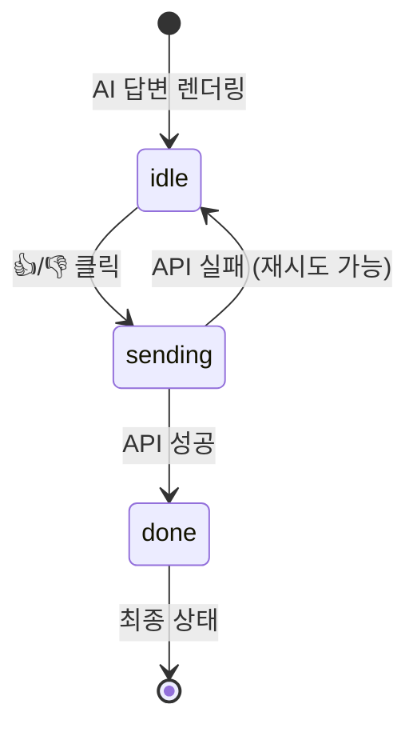

# 챗봇 답변 피드백 기능 - 구현 문서

## 1. 수정 파일 및 변경 사항

### 1.1 `src/lib/chat-api.ts`

**ChatResponse 인터페이스 수정:**
```typescript
export interface ChatResponse {
  answer: string;
  sources: SourceDocument[];
  message_id: string;  // 추가
}
```

**sendFeedback 함수 추가:**
```typescript
export async function sendFeedback(params: {
  message_id: string;
  blog_id: string;
  question: string;
  rating: "up" | "down";
}): Promise<void> {
  const res = await fetch(`${CHAT_API_URL}/feedback`, {
    method: "POST",
    headers: { "Content-Type": "application/json" },
    body: JSON.stringify(params),
  });

  if (!res.ok) {
    throw new Error(`Feedback API error: ${res.status}`);
  }
}
```

---

### 1.2 `src/components/chat/MessageList.tsx`

**Message 인터페이스 수정:**
```typescript
export interface Message {
  id: string;
  role: "user" | "assistant";
  content: string;
  sources?: SourceDocument[];
  message_id?: string;   // 추가: 백엔드 메시지 ID
  question?: string;     // 추가: 피드백 전송 시 사용할 원본 질문
}
```

**피드백 상태 관리:**
```typescript
type FeedbackStatus = "idle" | "sending" | "done";

// 메시지별 피드백 상태 (key: message id, value: { status, rating })
const [feedbackMap, setFeedbackMap] = useState<
  Record<string, { status: FeedbackStatus; rating?: "up" | "down" }>
>({});
```

**피드백 핸들러:**
```typescript
const handleFeedback = async (msg: Message, rating: "up" | "down") => {
  if (!msg.message_id) return;

  setFeedbackMap((prev) => ({
    ...prev,
    [msg.id]: { status: "sending", rating },
  }));

  try {
    await sendFeedback({
      message_id: msg.message_id,
      blog_id: "investment",
      question: msg.question || "",
      rating,
    });
    setFeedbackMap((prev) => ({
      ...prev,
      [msg.id]: { status: "done", rating },
    }));
  } catch {
    // 실패 시 idle로 복원 (재시도 가능)
    setFeedbackMap((prev) => ({
      ...prev,
      [msg.id]: { status: "idle" },
    }));
  }
};
```

**피드백 UI (AI 답변 하단에 렌더링):**
- `idle` 상태: "도움이 됐나요? 👍 👎" 버튼 표시
- `sending` 상태: "전송 중..." 텍스트 + 버튼 비활성화
- `done` 상태: "피드백 감사합니다 👍/👎" 텍스트 표시 (재클릭 불가)

---

### 1.3 `src/components/chat/ChatWindow.tsx`

**handleSend 함수 수정 (assistantMsg 생성 부분):**
```typescript
const assistantMsg: Message = {
  id: crypto.randomUUID(),
  role: "assistant",
  content: res.answer,
  sources: res.sources,
  message_id: res.message_id,  // 추가
  question,                     // 추가
};
```

---

## 2. API 스펙

### POST /feedback

**Request:**
```json
{
  "message_id": "uuid-string",
  "blog_id": "investment",
  "question": "ETF 추천해주세요",
  "rating": "up"
}
```

**Response:** `200 OK` (body 없음)

---

## 3. 피드백 UI 상태 흐름


