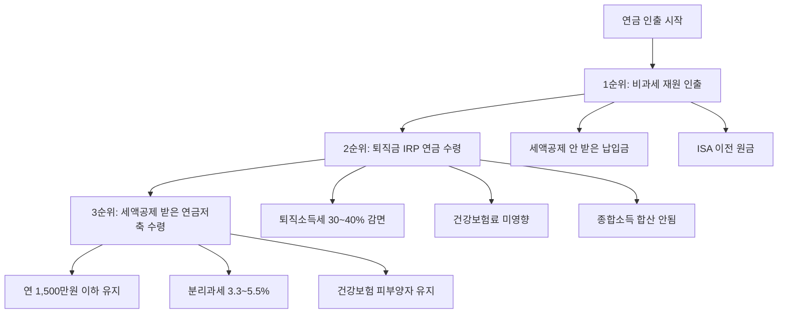

# 연금저축 블로그 글 PRD

## 메타 정보

- **카테고리**: `etc` (연말정산 글과 동일 카테고리)
- **슬러그**: `contents/etc/pension-savings-withdrawal-strategy/index.md`
- **제목(안)**: "연금저축, 넣을 때보다 꺼낼 때가 더 중요하다 — 납입부터 인출까지 절세 전략 총정리"
- **대상 독자**: 연금저축/IRP를 가입했거나 가입 예정인 직장인
- **톤**: 스터디 정리 (기존 연말정산 글과 동일)
- **참고 자료**:
  - https://www.banksalad.com/articles/소득공제-세액공제-개인연금-연봉별-비교
  - https://www.tossbank.com/articles/annuity
  - https://seoulpi.io/cityfolio/article/00497586669073514496

---

## 블로그 목차 구성

### 1. 개요

- 연금저축은 "세액공제"라는 혜택 때문에 많이 가입하지만, 정작 **꺼낼 때(수령/인출) 전략**을 모르면 세금 폭탄을 맞을 수 있다
- 이 글은 연금저축의 기본 개념부터 **수령 시 절세 전략**까지 한 번에 정리하는 스터디 노트

**이 글을 읽으면 알 수 있는 것:**
- 연금저축과 IRP의 차이점
- 절세를 극대화하는 납입 순서
- 연금 수령 시 세금을 최소화하는 인출 순서 (핵심)

---

### 2. 연금저축이란?

#### 2.1 연금저축의 정의

- 개인이 노후를 대비하여 자발적으로 가입하는 세제혜택 저축 제도
- 납입 시 세액공제 혜택 → 수령 시 연금소득세 과세 (과세이연 구조)

#### 2.2 연금저축 상품 종류

| 구분 | 연금저축보험 | 연금저축펀드 |
|------|-------------|-------------|
| 운용사 | 보험사 | 증권사 |
| 운용 방식 | 공시이율 (확정형) | 펀드 투자 (실적형) |
| 수익률 | 안정적이나 낮음 | 변동 가능, 장기 수익률 높을 수 있음 |
| 중도 인출 | 제한적 | 비교적 자유로움 |
| 추천 대상 | 안정 추구형 | 장기 투자 가능한 사람 |

#### 2.3 연금저축 vs IRP 비교

| 구분 | 연금저축 | IRP (개인형 퇴직연금) |
|------|---------|---------------------|
| 세액공제 한도 | 연 600만원 | 연 900만원 (연금저축 포함) |
| 투자 제한 | 없음 (주식 100% 가능) | 위험자산 70% 제한 |
| 중도 인출 | 자유 (단, 세금 발생) | 법정 사유만 가능 |
| 퇴직금 이전 | 불가 | 가능 |
| 수수료 | 낮음 | 상품에 따라 다름 |
| 추천 | 유연한 운용 원하는 사람 | 퇴직금 관리 + 추가 세액공제 |

**핵심 포인트**: 연금저축 600만원 먼저 채우고, IRP로 300만원 추가 납입이 가장 효율적

---

### 3. 연금저축 납입 순서 (절세 극대화)

#### 3.1 세액공제 기본 구조

| 총급여 | 세액공제율 | 연금저축 600만원 기준 환급액 | 900만원(+IRP) 기준 환급액 |
|--------|----------|--------------------------|-------------------------|
| 5,500만원 이하 | 16.5% | 99만원 | 148.5만원 |
| 5,500만원 초과 | 13.2% | 79.2만원 | 118.8만원 |

#### 3.2 최적 납입 순서

```
1순위: 연금저축 → 600만원 (세액공제 한도까지)
2순위: IRP → 300만원 (합산 900만원까지)
3순위: 연금저축 추가 납입 → 600만원 초과분 (세액공제 없지만 과세이연 효과)
```

- 연금저축을 먼저 채우는 이유: IRP는 위험자산 70% 제한이 있어 투자 자유도가 낮음
- 세액공제 한도 초과 납입: 세액공제는 못 받지만, 운용 수익에 대한 과세이연 효과 + 수령 시 비과세

#### 3.3 연금저축 vs ISA 연계 전략

- ISA 만기 후 연금계좌 이전 시 추가 세액공제 (이전 금액의 10%, 최대 300만원)
- ISA → 연금저축 이전을 활용하면 세액공제 한도를 초과 확보 가능

---

### 4. 연금 수령 및 인출 순서 (핵심 섹션) ⭐

> **이 섹션이 블로그의 핵심**. 대부분의 사람들이 "납입"에만 집중하지만, 실제 절세 효과는 "인출 순서"에서 결정된다.

#### 4.1 연금 수령 시 과세 구조 이해

| 재원 | 수령 방법 | 세율 | 비고 |
|------|----------|------|------|
| 세액공제 받은 납입금 + 운용수익 | 연금 수령 | 연금소득세 3.3~5.5% | 나이별 차등 |
| 세액공제 받은 납입금 + 운용수익 | 일시 인출 (해지) | 기타소득세 16.5% | 큰 손해 |
| 세액공제 안 받은 납입금 | 인출 | 비과세 | 세금 없음 |
| 퇴직금 (IRP) | 연금 수령 | 퇴직소득세 30~40% 감면 | 연차별 감면율 다름 |

#### 4.2 나이별 연금소득세율

| 수령 나이 | 연금소득세율 (지방소득세 포함) |
|----------|---------------------------|
| 만 55~69세 | 5.5% |
| 만 70~79세 | 4.4% |
| 만 80세 이상 | 3.3% |

**포인트**: 늦게 수령할수록 세율이 낮아진다. 하지만 생활비 필요 시점과 균형 필요

#### 4.3 연간 1,500만원 기준선의 중요성

- 연금소득 **연 1,500만원 이하**: 분리과세 (3.3~5.5%)로 종결
- 연금소득 **연 1,500만원 초과**: 종합소득세 합산 과세 (최대 45%) 또는 16.5% 분리과세 선택
- **건강보험료**: 1,500만원 이하 분리과세 시 건강보험 피부양자 자격 유지 가능

> 연 1,500만원을 넘지 않도록 인출 금액을 조절하는 것이 절세의 핵심

#### 4.4 최적 인출 순서 (절세 + 건강보험료 최소화)



##### 1순위: 비과세 재원 먼저 인출

- **세액공제를 받지 않은 자기부담금** (연금저축 600만원 초과 납입분)
- **ISA 이전 원금**
- 세금 0원, 건강보험료 영향 없음
- 생활비가 필요할 때 가장 먼저 활용

##### 2순위: 퇴직금 기반 IRP 연금 수령

- 퇴직금은 다른 소득과 합산 과세하지 않음 (분류과세)
- 건강보험료에도 영향 없음
- **10년차까지**: 퇴직소득세 30% 감면
- **11년차부터**: 퇴직소득세 40% 감면
- 만 55세부터 최소 금액이라도 매년 연금 개시 신청 권장 (연차 카운트 시작)

##### 3순위: 세액공제 받은 연금저축 수령

- 연금소득세 3.3~5.5% 적용
- **반드시 연 1,500만원 이하로 조절**
- 1,500만원 초과 시 종합소득세 합산 → 세율 급등 가능
- 건강보험 피부양자 자격 상실 위험

#### 4.5 인출 순서 요약 표

| 순위 | 재원 | 세금 | 건강보험료 영향 | 핵심 포인트 |
|------|------|------|---------------|------------|
| 1순위 | 비과세 납입금 (세액공제 미적용분, ISA 원금) | 없음 | 없음 | 가장 먼저 인출 |
| 2순위 | 퇴직금 IRP | 퇴직소득세 (30~40% 감면) | 없음 | 만 55세부터 매년 개시 |
| 3순위 | 세액공제 받은 연금저축 | 연금소득세 3.3~5.5% | 1,500만원 이하 시 없음 | 연 1,500만원 이하 유지 |

#### 4.6 실수하기 쉬운 케이스

1. **급하게 일시 해지**: 16.5% 기타소득세 → 그동안 받은 세액공제 혜택 토해냄
2. **1,500만원 초과 수령**: 종합소득세 합산 → 세율 급등 + 건강보험료 폭탄
3. **퇴직금 IRP 연금 개시 안 함**: 연차 카운트가 안 되어 감면율 손해
4. **비과세 재원 나중에 인출**: 과세 재원을 먼저 쓰면 세금 불필요하게 납부

---

### 5. 시뮬레이션 예시

> 구체적인 숫자 예시로 독자의 이해를 돕는다

#### 5.1 납입 단계 시뮬레이션

- 총급여 6,000만원 직장인 기준
- 연금저축 600만원 + IRP 300만원 납입 시
- 연간 절세 효과: 118.8만원 (13.2% × 900만원)
- 20년 납입 시 총 절세: 약 2,376만원

#### 5.2 수령 단계 시뮬레이션

- 만 55세, 연금 수령 시작
- 월 120만원 수령 (연 1,440만원) → 1,500만원 이하 분리과세
- 연금소득세: 1,440만원 × 5.5% = 79.2만원
- vs 일시 해지 시: 16.5% = 약 수백만원 이상 세금

---

### 6. 정리 및 체크리스트

- 연금저축 600만원 → IRP 300만원 순서로 납입
- 세액공제 한도 초과분은 "비과세 재원"이 되므로 전략적 추가 납입 고려
- 수령 시: 비과세 재원 → 퇴직금 IRP → 세액공제 연금저축 순서
- 연 1,500만원 이하 유지가 핵심
- 만 55세 되면 바로 연금 개시 (최소 금액이라도)

---

## 논의 사항

### 확정된 사항
- [x] 카테고리: `etc`
- [x] 핵심 주제: 인출 순서 중심
- [x] 톤: 스터디 정리 노트 형식

### 논의 필요 사항
- [x] **제목 확정**: "연금저축, 넣을 때보다 꺼낼 때가 더 중요하다 — 납입부터 인출까지 절세 전략 총정리"
- [x] **시뮬레이션 수치**: 현재 기본 예시에 더 상세한 설명 추가 (납입/수령 단계별 비교, 인출 순서별 세금 차이 등)
- [x] **ISA 연계 전략**: 이 글에서는 간단히 언급만 하고, 별도 포스팅으로 분리
- [x] **연금저축보험 vs 연금저축펀드 비교**: 현재 수준의 간단한 비교표로 충분, 더 상세하게 다루지 않음
- [x] **2026년 세법 변경사항**: 반영한다 (조사 후 포함)
- [x] **건강보험료 상세 설명**: 피부양자 기준 자체를 깊게 파지 않고, 인출 순서 섹션에서 "1,500만원 초과 시 피부양자 자격 상실 → 건강보험료 별도 부담" 수준으로 간단히 설명
- [x] **연말정산 글과의 연결**: 필요한 곳에서 링크 연결
- [x] **시리즈 구성**: 연금저축 관련 글끼리만 시리즈로 묶음 (연말정산은 제외)

### 참고: 기존 블로그 글과의 관계
- `contents/etc/year-end-tax-settlement/index.md` — 연말정산 글에서 연금저축 세액공제 간단히 다루고 있음
- 이 글에서는 연말정산 글에서 다루지 않은 **수령/인출 전략**에 집중
