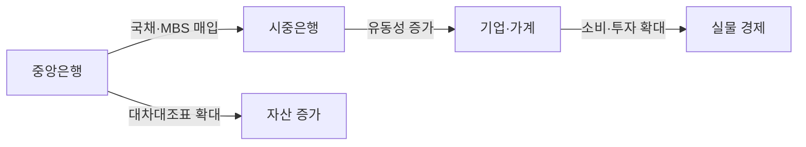
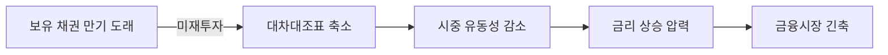
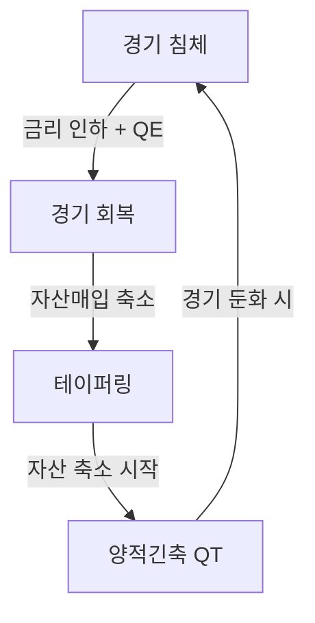

# 양적완화(QE) & 양적긴축(QT) 블로그 포스트 — 구현 문서

## 생성 파일

| 파일 | 설명 |
|------|------|
| `contents/etc/quantitative-easing-and-tightening/index.md` | 블로그 포스트 본문 |

## Frontmatter

```yaml
---
title: "양적완화(QE)와 양적긴축(QT) 완벽 정리 — 통화정책 사이클과 투자 전략"
description: "양적완화와 양적긴축의 개념, 작동 원리, 글로벌 사례, 그리고 투자 관점에서의 영향까지 한 번에 정리합니다."
date: 2026-02-15
update: 2026-02-15
category: Etc
tags:
  - 양적완화
  - 양적긴축
  - QE
  - QT
  - 통화정책
  - 중앙은행
  - 테이퍼링
  - 금리
  - 인플레이션
  - 연준
---
```

## 목차 구조 (17개 섹션)

| 섹션 | 제목 | 핵심 내용 |
|------|------|-----------|
| 1 | 개요 | QE·QT를 함께 이해해야 하는 이유, 통화정책 사이클 소개 |
| 2 | 통화정책 기초 | 중앙은행 역할, 기준금리, 전통적 vs 비전통적 통화정책 |
| 3 | 양적완화(QE)란? | 정의, 등장 배경, "돈을 푼다"의 실제 의미, 대상 자산 |
| 4 | 양적완화 작동 원리 | 자산 매입 과정, 유동성·금리·자산가격 효과, 대차대조표 변화 + **Mermaid** |
| 5 | 양적완화 효과·부작용 | 긍정적 효과 vs 부작용 |
| 6 | 테이퍼링 | 정의, Taper Tantrum 사례, 시장 신호 |
| 7 | 양적긴축(QT)이란? | 정의, 필요성, 자산 매각 vs 만기 미재투자 |
| 8 | 양적긴축 작동 원리 | 대차대조표 축소, 유동성 감소, 긴축 효과 + **Mermaid** |
| 9 | 양적긴축 효과·리스크 | 기대 효과 vs 리스크 |
| 10 | QE vs QT 핵심 비교 | **비교표** (정책 목적, 유동성, 금리, 자산시장, 투자 심리, 대차대조표) |
| 11 | 통화정책 사이클 | 침체→QE→회복→테이퍼링→QT 반복 + **Mermaid** |
| 12 | 글로벌 사례 | 2008 금융위기, 2020 코로나, 2022 QT, 일본·유럽 |
| 13 | QE·QT와 인플레이션 | 통화량과 물가, QE 후 물가 안 오른 이유, 유동성 함정 |
| 14 | 투자 관점 | QE 환경 vs QT 환경 투자 전략, 정책 전환 시점 포착 |
| 15 | 헷갈리는 개념 정리 | 돈 찍기 vs QE, 금리 인상 vs QT, 재정 vs 통화정책 |
| 16 | 마무리 | 핵심 요약 |
| 17 | 참고 | 참고 링크 |

## Mermaid 다이어그램 (3개)

### 4장 — QE 자산 매입 흐름



### 8장 — QT 대차대조표 축소 흐름



### 11장 — 통화정책 사이클



## 작성 규칙

- **Heading**: `#`(H1)부터 시작, 번호 체계 `N.` → `N.N` → `N.N.N`
- **다이어그램**: ASCII art 금지, Mermaid 코드 블록만 사용
- **용어 표기**: 첫 등장 시 `한글(영문, 약어)`, 이후 한글 또는 약어
- **인코딩**: UTF-8 필수, `file -I`로 검증
