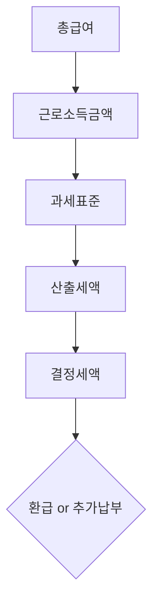

# 연말정산 잘 준비하기 블로그 포스트 PRD

## 1. 개요

### 1.1 목적

직장인이 연말정산을 체계적으로 준비할 수 있도록 실전 가이드 블로그 포스트를 작성한다.

### 1.2 배경

- 매년 연말정산을 하지만 용어와 절차가 헷갈려 제대로 준비하지 못하는 경우가 많음
- 기존 블로그에 연금저축, IRP, 세금 관련 포스트는 있으나 연말정산 전체를 다루는 글이 없음
- 관련 기존 포스트:
  - `stock/what-is-pension-savings/` — 연금저축이란?
  - `stock/how-to-check-pension-account-contribution-amount/` — 연금계좌 납입금액 확인하는 방법
  - `stock/types-of-stock-taxes/` — 주식 세금 종류
  - `etf/etf-tax-summary/` — ETF 세금 정리

### 1.3 대상 독자

- 직장인 (근로소득자)
- 연말정산을 매년 하지만 정확히 이해하지 못하는 사람
- 절세 전략을 미리 세우고 싶은 사람

---

## 2. 작업 항목

### 2.1 블로그 포스트 생성

| 항목 | 내용 |
|------|------|
| 파일 경로 | `contents/stock/year-end-tax-settlement-preparation-guide/index.md` |
| 카테고리 | `Stock` |
| 예상 분량 | 본문 약 3,000~5,000자 |

### 2.2 Frontmatter

```yaml
title: "연말정산 잘 준비하기 — 직장인 절세 실전 가이드"
description: "연말정산의 기본 개념부터 연금계좌, 카드 소비 전략, 의료비, 월세, 고향사랑기부제까지 직장인이 꼭 알아야 할 절세 포인트를 정리합니다."
date: 2026-02-15
update: 2026-02-15
category: Stock
tags:
  - 연말정산
  - 세액공제
  - 소득공제
  - 연금저축
  - IRP
  - 절세
  - 카드공제
  - 의료비공제
  - 월세공제
  - 고향사랑기부제
```

---

## 3. 콘텐츠 목차 구조

참고 파일(`3_yearly_chatgpt.md`)의 목차를 기반으로, 프로젝트 heading 규칙(`# N.` → `## N.N` → `### N.N.N`)에 맞춰 구성한다.

### 3.1 전체 목차

```markdown
# 1. 개요
- 매년 연말정산을 하지만 헷갈리는 이유
- 이 글의 목적 (스터디 / 정리 / 절세 준비)
- 연말정산 전체 흐름 한눈에 보기 (Mermaid 다이어그램)

# 2. 기본 개념 정리
## 2.1 연말정산이란?
## 2.2 소득공제 vs 세액공제
## 2.3 인적공제
## 2.4 환급 vs 추가 납부가 생기는 이유

# 3. 연금계좌 활용
## 3.1 세액공제 한도 (최대 900만원)
## 3.2 납입 마감일과 확인 방법

# 4. 소비 전략 (카드 공제)
## 4.1 총급여 대비 최저사용금액 기준
## 4.2 신용카드 vs 체크카드 vs 현금영수증 공제율
## 4.3 연말 몰아서 쓰기 전략

# 5. 의료비 공제
## 5.1 공제 시작 기준 (총급여의 3%)
## 5.2 공제 가능 항목
## 5.3 공제 불가능 항목

# 6. 월세 세액공제
## 6.1 공제 조건
## 6.2 필요 서류
## 6.3 흔한 실수

# 7. 고향사랑기부제 활용
## 7.1 10만원이 유리한 이유
## 7.2 세액공제 구조
## 7.3 추가 혜택 (답례품 등)

# 8. FAQ
- 언제부터 준비해야 하나
- 카드 많이 쓰면 무조건 좋은가
- 연금저축 꼭 해야 하나
- 환급은 언제 받나
- 회사에서 자동으로 다 해주지 않나

# 9. 마무리
- 핵심 요약 (5줄 정리)
- 연말정산 준비 체크리스트

# 10. 참고
- 관련 링크
```

---

## 4. 콘텐츠 작성 규칙

### 4.1 다이어그램

- 연말정산 전체 흐름을 **Mermaid 다이어그램**으로 표현 (ASCII art 사용 금지)
- 예: 총급여 → 근로소득금액 → 과세표준 → 산출세액 → 결정세액 → 환급/추가납부



### 4.2 표 활용

- 소득공제 vs 세액공제 비교 표
- 카드 종류별 공제율 비교 표
- 연금계좌 한도 정리 표
- 연말정산 준비 체크리스트 표

### 4.3 기존 포스트 연결

- 연금저축 관련 내용에서 기존 포스트 링크 연결:
  - `연금저축이란?` → `/stock/what-is-pension-savings`
  - `연금계좌 납입금액 확인하는 방법` → `/stock/how-to-check-pension-account-contribution-amount`

### 4.4 Heading 스타일

- 프로젝트 규칙에 따라 `# N.` → `## N.N` → `### N.N.N` 형식 사용

---

## 5. 작업 순서

| 단계 | 작업 | 설명 |
|------|------|------|
| 1 | GitHub Issue 생성 | 블로그 포스트 작성 작업 이슈 생성 |
| 2 | Feature 브랜치 생성 | `feature/{issue-number}-year-end-tax-settlement` |
| 3 | 콘텐츠 파일 생성 | `contents/stock/year-end-tax-settlement-preparation-guide/index.md` |
| 4 | 본문 작성 | 목차 구조에 따라 내용 채우기 |
| 5 | 인코딩 검증 | `file -I` 로 UTF-8 확인 |
| 6 | 로컬 빌드 확인 | `npm run build` → `npm run start` → Playwright로 렌더링 확인 |
| 7 | PR 생성 및 리뷰 | `gh pr create` + HEREDOC 사용 |

---

## 6. 검증 방법

### 6.1 빌드 검증

- [ ] `npm run build` 정상 동작
- [ ] `npm run start`로 로컬 확인 — 포스트 렌더링 정상 여부

### 6.2 콘텐츠 검증

- [ ] Heading 스타일이 `# N.` → `## N.N` → `### N.N.N` 규칙을 따르는지 확인
- [ ] Mermaid 다이어그램이 정상 렌더링되는지 확인
- [ ] 기존 포스트 링크가 정상 동작하는지 확인
- [ ] 한글 인코딩 UTF-8 유지: `file -I contents/stock/year-end-tax-settlement-preparation-guide/index.md`

### 6.3 카테고리/태그 검증

- [ ] Stock 카테고리 페이지에 포스트가 노출되는지 확인
- [ ] 태그 페이지에서 연말정산 관련 태그로 검색 가능한지 확인
