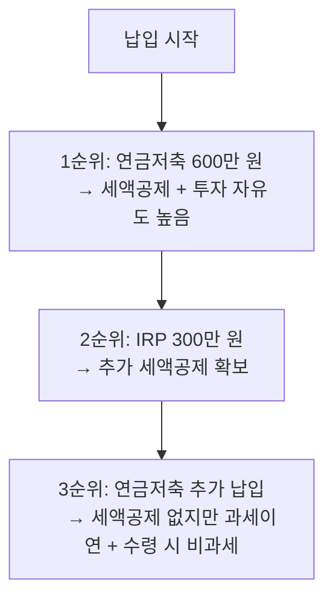
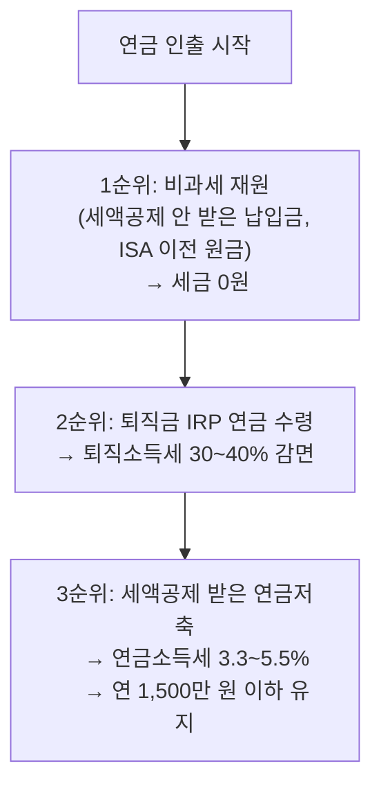
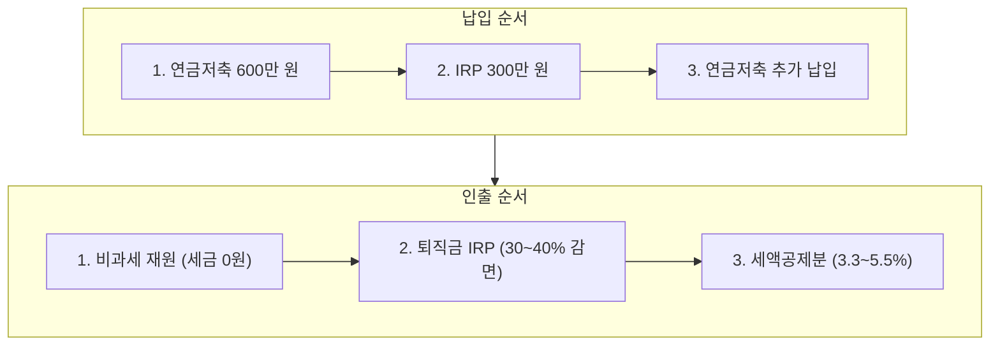

# 1. 개요

연금저축은 **세액공제**라는 확실한 혜택 덕분에 많은 직장인이 가입한다. 매년 최대 148.5만 원을 돌려받을 수 있으니, "일단 넣으면 이득"이라는 인식이 강하다.

하지만 정작 **꺼낼 때(수령/인출) 전략**을 모르면, 그동안 아꼈던 세금을 한꺼번에 토해내거나 건강보험료 폭탄을 맞을 수 있다. 연금저축은 "넣는 것"보다 **"꺼내는 순서"**가 훨씬 중요하다.

이 글은 연금저축의 기본 개념부터 **수령 시 절세 전략**까지, 스터디 관점에서 한 번에 정리한 글이다.

이 글을 읽으면 알 수 있는 것:

- 연금저축과 IRP의 차이점
- 절세를 극대화하는 납입 순서
- 연금 수령 시 세금과 건강보험료를 최소화하는 인출 순서 (핵심)

> 연말정산의 전체 구조와 세액공제 개념은 [연말정산, 1월이 아니라 지금부터 준비하는 절세 가이드](/etc/year-end-tax-settlement/) 글을 참고하자.

# 2. 연금저축이란?

## 2.1 연금저축의 정의

연금저축은 **개인이 노후를 대비하여 자발적으로 가입하는 세제혜택 저축 제도**다. 국민연금과 달리 가입이 의무가 아니며, 본인이 원하는 금액을 자유롭게 납입할 수 있다. 정부가 세액공제라는 혜택을 제공하는 이유는, 국민연금만으로는 부족한 노후 소득을 개인이 스스로 준비하도록 유도하기 위해서다. 핵심 구조는 다음과 같다.

- **납입 시**: 납입 금액에 대해 세액공제를 받는다 (세금을 돌려받음)
- **운용 기간**: 운용 수익에 대해 세금을 내지 않는다 (과세이연)
- **수령 시**: 연금으로 받으면 낮은 연금소득세(3.3~5.5%)만 낸다

즉, **지금 세금을 줄이고 → 나중에 적은 세금을 내는 구조**다.

## 2.2 연금저축 상품 종류

연금저축은 가입하는 금융사에 따라 두 가지로 나뉜다. 같은 "연금저축"이라는 이름이지만 운용 방식과 수익 구조가 완전히 다르므로, 자신의 투자 성향에 맞는 상품을 선택하는 것이 중요하다.

| 구분 | 연금저축보험 | 연금저축펀드 |
|------|-------------|-------------|
| 운용사 | 보험사 | 증권사 |
| 운용 방식 | 공시이율 (확정형) | 펀드·ETF 투자 (실적형) |
| 수익률 | 안정적이나 낮음 | 변동 가능, 장기 수익률 높을 수 있음 |
| 중도 인출 | 제한적 | 비교적 자유로움 |
| 수수료 | 사업비 포함 | 낮음 |
| 추천 대상 | 안정 추구형 | 장기 투자 가능한 사람 |

> 최근에는 증권사에서 가입하는 **연금저축펀드**가 ETF 투자가 가능하고 수수료가 낮아 인기가 많다.

## 2.3 연금저축 vs IRP 비교

| 구분 | 연금저축 | IRP (개인형 퇴직연금) |
|------|---------|---------------------|
| 세액공제 한도 | 연 600만 원 | 연금저축 포함 합산 연 900만 원 (IRP 추가 납입분은 300만 원) |
| 투자 제한 | 없음 (주식형 ETF 100% 가능) | 위험자산 70% 제한 (초과 시 매수 자체가 불가) |
| 중도 인출 | 자유 (단, 세금 발생) | 법정 사유만 가능 |
| 퇴직금 이전 | 불가 | 가능 |
| 수수료 | 낮음 | 상품에 따라 다름 |
| 추천 | 유연한 운용을 원하는 사람 | 퇴직금 관리 + 추가 세액공제 |

**핵심 포인트**: 연금저축은 투자 자유도가 높고, IRP는 퇴직금을 이전받을 수 있다. 둘 다 가입하여 역할을 나누는 것이 가장 효율적이다.

# 3. 연금저축 납입 순서 (절세 극대화)

## 3.1 세액공제 기본 구조

연금저축과 IRP에 납입하면 세액공제를 받는다. 공제율은 총급여에 따라 달라지는데, 소득이 낮을수록 더 높은 공제율(16.5%)이 적용되어 저소득자에게 상대적으로 유리한 구조다. 아래 표에서 본인의 총급여 구간에 해당하는 환급액을 확인해보자.

| 총급여 | 세액공제율 | 연금저축 600만 원 환급액 | +IRP 300만 원 (합산 900만 원) 환급액 |
|--------|----------|------------------------|-------------------------------------|
| 5,500만 원 이하 | 16.5% | 99만 원 | **148.5만 원** |
| 5,500만 원 초과 | 13.2% | 79.2만 원 | **118.8만 원** |

> 세액공제란 계산된 세금에서 직접 빼주는 것이다. 소득공제와 달리 소득 수준에 관계없이 같은 금액을 절세할 수 있다. 자세한 내용은 [연말정산 절세 가이드](/etc/year-end-tax-settlement/)를 참고하자.

## 3.2 최적 납입 순서

### 3.2.1 1순위: 연금저축 600만 원

- 세액공제 한도(600만 원)까지 채운다
- IRP보다 먼저 넣는 이유: **투자 제한이 없다** (주식형 ETF 100% 투자 가능)
- IRP는 위험자산 70% 제한이 있어 투자 자유도가 낮다

### 3.2.2 2순위: IRP 300만 원

- 연금저축과 합산 900만 원까지 세액공제를 받을 수 있다
- 나머지 300만 원을 IRP에 납입하여 **세액공제 한도를 꽉 채운다**
- IRP는 위험자산 70% 제한이 있으므로, 나머지 30%는 예금이나 채권형 펀드 등 안전자산으로 운용해야 한다. 이런 제한 때문에 연금저축을 먼저 채우고 IRP는 보조로 활용하는 것이 유리하다

### 3.2.3 3순위: 연금저축 추가 납입 (세액공제 한도 초과)

- 연금저축의 연간 납입 한도는 **1,800만 원**이다
- 600만 원을 초과하는 금액은 세액공제를 받을 수 없지만, 두 가지 이점이 있다:
  - **과세이연**: 운용 수익에 대한 세금을 나중으로 미룰 수 있다
  - **수령 시 비과세**: 세액공제를 받지 않은 원금은 꺼낼 때 세금이 없다 → 이 부분이 인출 순서에서 매우 중요하다 (4장에서 자세히 설명)
> 추가 납입은 세액공제용 계좌와 **별도 연금저축 계좌**를 만들어 분리 운용하면, 인출 시 비과세 재원을 더 효율적으로 활용할 수 있다. 이 전략은 별도 포스팅에서 자세히 다룰 예정이다.

## 3.3 ISA 연계 전략 (간단 요약)

ISA(개인종합자산관리계좌) 만기 후 연금계좌로 이전하면, 이전 금액의 10%(최대 300만 원)를 **추가 세액공제** 받을 수 있다. 즉, 연간 세액공제 한도(900만 원)를 넘어서는 공제를 확보할 수 있는 유일한 방법이다.

> ISA 연계 전략은 별도 포스팅에서 자세히 다룰 예정이다.

# 4. 연금 수령 및 인출 순서 (핵심)

> 대부분의 사람들이 "납입"에만 집중하지만, **실제 절세 효과는 "인출 순서"에서 결정된다.** 같은 금액을 가지고도 어떤 순서로 꺼내느냐에 따라 세금이 수십~수백만 원 차이 날 수 있다.

## 4.1 연금 수령 시 과세 구조 이해

연금계좌에서 돈을 꺼낼 때, **재원(돈의 출처)에 따라 세금이 완전히 다르다.** 이 구조를 이해하는 것이 인출 전략의 출발점이다.

| 재원 | 연금 수령 시 | 일시 인출(해지) 시 | 비고 |
|------|------------|------------------|------|
| 세액공제 받은 납입금 + 운용수익 | 연금소득세 3.3~5.5% | 기타소득세 16.5% | 연금 수령이 압도적으로 유리 |
| 세액공제 안 받은 납입금 | **비과세** | **비과세** | 세금 없음 |
| 퇴직금 (IRP) | 퇴직소득세 30~40% 감면 | 퇴직소득세 100% | 연금 수령 시 감면 |

핵심은 단순하다:
- **연금으로 받으면 세금이 적다**
- **일시에 해지하면 세금이 크다**
- **세액공제 안 받은 돈은 언제 꺼내도 세금이 없다**

## 4.2 나이별 연금소득세율

세액공제를 받은 납입금과 운용수익을 연금으로 수령할 때 적용되는 세율이다. 나이가 많을수록 세율이 낮아지는 구조인데, 이는 고령일수록 소득이 줄어드는 현실을 반영한 것이다. 수령 방식에 따라 세율이 다르므로 함께 고려해야 한다.

- **확정기간형**: 정해진 기간(예: 10년, 20년) 동안 연금을 나눠 받는 방식이다. 기간이 끝나면 연금 수령이 종료된다. 연금저축펀드(증권사)에서 주로 이 방식을 사용한다.
- **종신형**: 사망할 때까지 평생 연금을 받는 방식이다. 보험사의 연금저축보험을 통해 가입할 수 있으며, 장수 리스크에 대비할 수 있다는 장점이 있다.

| 수령 나이 | 확정기간형 연금소득세율 | 종신형 연금소득세율 |
|----------|---------------------|-------------------|
| 만 55~69세 | 5.5% | 4.4% |
| 만 70~79세 | 4.4% | 4.4% |
| 만 80세 이상 | 3.3% | 3.3% |

> 세율은 지방소득세 포함 기준이다.

**2025년 세제개편**: 종신형 연금은 나이에 관계없이 **3.3%** 단일 세율로 인하될 예정이다. 종신형 연금 수령을 고려 중이라면 더욱 유리해진다.

## 4.3 연간 1,500만 원 기준선의 중요성

연금 수령 시 가장 중요한 숫자는 **연 1,500만 원**이다. 이것은 인출 한도가 아니라 **세금 구조가 달라지는 기준선**이다. 1,500만 원 이상도 얼마든지 꺼낼 수 있지만, 초과하는 순간 세율이 크게 올라가기 때문에 이 선을 넘기지 않도록 조절하는 것이 핵심이다.

| 구분 | 연 1,500만 원 이하 | 연 1,500만 원 초과 |
|------|-------------------|-------------------|
| 과세 방식 | **분리과세** (3.3~5.5%) | 종합소득세 합산 (최대 45%) 또는 16.5% 분리과세 중 선택 |
| 건강보험료 | 영향 없음 | 소득에 포함 → 보험료 인상 가능 |
| 피부양자 자격 | 유지 가능 | **상실 위험** → 지역가입자 전환 시 별도 보험료 부담 |

> 2024년부터 분리과세 한도가 기존 1,200만 원에서 **1,500만 원으로 상향**되었다. 이전보다 여유가 생겼지만, 여전히 이 기준선을 넘기지 않는 것이 절세의 핵심이다.

**건강보험료 영향**: 은퇴 후 배우자의 건강보험 피부양자로 등록된 상태에서 연금소득이 일정 기준을 넘으면 피부양자 자격을 잃고 지역가입자로 전환된다. 이 경우 매달 수십만 원의 건강보험료를 별도로 내야 하므로, 연금 수령액 조절이 중요하다.

> "연 1,500만 원만으로 생활이 되나?"라는 의문이 들 수 있다. 핵심은 **세액공제를 받은 연금저축 수령분만** 1,500만 원 이하로 조절하면 된다는 것이다. 비과세 재원(세액공제 미적용분, ISA 이전 원금)은 이 한도에 포함되지 않고, 퇴직금 IRP 수령분도 별도 분류과세이므로 합산되지 않는다. 실제 생활비는 이 세 가지 재원을 조합하여 구성하면 된다. 이 부분은 인출 순서(4.4)에서 자세히 다룬다.

## 4.4 최적 인출 순서

세금과 건강보험료를 최소화하는 인출 순서는 다음과 같다. 핵심 원칙은 간단하다: **세금이 없거나 적은 재원부터 먼저 꺼내고, 세금이 붙는 재원은 최대한 나중에 꺼낸다.** 이 순서를 지키면 같은 금액을 인출하더라도 총 세금 부담을 크게 줄일 수 있다.

### 4.4.1 1순위: 비과세 재원 먼저 인출

- **세액공제를 받지 않은 자기부담금** (연금저축 600만 원 초과 납입분)
- **ISA에서 이전한 원금**
- **세금 0원**, 건강보험료 영향 없음
- 생활비가 필요할 때 가장 먼저 활용한다

> 3장에서 설명한 "세액공제 한도 초과 납입"이 여기서 빛을 발한다. 미리 비과세 재원을 만들어 두면, 수령 시 세금 없이 꺼낼 수 있는 자금이 된다.

### 4.4.2 2순위: 퇴직금 기반 IRP 연금 수령

- 퇴직금은 다른 소득과 **합산 과세하지 않는다** (분류과세)
- 건강보험료에도 **영향 없음**
- 연금으로 수령하면 퇴직소득세를 감면받는다:

| 수령 연차 | 퇴직소득세 감면율 |
|----------|----------------|
| 1~10년차 | 30% 감면 |
| 11년차 이후 | 40% 감면 |

**중요**: 만 55세가 되면 최소 금액이라도 반드시 연금 개시를 신청하자. 실제로 큰 금액을 수령하지 않더라도, **연금 개시 시점부터 연차 카운트가 시작**되기 때문이다. 일찍 개시할수록 40% 감면 구간에 빨리 진입할 수 있다.

### 4.4.3 3순위: 세액공제 받은 연금저축 수령

- 연금소득세 3.3~5.5% 적용 (나이별 차등)
- **반드시 연 1,500만 원 이하로 조절한다**
- 1,500만 원을 초과하면:
  - 종합소득세 합산 과세 (세율 최대 45%) 또는 16.5% 분리과세 중 선택
  - 건강보험 피부양자 자격 상실 위험
  - 세금 + 건강보험료 이중 부담 발생

## 4.5 인출 순서 요약 표

앞에서 설명한 인출 전략을 한 표로 정리하면 다음과 같다. 세금과 건강보험료 영향을 함께 고려하여, 번호 순서대로 인출하는 것이 가장 유리하다.

| 순위 | 재원 | 세금 | 건강보험료 영향 | 핵심 포인트 |
|------|------|------|---------------|------------|
| 1순위 | 비과세 납입금 (세액공제 미적용분, ISA 원금) | 없음 | 없음 | 가장 먼저 인출 |
| 2순위 | 퇴직금 IRP | 퇴직소득세 30~40% 감면 | 없음 | 만 55세부터 바로 개시 |
| 3순위 | 세액공제 받은 연금저축 | 연금소득세 3.3~5.5% | 1,500만 원 이하 시 없음 | 연 1,500만 원 이하 유지 |

## 4.6 FAQ

### Q: 급하게 돈이 필요해서 일시 해지하면 어떻게 되나?

세액공제받은 금액과 운용수익에 대해 **기타소득세 16.5%**가 부과된다. 그동안 받은 세액공제 혜택을 고스란히 토해내는 셈이다.

예시: 10년간 매년 600만 원 납입 (총 6,000만 원), 세액공제 총 792만 원 받음
→ 해지 시 기타소득세: (6,000만 원 + 운용수익) × 16.5% = **약 990만 원 이상**

### Q: 연 1,500만 원을 초과해서 수령하면 어떻게 되나?

종합소득세 합산 시 세율이 급등하고, 건강보험료까지 인상된다.

예시: 연금소득 2,000만 원 수령 시
- 1,500만 원 이하였다면: 2,000만 원 × 5.5% = 110만 원
- 1,500만 원 초과로 종합과세 시: 다른 소득과 합산하여 **15~24% 이상** 세율 적용 가능

### Q: 퇴직금 IRP 연금 개시를 늦게 하면 손해인가?

그렇다. 만 55세에 개시하지 않고 60세에 시작하면, 40% 감면 구간(11년차)에 도달하는 시점이 5년 늦어진다. 그만큼 30% 감면만 받는 기간이 길어지고, 전체적으로 세금을 더 내게 된다. 연금 개시는 최소 금액(예: 월 1만 원)으로도 가능하니, 만 55세가 되자마자 신청하는 것이 유리하다.

### Q: 비과세 재원을 나중에 인출해도 괜찮은가?

괜찮지 않다. 세금이 붙는 재원을 먼저 꺼내고 비과세 재원을 마지막에 꺼내면, 불필요하게 세금을 더 내는 결과가 된다. 예를 들어 비과세 재원 2,000만 원이 있는데 이를 나중에 꺼내고, 세액공제 받은 납입금을 먼저 수령하면 연금소득세를 수백만 원 더 내게 된다. 비과세 재원은 세금이 0원이므로 항상 먼저 소진하는 것이 원칙이다.

# 5. 시뮬레이션 예시

앞에서 설명한 납입 순서와 인출 전략이 실제로 얼마나 차이를 만드는지, 구체적인 숫자로 확인해보자. 가상의 직장인을 기준으로 25년 납입 후 수령하는 시나리오를 시뮬레이션한다.

## 5.1 기본 가정

시뮬레이션에서는 30세에 직장생활을 시작하여 매년 꾸준히 세액공제 한도까지 납입하는 직장인을 가정한다. 수익률 5%는 장기 분산 투자(국내외 ETF 혼합) 기준으로 보수적인 가정이다.

| 항목 | 설정 |
|------|------|
| 총급여 | 6,000만 원 (세액공제율 13.2%) |
| 납입 기간 | 30세~54세 (25년) |
| 연금 수령 시작 | 만 55세 |
| 연간 납입 | 연금저축 600만 원 + IRP 300만 원 = 900만 원 |
| 연평균 수익률 | 5% (세전) |

## 5.2 납입 단계: 세액공제 효과

| 항목 | 금액 |
|------|------|
| 연간 세액공제 | 900만 원 × 13.2% = **118.8만 원** |
| 25년 총 세액공제 | 118.8만 원 × 25년 = **2,970만 원** |
| 총 납입 원금 | 900만 원 × 25년 = **2억 2,500만 원** |

25년간 **약 2,970만 원**을 세금에서 돌려받는다. 매년 연말정산 때 약 119만 원이 환급되는 셈이니, 월급 외에 추가 수입처럼 느껴질 수 있다. 이 금액만으로도 연금저축 가입의 이유는 충분하지만, 진짜 효과는 과세이연과 인출 전략에서 더 크게 나타난다.

## 5.3 운용 결과: 과세이연 효과

일반 계좌에서는 매년 수익이 발생할 때마다 15.4%의 배당소득세를 내야 한다. 반면 연금계좌는 수령 시점까지 세금이 유예되므로, 세금으로 빠져나갈 돈까지 함께 운용된다. 25년이라는 긴 기간 동안 이 차이가 복리로 쌓이면 약 6,000만 원이라는 큰 격차가 벌어진다.

| 항목 | 연금계좌 (과세이연) | 일반 계좌 (매년 과세) |
|------|-------------------|---------------------|
| 25년 후 예상 적립금 | 약 **4억 3,000만 원** | 약 **3억 7,000만 원** |
| 차이 | | 약 **6,000만 원** |

> 과세이연: 운용 수익에 대한 세금을 매년 내지 않고 수령 시점까지 미루는 것. 그 사이 세금 낼 돈까지 재투자되어 복리 효과가 커진다.

## 5.4 수령 단계: 인출 방법별 세금 비교

만 55세, 적립금 4억 3,000만 원 기준으로 인출 방법에 따른 세금 차이를 비교한다.

### 5.4.1 방법 A: 일시 해지 (최악)

적립금 전액을 한 번에 꺼내면, 세액공제 받은 납입금과 운용수익 전체에 **기타소득세 16.5%**가 부과된다. 그동안 받은 세액공제 혜택을 토해내는 것은 물론, 운용수익에 대해서도 높은 세율이 적용되어 가장 불리한 선택이다.

| 항목 | 금액 |
|------|------|
| 적립금 | 4억 3,000만 원 |
| 기타소득세 (16.5%) | **약 7,095만 원** |
| 실수령액 | 약 3억 5,905만 원 |

### 5.4.2 방법 B: 연금 수령 (연 1,500만 원, 약 29년)

분리과세 한도인 연 1,500만 원 이하로 수령하면, 종합소득세 합산 없이 **저율 연금소득세**만 납부하면 된다. 나이가 들수록 세율이 낮아지므로, 오래 나눠 받을수록 총 세금이 줄어든다. 건강보험 피부양자 자격도 유지할 수 있다.

| 항목 | 금액 |
|------|------|
| 연간 수령액 | 1,500만 원 |
| 연금소득세 (5.5%, 55~69세) | 연 82.5만 원 |
| 연금소득세 (4.4%, 70~79세) | 연 66만 원 |
| 연금소득세 (3.3%, 80세~) | 연 49.5만 원 |
| 총 연금소득세 (약 29년) | **약 1,900만 원** |

### 5.4.3 비교 요약

인출 방법 하나로 세금이 5,000만 원 이상 차이 난다. 연금저축의 절세 효과는 납입 시점보다 수령 시점의 전략에서 훨씬 크게 나타난다.

| 구분 | 일시 해지 | 연금 수령 (연 1,500만 원) |
|------|----------|------------------------|
| 총 세금 | 약 7,095만 원 | 약 1,900만 원 |
| **차이** | | **약 5,195만 원 절세** |

> 같은 돈을 꺼내도 **인출 방법만 바꾸면 약 5,000만 원 이상 세금을 아낄 수 있다.** 이것이 인출 순서가 중요한 이유다.

# 6. 2025~2026년 세법 변경사항

세법은 매년 개정되며, 연금저축 관련 규정도 예외가 아니다. 최근 몇 년간 연금 수령자에게 유리한 방향으로 변경이 이루어졌다. 특히 분리과세 한도 상향은 수령 전략에 직접적인 영향을 미치므로 반드시 알아두자.

| 항목 | 변경 내용 | 적용 시기 |
|------|----------|----------|
| **분리과세 한도 상향** | 사적연금 분리과세 기준 1,200만 원 → **1,500만 원** | 2024년~ |
| **종신형 연금 세율 인하** | 나이 무관 **3.3%** 단일 세율 적용 (기존 4.4%) | 2025년 세제개편안 |
| **해외 ETF 외국납부세액공제** | 연금계좌 내 해외 간접투자 소득에도 외국납부세액공제 적용 확대 | 2025년 세제개편안 |

> 분리과세 한도가 1,500만 원으로 올라간 것은 연금 수령자에게 유리한 변화다. 월 125만 원까지 저율 분리과세로 수령할 수 있게 되었다.

# 7. 정리 및 체크리스트

지금까지 다룬 내용을 납입과 수령 두 단계로 나누어 체크리스트로 정리한다. 연금저축은 납입할 때 한 번, 수령할 때 한 번 전략이 필요하다. 아래 항목들을 매년 점검하면 불필요한 세금을 줄일 수 있다.

## 7.1 납입 체크리스트

매년 연말정산 전에 아래 항목을 확인한다. 납입은 해당 연도 12월 31일까지 완료해야 그 해 세액공제가 적용된다.

- [ ] 연금저축 **600만 원** 먼저 납입 (세액공제 + 투자 자유도)
- [ ] IRP **300만 원** 추가 납입 (합산 900만 원 세액공제 한도)
- [ ] 여유가 있다면 연금저축에 추가 납입 (비과세 재원 확보)
- [ ] **12월 31일까지** 납입 완료 (해당 연도 공제 적용)

> 연금저축과 IRP의 현재 납입금액을 확인하는 방법은 [연금계좌 납입금액 확인하는 방법](/stock/how-to-check-pension-account-contribution-amount/)을 참고한다.

## 7.2 수령 체크리스트

만 55세 이후 연금을 수령할 때 확인할 항목이다. 인출 순서와 금액 조절이 절세의 핵심이므로, 매년 수령 계획을 세울 때 아래 사항을 점검한다.

- [ ] 만 55세 되면 **즉시 연금 개시** (최소 금액이라도 → 연차 카운트 시작)
- [ ] 인출 순서: **비과세 재원 → 퇴직금 IRP → 세액공제 연금저축**
- [ ] 세액공제 받은 연금저축은 **연 1,500만 원 이하** 유지
- [ ] 일시 해지는 최후의 수단 (기타소득세 16.5% 부과)

## 7.3 한눈에 보는 요약

납입 순서와 인출 순서를 한눈에 정리한 다이어그램이다. 핵심은 간단하다. 넣을 때는 세액공제 한도부터 채우고, 꺼낼 때는 세금 없는 돈부터 먼저 꺼낸다.

# 8. 참고

- [연금저축·IRP 세액공제 총정리 - 뱅크샐러드](https://www.banksalad.com/articles/%EC%86%8C%EB%93%9D%EA%B3%B5%EC%A0%9C-%EC%84%B8%EC%95%A1%EA%B3%B5%EC%A0%9C-%EA%B0%9C%EC%9D%B8%EC%97%B0%EA%B8%88-%EC%97%B0%EB%B4%89%EB%B3%84-%EB%B9%84%EA%B5%90)
- [연금저축 가이드 - 토스뱅크](https://www.tossbank.com/articles/annuity)
- [연금 인출 순서 전략 - 서울파이](https://seoulpi.io/cityfolio/article/00497586669073514496)
- [2026년 연금 수령 주의사항 - 에코센스와이어](https://ecosensewire.com/2026-pension-withdrawal-strategy-guide/)
- [2025년 세제개편안 - 기획재정부](https://www.moef.go.kr/nw/nes/detailNesDtaView.do?searchBbsId1=MOSFBBS_000000000028&searchNttId1=MOSF_000000000074687&menuNo=4010100)
- [2025년 세제개편안 연금 전략 - 키움투자자산운용](https://www.kiwoomam.com/lounge/KI0502010102M?kijaNo=498)
- [연금소득 과세 안내 - 국세청](https://www.nts.go.kr/nts/cm/cntnts/cntntsView.do?mi=6608&cntntsId=7888)
