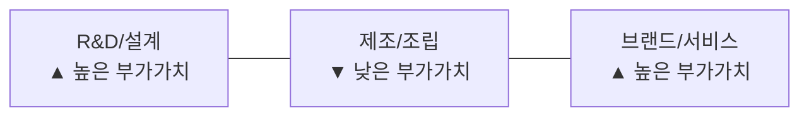

## 1. 왜 지금 플라자 합의를 공부하는가?

2025년 현재, 강달러가 지속되고 미중 무역전쟁이 격화되면서 "플라자 합의 2.0"이라는 말이 나오고 있다. 40년 전에 일어난 사건이 왜 지금 다시 화제가 되는 걸까?

그 이유는 간단하다. **돈의 흐름은 반복된다**. 환율이 급변하면 수출입 구조가 바뀌고, 각국 정책 대응이 자산 가격에 직접적인 영향을 미친다. 1985년 플라자 합의는 이 메커니즘을 가장 극적으로 보여준 사건이다.

이 글에서는 플라자 합의의 배경부터 결과까지를 투자자 관점에서 정리하고, 실제 자산 가격이 어떻게 움직였는지 차트로 확인한다. 그리고 현재 상황과의 유사점을 비교하여, 비슷한 상황이 다시 올 때 어떻게 대비할지 생각해본다.

**이 글을 읽으면 알 수 있는 것:**
- 플라자 합의가 왜, 어떻게 일어났는지
- 합의 전후 주요 자산(주식, 금, 환율)의 가격 변동
- 일본 버블 형성과 붕괴의 메커니즘
- 한국이 이 기회를 어떻게 활용했는지
- 현재 상황과의 유사점과 투자 시사점

---

## 2. 배경: 왜 달러가 그렇게 강해졌나? (1980~1985)

플라자 합의를 이해하려면 먼저 1980년대 초반의 상황을 알아야 한다. 당시 달러는 역사상 유례없는 초강세를 보이고 있었다.

### 2.1 볼커 쇼크 — 인플레이션과의 전쟁

1970년대 두 차례 오일쇼크로 미국 물가상승률이 10%대까지 치솟았다. 이른바 '대인플레이션(Great Inflation)' 시대였다. 1979년 Fed 의장으로 취임한 폴 볼커(Paul Volcker)는 인플레를 잡기 위해 극단적인 선택을 했다. **기준금리를 최대 20%까지 인상**한 것이다.

세계에서 가장 높은 실질금리를 제공하니 전 세계 자금이 달러 자산(미국 국채, 회사채 등)으로 몰려들었다. 그 결과 1980~1985년 사이 달러 가치(DXY)는 약 44% 상승하여 160까지 치솟았다.

### 2.2 레이건 재정확대 — 쌍둥이 적자의 시작

같은 시기 레이건 행정부는 대규모 감세와 군비 확대라는 확장적 재정정책을 펼쳤다. 재정적자가 크게 늘면서 장기금리를 끌어올리는 요인이 되었다.

**"긴축 통화(볼커) + 확장 재정(레이건)"** 조합은 실질금리를 높게 유지했고, 해외 자본 유입을 가속시켜 달러 강세를 더욱 강화했다. 게다가 1기 레이건 행정부는 외환시장 개입을 거의 하지 않는 '강한 달러 방치(benign neglect)' 정책을 취했다. 재무장관 도널드 리건은 "강한 달러는 미국 경제에 대한 신뢰의 표시"라며 환율 조정을 꺼렸다.

### 2.3 달러 강세의 부작용 — 무역적자 폭발

달러가 강하면 좋은 거 아닌가? 꼭 그렇지는 않다.

달러 강세의 메커니즘을 살펴보면:
- **수출 측면**: 달러 기준 미국 상품 가격이 비싸져서 해외 바이어가 미국산 구매를 줄임 → **수출 감소**
- **수입 측면**: 해외 상품이 달러 기준으로 싸져서 미국 소비자가 외국 제품을 더 많이 구매 → **수입 증가**
- **결과**: 수입 > 수출 → **무역적자 확대**

실제 데이터를 보면 그 영향이 극적이었다:

| 연도 | 미국 상품 무역적자 |
|------|-------------------|
| 1980년 | 255억 달러 |
| 1984년 | 1,070억 달러 |
| 1985년 | 1,220억 달러 |
| 1987년 | 1,595억 달러 |

미국 수출기업과 제조업이 가격경쟁력을 잃으면서 일자리가 줄었고, 의회에서는 보호무역(관세) 압력이 거세졌다. "관세전쟁을 할 것인가, 환율을 조정할 것인가"의 기로에 선 것이다.

> **투자 교훈**: 달러 강세는 수입 물가 하락(인플레 억제)이라는 장점이 있지만, 수출 경쟁력 약화와 무역적자 확대라는 구조적 부작용이 있다. "자본계정 흑자(해외 돈 유입) → 달러 강세 → 무역적자 확대"는 지금도 반복되는 패턴이다.

---

## 3. 플라자 합의 — 무엇이, 어떻게 결정되었나?

### 3.1 합의 개요

1985년 9월 22일, 뉴욕 맨해튼의 플라자 호텔. G5(미국, 일본, 서독, 영국, 프랑스) 재무장관과 중앙은행 총재들이 한자리에 모였다.

핵심 합의 내용은 단순했다: **"달러를 인위적으로 약세로 만들자."**

보호무역(관세전쟁)이라는 극단적 선택 대신, 각국이 협조하여 외환시장에 개입하고 환율을 조정함으로써 무역불균형을 해소하겠다는 것이었다. 구체적 환율 목표치는 공식적으로 명시하지 않았지만, 방향은 명확했다.

### 3.2 합의의 구체적 내용

- 각국 중앙은행이 외환시장에서 **협조 개입하여 달러를 매도**
- 일본과 서독에 **내수 확대** 요구 (수출 의존도를 낮추라는 의미)
- 미국에 **재정적자 축소** 요구
- 시장에 "이제 달러는 내린다"는 강력한 시그널 전달

발표 직후 외환시장은 즉각 반응했다. 달러는 발표 다음 날부터 급락하기 시작했다.

---

## 4. 합의 이후 — 돈의 흐름이 바뀌다 (1985~1990)

### 4.1 환율 대변동

플라자 합의의 효과는 예상보다 훨씬 강력했다.

| 통화 | 합의 전 (1985.9) | 1986년 | 1988년 | 변동폭 |
|------|------------------|--------|--------|--------|
| 달러/엔 | 약 240엔 | 153엔 | 120엔 | **엔 약 50% 강세** |
| DXY (달러 인덱스) | 약 140 | 약 110 | 약 85 | **달러 약 40% 하락** |

달러는 주요 통화 대비 약 40~50% 하락했다. 특히 엔/달러 환율은 240엔에서 120엔까지 떨어져, 엔화 가치가 2배 가까이 올랐다. 이는 일본 경제에 엄청난 충격이었다.

### 4.2 일본의 대응 — 저금리와 유동성, 그리고 버블의 씨앗

엔화가 급등하자 일본 수출기업(도요타, 소니, NEC 등)의 가격경쟁력이 급격히 나빠졌다. "수출이 죽으면 경기 전체가 무너진다"는 위기감 속에서 일본 정부와 일본은행(BOJ)은 강력한 경기부양책을 꺼냈다.

**통화 정책**:
- BOJ가 공식할인율을 **5% → 2.5%로 5차례 인하** (1986~1987년)
- 시중에 막대한 유동성 공급

**재정 정책**:
- 공공투자 확대
- 재정지출 증가로 내수 자극

논리는 이랬다: "환율은 받아들이되, 금리와 유동성으로 경기 충격을 완화하자." 단기적으로 이 정책은 효과가 있었다. 문제는 이 정책이 **너무 오래, 너무 과하게** 지속되었다는 것이다.

초저금리와 풍부한 유동성은 실물 경제가 아닌 **자산시장으로 흘러갔다**.

- **니케이225**: 1985년 약 13,000pt → 1989년 12월 **38,957pt** (약 3배 상승)
- **도쿄 토지 가격**: 4년간 폭등. "도쿄 황궁 부지 가격이 캘리포니아 전체 땅값보다 비싸다"는 말이 나올 정도
- 통화·신용이 연 10% 이상 빠르게 증가

이것이 역사에 기록된 **일본 자산 버블**이었다.

### 4.3 버블 붕괴와 잃어버린 수십 년

1989년 말, BOJ가 뒤늦게 금리를 인상하기 시작했다. 버블은 무너졌다.

| 지표 | 최고점 | 최저점 | 하락폭 |
|------|--------|--------|--------|
| 니케이225 | 38,957 (1989.12) | 14,309 (1992) | **-63%** |
| 도쿄 상업용 부동산 | 1991년 정점 | 2000년대 중반 | **-80% 이상** |

부실채권이 급증하고, 디플레이션이 장기화되면서 일본은 "잃어버린 10년"에 진입했다. 실제로는 10년이 아니라 **20~30년**이 걸렸다. 니케이225가 1989년 최고점(38,957pt)을 회복한 것은 2024년이다. **35년이 걸린 것이다.**

> **투자 교훈**: 정책 대응(저금리, 유동성)이 단기적으로 자산 가격을 올리지만, 과도한 완화는 버블을 만들고 장기 침체로 이어질 수 있다. "환율 쇼크 → 과도한 완화 → 버블 → 붕괴 → 장기 침체"라는 패턴은 모든 투자자가 기억해야 할 시나리오이다.

---

## 5. 자산별 가격 변동 — 차트로 보는 돈의 흐름

플라자 합의 전후(1980~1995) 주요 자산이 어떻게 움직였는지 차트로 확인해보자.

<!-- TODO: Google Finance에서 캡처한 차트 이미지 삽입 -->
<!-- 1985년 1월 = 100 기준으로 정규화하여 아래 자산들을 비교 -->
<!-- S&P 500 / 나스닥 / 금(Gold) / 니케이225 / KOSPI / DXY -->

### 5.1 주요 자산 비교 (1980~1995)

| 자산 | 1985년 (합의 전) | 1989년 (정점기) | 1992년 | 특징 |
|------|------------------|----------------|--------|------|
| S&P 500 | ~180 | ~350 | ~420 | 꾸준한 상승 (1987년 블랙먼데이 제외) |
| 나스닥 | ~280 | ~450 | ~600 | 기술주 중심 성장 |
| 금(Gold) | ~300$/oz | ~380$/oz | ~340$/oz | 달러 약세 시 상승, 이후 횡보 |
| 니케이225 | ~13,000 | **~38,957** | ~14,309 | 폭등 후 폭락 — 버블의 전형 |
| KOSPI | ~140 | **~1,000** | ~680 | 3저 호황으로 약 7배 상승 |
| DXY | ~140 | ~95 | ~85 | 플라자 합의 후 지속 하락 |

### 5.2 차트에서 읽을 수 있는 핵심 포인트

**1985년 9월 (플라자 합의)**
- DXY가 급락하기 시작하며 달러 약세 시대 개막
- 니케이225와 KOSPI가 본격적인 상승 시작

**1985~1989년 (버블 형성기)**
- 니케이225가 가장 가파른 상승세 — 일본 자산 버블의 절정
- KOSPI도 3저 호황(저유가, 저금리, 저달러)으로 7배 가까이 폭등
- S&P500도 꾸준히 상승하나 니케이·KOSPI 대비 완만

**1987년 10월 (블랙먼데이)**
- 하루 만에 전 세계 주식시장 동시 폭락 (S&P500 -20%, 니케이 -15%)
- 하지만 비교적 빠르게 회복 — 미국과 일본 모두 연내 상당 부분 만회

**1989~1992년 (일본 버블 붕괴)**
- 니케이225가 38,957에서 14,309으로 63% 폭락
- 같은 기간 S&P500은 상승 지속 — **같은 이벤트에 대한 국가별 반응이 극적으로 다름**
- 금은 달러 약세 시 상승했다가 이후 횡보

> **투자 교훈**: 거시적 이벤트(환율 정책 변화)는 모든 자산에 영향을 미치지만, 국가와 자산별로 반응 방향과 크기가 완전히 다르다. 분산 투자와 글로벌 포트폴리오의 중요성을 보여주는 사례이다.

---

## 6. 한국에 미친 영향 — 첫 번째 구조적 기회

### 6.1 엔 강세 → 일본 경쟁력 약화 → 한국의 추격

엔/달러가 240에서 120으로 떨어지면서 일본 제조업의 수출 가격이 사실상 2배로 뛰었다. 일본이 약해진 영역은 명확했다.

- **반도체**: 일본이 DRAM 시장 80% 점유 → 삼성전자가 가격 경쟁력으로 추격 시작
- **조선**: 일본 조선소 수주 경쟁력 약화 → 현대중공업, 대우조선 등이 세계 시장 점유율 확대
- **전자/디스플레이**: 일본 가전의 가격 경쟁력 하락 → 한국 기업이 틈새 진입

이것이 한국 경제 역사에서 **"1차 구조적 기회"**로 불리는 시기이다.

### 6.2 3저 호황 (1986~1988)

플라자 합의 이후 한국에는 세 가지 유리한 조건이 동시에 형성되었다.

| 조건 | 내용 | 한국 경제 효과 |
|------|------|--------------|
| **저유가** | 유가 하락 | 에너지 수입국인 한국의 비용 절감 |
| **저금리** | 글로벌 금리 하향 추세 | 기업 투자 비용 감소 |
| **저달러(원화 약세)** | 달러 약세 + 원화 상대적 안정 | 한국 수출 가격경쟁력 강화 |

이 3저 호황 기간 동안:
- KOSPI: 약 140 → 약 1,000 (약 **7배 상승**)
- 한국 수출 급증, 경상수지 흑자 전환
- 삼성, 현대, LG 등 대기업이 글로벌 시장에서 입지를 다진 시기

### 6.3 스마일 커브와 한국의 위치

글로벌 가치사슬에서 부가가치 분포를 나타내는 **스마일 커브(Smile Curve)** 개념으로 보면, 한국의 전략적 위치를 이해할 수 있다.

- **스마일 커브**: 양 끝(R&D, 브랜드)에 부가가치가 높고 중앙(제조)은 낮은 U자형
- 한국은 1985년 이후 **제조**에서 출발하여 점차 **R&D(반도체 설계, HBM)** 쪽으로 이동

최근에는 **역스마일 커브** 논의가 나오고 있다. AI로 소프트웨어·지식노동 비용이 하락하면서, 오히려 "실제로 만드는 능력(제조, 공장, 장비, 에너지 인프라)"의 희소가치가 올라가고 있다는 것이다. 이 관점에서 반도체·제조 기반이 탄탄한 한국은 또 한 번의 구조적 기회를 맞고 있다는 분석이 있다.

---

## 7. 현재와의 비교 — 플라자 합의 2.0이 올까?

### 7.1 유사점 — 데자뷔?

| 항목 | 1985년 | 2025년 현재 |
|------|--------|------------|
| 달러 강세 | DXY 160 (역대 최고) | DXY 100~110 (강세 지속) |
| 미국 무역적자 | 1,220억 달러 | 약 1조 달러 이상 |
| 보호무역 압력 | 의회 관세 법안 추진 | 트럼프 행정부 관세 정책 |
| 미국 금리 | 볼커 고금리 (최대 20%) | Fed 고금리 (5%대) |
| 무역 갈등 대상 | 일본, 서독 | 중국, 한국, EU |

구조적으로 놀라울 정도로 비슷하다. **달러가 강하고, 무역적자가 크고, 보호무역 압력이 높다**는 패턴이 반복되고 있다.

### 7.2 차이점 — 같은 처방이 가능할까?

그러나 결정적인 차이점도 있다:

- **국제 협조의 어려움**: 1985년에는 G5가 동맹 관계에서 합의했지만, 현재 미중 갈등 구도에서 유사한 협조 합의는 어렵다
- **중국의 존재**: 1985년에는 중국이 글로벌 경제에서 미미했지만, 현재는 세계 2위 경제 대국이다
- **디지털 경제**: 서비스·데이터 무역의 비중이 커져 단순 환율 조정만으로 무역불균형 해소가 어렵다
- **암호화폐와 새로운 자산**: 1985년에는 존재하지 않았던 자산 클래스가 돈의 흐름에 영향

### 7.3 투자자가 주목해야 할 시그널

"플라자 합의 2.0"이 정확히 같은 형태로 반복되지는 않겠지만, **비슷한 메커니즘이 작동할 가능성**은 있다. 주목해야 할 시그널:

1. **미국 환율 정책 변화**: "강달러 옹호" → "약달러 전환" 발언이 나올 때
2. **다자간 통화 협의**: G7/G20에서 환율 조정 논의가 공식화될 때
3. **미국 무역적자 확대 속도**: 정치적 임계점을 넘는 수준
4. **각국 중앙은행 금리 방향**: 특히 일본(BOJ)의 정책 전환
5. **신흥국 통화 급변**: 원화, 위안화 등의 급격한 절상/절하

---

## 8. 투자 교훈 정리

### 8.1 플라자 합의에서 배우는 4가지 핵심 교훈

**교훈 1: 환율은 가장 강력한 거시 변수이다**

환율 변동은 주식, 채권, 금, 부동산 등 모든 자산에 파급 효과를 미친다. 1985년 이후 달러가 40% 하락하면서 니케이는 3배 상승하고, KOSPI는 7배 상승했다. 단일 변수로 이만큼의 자산 가격 변동을 설명하는 경우는 드물다.

**교훈 2: 정책 대응은 새로운 기회를 만든다**

일본의 저금리 대응은 버블을 만들었지만, 한국에는 3저 호황이라는 기회를 열었다. 한 나라의 정책 대응이 다른 나라에 어떤 영향을 미치는지를 볼 수 있어야 한다.

**교훈 3: 과도한 완화의 끝은 버블이다**

"환율 쇼크 → 과도한 완화 → 버블 → 붕괴 → 장기 침체." 일본의 사례는 이 패턴의 교과서이다. 현재 각국의 양적완화와 저금리 정책을 볼 때 이 역사적 교훈을 기억해야 한다.

**교훈 4: 위기 속의 승자를 찾아라**

일본이 약해진 틈에 한국이 부상했다. 미국 제조업이 약해진 틈에 일본과 독일이 성장했다. 한 나라의 위기는 반드시 다른 나라의 기회가 된다. 투자자는 위기가 발생했을 때 "누가 이 상황의 수혜자인가?"를 먼저 물어야 한다.

### 8.2 현재 포트폴리오에 적용할 점

| 시나리오 | 고려할 행동 |
|---------|-----------|
| 달러 약세 전환 시 | 신흥국 주식, 금, 원자재 비중 확대 |
| 특정국 통화 급변 시 | 해당국 수출기업 경쟁력 변화 모니터링 |
| 과도한 유동성 공급 시 | 자산 버블 경계, 실물자산 비중 점검 |
| 국제 통화 합의 논의 시 | 환율 변동 방향의 수혜 국가/산업 파악 |

---

## 9. 마무리

1985년 플라자 합의는 단순한 역사적 사건이 아니다. **"강한 달러 → 무역적자 → 정치적 압력 → 환율 조정 → 각국 자산 가격 변동"**이라는 돈의 흐름 패턴을 가장 극적으로 보여준 사건이다.

40년이 지난 지금, 비슷한 조건들이 다시 형성되고 있다. 이 역사를 아는 투자자와 모르는 투자자의 차이는, 같은 뉴스를 보고도 기회를 포착하느냐 못 하느냐의 차이가 될 것이다.

---

## 10. 참고 자료

- [Plaza Accord - Wikipedia](https://en.wikipedia.org/wiki/Plaza_Accord)
- [EBC - Plaza Accord Explained](https://www.ebc.com/forex/plaza-accord-explained-dollar-yen-and-market-impact)
- [NBER Working Paper - Plaza Accord](https://www.nber.org/system/files/working_papers/w21813/w21813.pdf)
- [Federal Reserve History - Great Inflation](https://www.federalreservehistory.org/essays/great-inflation)
- [Cleveland Fed - The Dollar in the Eighties](https://www.clevelandfed.org/publications/economic-commentary/1985/ec-19850901-the-dollar-in-the-eighties)
- [BIS - Japanese Asset Price Bubble](https://www.bis.org/publ/bppdf/bispap21e.pdf)
