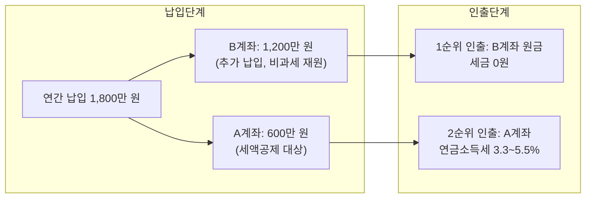
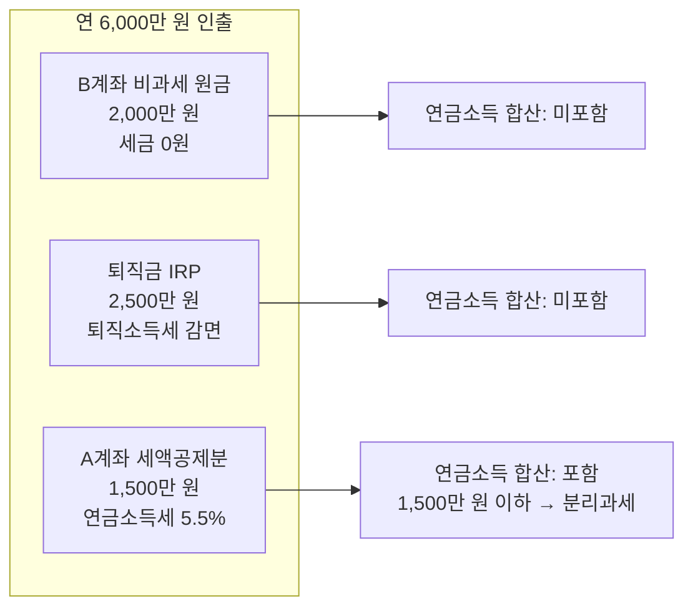
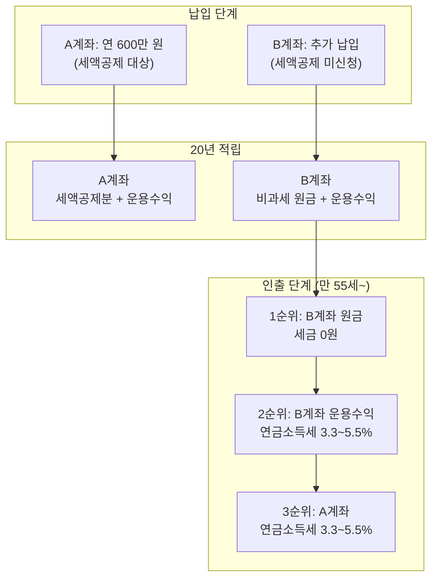

연금저축은 대부분 계좌 하나에 모든 자금을 넣는다. 세액공제 받는 600만 원도, 추가로 넣는 돈도 같은 계좌에 쌓인다. 그런데 이렇게 하면 인출할 때 비과세 재원이 빨리 소진되어, 세금을 더 내게 된다.

**세액공제 받은 돈과 안 받은 돈을 별도 계좌로 분리**하면, 비과세 인출 기간을 수년 더 늘릴 수 있다. 국세청 유권해석에 따르면 연금계좌의 인출 순서는 **계좌별로 독립 적용**되기 때문이다.

이 글은 연금저축 계좌 분리 운용의 원리와 실제 절세 효과를 정리하는 스터디 노트다.

이 글을 읽으면 알 수 있는 것:

- 왜 연금저축 계좌를 나눠야 하는지 (인출 순서의 독립 적용 원리)
- 세액공제용 계좌 vs 추가 납입용 계좌 분리 방법
- 단일 계좌 vs 분리 계좌의 세금 차이 시뮬레이션
- 실전에서 주의해야 할 사항

> 이전 글: [ISA 만기 자금, 연금계좌로 옮기면 세액공제 300만 원이 더 생긴다](/etc/isa-pension-transfer-strategy/)
> 시리즈 첫 글: [연금저축, 넣을 때보다 꺼낼 때가 더 중요하다 — 납입부터 인출까지 절세 전략 총정리](/etc/pension-savings-withdrawal-strategy/)

---

# 1. 연금계좌 인출 순서 복습

계좌 분리 전략을 이해하려면, 먼저 연금계좌의 **법정 인출 순서**를 알아야 한다. 이전 글([연금저축 납입·인출 절세 전략](/etc/pension-savings-withdrawal-strategy/))에서 자세히 다뤘지만, 이 글의 핵심과 직접 연결되므로 간단히 복습한다.

## 1.1 법정 인출 순서

연금계좌에서 돈을 꺼낼 때는 법정 순서가 있다. 세 부담이 적은 재원부터 먼저 빠져나간다.

| 순서 | 재원 | 과세 여부 |
|------|------|----------|
| 1순위 | 세액공제 받지 않은 납입금 (과세제외금액) | **비과세** |
| 2순위 | 퇴직금 (이연퇴직소득) | 퇴직소득세 (30~40% 감면) |
| 3순위 | 세액공제 받은 납입금 + 운용 수익 | 연금소득세 3.3~5.5% |

이 순서는 납세자가 선택하는 것이 아니라, **법으로 정해진 순서**다. 세금이 없는 돈(1순위)이 먼저 빠지고, 세금이 붙는 돈(3순위)이 나중에 빠진다.

## 1.2 "계좌별 독립 적용"이 핵심

여기서 중요한 포인트가 있다. 이 인출 순서는 모든 연금계좌를 합산해서 적용하는 것이 아니라, **각 계좌별로 따로** 적용된다.

국세청 유권해석(서면-2023-원천-4016, 2025.01.23)에 따르면:

> "연금계좌를 여러 개 운용하는 경우, 소득세법 시행령 제40조의3의 인출순서는 **각 연금계좌별로 적용**하는 것이며, 납세자의 모든 계좌를 통산해 적용하는 것은 아니다"

이 말이 무엇을 의미하는지 예시로 살펴보자.

- **계좌가 1개**일 때: 계좌 안의 비과세 재원이 소진되면, 그다음 인출분은 모두 과세 대상
- **계좌가 2개**일 때: A계좌에서 비과세 재원이 소진되어도, **B계좌의 비과세 재원은 남아 있다**

이 구조를 전략적으로 활용하는 것이 바로 **계좌 분리 전략**이다.

---

# 2. 계좌 분리 전략

## 2.1 분리 방법

연금저축 계좌를 **용도별로 2개** 나누어 운용한다.

| 계좌 | 용도 | 납입 내용 | 인출 시 과세 |
|------|------|----------|------------|
| **A계좌** (세액공제용) | 세액공제 한도까지만 납입 | 연 600만 원 | 연금소득세 3.3~5.5% |
| **B계좌** (추가 납입용) | 세액공제 한도 초과분만 납입 | 연 최대 1,200만 원 | **원금 비과세** |

### 계좌 개설 방법

- 같은 증권사에서 연금저축 계좌 **2개 개설 가능**
- 다른 증권사에서 각각 1개씩 개설하는 것도 가능
- 같은 증권사에서 개설하면 관리가 편리하고, 이체 시 수수료도 없다

### 세액공제 한도는 합산

계좌를 나눠도 세액공제 한도는 변하지 않는다. 연금저축 600만 원 + IRP 300만 원 = **합산 900만 원**이 한도다. 계좌가 2개든 5개든 전체 합산으로 적용된다. A계좌에서만 세액공제를 신청하고, B계좌에서는 세액공제를 신청하지 않으면 된다.

## 2.2 단일 계좌 vs 분리 계좌 비교

### 단일 계좌 (A계좌 하나에 전부 납입)

하나의 계좌에 세액공제 대상 금액과 추가 납입 금액을 모두 넣는 경우다.

- 비과세 재원(세액공제 미적용분)과 과세 재원(세액공제 적용분 + 운용 수익)이 **한 계좌에 섞인다**
- 인출 시 비과세 재원이 먼저 빠지지만, 소진되면 이후 인출분은 **모두 과세 대상**
- 비과세 재원이 상대적으로 빨리 소진된다

### 분리 계좌 (A계좌 + B계좌)

세액공제 대상 금액과 추가 납입 금액을 별도 계좌에 나누어 넣는 경우다.

- **B계좌**: 납입금 전체가 비과세 재원 → 원금은 세금 없이 인출 가능
- **A계좌**: 세액공제 받은 납입금 + 운용 수익 → 연금소득세 적용
- B계좌에서 먼저 인출하고, A계좌는 나중에 연금으로 수령하면 **비과세 인출 기간을 늘릴 수 있다**

왜 분리 계좌가 유리한지는 아래 시뮬레이션에서 숫자로 확인해보자.

---

# 3. 세금 차이 시뮬레이션

## 3.1 기본 가정

| 항목 | 설정 |
|------|------|
| 총급여 | 6,000만 원 (세액공제율 13.2%) |
| 연금저축 납입 | 연 900만 원 (세액공제 600만 원 + 추가 납입 300만 원) |
| 납입 기간 | 20년 (35세~54세) |
| 연평균 수익률 | 5% |
| 수령 시작 | 만 55세 |
| 연간 수령액 | 1,200만 원 (연 1,500만 원 이하 분리과세 유지) |
| 연금소득세율 | 5.5% (만 55~69세 기준) |

### 20년 납입 후 적립 현황

| 항목 | 금액 |
|------|------|
| 총 납입 원금 | 1억 8,000만 원 (900만 원 × 20년) |
| 세액공제 받은 납입금 | 1억 2,000만 원 (600만 원 × 20년) |
| 세액공제 안 받은 납입금 (비과세 재원) | 6,000만 원 (300만 원 × 20년) |
| 운용 수익 (5% 복리 가정) | 약 1억 1,799만 원 |
| **총 적립금** | **약 2억 9,799만 원** |

## 3.2 시나리오 1: 단일 계좌

하나의 계좌에 20년간 매년 900만 원(세액공제 600만 원 + 추가 300만 원)을 납입했다.

계좌 안에는 비과세 재원 6,000만 원과 과세 재원(세액공제분 1억 2,000만 원 + 운용 수익 약 1억 1,799만 원)이 섞여 있다.

**인출 흐름:**

| 기간 | 인출 재원 | 연간 세금 | 비고 |
|------|----------|----------|------|
| 1~5년차 | 비과세 재원 (6,000만 원) | **0원** | 1,200만 원 × 5년 = 6,000만 원 |
| 6년차~ | 과세 재원 (세액공제분 + 운용 수익) | **66만 원** | 1,200만 원 × 5.5% |

- 비과세 재원이 **5년차에 소진**
- 6년차부터는 매년 66만 원의 연금소득세 발생

## 3.3 시나리오 2: 분리 계좌

A계좌(세액공제용)에 연 600만 원, B계좌(추가 납입용)에 연 300만 원을 20년간 따로 납입했다.

**각 계좌 적립 현황:**

| 구분 | A계좌 (세액공제용) | B계좌 (추가 납입용) |
|------|-------------------|-------------------|
| 납입 원금 | 1억 2,000만 원 | 6,000만 원 |
| 운용 수익 (5%) | 약 7,866만 원 | 약 3,933만 원 |
| **총 적립금** | **약 1억 9,866만 원** | **약 9,933만 원** |
| 비과세 재원 | 0원 (전액 세액공제 대상) | **6,000만 원** (원금 전액) |

**인출 흐름:**

B계좌에서 먼저 인출을 시작한다. B계좌의 원금 6,000만 원은 전액 비과세 재원이다.

| 기간 | 인출 계좌 | 인출 재원 | 연간 세금 | 비고 |
|------|----------|----------|----------|------|
| 1~5년차 | B계좌 | 비과세 재원 (원금 6,000만 원) | **0원** | 1,200만 원 × 5년 = 6,000만 원 |
| 6~8년차 | B계좌 | 운용 수익 (약 3,933만 원) | **66만 원** | B계좌 운용 수익은 과세 대상 |
| 9년차~ | A계좌 | 과세 재원 | **66만 원** | A계좌 인출 시작 |

여기까지 보면 단일 계좌와 큰 차이가 없어 보인다. 하지만 핵심은 **B계좌의 운용 수익**에 있다.

## 3.4 분리 계좌가 유리한 진짜 이유

단일 계좌에서는 비과세 재원과 과세 재원이 섞여 있어, 인출 시 비과세 재원이 소진되면 곧바로 과세 구간에 진입한다.

반면 분리 계좌에서는:

1. **B계좌 원금 6,000만 원**: 전액 비과세로 인출 (5년간)
2. **B계좌 운용 수익**: 과세 대상이지만, 이 기간 동안 **A계좌의 자산은 계속 운용되며 복리 효과**를 누린다
3. **A계좌 인출 지연**: A계좌의 인출 시점이 늦어지면, 만 70세 이후(세율 4.4%)나 만 80세 이후(세율 3.3%)에 더 낮은 세율로 수령 가능

### 12년 누적 세금 비교

참고 기사의 홍길동 사례(연간 3,000만 원 인출, 16.5% 분리과세 기준)를 참고하면:

| 구분 | 단일 계좌 | 분리 계좌 (2개) |
|------|----------|---------------|
| 12년 누적 세금 | 약 1,333만 원 | 약 1,221만 원 |
| **절감액** | - | **약 112만 원** |

> 절세 금액 자체는 112만 원으로 크지 않아 보일 수 있다. 하지만 계좌를 나누는 데 드는 비용은 0원이고, 한번 세팅하면 평생 효과가 지속된다. "공짜로 얻는 절세"라는 점에서 하지 않을 이유가 없다.

### 나이별 세율 차이 효과

A계좌의 인출 시점을 늦출수록 더 낮은 세율이 적용된다.

| 수령 나이 | 연금소득세율 | 1,200만 원 수령 시 세금 |
|----------|-----------|---------------------|
| 만 55~69세 | 5.5% | 66만 원 |
| 만 70~79세 | 4.4% | 52.8만 원 |
| 만 80세 이상 | 3.3% | 39.6만 원 |

B계좌 비과세 인출로 초기 수년을 버티고, A계좌를 70세 이후에 본격 인출하면 세율이 5.5% → 4.4%로 낮아져 **매년 13.2만 원씩 추가 절세**가 가능하다.

## 3.5 실전 시나리오: 월 500만 원 생활비가 필요하다면

지금까지 시뮬레이션은 연 1,200만 원 수령을 기준으로 했다. 하지만 실제 은퇴 후 **월 500만 원(연 6,000만 원)** 정도의 생활비가 필요한 경우, 계좌를 어떻게 구성해야 할까?

### 핵심: 연금소득 1,500만 원에 포함되지 않는 재원을 활용

모든 인출이 "연금소득"으로 잡히는 것은 아니다. 1,500만 원 분리과세 기준선에 **포함되지 않는 재원**을 최대한 활용하는 것이 핵심이다.

| 재원 | 과세 방식 | 연금소득 1,500만 원 포함 여부 |
|------|---------|--------------------------|
| 비과세 재원 (B계좌 원금, ISA 전환 원금) | **세금 0원** | 미포함 |
| 퇴직금 IRP 연금 수령 | 퇴직소득세 (30~40% 감면) | **미포함** (분류과세) |
| 세액공제 받은 연금저축 (A계좌) | 연금소득세 3.3~5.5% | **포함** |

### 연 6,000만 원 인출 구성 예시

| 인출 원천 | 연간 인출액 | 세금 | 연금소득 1,500만 원 한도 |
|----------|-----------|------|----------------------|
| B계좌 비과세 원금 | 2,000만 원 | 0원 | 미포함 |
| 퇴직금 IRP | 2,500만 원 | 퇴직소득세 감면 | 미포함 |
| A계좌 세액공제분 | **1,500만 원** | 82.5만 원 (5.5%) | **포함 (한도 충족)** |
| **합계** | **6,000만 원** | **약 82.5만 원 + 퇴직소득세** | |

A계좌에서 **1,500만 원 이하**만 인출하면 분리과세로 종결되고, 종합소득세 합산도 건강보험 피부양자 자격 상실도 피할 수 있다. 나머지 4,500만 원은 비과세 재원과 퇴직금으로 충당한다.

### 필요한 계좌: 최소 3개

| 계좌 | 용도 | 역할 |
|------|------|------|
| **A계좌** (세액공제용 연금저축) | 세액공제 대상 금액 납입 | 연 1,500만 원 이하로 인출 조절 |
| **B계좌** (추가 납입용 연금저축) | 세액공제 초과분 납입 | 비과세 원금 인출 (세금 0원) |
| **퇴직금 IRP** | 퇴직금 수령 전용 | 퇴직소득세 감면, 종합소득 합산 안 됨 |

여기에 ISA 만기 전환까지 활용하면 B계좌의 비과세 재원이 더 두꺼워진다. 3년마다 ISA에서 연금계좌로 전환하면 비과세 원금이 계속 쌓이므로, 은퇴 초기 비과세 인출 기간을 더 길게 가져갈 수 있다.

> ISA 전환 전략에 대한 자세한 내용은 [ISA 만기 자금, 연금계좌로 옮기면 세액공제 300만 원이 더 생긴다](/etc/isa-pension-transfer-strategy/)를 참고한다.

---

# 4. 주의사항

## 4.1 반드시 알아야 할 규칙

### 4.1.1 세액공제 한도는 합산

계좌를 나눠도 세액공제 한도는 변하지 않는다.

- 연금저축 600만 원 + IRP 300만 원 = **합산 900만 원** 한도
- B계좌에서 세액공제를 신청하면 안 된다. B계좌는 반드시 **세액공제 미신청** 상태로 유지해야 비과세 재원이 된다

### 4.1.2 납입 한도도 합산

연금저축 전체 납입 한도는 **연간 1,800만 원**이며, 계좌 수와 무관하게 합산 적용된다.

- A계좌 600만 원 + B계좌 1,200만 원 = 1,800만 원 (한도 충족)
- 이 한도를 초과하면 초과분은 해당 연도에 납입이 거부된다

### 4.1.3 B계좌 세액공제 신청 실수

연말정산 시 B계좌의 납입금에 대해서도 세액공제를 신청하면, 해당 금액은 **과세 재원**으로 전환된다. B계좌는 반드시 세액공제를 신청하지 않아야 한다.

만약 실수로 세액공제를 받았다면, 다음 해 **종합소득세 경정청구**를 통해 세액공제를 취소할 수 있다. 하지만 절차가 복잡하고 시간이 걸리므로, 처음부터 주의하는 것이 좋다.

## 4.2 실전 팁

### 같은 증권사에서 2개 계좌 개설

ISA와 마찬가지로, 같은 증권사에서 연금저축 계좌를 2개 개설하는 것이 관리에 편리하다. 다른 증권사에서 개설하면 계좌 관리 앱이 분산되어 관리가 번거로워진다.

### 연금 개시 시점은 계좌별로 다르게 설정 가능

각 계좌별로 연금 개시 시점을 다르게 설정할 수 있다. B계좌는 만 55세에 바로 연금 개시하고, A계좌는 만 70세에 개시하는 식으로 운용하면, 나이별 세율 차이를 최대한 활용할 수 있다.

### 적정 계좌 수

계좌가 많아지면 관리 부담도 커진다. 일반적으로 **2개(세액공제용 + 추가 납입용)**면 충분하다. IRP까지 포함하면 3개 정도가 적절하다.

## 4.3 FAQ

### Q. B계좌의 운용 수익도 비과세인가?

아니다. B계좌의 **원금**만 비과세(과세제외금액)이고, **운용 수익**은 과세 대상이다. B계좌에서 인출할 때 원금이 먼저 빠지고(비과세), 원금이 소진된 후 운용 수익이 빠진다(과세). 따라서 B계좌 원금만큼은 확실히 비과세로 인출할 수 있다.

### Q. 이미 하나의 계좌에 전부 넣고 있는데, 지금이라도 분리해야 하나?

가능하다. 기존 계좌는 그대로 두고, 새 계좌를 하나 더 개설하여 앞으로의 추가 납입분만 새 계좌에 넣으면 된다. 기존 계좌에 이미 쌓인 비과세 재원은 그대로 유지되고, 새 계좌에 쌓이는 비과세 재원이 추가되는 구조다.

### Q. 세액공제 안 받은 돈을 어떻게 확인하나?

국세청 홈택스에서 **"연금보험료 등 소득·세액공제 확인서"**를 발급받으면, 각 계좌별로 세액공제를 받은 금액과 받지 않은 금액을 확인할 수 있다. 연말정산 후 매년 확인하는 습관을 들이면 좋다.

---

# 5. 정리 및 체크리스트

## 5.1 계좌 분리 세팅

지금 당장 할 수 있는 일이다. 계좌 개설은 무료이고, 한번 세팅하면 이후 매년 자동으로 비과세 재원이 쌓인다.

- [ ] 연금저축 계좌 추가 개설 (같은 증권사에서 개설하면 관리가 편리)
- [ ] A계좌: 세액공제 대상 금액만 납입 (연 600만 원)
- [ ] B계좌: 추가 납입분만 납입 (세액공제 미신청)
- [ ] 연말정산 시 B계좌 세액공제 신청하지 않았는지 반드시 확인
- [ ] 이미 단일 계좌를 쓰고 있다면, 새 계좌를 추가 개설하여 앞으로의 추가 납입분만 새 계좌에 넣으면 된다

## 5.2 인출 전략

은퇴 후 실제로 돈을 꺼낼 때의 순서다. 비과세 재원을 먼저 소진하고, 과세 재원은 최대한 늦게 꺼내는 것이 핵심이다. A계좌의 인출을 늦출수록 나이별 세율(5.5% → 4.4% → 3.3%)이 낮아져 추가 절세가 가능하다.

- [ ] 만 55세 이후 B계좌 먼저 연금 개시 → 원금은 세금 0원으로 생활비 확보
- [ ] B계좌 소진 후 퇴직금 IRP 인출 → 퇴직소득세 감면, 종합소득 합산 안 됨
- [ ] A계좌는 가능한 한 늦게 연금 개시 (만 70세 이후면 세율 4.4%로 인하)
- [ ] A계좌 인출 시 연간 1,500만 원 이하 유지 → 분리과세 + 건강보험 피부양자 유지

## 5.3 한눈에 보는 요약

| 핵심 포인트 | 내용 |
|-----------|------|
| **분리 이유** | 인출 순서가 계좌별로 독립 적용되므로, 비과세 재원을 별도 계좌에 모아두면 비과세 인출 기간이 길어진다 |
| **A계좌** | 세액공제 한도(600만 원)까지만 납입 → 인출 시 연금소득세 부과 |
| **B계좌** | 추가 납입분만 납입 → 원금은 비과세 인출 |
| **절세 효과** | 12년 기준 약 112만 원 절세 + 나이별 세율 차이 활용 시 추가 절세 |
| **비용** | 0원 (계좌 개설 무료, 한번 세팅하면 평생 효과) |

---

# 6. 참고

- [개인연금 계좌 2개 이상이면 인출할 때 세금 줄어 이득 - 한국경제](https://v.daum.net/v/20251011090229155)
- [연금계좌 분리 운용 전략 - KB골든라이프](https://kbthink.com/main/asset-management/pension-n-old-age/kb-goldenlife/2024/kb-goldenlife-241013.html)
- [연금계좌 인출 순서 - Bravo](https://bravo.etoday.co.kr/view/atc_view/15819)
- [연금계좌 인출 순서 이해 - 미래에셋 투자와연금센터](https://investpension.miraeasset.com/contents/view.do?idx=13935)
- [연금계좌 인출순서 계좌별 적용 - 국세청 유권해석 (서면-2023-원천-4016)](https://www.intn.co.kr/news/articleView.html?idxno=2041805)
