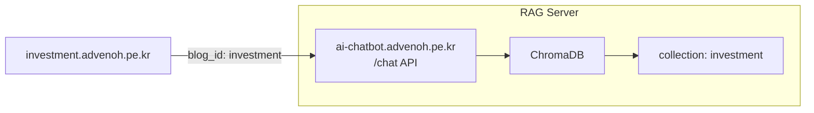

# 투자 블로그 ChatWindow 통합 - 프로젝트 PRD

## 1. 개요

### 1.1 목적
RAG 챗봇 API 서버(`ai-chatbot.advenoh.pe.kr`)를 활용하여 투자 블로그(`investment.advenoh.pe.kr`)에 ChatWindow 컴포넌트를 추가한다. 방문자가 투자 관련 블로그 콘텐츠에 대해 바로 Q&A를 이용할 수 있도록 한다.

### 1.2 선행 조건
- `7_blog_chat_integration` (blog-v2 ChatWindow 통합) 구현 완료
- `ai-chatbot.advenoh.pe.kr` API 서버 배포 완료
- `/chat` API 엔드포인트 정상 동작 확인

### 1.3 관련 Repo

| Repo | 역할 |
|------|------|
| [ai-chatbot.advenoh.pe.kr](https://github.com/kenshin579/ai-chatbot.advenoh.pe.kr) | RAG API 서버 (이미 배포됨) |
| [investment.advenoh.pe.kr](https://github.com/kenshin579/investment.advenoh.pe.kr) | 투자 블로그 - ChatWindow 추가 |

---

## 2. 아키텍처



- 투자 블로그 FE에서 `ai-chatbot.advenoh.pe.kr/chat` API 호출
- `blog_id: "investment"` 고정값 전송
- CORS: API 서버에서 `investment.advenoh.pe.kr` 도메인 허용 필요

---

## 3. investment 블로그 프로젝트 특성

### 3.1 blog-v2 대비 차이점

| 항목 | blog-v2 | investment |
|------|---------|------------|
| 디렉토리 구조 | `app/`, `components/`, `lib/` | `src/app/`, `src/components/`, `src/lib/` |
| 테마 시스템 | `next-themes` 라이브러리 | 커스텀 ThemeProvider (localStorage + context) |
| shadcn/ui RSC | `rsc: true` | `rsc: false` |
| 콘텐츠 카테고리 | 18+ (ai, java, go 등) | 4 (etc, etf, stock, weekly) |
| 콘텐츠 수 | 다수 | 약 95개 포스트 |
| 마크다운 처리 | `marked` + `prismjs` | `react-markdown` + `rehype-highlight` |

### 3.2 기존 컴포넌트 현황
- shadcn/ui 컴포넌트 47개 사용 중 (Button, Card, ScrollArea, Input, Badge, Skeleton 등)
- `framer-motion` 애니메이션 라이브러리 사용 중
- `lucide-react` 아이콘 라이브러리 사용 중

---

## 4. ChatWindow 컴포넌트 설계

### 4.1 컴포넌트 구조

```
src/components/chat/
├── ChatButton.tsx        # 화면 우하단 플로팅 채팅 버튼
├── ChatWindow.tsx        # 채팅 창 (열림/닫힘 토글)
├── MessageList.tsx       # 메시지 목록 (질문/답변)
├── ChatInput.tsx         # 입력 필드 + 전송 버튼
└── SourceLinks.tsx       # 참조 블로그 글 링크 목록
```

### 4.2 동작 방식

blog-v2와 동일:
1. 블로그 페이지 우하단에 **플로팅 채팅 버튼** 표시
2. 클릭 시 ChatWindow 오픈 (오버레이)
3. 질문 입력 → `POST ai-chatbot.advenoh.pe.kr/chat` 호출
4. 답변 + 참조 블로그 글 출처 표시
5. 멀티턴 대화 지원 (chat_history 전송)

### 4.3 API 호출

```typescript
// src/lib/chatApi.ts
const CHAT_API_URL = "https://ai-chatbot.advenoh.pe.kr";
const BLOG_ID = "investment"; // investment 블로그 고정값

export async function sendChatMessage(
  question: string,
  chatHistory: [string, string][]
): Promise<ChatResponse> {
  const res = await fetch(`${CHAT_API_URL}/chat`, {
    method: "POST",
    headers: { "Content-Type": "application/json" },
    body: JSON.stringify({
      blog_id: BLOG_ID,
      question,
      chat_history: chatHistory,
    }),
  });
  return res.json();
}
```

### 4.4 UI 요구사항

- 플로팅 버튼: 우하단 고정, 채팅 아이콘
- 채팅 창: 400x500px, 반응형 (모바일에서는 전체 화면)
- 메시지: 사용자(우측), 봇(좌측) 정렬
- 소스 인용: 답변 하단에 참조 블로그 글 링크 목록
- 로딩 상태: 타이핑 인디케이터
- 다크/라이트 모드: 투자 블로그 커스텀 ThemeProvider와 연동
- shadcn/ui 컴포넌트 사용 (디자인 시스템 일관성)

---

## 5. ChromaDB investment Collection 인덱싱

blog-v2와 달리 investment Collection 인덱싱이 선행 필요:

- **인덱싱 대상**: `contents/` 디렉토리 내 약 95개 포스트
- **카테고리**: etc (9), etf (11), stock (61), weekly (14)
- **Collection 이름**: `investment`
- `ai-chatbot.advenoh.pe.kr` 프로젝트에서 인덱싱 스크립트 실행

---

## 6. API 서버 CORS 설정

```python
# ai-chatbot.advenoh.pe.kr/app/main.py
app.add_middleware(
    CORSMiddleware,
    allow_origins=[
        "https://blog-v2.advenoh.pe.kr",
        "https://investment.advenoh.pe.kr",  # 추가
        "http://localhost:3000",
    ],
    allow_methods=["POST"],
    allow_headers=["Content-Type"],
)
```

---

## 7. 구현 순서 (마일스톤)

| 단계 | 작업 | 산출물 |
|------|------|--------|
| M1 | investment 코드베이스 분석 (구조, 테마, 컴포넌트 패턴) | 분석 결과 |
| M2 | investment Collection 인덱싱 | ChromaDB investment Collection |
| M3 | API 서버 CORS 설정 (investment 도메인 허용) | CORS 미들웨어 업데이트 |
| M4 | ChatWindow 컴포넌트 구현 (blog-v2 기반 포팅 + 테마 연동) | 채팅 컴포넌트 |
| M5 | 배포 및 E2E 테스트 | 프로덕션 채팅 기능 |

---

## 8. 테스트

- **MCP Playwright** 사용하여 E2E 테스트:
  - 플로팅 버튼 클릭 → ChatWindow 오픈 확인
  - 질문 입력 → 답변 수신 확인
  - 소스 인용 링크 표시 확인
  - 멀티턴 대화 동작 확인
  - 모바일 반응형 확인
