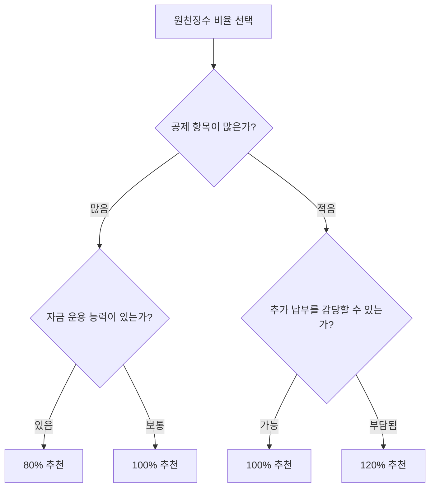

# 원천징수 비율 선택 가이드 블로그 글 PRD

## 메타 정보

- **카테고리**: `etc`
- **슬러그**: `contents/etc/withholding-tax-rate-selection-guide/index.md`
- **제목(안)**: "원천징수 비율 80%, 100%, 120% — 어떤 걸 선택해야 할까?"
- **대상 독자**: 연말정산을 하는 직장인 (특히 원천징수 비율 변경을 고려하는 사람)
- **톤**: 스터디 정리 (기존 연말정산 글과 동일)
- **관련 글**: [연말정산 잘 준비하기 — 직장인 절세 실전 가이드](/etc/year-end-tax-settlement-preparation-guide/)
- **참고 자료**:
  - https://www.nts.go.kr/nts/cm/cntnts/cntntsView.do?mi=2304&cntntsId=238938
  - https://www.hometax.go.kr (간이세액표)

---

## 블로그 목차 구성

### 1. 개요

- 직장인은 매달 급여에서 소득세를 원천징수당하는데, 이 비율을 **80%, 100%, 120%** 중 선택할 수 있다
- 대부분 100%(기본)으로 설정되어 있지만, 변경하면 매달 실수령액과 연말정산 결과가 달라진다
- 이 글은 각 비율의 장단점과 어떤 상황에서 어떤 비율이 유리한지 정리한다
- 연말정산 기본 개념은 [연말정산 절세 가이드](/etc/year-end-tax-settlement-preparation-guide/)를 참고

**이 글을 읽으면 알 수 있는 것:**
- 원천징수 비율 80%, 100%, 120%의 의미와 차이
- 각 비율 선택 시 월 실수령액과 연말정산 결과에 미치는 영향
- 본인 상황에 맞는 최적의 비율 선택 기준
- 원천징수 비율 변경 방법

---

### 2. 원천징수란?

#### 2.1 원천징수의 개념

- 회사가 급여 지급 시 소득세를 미리 떼서 국세청에 납부하는 제도
- 직장인은 매달 **간이세액표** 기준으로 소득세가 원천징수된다
- 간이세액표는 국세청이 정한 "대략적인" 세금 기준이다 (실제 세금과 차이 발생)

#### 2.2 간이세액표와 원천징수 비율

- 간이세액표의 기본 금액(100%)을 기준으로 비율을 선택할 수 있다
- **80%**: 간이세액의 80%만 원천징수 (매달 세금을 적게 뗌)
- **100%**: 간이세액 그대로 원천징수 (기본값)
- **120%**: 간이세액의 120%를 원천징수 (매달 세금을 많이 뗌)

> 간이세액표 기준 월급 400만 원(부양가족 1인)의 경우:
> - 100% 기준 원천징수 소득세: 약 X만 원
> - 80%: 약 X × 0.8 = Y만 원
> - 120%: 약 X × 1.2 = Z만 원
> (실제 간이세액표 조회하여 구체적 금액 기입 필요)

---

### 3. 비율별 장단점 비교 (핵심)

#### 3.1 80% 선택 시

**장점:**
- 매달 실수령액이 늘어남 → 현금 흐름이 좋아진다
- 여유 자금을 투자(연금저축, IRP, 예적금 등)에 활용 가능
- 기회비용 확보 — 세금으로 묶여 있을 돈을 미리 운용할 수 있다

**단점:**
- 연말정산 때 **추가 납부(토해내기)** 가능성이 높아진다
- 추가 납부 시 한꺼번에 큰 금액을 내야 하는 심리적 부담
- 공제 항목이 적은 사람(무주택, 미혼, 부양가족 없음)에게는 추가 납부가 거의 확정적

**적합한 사람:**
- 자금 운용 능력이 있고, 여유 자금을 투자나 저축에 활용할 수 있는 사람
- 공제 항목이 충분한 사람 (부양가족, 월세, 연금저축 등)
- 현금 흐름을 중시하는 사람

#### 3.2 100% 선택 시

**장점:**
- 기본값이므로 별도 설정이 필요 없다
- 대부분의 경우 환급/추가 납부 금액이 크지 않아 무난하다
- 공제 항목이 적당히 있으면 소액 환급 가능

**단점:**
- 공제가 많은 사람은 불필요하게 많은 세금을 미리 내는 셈
- 공제가 적은 사람은 여전히 추가 납부 가능

**적합한 사람:**
- 세금 관리에 크게 신경 쓰고 싶지 않은 일반 직장인
- 평균적인 공제 항목을 가진 사람

#### 3.3 120% 선택 시

**장점:**
- 연말정산 때 **환급**(13월의 월급)을 많이 받을 가능성이 높다
- 강제 저축 효과 — 매달 세금을 더 내서 연말에 목돈으로 돌려받는다
- 추가 납부 걱정이 거의 없다

**단점:**
- 매달 실수령액이 줄어든다
- 기회비용 상실 — 미리 낸 세금에 대한 이자/수익을 포기하는 셈
- 국가에 무이자 대출을 해주는 것과 같다 (환급금에 이자 없음)

**적합한 사람:**
- 목돈 관리가 어려워 강제 저축이 필요한 사람
- 연말 환급의 심리적 만족감을 중시하는 사람
- 추가 납부를 절대 원하지 않는 사람

#### 3.4 비교 요약표

| 구분 | 80% | 100% | 120% |
|------|-----|------|------|
| 월 실수령액 | 많음 | 보통 | 적음 |
| 연말정산 결과 | 추가 납부 가능성 높음 | 중립 | 환급 가능성 높음 |
| 기회비용 | 확보 (투자 가능) | 보통 | 상실 (무이자 대출) |
| 심리적 요인 | 연말 토해내기 스트레스 | 무난 | 13월의 월급 기쁨 |
| 적합한 사람 | 자금 운용 능력 있는 사람 | 일반 직장인 | 강제 저축 원하는 사람 |

---

### 4. 시뮬레이션: 비율별 연간 현금 흐름

> 총급여 5,000만 원 기준, 간이세액표 적용 시뮬레이션
> - 80%, 100%, 120% 각각의 월별 원천징수 금액
> - 연간 기납부세액 합계
> - 결정세액(공제 적용 후)과의 차이 → 환급/추가 납부 금액
> - **핵심**: 연간 총 세금은 동일, 납부 시점만 다름

#### 4.1 공제 항목이 적은 경우 (미혼, 무주택, 카드 소비 적음)

- 80%: 추가 납부 약 X만 원
- 100%: 추가 납부 약 Y만 원 또는 소액 환급
- 120%: 환급 약 Z만 원

#### 4.2 공제 항목이 많은 경우 (부양가족, 연금저축 900만 원, 월세)

- 80%: 소액 환급 또는 소액 추가 납부
- 100%: 환급 약 X만 원
- 120%: 환급 약 Y만 원

> (간이세액표 실제 데이터 기반으로 구체적 금액 기입 필요)

---

### 5. 원천징수 비율 변경 방법

#### 5.1 변경 절차

- 회사 인사/급여 담당자에게 **원천징수세액 조정신청서** 제출
- 또는 홈택스에서 간이세액표 조회 후 원하는 비율을 회사에 요청
- 변경은 **연중 언제든** 가능하다
- 변경한 달의 다음 급여부터 적용된다

#### 5.2 변경 시 고려사항

- 연초에 변경하면 1년 내내 효과를 볼 수 있다
- 연말에 변경하면 효과가 크지 않다 (이미 대부분 원천징수 완료)
- 매년 연초에 작년 연말정산 결과를 보고 비율을 조정하는 것을 추천
- 변경해도 연간 **총 세금은 동일**하다 — 납부 시점만 달라진다

---

### 6. 나에게 맞는 비율은?

#### 6.1 선택 기준 플로우차트

#### 6.2 실전 팁

- **10월 홈택스 연말정산 미리보기**를 활용하면 올해 예상 결정세액을 미리 볼 수 있다
- 미리보기 결과를 보고 남은 2~3개월의 전략을 조정할 수 있다
- 80%를 선택한 경우, 여유 자금으로 연금저축/IRP에 추가 납입하면 세액공제까지 챙길 수 있다
- "추가 납부 = 손해"가 아니다 — 그 돈을 1년간 내가 먼저 쓴 것이므로, 기회비용을 고려하면 오히려 이득일 수 있다

---

### 7. 정리

- 원천징수 비율은 **세금 납부 시점**만 바꾸는 것이지, 연간 총 세금은 동일하다
- 80%: 매달 실수령액 ↑, 연말 추가 납부 가능성 ↑ — 자금 운용 능력 있는 사람에게 유리
- 100%: 무난한 기본값 — 대부분의 직장인에게 적합
- 120%: 매달 실수령액 ↓, 연말 환급 ↑ — 강제 저축 효과를 원하는 사람에게 유리
- 핵심은 **본인의 공제 항목**과 **자금 관리 성향**에 맞는 비율을 선택하는 것이다

---

### 8. 참고

- 참고 자료 목록 (작성 시 추가)

---

## 논의 사항

### 확정된 사항
- [x] 카테고리: `etc`
- [x] 톤: 스터디 정리 노트 형식
- [x] 관련 글: 연말정산 절세 가이드와 연결

### 논의 필요 사항
- [ ] **제목 확정**: 현재 안 "원천징수 비율 80%, 100%, 120% — 어떤 걸 선택해야 할까?" — 다른 안이 있는지?
- [ ] **시뮬레이션 상세도**: 간이세액표 실제 데이터를 기반으로 구체적 금액을 넣을지, 개념 설명 위주로 갈지?
- [ ] **연말정산 글과의 관계**: 독립 포스팅 vs 연말정산 글에 섹션 추가?
- [ ] **시리즈 설정**: 연말정산 관련 시리즈로 묶을지?
- [ ] **간이세액표 데이터**: 2025년 기준 간이세액표를 조회하여 구체적 금액 예시를 넣을지?

### 연말정산 글과의 관계
- 연말정산 글 2.3절에서 "원천징수 비율을 높게/낮게 설정한 경우" 간략 언급 → 이 글로 상세 연결
- 이 글의 "공제 항목" 부분은 연말정산 글의 소득공제/세액공제 설명과 직접 연결
