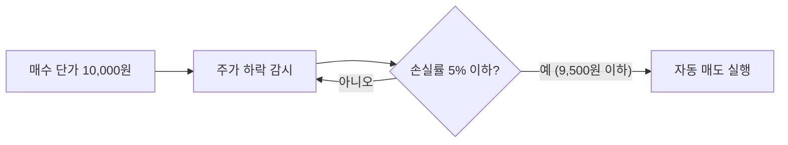
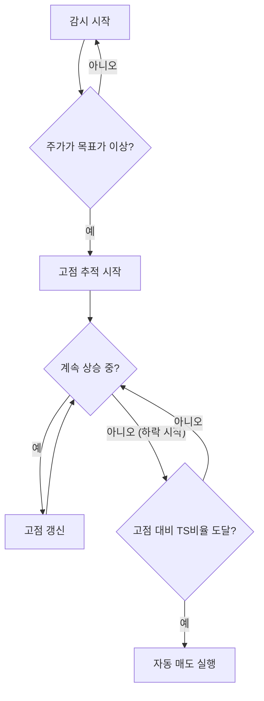

# 1. 개요

주식 투자를 하다 보면 "이 가격까지 떨어지면 손절해야지"라고 마음먹어도, 막상 장 시간에 시세를 확인하지 못해 타이밍을 놓치는 경우가 많다. 직장인이라면 더더욱 장 중에 실시간으로 주가를 모니터링하기 어렵다.

이런 상황에서 활용할 수 있는 기능이 바로 `서버자동주문`이다. 미래에셋증권의 `서버자동주문`은 사용자가 미리 지정한 조건(가격, 수량 등)에 도달하면 증권사 서버가 자동으로 매도 주문을 실행해주는 기능이다. HTS나 MTS를 켜놓지 않아도, PC나 휴대폰이 꺼져 있어도 서버에서 실시간으로 감시하고 조건이 충족되면 자동으로 주문을 넣어준다는 것이 가장 큰 장점이다.

이 글에서는 `서버자동주문`의 핵심 개념과 함께 MTS(모바일)와 HTS(PC)에서 실제로 설정하는 방법을 단계별로 정리한다. 특히 `Stoploss`(손절매)와 `Trailing Stop`(트레일링 스탑)을 중심으로 살펴본다.

## 서버자동주문의 주요 특징

`서버자동주문`은 일반적인 예약주문과는 다른 기능이다. 주요 특징을 정리하면 다음과 같다.

| 구분 | 서버자동주문 | 일반 예약주문 |
|------|-------------|--------------|
| 감시 주체 | 증권사 서버 | 사용자 단말기 (HTS/MTS) |
| PC/스마트폰 종료 시 | 정상 동작 | 주문 무효 |
| 감시 유효기간 | 국내 최대 90일, 해외 약 30일 | 당일 또는 지정일까지 |
| 조건 설정 | Stoploss, 목표가, Trailing Stop 등 | 단순 지정가 |

핵심은 **증권사 서버에서 실시간으로 조건을 감시**한다는 점이다. 한 번 설정해두면 PC를 끄든, 스마트폰을 꺼두든 조건에 도달하면 자동으로 주문이 실행된다. 또한 최대 90일까지 조건이 유지되기 때문에 단기뿐 아니라 중기적인 투자 전략에도 충분히 활용할 수 있다.

# 2. 핵심 개념 이해하기

`서버자동주문`을 설정하기 전에, 먼저 핵심 개념인 `Stoploss`와 `Trailing Stop`에 대해서 알아보자.

## 2.1 Stoploss(손절매)란?

`Stoploss`는 말 그대로 손실(Loss)을 멈추는(Stop) 전략이다. 주가가 미리 설정한 손실률 이하로 떨어지면 자동으로 매도 주문을 실행하여 추가 하락에 대한 손실을 방지하는 기법이다.

예를 들어, 평균 매수 단가가 10,000원인 종목에 손실률 5%로 `Stoploss`를 설정해두면, 주가가 9,500원 이하로 떨어지는 순간 자동으로 매도 주문이 들어간다. 주가가 더 하락하여 8,000원, 7,000원까지 떨어지더라도 이미 9,500원 부근에서 매도가 실행되었으므로 큰 손실을 피할 수 있다.

`Stoploss`의 핵심은 투자자의 감정을 배제하고 기계적으로 손절매를 실행한다는 점이다. "조금만 더 기다리면 반등하겠지"라는 기대감에 손절 타이밍을 놓치는 상황을 방지해준다.

## 2.2 Trailing Stop(트레일링 스탑)이란?

`Trailing Stop`은 `Stoploss`를 한 단계 발전시킨 전략이다. 단순히 손실을 방지하는 것에서 나아가, **이익을 극대화**하는 데 초점을 맞추고 있다.

동작 원리는 다음과 같다.

1. 목표가 이상으로 주가가 상승하면 감시를 시작한다
2. 주가가 계속 상승하면 고점을 자동으로 추적한다
3. 고점 대비 일정 비율만큼 하락하면 그 시점에 자동 매도한다

위 그래프를 예시로 설명하면 다음과 같다. 평균단가 100,000원, 목표가 200,000원, `Trailing Stop` 이익보존 비율 70%로 설정한 경우이다.

1. 먼저 목표가 200,000원을 터치하는지 감시한다
2. 목표가 이상으로 가격이 상승하면, 이후 가격이 하락할 때 `Trailing Stop` 비율 70%를 계산한다
3. 최종 계산된 금액으로 가격이 하락하여 터치하면 주문을 전송한다

각 지점별로 살펴보면 다음과 같다.

- **A 지점 (199,000원)**: 아직 목표가(200,000원)에 도달하지 않았으므로 감시만 계속한다
- **B 지점 (200,000원)**: 목표가에 도달했으므로 `Trailing Stop` 감시가 활성화된다
- **C 지점 (300,000원)**: 고점을 갱신하며 계속 추적한다. 최고이익은 200,000원(= 300,000원 - 평균단가 100,000원)이다
- **D 지점 (240,000원)**: 고점(300,000원) 대비 하락했다. 최고이익 200,000원의 70%인 140,000원을 보존하는 가격(= 100,000원 + 140,000원 = 240,000원)에서 매도가 실행된다

**Stoploss와 Trailing Stop의 차이를 정리하면 다음과 같다.**

| 구분 | Stoploss | Trailing Stop |
|------|----------|---------------|
| 목적 | 손실 방지 (손절매) | 이익 극대화 (익절) |
| 기준 | 매수 단가 기준 손실률 | 목표가 도달 후 고점 기준 하락률 |
| 매도 시점 | 손실률 도달 시 즉시 | 고점 대비 일정 비율 하락 시 |
| 활용 상황 | 하락 방어 | 상승 추세에서 이익 확보 |

## 2.3 서버자동주문 vs HTS 스탑로스

혼동하기 쉬운 부분이 있는데, `서버자동주문`의 Stoploss와 HTS 자체의 스탑로스 기능은 다른 것이다.

| 구분 | 서버자동주문 | HTS 스탑로스 |
|------|-------------|-------------|
| 동작 조건 | 증권사 서버에서 감시 (PC 꺼도 동작) | HTS가 실행 중일 때만 동작 |
| PC 종료 시 | 정상 감시 유지 | 감시 중단 |
| PC 재시작 시 | 변동 없음 | HTS 활성화 시 조건에 해당하면 바로 실행됨 |

HTS 스탑로스의 경우, 컴퓨터를 껐다가 켜면 HTS가 활성화되는 순간 조건에 해당하는 종목이 있으면 바로 매도가 실행될 수 있으므로 주의가 필요하다. 장기적으로 조건을 걸어두고 관리하려면 `서버자동주문`을 사용하는 것이 안전하다.

# 3. MTS에서 서버자동주문 설정하기

MTS(모바일)에서 `서버자동주문`을 설정하는 방법을 알아보자. MTS에서는 간편하게 `자동매도 감시조건`을 설정할 수 있다.

## 3.1 자동매도 설정 방법

**1단계: 자동매도 화면 진입**

미래에셋증권 앱을 실행하고 `MY자산`에서 보유하고 있는 주식 종목을 선택한다. 종목을 클릭하면 하단에 여러 버튼이 나타나는데, 여기서 `자동` 버튼을 클릭하면 자동매도 감시조건 간단설정 화면으로 이동한다.

**2단계: 감시조건 설정**

`자동매도 감시조건 간단설정` 화면에서 다음 항목을 설정한다.

- **감시조건**: 손실률 기준을 설정한다. 예를 들어 손실률 3%로 설정하면 매수 단가 대비 3% 이하로 떨어질 때 자동 매도가 실행된다
- **주문조건**: 주문 수량과 주문단가(시장가/지정가)를 설정한다
- **감시유효기간**: 최대 90일까지 설정 가능하다. 기간이 만료되면 자동주문 조건도 함께 해제된다

설정을 마치면 화면 하단의 조건 확인 팝업에서 설정 내용을 한 번 더 확인할 수 있다.

**3단계: 저장 및 실행**

모든 조건을 확인한 후 `저장 후 실행` 버튼을 클릭하고, 확인 팝업에서 `네, 이동합니다`를 누르면 자동매도 설정이 완료된다.

> 예약주문과 달리 `서버자동주문`은 서버에서 항상 실시간 감시되므로, 스마트폰을 종료해도 주문이 유효하다.

## 3.2 자동주문 현황 확인 및 관리

등록된 자동주문은 앱 내 `국내주식자동주문` 화면에서 언제든 확인하고 관리할 수 있다. 현재 감시 중인 조건의 상세 내용을 확인하거나, 필요에 따라 수정 또는 삭제가 가능하다.

자동주문 현황에서는 다음 정보를 확인할 수 있다.

- 감시 중인 종목과 설정 조건
- 감시 유효기간 (만료일)
- 감시 상태 (감시 중/실행 완료/만료)

# 4. HTS에서 서버자동주문 설정하기

HTS(카이로스)에서는 MTS보다 더 상세한 조건을 설정할 수 있다. 특히 `Trailing Stop`이나 복수 조건 동시 설정 등 고급 기능을 활용하려면 HTS를 사용하는 것이 좋다.

## 4.1 서버자동주문 화면 접근

HTS에서 서버자동주문 화면에 접근하는 방법은 두 가지이다.

- **메뉴 탐색**: `주식특화주문` > `서버자동주문` 메뉴를 선택한다
- **화면번호 입력**: 화면번호 `[8570]`을 직접 입력한다

HTS 서버자동주문 화면은 크게 다음과 같은 영역으로 구성되어 있다.

- **좌측**: 종목 차트 및 현재가 정보
- **중앙 상단**: 주문조건 설정 영역 (감시조건, 주문수량, 주문단가)
- **중앙 하단**: 감시조건 상세 설정 (Stoploss, 이익률, Trailing Stop, 목표가격)
- **우측**: 등록된 자동주문 목록 및 감시 현황

## 4.2 자동매도 조건 설정

HTS에서는 다양한 감시조건을 조합하여 설정할 수 있다. 주요 설정 항목은 다음과 같다.

**기본 설정**

- **주문구분**: 일반/신용/대출 중 선택
- **매도가능수량**: 전체 또는 일부 수량 지정
- **주문거래소/주문단가**: KRX, 시장가 등 선택
- **감시조건 설정 기준**: 평균단가(고정) 기준으로 설정

**Stoploss(손실률) 조건**

`이하조건`의 `손실률`에 체크하고 원하는 손실률을 입력한다. 예를 들어 손실률을 `7.00%`로 설정하면, 평균단가 대비 7% 이상 하락할 때 자동 매도가 실행된다.

**이익률 조건**

`이상조건`의 `이익률`에 체크하고 원하는 이익률을 입력한다. 목표 이익률에 도달하면 자동으로 매도하여 이익을 확정할 수 있다.

> `Stoploss`(손실률)와 이익률 조건을 동시에 설정하면, 하락 시에는 손절매가 실행되고 상승 시에는 익절이 실행되는 양방향 자동매매가 가능하다.

## 4.3 Trailing Stop 설정

HTS에서 `Trailing Stop`을 설정하려면 감시조건 영역에서 `TS_목표가격`에 체크하고 다음 항목을 입력한다.

- **목표가격 현재가**: `Trailing Stop` 감시가 시작되는 기준 가격. 이 가격 이상으로 주가가 올라가야 추적이 시작된다
- **비율(%) 이익보존**: 고점 대비 이익보존 비율. 예를 들어 70%로 설정하면, 최고 이익의 70%를 보존하는 시점에 매도가 실행된다

**Trailing Stop 동작 흐름**

`Trailing Stop`은 `Stoploss`와 달리 상승 추세에서 이익을 극대화하는 데 적합하다. 주가가 계속 상승하는 한 매도하지 않고, 상승세가 꺾여 일정 비율 하락할 때 비로소 매도하기 때문에 불필요한 조기 익절을 방지할 수 있다.

## 4.4 감시 관리

감시 설정을 완료하면 `조건저장` 또는 `저장즉시실행` 버튼을 클릭하여 감시를 시작한다.

감시 관리 시 알아두어야 할 사항은 다음과 같다.

- **감시 유효기간**: 최대 90일까지 설정 가능하다 (감시조건 중복체크 시 먼저 충족한 조건으로 실행)
- **감시 중단/수정**: 감시 중인 조건은 언제든 중단하거나 수정할 수 있다
- **실행 완료된 조건**: 이미 주문이 실행된 조건은 해제가 불가하다
- **신규잔고편입**: 이 옵션을 활성화하면 신규로 매수하는 종목에 대해 동일한 감시 조건이 일괄적으로 적용된다

# 5. 해외주식 서버자동주문

해외주식도 국내주식과 동일하게 `서버자동주문`을 설정할 수 있다. MTS와 HTS 모두에서 지원하며, 설정 방법도 국내주식과 거의 같다.

## 5.1 국내주식과의 공통점과 차이점

| 구분 | 국내주식 | 해외주식 |
|------|---------|---------|
| 설정 방법 | MTS/HTS에서 설정 | MTS/HTS에서 동일하게 설정 |
| 감시 유효기간 | 최대 90일 | 약 30일 |
| Stoploss | 지원 | 지원 |
| Trailing Stop | 지원 | 지원 |
| 주문 통화 | 원화 | 원화/외화 모두 가능 |

해외주식도 손절/익절/트레일링스탑 등 국내주식과 동일한 조건을 사용할 수 있지만, 감시 유효기간이 약 30일로 국내(90일)보다 짧다는 점에 유의해야 한다.

## 5.2 MTS/HTS에서 해외주식 자동주문 설정

해외주식 `서버자동주문`은 국내주식과 별도의 화면에서 설정한다.

- **MTS**: `MY자산` > `해외주식` 탭에서 보유 종목을 선택하고 `자동` 버튼을 클릭한다
- **HTS**: `해외주식 서버자동주문` 메뉴를 통해 접근한다

설정 항목과 절차는 국내주식과 동일하다. 계좌, 종목, 수량, 감시조건(Stoploss, 이익률, Trailing Stop)을 설정하고 감시를 시작하면 된다.

## 5.3 해외주식 자동주문 시 유의사항

해외주식 `서버자동주문`을 사용할 때 추가로 고려해야 할 사항이 있다.

- **거래소별 거래 시간**: 미국(뉴욕거래소, 나스닥), 홍콩, 일본 등 거래소마다 거래 시간이 다르다. 서버자동주문은 해당 거래소의 정규 거래 시간 내에서만 주문이 실행된다
- **환율 변동**: 외화로 거래하는 경우 환율 변동에 따라 실제 원화 기준 손익이 달라질 수 있다. 손실률이나 이익률을 설정할 때 환율 변동분도 함께 고려하는 것이 좋다
- **감시 기간 갱신**: 해외주식의 감시 유효기간은 약 30일이므로, 장기 투자 시에는 만료 전에 다시 설정해야 한다

# 6. 서버자동주문 활용 팁과 주의사항

`서버자동주문`을 효과적으로 활용하기 위한 팁과 주의사항을 정리한다.

**손실률과 이익률 동시 설정**

`Stoploss`(손실률)와 이익률 조건을 함께 설정하면 하락 시 손절, 상승 시 익절이 자동으로 실행된다. 양방향으로 조건을 걸어두면 장 중에 신경 쓰지 않아도 되므로 직장인 투자자에게 특히 유용하다.

**신규잔고편입 활용**

HTS에서 `신규잔고편입` 옵션을 활성화하면, 이후 신규로 매수하는 종목에 대해 동일한 감시 조건이 자동으로 적용된다. 매번 종목마다 개별 설정할 필요 없이 일괄적으로 Stoploss 조건을 걸 수 있어 편리하다.

**감시 유효기간 관리**

국내주식은 최대 90일, 해외주식은 약 30일까지 감시가 유지된다. 장기 보유 종목의 경우 감시 기간이 만료되기 전에 다시 설정하는 것을 잊지 않도록 한다. 앱의 자동주문 현황에서 만료일을 주기적으로 확인하는 습관을 들이는 것이 좋다.

**시장가 주문 vs 지정가 주문**

자동매도 시 주문단가를 `시장가`로 설정하면 조건 충족 즉시 체결될 가능성이 높지만, 급격한 변동 시 예상보다 낮은 가격에 체결될 수 있다. `지정가`로 설정하면 원하는 가격 이상에서만 체결되지만, 체결되지 않을 위험이 있다. 본인의 투자 성향에 맞게 선택하면 된다.

# 7. 마무리

미래에셋증권 `서버자동주문`은 "조건만 설정하면 실시간 감시는 서버에서, 주문 실행도 자동"이라는 점이 핵심이다. 단순 예약주문보다 훨씬 강력하며, 특히 `Stoploss`를 통한 자동 손절매는 투자자의 심리적 부담을 크게 줄여준다.

정리하면 다음과 같다.

- **간편하게 시작하려면**: MTS에서 `자동매도 감시조건 간단설정`으로 `Stoploss`를 설정한다
- **고급 전략을 활용하려면**: HTS에서 `Stoploss` + `Trailing Stop` + 이익률 조건을 조합하여 설정한다
- **해외주식도 동일하게**: 국내주식과 거의 같은 방법으로 설정 가능하다 (감시 기간 약 30일)

변동성이 심한 장에서 감정에 흔들리지 않고 기계적으로 대응하고 싶다면, `서버자동주문`을 적극 활용해보길 추천한다.

# 8. 참고

- [[8570] 서버자동주문](https://securities.miraeasset.com/oms/omsclient.do?n=K001#)
- [국내주식 자동주문시스템 이용에 관한 유의사항](https://securities.miraeasset.com/hki/hki3072/n09.do)
- [해외주식 자동주문시스템 이용에 관한 유의사항](https://securities.miraeasset.com/hki/hki3072/n10.do)
- [서버자동주문 A~Z 까지 알려드립니다](https://1.dreamct0202.com/entry/%EB%AF%B8%EB%9E%98%EC%97%90%EC%85%8B%EC%A6%9D%EA%B6%8C%EC%84%9C%EB%B2%84%EC%9E%90%EB%8F%99%EC%A3%BC%EB%AC%B8-AZ%EA%B9%8C%EC%A7%80-%EC%95%8C%EB%A0%A4%EB%93%9C%EB%A6%BD%EB%8B%88%EB%8B%A4)
- [스탑로스. 손절매 칼같이 하기](https://blog.naver.com/how2invest/221491239795)
- [사고 싶을 때 사고, 팔고 싶을 때 팔기. 자동주문](https://blog.naver.com/how2invest/221493892312)
