# 1. 개요

2020년 코로나 팬데믹은 현대 투자 역사에서 **가장 빠른 폭락과 가장 빠른 회복**이 동시에 일어난 사건이다. S&P 500이 사상 최고치에서 단 23거래일 만에 약세장(-20%)에 진입했고, 불과 5개월 뒤에 다시 사상 최고치를 경신했다.

이 글에서는 다음을 다룬다:

- 코로나 발생부터 팬데믹 선언까지의 타임라인
- 미국·한국 시장이 얼마나 빠르게 무너졌는가 (데이터 중심)
- 금리, 금, 원유 등 주요 자산의 움직임
- **"돈을 푼다"**는 것의 실제 의미 — 왜 금리 인하만으로 부족했는가
- 역대급 반등과 투자자가 배울 수 있는 교훈

> 양적완화(QE)의 작동 원리 자체는 [양적완화(QE)와 양적긴축(QT) 완벽 정리](/etc/quantitative-easing-and-tightening/) 글에서 상세히 다루고 있다. 이 글은 QE가 **왜** 필요했고, 그 결과 시장이 **어떻게** 움직였는지에 집중한다.

# 2. 코로나 발생과 시장 충격 (2020.01~03)

## 2.1 타임라인: 우한에서 팬데믹까지

| 날짜 | 사건 |
|------|------|
| 2019.12.31 | 중국 우한시, WHO에 원인 불명 폐렴 사례 보고 |
| 2020.01.11 | 중국, 첫 사망자 발표 |
| 2020.01.20 | 한국 첫 확진자 발생 (우한 입국 중국 여성) |
| 2020.01.23 | 우한시 전면 봉쇄 (인구 1,100만) |
| 2020.01.30 | WHO, "국제 공중보건 비상사태(PHEIC)" 선포 |
| 2020.02.19 | S&P 500 사상 최고치 **3,386** 기록 — 시장은 아직 낙관적 |
| 2020.02.24 | 이탈리아 북부 대규모 감염 확인 → 유럽 확산 본격화 |
| 2020.03.03 | 연준, **긴급 금리 인하** 0.5%p (정규 회의 아닌 임시 인하) |
| 2020.03.09 | S&P 500 **-7.6%** — 1997년 이후 최악의 하루, 서킷브레이커 발동 |
| 2020.03.11 | WHO, **팬데믹(세계적 대유행)** 공식 선언 |
| 2020.03.13 | 트럼프 대통령, 국가비상사태 선포 |
| 2020.03.15 | 연준, **긴급 금리 인하** 1.0%p → 기준금리 0~0.25% (제로금리) |
| 2020.03.16 | 다우존스 **-12.9%** — 1987년 블랙먼데이 이후 최대 낙폭 |
| 2020.03.23 | S&P 500 저점 **2,237** — 고점 대비 **-33.9%** |

2월 19일 사상 최고치를 기록한 S&P 500이 3월 23일 저점까지 떨어지는 데 걸린 시간은 불과 **23거래일**이었다. 이는 역사상 가장 빠른 속도의 약세장 진입이었다.

## 2.2 시장이 왜 이렇게 빠르게 무너졌는가

코로나 팬데믹은 기존 경제 위기와 근본적으로 달랐다:

- **공급과 수요가 동시에 멈춤**: 공장 폐쇄(공급 차단) + 외출 금지(수요 소멸)가 동시에 발생
- **글로벌 동시다발적 충격**: 한 나라가 아니라 전 세계가 동시에 봉쇄
- **끝이 보이지 않는 불확실성**: 바이러스의 치사율, 백신 개발 시기, 봉쇄 기간 등 모든 것이 미지수
- **알고리즘 트레이딩**: 변동성 급등 시 자동 매도 프로그램이 하락을 가속화

# 3. 미국 시장

## 3.1 S&P 500: 34일 만에 -34%

S&P 500 지수의 2020년 1분기 움직임:

| 날짜 | 종가 | 고점 대비 변동 | 비고 |
|------|------|---------------|------|
| 2020.02.19 | 3,386 | — | **사상 최고치** |
| 2020.02.28 | 2,954 | -12.8% | 일주일간 급락 |
| 2020.03.09 | 2,746 | -18.9% | 서킷브레이커 ① |
| 2020.03.12 | 2,480 | -26.7% | 서킷브레이커 ② |
| 2020.03.16 | 2,386 | -29.5% | 서킷브레이커 ③ |
| 2020.03.18 | 2,398 | -29.2% | 서킷브레이커 ④ |
| 2020.03.23 | 2,237 | **-33.9%** | **저점** |

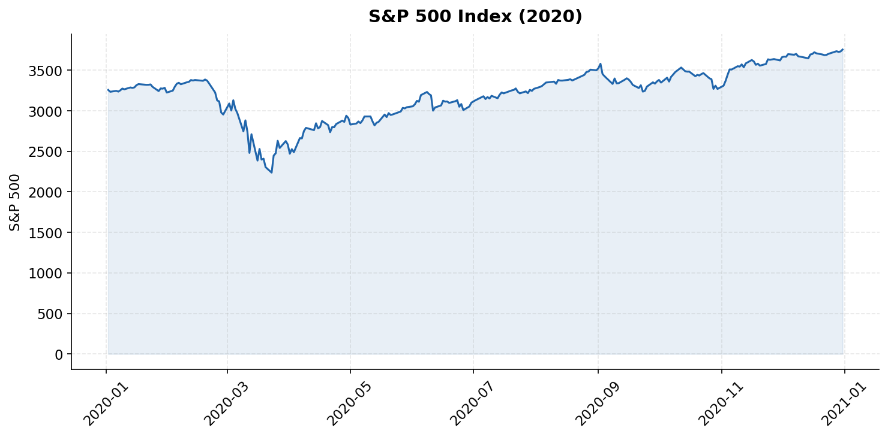

## 3.2 서킷브레이커 4회 발동

2020년 3월에만 **서킷브레이커가 4차례** 발동되었다. 서킷브레이커는 S&P 500이 전일 종가 대비 **7% 이상** 하락하면 15분간 거래를 중단하는 장치다.

| 발동일 | S&P 500 일간 변동 | 발동 시점 |
|--------|-------------------|-----------|
| 2020.03.09 | -7.6% | 장 개시 직후 |
| 2020.03.12 | -9.5% | 장 개시 직후 |
| 2020.03.16 | -12.0% | 장 개시 직후 |
| 2020.03.18 | -5.2% (장중 -7%) | 장중 |

1997년 서킷브레이커 제도 도입 이후 2020년 이전까지 발동된 적이 **단 1회**(1997년)뿐이었다. 그런데 2020년 3월 한 달 사이에 4번이나 발동된 것이다.

## 3.3 VIX(공포지수) — 2008년 금융위기 수준 돌파

VIX(Volatility Index)는 S&P 500 옵션의 내재 변동성을 측정하는 지수로, **"공포지수"**라고도 불린다.

| 시기 | VIX 최고치 |
|------|-----------|
| 평상시 | 12~20 |
| 2008년 금융위기 | **80.86** (2008.11.20) |
| **2020년 코로나** | **82.69** (2020.03.16) |

2020년 3월 16일 VIX가 **82.69**를 기록하며 2008년 금융위기 때의 기록을 넘어섰다. 이는 시장 참여자들이 코로나 사태를 **2008년 금융위기 이상의 공포**로 받아들였다는 의미다.

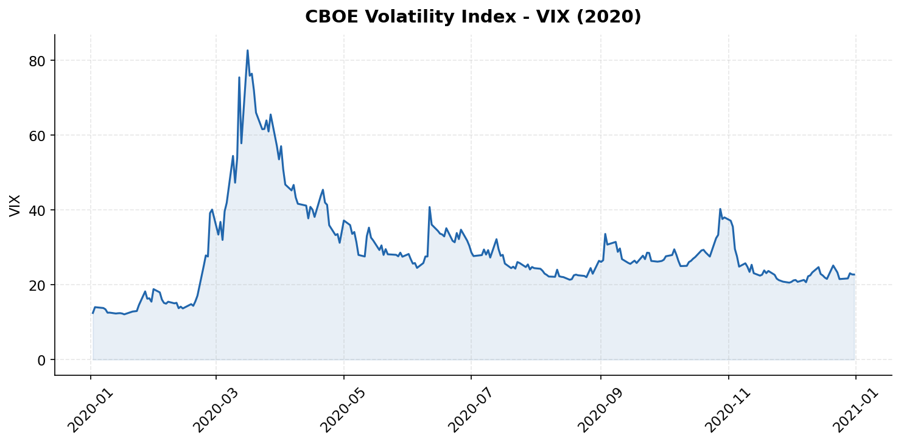

# 4. 한국 시장

## 4.1 KOSPI: 2,267 → 1,439 (-36.5%)

| 날짜 | KOSPI | 고점 대비 변동 | 비고 |
|------|-------|---------------|------|
| 2020.01.20 | 2,267 | — | 연초 고점 부근 |
| 2020.02.28 | 1,987 | -12.4% | 대구·경북 집단감염 확산 |
| 2020.03.13 | 1,771 | -21.9% | 사이드카·서킷브레이커 발동 |
| 2020.03.19 | 1,457 | -35.7% | **저점 부근** |
| 2020.03.23 | 1,482 | -34.6% | 미국 저점과 비슷한 시기 |

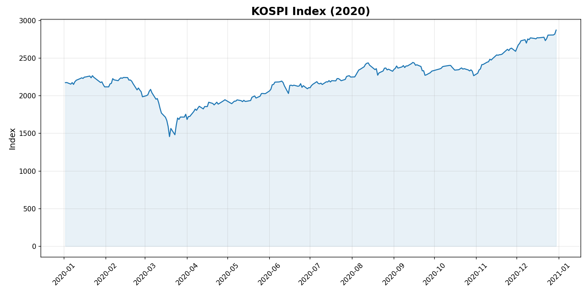

## 4.2 사이드카·서킷브레이커 발동

한국 시장도 안전장치가 연이어 발동되었다.

- **사이드카**: 선물 가격이 5% 이상 변동 시 프로그램 매매를 5분간 중단
- **서킷브레이커**: KOSPI가 전일 대비 8% 이상 하락하면 20분간 전 종목 거래 정지

| 날짜 | 장치 | 비고 |
|------|------|------|
| 2020.03.13 | 사이드카 + 서킷브레이커 | KOSPI -8% 하락 |
| 2020.03.19 | 사이드카 | 선물 급락 |

2020년 서킷브레이커는 **2011년 이후 9년 만에** 발동된 것이었다.

## 4.3 외국인 순매도 폭탄

2020년 3월 한 달간 외국인 투자자는 KOSPI에서 약 **13.3조 원**을 순매도했다. 이는 역대 최대 규모의 월간 순매도 기록이었다.

| 월 | 외국인 순매도 (KOSPI) |
|----|----------------------|
| 2020.01 | -2.0조 원 |
| 2020.02 | -3.8조 원 |
| **2020.03** | **-13.3조 원** |
| 2020.04 | -3.5조 원 |

외국인이 대거 빠져나가면서 원화 매도 압력도 함께 커졌고, 이것이 환율 급등의 원인이 되었다.

## 4.4 원/달러 환율 급등

| 날짜 | 원/달러 환율 | 비고 |
|------|-------------|------|
| 2020.01 | 약 1,155원 | 연초 |
| 2020.03.19 | **1,285원** | **연중 최고** |
| 2020.12 | 약 1,088원 | 연말 안정 |

원/달러 환율은 1,100원대에서 한 달 사이에 **1,285원**까지 급등했다. 글로벌 달러 유동성 경색(Dollar Squeeze)이 핵심 원인이었다.

- **달러 수요 폭증**: 위기 시 전 세계적으로 안전자산인 달러 확보 경쟁
- **외국인 자금 이탈**: 한국 주식 매도 → 달러로 환전 → 달러 수요 급증
- **무역 결제 불안**: 글로벌 교역 위축 속 달러 결제 자금 확보 압박

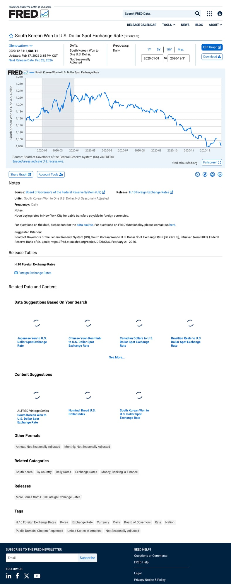

# 5. 금리 상황

## 5.1 미국 연준: 2주 만에 제로금리

연준은 코로나 사태에 대응하여 **역대급 속도**로 기준금리를 인하했다.

| 날짜 | 조치 | 기준금리 | 비고 |
|------|------|---------|------|
| 2020.03.03 | 긴급 인하 -0.50%p | 1.00~1.25% | FOMC 정규 회의가 아닌 **임시 긴급 인하** |
| 2020.03.15 | 긴급 인하 -1.00%p | 0.00~0.25% | 일요일 저녁 긴급 발표, **제로금리** |

2주 사이에 총 **1.50%p**를 인하한 것이다. 정규 FOMC 회의가 아닌 **긴급 임시 회의**를 통한 인하는 2008년 금융위기 이후 처음이었다.

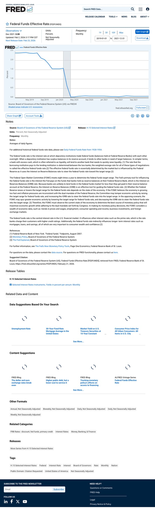

## 5.2 한국은행: 기준금리 인하

| 날짜 | 기준금리 | 변동 |
|------|---------|------|
| 2020.03.16 | 0.75% | -0.50%p (1.25% → 0.75%) |
| 2020.05.28 | **0.50%** | -0.25%p (역대 최저) |

한국은행도 사상 처음으로 기준금리를 **0%대**로 인하했다.

## 5.3 미국 10년물 국채 수익률 — 역대 최저

미국 10년물 국채 수익률은 2020년 3월 9일 한때 **0.31%**까지 하락하며 **역대 최저치**를 기록했다. 투자자들이 안전자산인 국채로 몰리면서 가격이 급등(=수익률 급락)한 것이다.

| 시기 | 10년물 수익률 |
|------|-------------|
| 2020.01 | 약 1.88% |
| 2020.03.09 | **0.31%** (장중 최저) |
| 2020.12 | 약 0.93% |

## 5.4 금리와 주가의 관계 — 왜 금리를 내리면 주가에 긍정적인가

금리 인하가 주가에 미치는 경로:

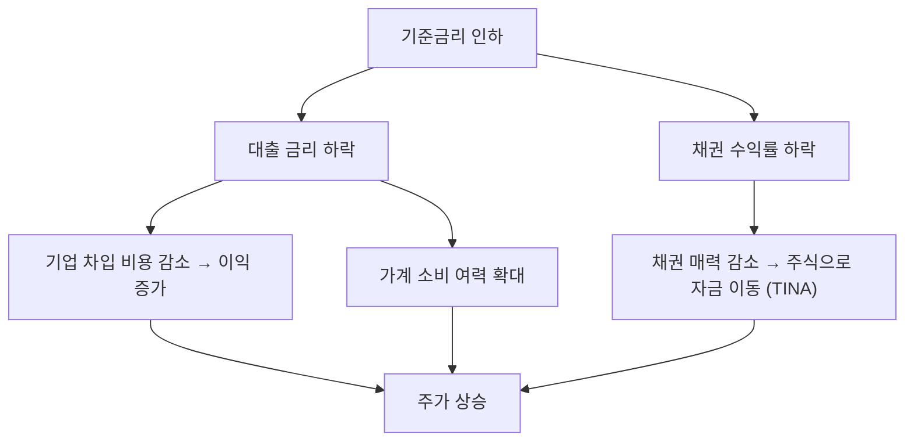

> **TINA(There Is No Alternative)**: 채권 수익률이 너무 낮으면 투자자들이 "주식 외에 대안이 없다"며 주식 시장으로 자금을 옮기는 현상.

# 6. 원자재 — 금(Gold)과 원유

## 6.1 금: 안전자산 선호 → 사상 최고가

금은 전통적인 안전자산으로, 위기 시 수요가 급증한다. 2020년에는 다음 요인이 겹치며 사상 최고가를 경신했다:

- **경기 불확실성**: 팬데믹으로 글로벌 경기 전망 급격히 악화
- **제로금리**: 금리가 0%에 가까워지면 금 보유의 기회비용(이자 수익 포기)이 사라짐
- **양적완화**: 대규모 화폐 공급 → 화폐 가치 하락 우려 → 금 수요 증가

| 시기 | 금 가격 (온스당) |
|------|-----------------|
| 2020.01 | 약 $1,520 |
| 2020.03 중순 | 약 $1,470 (일시 하락 — 현금 확보 매도) |
| 2020.08.06 | **$2,075** (**사상 최고가 경신**) |

금 가격이 3월 중순에 오히려 하락한 것은 주목할 만하다. 극심한 패닉 상황에서는 안전자산인 금마저도 매도되었다. 투자자들이 **마진콜 대응과 현금 확보**를 위해 보유 자산을 닥치는 대로 팔았기 때문이다. 이를 **"현금 선호 현상(Cash is King)"**이라고 한다.

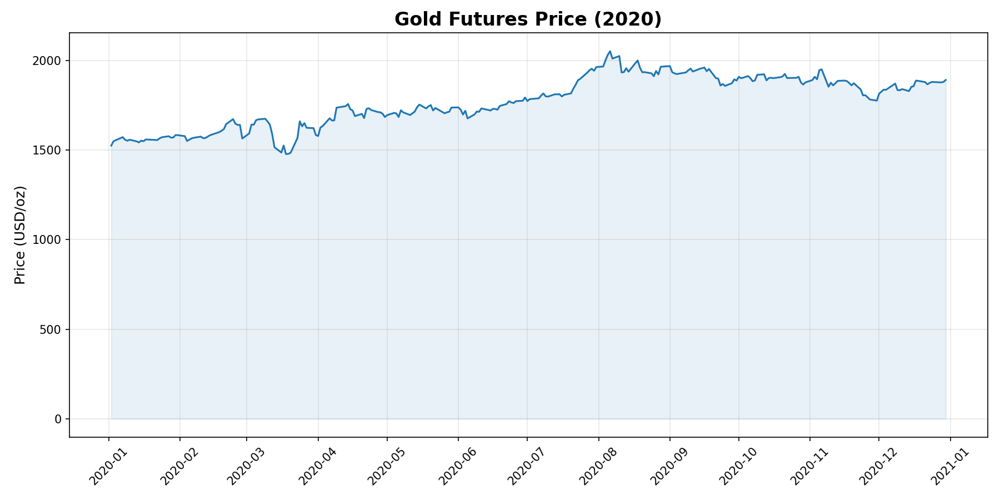

## 6.2 (번외) WTI 원유: 역사상 첫 마이너스 가격

2020년 4월 20일, WTI 원유 5월 선물 가격이 **배럴당 -$37.63**을 기록했다. 원유 가격이 **마이너스**라는 것은, 원유를 사주는 사람에게 오히려 돈을 줘야 한다는 의미다.

| 원인 | 설명 |
|------|------|
| **수요 소멸** | 전 세계 봉쇄로 항공, 운송, 공장 가동 급감 → 석유 수요 폭락 |
| **저장 시설 포화** | 남아도는 원유를 저장할 공간이 바닥남 (오클라호마 쿠싱 저장고 만땅) |
| **선물 만기** | 5월 선물 만기일 직전, 실물 인수를 피하려는 투기적 투매 |
| **사우디-러시아 감산 합의 실패** | OPEC+ 감산 협상 결렬 후 오히려 증산 경쟁 |

> 이 사건은 원유 **선물** 시장에서 발생한 것으로, 실제 현물 가격이 마이너스가 된 것은 아니다. 하지만 원유를 보유하는 것 자체가 비용이 되는 전대미문의 상황이었다.

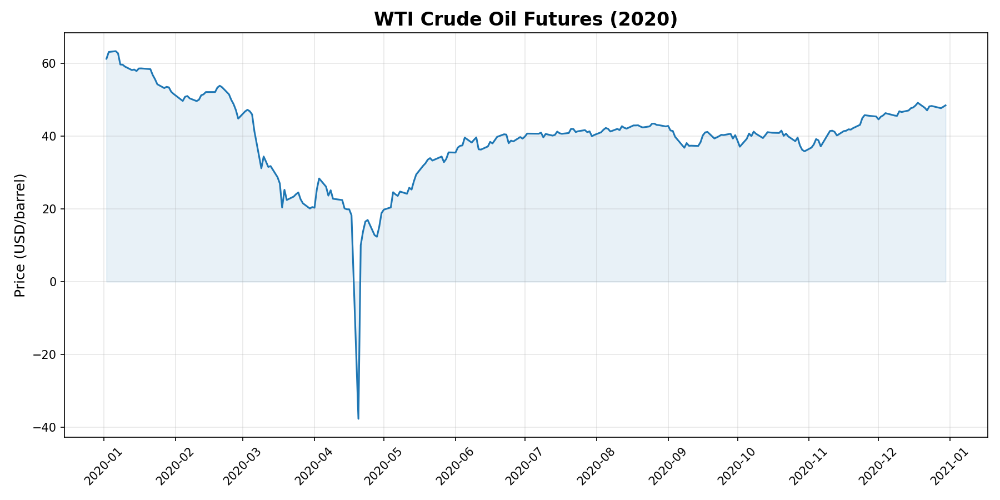

# 7. "돈을 푼다"는 것의 의미

코로나 사태 당시 뉴스에서 가장 많이 들은 표현 중 하나가 **"정부가 돈을 풀었다"**는 것이다. 이것이 정확히 무엇을 의미하는지, 그리고 왜 그렇게 해야 했는지를 정리한다.

## 7.1 돈을 푼다 = 시중에 유동성을 공급한다

"돈을 푼다"는 표현은 크게 두 가지 경로를 포함한다:

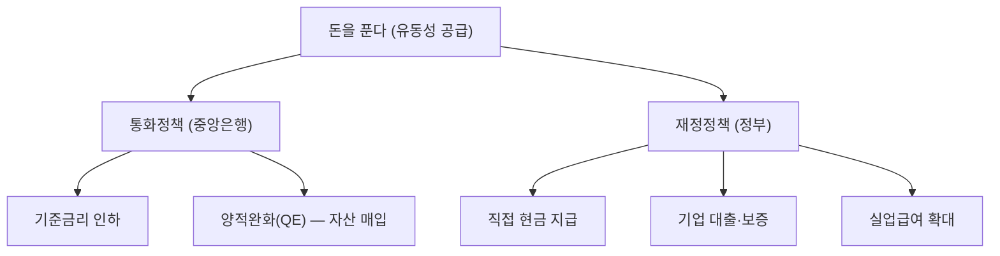

- **통화정책**: 중앙은행(연준, 한은)이 금리를 낮추고 자산을 매입하여 금융 시스템에 유동성을 공급
- **재정정책**: 정부가 세금으로 거둔 돈이나 국채 발행으로 마련한 돈을 국민·기업에 직접 지급

코로나 때는 이 두 가지가 **역사상 유례없는 규모로 동시에** 쏟아졌다.

## 7.2 왜 금리 인하만으로 부족했는가?

연준은 3월 15일에 기준금리를 0~0.25%까지 내렸다. 하지만 금리 인하만으로는 충분하지 않았다. 그 이유는 크게 세 가지다.

### 제로금리 하한(ZLB)에 도달

기준금리가 0%에 도달하면 더 이상 낮출 공간이 없다. 이를 **제로금리 하한(Zero Lower Bound, ZLB)**이라 한다.

- 금리를 0%까지 내렸지만 경기가 여전히 나빠지고 있다면?
- 전통적 통화정책의 탄약이 바닥난 상태다
- 이때 등장하는 비전통적 수단이 바로 **양적완화(QE)**

### 대출 기피 — 낮춰도 안 빌린다

평소에는 금리를 낮추면 "대출 이자가 싸졌으니 돈을 빌려서 투자하자/소비하자"가 된다. 하지만 코로나 때는 상황이 달랐다:

- **기업**: "매출이 0인데 대출을 받아서 뭘 하나? 갚을 수 있을지도 모르겠다"
- **가계**: "내일 해고될 수 있는데 집을 사겠다고 대출을 받겠나?"
- **은행**: "이 기업이 내일 망할 수도 있는데 대출을 내주겠나?"

금리가 아무리 낮아도 **극도의 불확실성** 앞에서는 아무도 돈을 빌리려 하지 않았다. 이것이 [유동성 함정](/etc/quantitative-easing-and-tightening/#133-유동성-함정)의 핵심이다.

### 유동성 위기 — 금융시장 자체가 얼어붙다

코로나 초기에는 금융시장 자체가 작동을 멈출 위기에 처했다:

- **채권 시장**: 투자자들이 국채마저 팔아 현금을 확보하려 함 → 채권 가격 급락, 수익률 급등
- **회사채 시장**: 기업 부도 우려로 회사채 매수자가 사라짐 → 스프레드(가산금리) 폭등
- **머니마켓**: 단기 자금 시장에서 자금 조달이 어려워짐
- **환율**: 전 세계적 달러 쟁탈전 (Dollar Squeeze)

> 금리 인하는 **"빌리기 쉽게"** 만드는 것이고, QE와 재정정책은 **"돈을 직접 넣어주는"** 것이다. 시장이 완전히 얼어붙었을 때는 간접적인 금리 인하만으로는 부족하고, 중앙은행이 직접 자산을 사들이고 정부가 현금을 뿌려야 한다.

## 7.3 통화정책 — 연준의 대응

> QE의 상세한 작동 원리는 [양적완화(QE)와 양적긴축(QT) 완벽 정리](/etc/quantitative-easing-and-tightening/)를 참고하자.

연준이 2020년 3월에 취한 조치를 정리하면:

| 조치 | 내용 | 목적 |
|------|------|------|
| **기준금리 인하** | 0~0.25%로 긴급 인하 | 차입 비용 감소 |
| **양적완화(QE)** | 국채 + MBS 무제한 매입 선언 | 시장에 직접 유동성 투입 |
| **회사채 매입** | 투자등급 회사채 + 회사채 ETF 매입 | 기업 자금 조달 시장 안정 |
| **달러 스왑라인** | 주요 14개국 중앙은행과 달러 스왑 | 글로벌 달러 부족 해소 |
| **레포 시장 지원** | 대규모 레포 오퍼레이션 | 단기 자금 시장 안정 |
| **PPP 대출 지원** | 소기업 급여보호 프로그램(PPP) 대출 매입 | 소기업 고용 유지 |

연준 대차대조표 변화:

| 시점 | 자산 규모 |
|------|----------|
| 2020.03 초 | 약 $4.2조 |
| 2020.06 | 약 $7.2조 |
| 변화 | **약 3개월 만에 +$3.0조** |

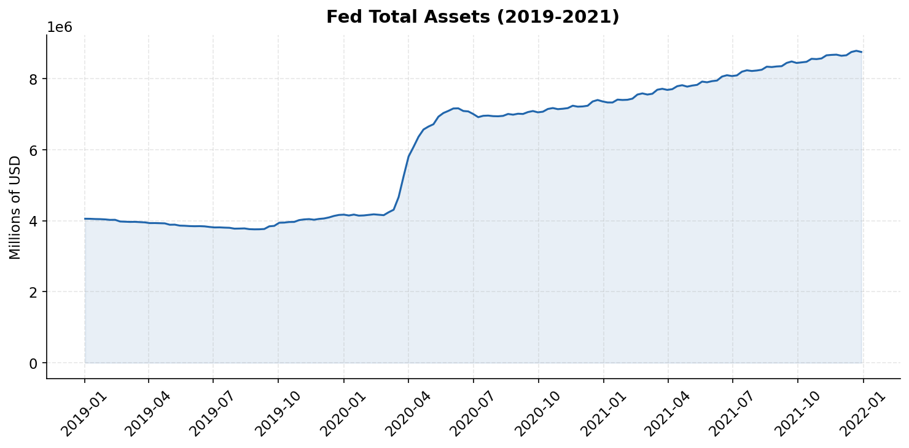

약 3개월 만에 **3조 달러**가 투입된 것이다. 2008년 금융위기 때 6년에 걸쳐 투입한 규모를 단 3개월 만에 쏟아부은 셈이다.

## 7.4 재정정책 — 정부의 대응

통화정책이 금융 시스템에 돈을 공급하는 것이라면, 재정정책은 **국민과 기업에 돈을 직접 넣어주는** 것이다.

### 미국: CARES Act ($2.2조)

2020년 3월 27일 서명된 **CARES Act(Coronavirus Aid, Relief, and Economic Security Act)**는 미국 역사상 최대 규모의 경기 부양 패키지였다.

| 항목 | 규모 | 내용 |
|------|------|------|
| **직접 지급(Stimulus Check)** | $3,000억 | 성인 1인당 **$1,200** + 아동 $500 |
| **실업급여 확대** | $2,600억 | 주당 $600 추가 지급 (4개월) |
| **급여보호 프로그램(PPP)** | $3,490억 | 소기업 급여 대출 (고용 유지 시 상환 면제) |
| **기업·지자체 대출** | $5,000억 | 대기업, 항공사, 주정부 지원 |
| **의료 부문** | $1,500억 | 병원, 의료장비 지원 |

이후에도 추가 부양책이 이어졌다:

| 법안 | 시기 | 규모 |
|------|------|------|
| CARES Act | 2020.03 | $2.2조 |
| 추가 PPP + 의료 | 2020.04 | $0.5조 |
| Consolidated Appropriations Act | 2020.12 | $0.9조 |
| American Rescue Plan (바이든) | 2021.03 | $1.9조 |
| **합계** | | **약 $5.5조** |

### 한국: 긴급재난지원금

| 차수 | 시기 | 규모 | 내용 |
|------|------|------|------|
| 1차 긴급재난지원금 | 2020.05 | 14.3조 원 | 전 국민 1인당 40만 원 (4인 가구 100만 원) |
| 소상공인 지원 | 2020~2021 | 수십 조 원 | 새희망자금, 버팀목자금, 손실보상금 등 |
| 2차 긴급재난지원금 | 2020.09 | 7.8조 원 | 소득 하위 70% 대상 |

## 7.5 통화정책 vs 재정정책: 왜 둘 다 동시에 필요했나

| 비교 | 통화정책 (중앙은행) | 재정정책 (정부) |
|------|-------------------|----------------|
| **돈이 가는 곳** | 금융 시스템 (은행, 채권 시장) | 국민, 기업에 직접 |
| **경로** | 간접적 (은행 대출 → 기업/가계) | 직접적 (현금 지급, 보조금) |
| **속도** | 금융시장은 즉각 반응 | 집행에 시간 소요 |
| **한계** | 돈이 실물 경제까지 안 갈 수 있음 | 재정 적자 확대 |

코로나 때는:
- **통화정책만**으로는: 금리를 0%로 내려도 아무도 빌리지 않고, 금융시장이 얼어붙음
- **재정정책만**으로는: 국채를 발행해야 하는데, 채권 시장이 불안정하면 정부도 자금 조달이 어려움

따라서 연준이 QE로 채권 시장을 안정시키고 → 정부가 국채를 발행하여 재원을 마련하고 → 그 돈을 국민에게 직접 지급하는 **"합작"** 구조가 만들어졌다.

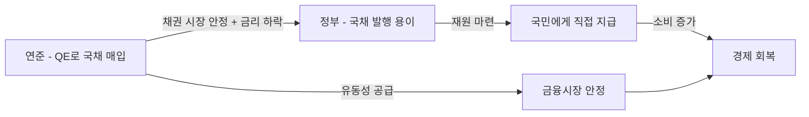

## 7.6 돈이 풀리면 벌어지는 일

대규모 유동성 공급의 결과:

| 단기 효과 (2020) | 중장기 부작용 (2021~2022) |
|------------------|--------------------------|
| 금융시장 안정 및 반등 | 자산 버블 (주식, 부동산, 코인) |
| 기업 부도 방지 | 인플레이션 급등 (2022년 미국 CPI 9.1%) |
| 실업 증가 완화 | 빈부 격차 확대 |
| 소비 회복 | 좀비 기업 양산 |
| 공포 심리 진정 | 정책 의존성 심화 |

> 2020년에 뿌린 돈은 2022년 **40년 만의 최악의 인플레이션**으로 되돌아왔다. 연준은 이를 잡기 위해 역사적인 속도로 금리를 올리고 QT를 시작해야 했다.

# 8. 폭락 이후 — 역대급 반등 (2020.03~12)

## 8.1 S&P 500: 5개월 만에 사상 최고치 회복

| 날짜 | S&P 500 | 비고 |
|------|---------|------|
| 2020.03.23 | 2,237 | **저점** |
| 2020.06.08 | 3,232 | 3,000 회복 |
| 2020.08.18 | 3,389 | **사상 최고치 회복** (저점 대비 +51.5%) |
| 2020.12.31 | 3,756 | 연말 종가 (저점 대비 +67.9%) |

3월 23일 저점에서 8월 18일 사상 최고치 회복까지 **약 5개월**. 이는 역대 약세장 회복 속도 중 가장 빠른 것이었다.

과거 약세장과의 비교:

| 약세장 | 고점→저점 기간 | 저점→회복 기간 |
|--------|--------------|--------------|
| 대공황 (1929) | 약 3년 | **25년** |
| 닷컴 버블 (2000) | 약 2.5년 | **7년** |
| 금융위기 (2007) | 약 1.4년 | **5.5년** |
| **코로나 (2020)** | **약 1개월** | **약 5개월** |

## 8.2 KOSPI: 연말 2,873 — 거의 2배

| 날짜 | KOSPI | 저점 대비 변동 |
|------|-------|--------------|
| 2020.03.19 | 1,457 | **저점** |
| 2020.06 | 2,108 | +44.7% |
| 2020.09 | 2,327 | +59.7% |
| 2020.12.31 | **2,873** | **+97.1%** |

KOSPI는 저점 대비 연말까지 거의 **2배** 가까이 상승했다. 한국 시장의 반등은 미국보다도 더 가팔랐다.

## 8.3 나스닥: 기술주 폭등 — 언택트 수혜

코로나 팬데믹은 **기술주의 시대**를 가속화했다.

| 수혜 섹터 | 대표 기업 | 이유 |
|-----------|----------|------|
| **원격근무** | Zoom, Microsoft Teams | 재택근무 전환 |
| **전자상거래** | Amazon, Shopify | 오프라인 매장 폐쇄 |
| **스트리밍** | Netflix, Disney+ | 집에서 콘텐츠 소비 |
| **클라우드** | AWS, Azure, Google Cloud | 디지털 전환 가속 |
| **반도체** | NVIDIA, AMD | 데이터센터 수요 폭증 |

나스닥 종합지수:

| 날짜 | 나스닥 | 비고 |
|------|--------|------|
| 2020.02.19 | 9,817 | 고점 |
| 2020.03.23 | 6,860 | 저점 (-30.1%) |
| 2020.06.09 | 10,020 | **사상 최고치 경신** (2.5개월 만에) |
| 2020.12.31 | 12,888 | 저점 대비 +87.9% |

나스닥은 S&P 500보다 **더 빠르게** 사상 최고치를 경신했다. 코로나가 오히려 기술주에는 **촉매**로 작용한 것이다.

## 8.4 "동학개미운동" — 한국 개인 투자자 대거 유입

코로나 폭락 이후 한국에서는 역사적인 현상이 벌어졌다. **개인 투자자(개미)**들이 대거 주식 시장에 뛰어든 것이다.

| 지표 | 내용 |
|------|------|
| **신규 계좌 개설** | 2020년 약 600만 개 (전년 대비 2배 이상) |
| **개인 순매수** | 2020년 KOSPI 약 63.5조 원 순매수 (역대 최대) |
| **외국인 vs 개인** | 외국인이 팔면 개인이 받아내는 구조 |
| **"동학개미"** | 1894년 동학농민운동에 빗대어 외국인에 맞서 싸우는 개인 투자자를 칭하는 신조어 |

왜 개인 투자자가 대거 유입되었나:

- **저금리**: 예금 금리 0%대 → "은행에 넣어봐야 이자가 없다"
- **재난지원금**: 여유 자금 발생
- **재택근무**: 집에서 주식 거래가 용이
- **MTS 앱 발달**: 모바일 거래 편의성 극대화
- **주변 사례**: "폭락 때 산 사람이 돈 벌었다"는 입소문

# 9. 투자자 관점에서 배울 점

## 9.1 패닉셀의 대가

2020년 3월 23일 저점에서 매도하고 시장에 복귀하지 않았다면:

| 시나리오 | 결과 |
|----------|------|
| 3월 23일 패닉셀 후 복귀 안 함 | -33.9% 손실 확정 |
| 3월 23일 패닉셀 → 6개월 후 복귀 | +17.5% 상승분 놓침 (원금 회복) |
| 처음부터 보유(Hold) | 2020년 말 +16.3% 수익 |
| 3월 23일 추가 매수 | 2020년 말 +67.9% 수익 |

> 역사적으로 S&P 500의 **최고의 상승일 10일 중 대부분**은 최악의 하락일과 매우 가까운 시기에 발생한다. 폭락을 피하려고 시장을 빠져나오면 반등도 함께 놓치게 된다.

## 9.2 위기 = 기회? 데이터로 보는 폭락 후 수익률

과거 주요 폭락 이후 S&P 500의 1년 수익률:

| 위기 | 저점 날짜 | 이후 1년 수익률 |
|------|----------|----------------|
| 블랙먼데이 (1987) | 1987.12 | +23% |
| 닷컴 버블 (2002) | 2002.10 | +34% |
| 금융위기 (2009) | 2009.03 | +69% |
| **코로나 (2020)** | **2020.03** | **+75%** |

물론 "저점을 정확히 맞추는 것"은 불가능하다. 하지만 데이터가 보여주는 교훈은 명확하다: **공포가 극대화된 시점은 장기적으로 매수 기회였다.**

## 9.3 유동성이 시장을 움직인다

코로나 사태가 투자자에게 가르쳐준 가장 큰 교훈:

> **주가는 기업 실적만으로 움직이지 않는다. 유동성(돈의 양과 흐름)이 시장의 방향을 결정한다.**

2020년 3월~12월 사이 기업 실적은 오히려 최악이었다. 실업률은 14.7%까지 치솟았고, GDP는 -31.2%(2분기 연율)를 기록했다. 그런데도 주가는 폭등했다. 이유는 단 하나: **역대급 유동성 공급** 때문이었다.

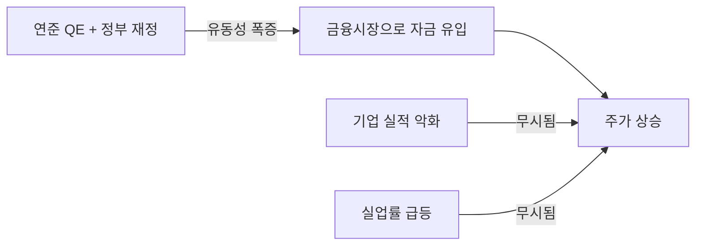

## 9.4 "Don't Fight the Fed" — 연준에 맞서지 마라

월가의 오래된 격언이다. 연준이 돈을 풀면 시장은 올라가고, 돈을 거두면 내려간다.

| 연준 스탠스 | 시장 방향 | 투자 전략 |
|------------|----------|----------|
| **QE + 제로금리** (돈 풀기) | 상승 | 위험자산 비중 확대 |
| **테이퍼링** (풀기 축소) | 변동성 확대 | 차익 실현 고려 |
| **QT + 금리 인상** (돈 거두기) | 하락 압력 | 방어적 포트폴리오 |
| **QT 종료 + 금리 인하** (전환) | 반등 신호 | 매수 기회 탐색 |

2020년 3월 연준이 "무제한 QE"를 선언한 순간이 사실상 저점이었다. 연준의 의지를 읽고 "Don't Fight the Fed"를 실천한 투자자들이 큰 수익을 올렸다.

# 10. 정리 & 참고

## 10.1 핵심 정리

| 항목 | 핵심 데이터 |
|------|-----------|
| **S&P 500 폭락** | 사상 최고치 → 23거래일 만에 -33.9% (역대 최단기간 약세장) |
| **S&P 500 회복** | 저점 → 5개월 만에 사상 최고치 회복 (역대 최단기간 회복) |
| **KOSPI** | 2,267 → 1,439 (-36.5%) → 연말 2,873 (+97.1%) |
| **VIX** | 82.69 (2008년 금융위기 수준 돌파) |
| **연준 금리** | 2주 만에 1.50%p 인하 → 제로금리 (0~0.25%) |
| **연준 대차대조표** | 3개월 만에 $4.2조 → $7.2조 (+$3.0조) |
| **금 가격** | $1,520 → $2,075 (사상 최고가) |
| **WTI 원유** | -$37.63/배럴 (역사상 첫 마이너스) |
| **미국 재정 부양** | 총 약 $5.5조 (CARES Act 등) |

## 10.2 투자 교훈

1. **패닉에 팔지 마라** — 최악의 날과 최고의 날은 가까이 붙어 있다
2. **유동성을 추적하라** — 기업 실적보다 돈의 흐름이 단기 시장 방향을 결정한다
3. **"Don't Fight the Fed"** — 중앙은행의 정책 방향에 맞서지 마라
4. **위기에 대비하라** — 현금 비중, 분산 투자, 리밸런싱 룰을 평소에 정해두자
5. **역사는 반복된다** — 폭락은 반드시 온다. 그리고 회복도 반드시 온다

## 10.3 참고

- [FRED - S&P 500 (SP500)](https://fred.stlouisfed.org/series/SP500)
- [FRED - VIX (VIXCLS)](https://fred.stlouisfed.org/series/VIXCLS)
- [FRED - Federal Funds Rate (FEDFUNDS)](https://fred.stlouisfed.org/series/FEDFUNDS)
- [FRED - Fed Balance Sheet (WALCL)](https://fred.stlouisfed.org/series/WALCL)
- [FRED - Gold Price (GOLDAMGBD228NLBM)](https://fred.stlouisfed.org/series/GOLDAMGBD228NLBM)
- [FRED - 10-Year Treasury (DGS10)](https://fred.stlouisfed.org/series/DGS10)
- [Federal Reserve - FOMC Statements](https://www.federalreserve.gov/monetarypolicy/fomccalendars.htm)
- [U.S. Congress - CARES Act Summary](https://home.treasury.gov/policy-issues/coronavirus)
- [한국은행 - 기준금리 변경 이력](https://www.bok.or.kr/portal/singl/baseRate/list.do)
- [양적완화(QE)와 양적긴축(QT) 완벽 정리](/etc/quantitative-easing-and-tightening/)
