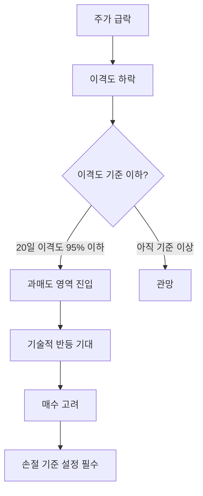
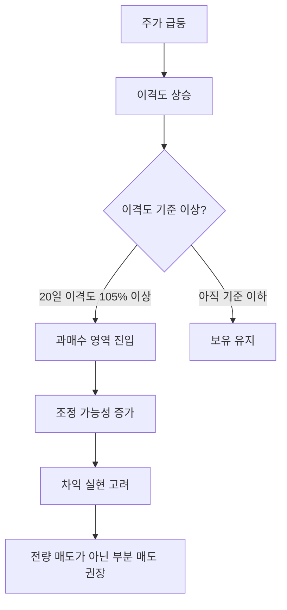
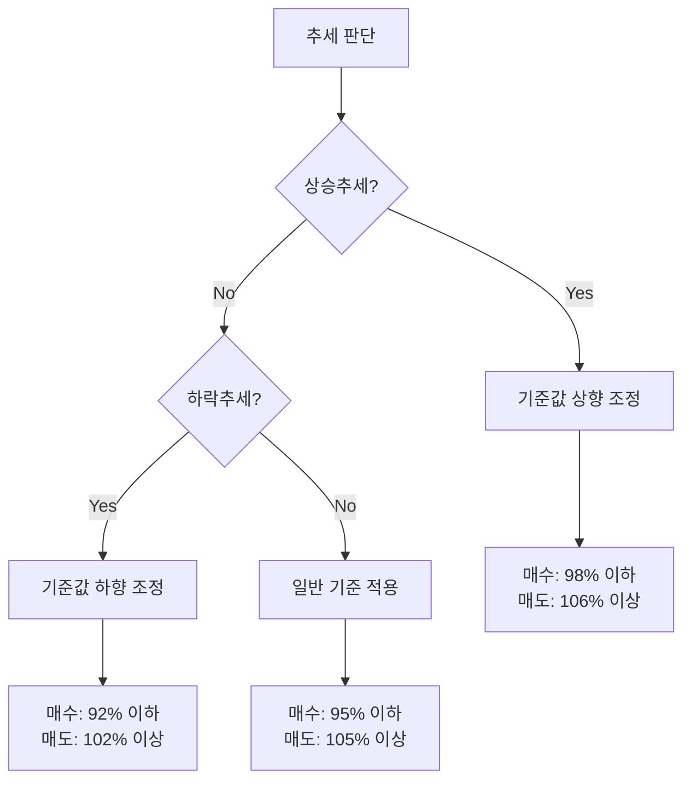

# 1. 개요

주가가 급등하면 "너무 올랐으니 곧 떨어지겠지"라는 생각이 들고, 급락하면 "이 정도면 바닥 아닌가"라는 생각이 들기 마련이다. 이런 직감을 수치로 표현한 것이 바로 `이격도`이다.

이격도는 현재 주가가 이동평균선으로부터 얼마나 떨어져 있는지를 백분율로 나타낸 지표이다. 이동평균선 글에서 그랜빌 8법칙 중 4법칙(과매도 반등 매수)과 8법칙(과매수 차익실현)을 설명할 때 "주가가 이평선으로부터 지나치게 멀어지면"이라는 표현을 사용했는데, 이 "지나치게 멀어진 정도"를 구체적인 숫자로 보여주는 것이 이격도이다.

이 글에서는 이격도의 기본 개념과 계산 방법, 이동평균선 기간별 과매수/과매도 기준값, 그리고 이격도를 활용한 실전 매매 전략까지 체계적으로 정리한다.

------

# 2. 이격도의 기본 개념

## 2.1 이격도(Disparity Index)란

`이격도`는 현재 주가와 이동평균선 사이의 거리를 백분율로 표현한 기술적 지표이다. 주가가 이동평균선 위에 있으면 100% 이상, 아래에 있으면 100% 미만의 값을 가진다.

이격도의 핵심 원리는 **평균회귀(Mean Reversion)**이다. 주가는 단기적으로 이동평균선에서 벗어날 수 있지만, 시간이 지나면 다시 이동평균선 쪽으로 돌아오려는 속성이 있다. 마치 고무줄을 잡아당기면 다시 원래 위치로 돌아오는 것과 같다. 이격도가 지나치게 크면 고무줄이 과하게 늘어난 상태이므로 조정이 올 가능성이 높고, 반대로 지나치게 작으면 과도하게 수축된 상태이므로 반등이 기대되는 것이다.

## 2.2 이격도 계산 방법

이격도의 계산 공식은 매우 간단하다.

**계산 공식:**

```
이격도(%) = (당일 주가 / N일 이동평균) x 100
```

**계산 예시 (20일 이격도):**

| 항목 | 값 |
|------|------|
| 당일 종가 | 55,000원 |
| 20일 이동평균 | 50,000원 |
| 이격도 | (55,000 / 50,000) x 100 = **110%** |

이 경우 이격도가 110%이므로, 현재 주가가 20일 이동평균선보다 10% 높은 위치에 있다는 뜻이다.

반대로 당일 종가가 47,500원이라면 이격도는 (47,500 / 50,000) x 100 = **95%**가 된다. 주가가 20일 이동평균선보다 5% 낮은 위치에 있는 것이다.

**이격도 값의 의미:**

| 이격도 | 의미 |
|--------|------|
| 100% | 주가가 이동평균선과 정확히 일치 (괴리 없음) |
| 100% 초과 | 주가가 이동평균선 위에 위치 (과매수 방향) |
| 100% 미만 | 주가가 이동평균선 아래에 위치 (과매도 방향) |

이격도의 기준점은 항상 100%이다. 100%에서 멀어질수록 주가와 이동평균선 사이의 괴리가 크다는 뜻이며, 평균회귀의 힘이 강하게 작용할 가능성이 높아진다.

------

# 3. 이격도 활용 기준

## 3.1 이동평균선 기간별 이격도 기준

이격도의 과매수/과매도 기준은 이동평균선의 기간에 따라 달라진다. 기간이 길수록 이동평균선의 변동이 완만해지므로, 주가가 이탈했을 때 더 큰 폭의 괴리가 발생할 수 있다. 따라서 장기 이격도일수록 기준 괴리폭이 넓어진다.

### 20일 이격도

20일 이격도는 실전에서 가장 많이 활용되는 이격도이다.

| 구분 | 과매도 (매수 고려) | 과매수 (매도 고려) |
|------|-------------------|-------------------|
| 일반 기준 | 95% 이하 | 105% 이상 |
| 상승추세 | 98% 이하 | 106% 이상 |
| 하락추세 | 92% 이하 | 102% 이상 |

20일은 약 한 달간의 거래일에 해당하므로, 단기적인 과열과 침체를 판단하는 데 적합하다. 기준점 100%에서 상하 약 5%를 벗어나면 의미 있는 괴리로 판단한다.

상승추세와 하락추세에서 기준값이 다른 이유는 추세의 방향에 따라 이격도의 분포가 비대칭적이기 때문이다. 상승추세에서는 이격도가 100% 이상에서 머무는 시간이 길고, 하락추세에서는 100% 이하에서 머무는 시간이 길다.

### 60일 이격도

| 구분 | 과매도 (매수 고려) | 과매수 (매도 고려) |
|------|-------------------|-------------------|
| 일반 기준 | 90% 이하 | 110% 이상 |
| 상승추세 | 98% 이하 | 110% 이상 |
| 하락추세 | 88% 이하 | 104% 이상 |

60일은 약 3개월(1분기)에 해당하며, 기준점에서 상하 약 10%를 벗어나면 의미 있는 괴리로 본다. 중기적인 매매 타이밍을 잡는 데 활용된다.

### 120일 이격도

| 구분 | 과매도 (매수 고려) | 과매수 (매도 고려) |
|------|-------------------|-------------------|
| 일반 기준 | 85% 이하 | 115% 이상 |

120일은 약 6개월에 해당하며, 기준점에서 상하 약 15%를 기준으로 한다. 120일 이격도가 극단적인 값에 도달하는 경우는 흔하지 않으며, 그만큼 도달했을 때의 의미가 크다.

### 기간별 기준값 종합

| 이격도 기간 | 과매도 (매수) | 과매수 (매도) | 상하 괴리폭 |
|------------|-------------|-------------|-----------|
| 5일 | 97% 이하 | 103% 이상 | 약 3% |
| 20일 | 95% 이하 | 105% 이상 | 약 5% |
| 60일 | 90% 이하 | 110% 이상 | 약 10% |
| 120일 | 85% 이하 | 115% 이상 | 약 15% |

이동평균 기간이 길어질수록 기준 괴리폭이 넓어지는 패턴을 확인할 수 있다. 5일 이격도는 3% 괴리면 의미 있는 신호이지만, 120일 이격도는 15%까지 벌어져야 비슷한 수준의 신호로 판단한다.

## 3.2 종목 특성별 이격도 해석

같은 이격도 값이라도 종목의 특성에 따라 해석이 달라진다. 크게 대형주와 중소형주의 차이를 이해하는 것이 중요하다.

**대형주 (시가총액 상위 종목)**

대형주는 거래량이 많고 기관 투자자의 비중이 높아 가격 변동이 상대적으로 안정적이다. 이격도의 변동 범위가 좁으므로, 일반적인 기준값을 그대로 적용해도 무방하다. 예를 들어 20일 이격도 기준으로 95~105% 범위 내에서 주로 움직인다.

**중소형주 (변동성이 큰 종목)**

중소형주나 테마주는 거래대금이 적고 급등/급락이 빈번하다. 이격도의 변동 범위가 넓어서, 대형주와 같은 기준을 적용하면 매수/매도 신호가 너무 자주 발생하거나 아예 발생하지 않는 문제가 생긴다. 이런 종목은 20일 이격도가 120%까지 올라가야 조정이 오고, 80%까지 떨어져야 반등하는 경우도 있다. 따라서 중소형주에는 이격도 기준값을 넓게 설정해야 한다.

**실전 팁:**

개별 종목마다 이격도 행동 패턴이 다르기 때문에, 종목별로 과거 차트에서 이격도가 어느 수준에서 반전되었는지를 먼저 확인하고 자신만의 기준을 설정하는 것이 바람직하다. 또는 개별 종목보다 **KOSPI, KOSDAQ 같은 지수의 이격도**를 활용하면 종목별 편차에 덜 영향을 받아 신뢰도가 높다.

------

# 4. 이격도를 활용한 매매 전략

## 4.1 과매도 구간에서 매수

이격도가 기준 이하로 하락하면 주가가 이동평균선으로부터 지나치게 멀어진 상태이므로, 평균회귀에 의한 기술적 반등을 기대할 수 있다.



이것은 그랜빌 8법칙 중 **4법칙(과매도 반등 매수)**과 직접적으로 연결되는 전략이다. 이동평균선 글에서 "주가가 이평선으로부터 지나치게 멀어지면 평균으로 되돌아가려는 힘이 작용한다"고 설명한 바로 그 상황을, 이격도라는 구체적인 수치로 판단하는 것이다.

**적용 예시:**

20일 이격도가 95% 이하로 떨어지면 매수를 고려한다. 다만 이것은 추세 전환이 아니라 단기 반등을 노리는 역추세 매매이므로, 반드시 손절 기준을 설정해야 한다. 이격도가 더 하락하여 90% 이하로 떨어지면 하락 추세가 더 깊어지고 있다는 뜻이므로, 무조건적인 매수는 위험하다.

## 4.2 과매수 구간에서 매도

이격도가 기준 이상으로 상승하면 주가가 이동평균선으로부터 과도하게 올라간 상태이므로, 차익 실현을 고려해야 한다.



이것은 그랜빌 8법칙 중 **8법칙(과매수 차익실현)**에 해당한다. 주가가 상승 중인 이평선에서 크게 벗어나 급등했을 때, 조정이 올 가능성이 높으므로 이익을 확보하는 전략이다.

**적용 예시:**

20일 이격도가 105% 이상이면 차익 실현을 고려한다. 다만 이것은 추세 자체의 전환 신호가 아니라 과열 구간에서의 일시적 조정을 예상하는 것이므로, 전량 매도보다는 부분 매도로 대응하는 것이 바람직하다. 상승 추세가 강하면 이격도가 105%를 넘어 110% 이상까지 유지되는 경우도 있기 때문이다.

## 4.3 상승추세와 하락추세에 따른 기준 조정

이격도를 실전에서 활용할 때 가장 중요한 것은 현재 시장이 상승추세인지 하락추세인지를 먼저 판단하고, 그에 맞게 기준값을 조정하는 것이다.



**상승추세에서의 조정:**

상승추세에서는 이격도가 100% 이상에서 머무는 시간이 길다. 따라서 과매도 기준을 98%로 높이고(약간만 빠져도 매수 기회), 과매수 기준을 106%로 높인다(쉽게 매도하지 않음). 상승 중 눌림목에서 매수하고, 과열 구간에서만 일부 차익 실현하는 전략이다.

**하락추세에서의 조정:**

하락추세에서는 이격도가 100% 이하에서 머무는 시간이 길다. 따라서 과매도 기준을 92%로 낮추고(충분히 빠질 때까지 기다림), 과매수 기준을 102%로 낮춘다(조금만 반등해도 매도 고려). 하락 추세 속에서 반등은 일시적인 경우가 많으므로 보수적으로 접근하는 것이다.

## 4.4 이격도 활용 시 주의사항

이격도는 유용한 지표이지만 몇 가지 중요한 한계가 있다. 이를 이해하지 못하면 오히려 큰 손실을 볼 수 있다.

**강한 추세에서는 이격도가 오래 유지될 수 있다**

가장 흔한 실수는 이격도가 과매수 영역에 진입했다는 이유만으로 매도하거나, 과매도 영역이라는 이유만으로 매수하는 것이다. 강한 상승 추세에서는 이격도가 105%를 넘어 110%, 115%까지 올라가며 장기간 유지될 수 있다. 반대로 강한 하락 추세에서는 이격도가 90% 이하에서 계속 머물 수 있다. "떨어지는 칼날을 잡는" 상황을 피하려면, 이격도가 과매도 영역에 진입했더라도 하락 추세가 둔화되거나 반전되는 조짐이 보일 때까지 기다리는 것이 안전하다.

**보합장에서 적중률이 가장 높다**

이격도는 주가가 일정 범위 내에서 등락을 반복하는 보합장(횡보장)에서 가장 효과적이다. 뚜렷한 추세가 없는 구간에서는 이격도가 과매수/과매도 영역에 도달할 때마다 반전하는 패턴이 잘 나타나기 때문이다. 반면 강한 추세장에서는 이격도의 예측력이 크게 떨어진다.

**매도보다 매수 시점 판단에 더 유리하다**

키움증권의 분석에 따르면, 이격도는 매도 시점보다 매수 시점을 선택하는 데 더 유리하며, 단기보다는 중장기 투자에서 활용도가 높다. 과매도 상태에서의 반등은 비교적 빠르게 나타나는 반면, 과매수 상태는 상승 추세의 힘에 의해 예상보다 오래 지속될 수 있기 때문이다.

**단독 사용보다 다른 지표와 종합 판단해야 한다**

이격도는 하나의 참고 지표일 뿐이다. RSI(상대강도지수), MACD, 볼린저 밴드, 거래량 등 다른 기술적 지표와 함께 종합적으로 판단해야 신뢰도가 높아진다. 예를 들어 이격도가 과매도 영역에 있으면서 동시에 RSI도 30 이하의 과매도 구간에 있고, 거래량이 감소 추세라면 반등 가능성이 더 높다고 판단할 수 있다.

------

# 5. 마무리

이격도는 이동평균선이라는 기반 위에서 작동하는 보조지표로, 주가와 이평선 사이의 괴리를 수치화하여 매매 타이밍을 판단하는 데 도움을 준다. 이 글에서 다룬 핵심 내용을 정리하면 다음과 같다.

- **이격도의 본질**: 현재 주가가 이동평균선으로부터 얼마나 떨어져 있는지를 백분율로 나타낸 지표이며, 평균회귀 원리에 기반한다
- **기간별 기준값**: 20일 이격도는 상하 5%(95~105%), 60일은 상하 10%(90~110%), 120일은 상하 15%(85~115%)가 일반적인 기준이다
- **추세에 따른 기준 조정**: 상승추세에서는 기준값을 높이고, 하락추세에서는 기준값을 낮춰야 한다
- **종목 특성에 따른 차이**: 대형주는 일반 기준을 적용하되, 변동성이 큰 중소형주는 기준 괴리폭을 넓게 설정해야 한다
- **한계 인식**: 강한 추세에서는 이격도가 장기간 극단값을 유지할 수 있으므로, 단독 사용이 아닌 다른 지표와 함께 종합적으로 판단해야 한다

------

# 6. 참고

- [이격도 -- 나무위키](https://namu.wiki/w/%EC%9D%B4%EA%B2%A9%EB%8F%84)
- [기술적지표 가이드: 이격도 -- 키움증권](https://www.kiwoom.com/wm/fnd/fs010/fndTechIndiGuidePop)
- [다시 만난 차트: 이격도 -- StockPlus](https://insight.stockplus.com/articles/123)
- [기술적 분석기법: 이격도 -- bondweb](https://www.bondweb.co.kr/PrimePlusHelp/help/c001.htm)
- [이격도 매매법 -- 흥국증권](http://www.heungkuksec.co.kr/jsp/sales/analysis_basis02_2.jsp)
- [주식 이격도 계산법, 활용법 -- chartget](https://chartget.co.kr/%EC%A3%BC%EC%8B%9D-%EC%9D%B4%EA%B2%A9%EB%8F%84-%EA%B3%84%EC%82%B0%EB%B2%95-%ED%99%9C%EC%9A%A9%EB%B2%95-%EC%95%8C%EC%95%84%EB%B3%B4%EA%B8%B0/)
- [이동평균선/이격도/투자심리선 -- 한경 생글생글](https://sgsg.hankyung.com/article/2005102520411)
