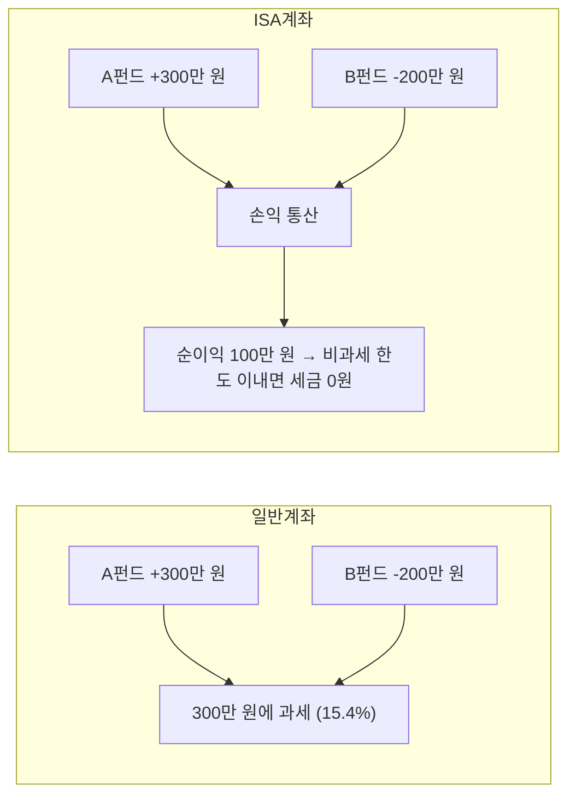
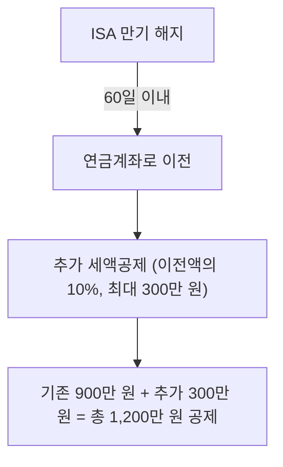
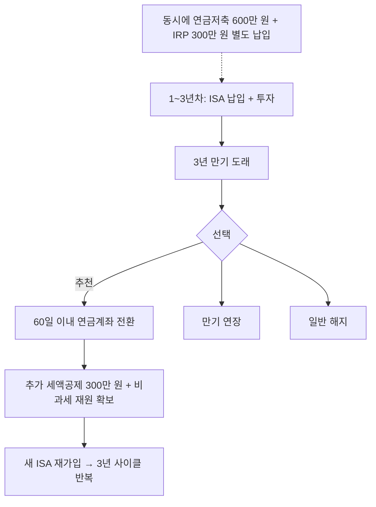

연금저축 글에서 잠깐 언급했던 **ISA → 연금계좌 전환 전략**을 이번 글에서 본격적으로 정리한다. ISA는 단순한 비과세 계좌가 아니라, 연금계좌와 연계하면 절세 효과가 극대화되는 계좌다.

**이 글을 읽으면 알 수 있는 것:**
- ISA 계좌의 종류와 비과세 혜택
- ISA 만기 후 연금계좌로 전환하는 방법과 추가 세액공제
- ISA → 연금저축 전환 시 비과세 재원이 되는 구조
- 전환 시 주의사항 (60일 기한 등)

> 이전 글: [연금저축, 넣을 때보다 꺼낼 때가 더 중요하다 — 납입부터 인출까지 절세 전략 총정리](/etc/pension-savings-withdrawal-strategy/)

---

# 1. ISA란?

## 1.1 ISA의 정의

ISA(Individual Savings Account, 개인종합자산관리계좌)는 하나의 계좌에서 예금, 펀드, ETF, 리츠 등 다양한 금융상품에 투자할 수 있는 **만능 절세 계좌**다. 2016년에 도입되어 현재까지 631만 명 이상이 가입하고 있다.

핵심 혜택을 한 줄로 요약하면 이렇다:

> **손익 통산 후 비과세 + 초과분 분리과세 9.9%**

## 1.2 ISA 종류

ISA는 **운용 방식**과 **소득 수준** 두 가지 기준으로 나뉜다.

### 운용 방식에 따른 분류

| 유형 | 설명 | 특징 |
|------|------|------|
| 중개형 | 투자자가 직접 국내 상장주식 거래 | 수수료 최소, 증권사에서 가장 인기 |
| 신탁형 | 정기예금, 펀드 등 금융사에 운용 지시 | 중개형보다 수수료 높음 |
| 일임형 | 투자 전문가에게 전액 위임 | 직접 운용 부담 없음 |

### 소득 수준에 따른 분류

| 구분 | 가입 조건 | 비과세 한도 | 초과분 세율 |
|------|---------|-----------|-----------|
| 일반형 | 만 19세 이상 | **200만 원** | 9.9% 분리과세 |
| 서민형 | 총급여 5,000만 원 이하 | **400만 원** | 9.9% 분리과세 |
| 농어민형 | 농어업 종사자 | **400만 원** | 9.9% 분리과세 |

## 1.3 ISA 기본 스펙

| 항목 | 내용 |
|------|------|
| 의무 가입 기간 | 3년 |
| 연간 납입 한도 | 2,000만 원 (미사용분 이월 가능) |
| 총 납입 한도 | 1억 원 |
| 투자 가능 상품 | 예금, 펀드, ETF, 리츠 등 |
| 계좌 수 | 전 금융기관 통틀어 1인 1계좌 |
| 중도 인출 | 원금만 인출 가능, 수익은 만기까지 유지 |

## 1.4 손익 통산이란?

ISA의 가장 큰 장점은 **손익 통산**이다. 여러 상품에서 발생한 이익과 손실을 합산하여 순이익에만 세금을 부과한다.

- **일반 계좌**: A펀드 수익 300만 원에 15.4% 과세 → **약 46만 원 세금**
- **ISA 계좌**: 순이익 100만 원 (비과세 한도 200만 원 이내) → **세금 0원**

같은 투자를 하더라도 ISA 계좌 하나로 **46만 원의 세금 차이**가 발생한다.

---

# 2. ISA 만기 후 연금계좌 전환 전략

이 부분이 이 글의 **핵심**이다. ISA의 비과세 혜택도 좋지만, 만기 후 연금계좌로 전환하면 **추가 절세 효과**까지 누릴 수 있다.

## 2.1 전환 시 추가 세액공제

ISA 만기 해지 후 **60일 이내**에 연금계좌(연금저축 또는 IRP)로 이전하면:

- 이전 금액의 **10%**, 최대 **300만 원** 추가 세액공제
- 기존 연금저축+IRP 세액공제 900만 원과 **별도로** 적용
- 해당 연도 총 세액공제 한도: **최대 1,200만 원**

## 2.2 세액공제 시뮬레이션

### 연간 총 세액공제 시나리오

| 항목 | 금액 |
|------|------|
| 연금저축 납입 | 600만 원 (세액공제) |
| IRP 납입 | 300만 원 (세액공제) |
| ISA 전환 추가 공제 | 300만 원 (세액공제) |
| **합계** | **1,200만 원** |
| 환급액 (총급여 5,500만 원 이하, 16.5%) | **198만 원** |
| 환급액 (총급여 5,500만 원 초과, 13.2%) | **158.4만 원** |

### 전환 금액별 추가 세액공제

| ISA 전환 금액 | 추가 공제 대상 (10%) | 실제 추가 공제 | 추가 환급액 (16.5%) | 추가 환급액 (13.2%) |
|-------------|-------------------|--------------|-------------------|-------------------|
| 1,000만 원 | 100만 원 | 100만 원 | 16.5만 원 | 13.2만 원 |
| 2,000만 원 | 200만 원 | 200만 원 | 33만 원 | 26.4만 원 |
| **3,000만 원 이상** | **300만 원 (한도)** | **300만 원** | **49.5만 원** | **39.6만 원** |

최소 **3,000만 원 이상** 전환해야 추가 세액공제 300만 원 한도를 꽉 채울 수 있다.

## 2.3 전환 후 비과세 재원 확보

ISA에서 연금계좌로 이전한 금액 중 **추가 세액공제를 받지 않은 부분**은 연금계좌 내에서 **비과세 재원**이 된다.

| 항목 | 금액 | 인출 시 과세 |
|------|------|-----------|
| ISA 전환 총액 | 3,000만 원 | - |
| 세액공제 대상 | 300만 원 | 연금소득세 3.3~5.5% |
| **비과세 재원** | **2,700만 원** | **세금 없음** |

이 비과세 재원은 연금저축의 인출 순서에서 **1순위**로 빠져나간다. 즉, 연금 수령 시 비과세 재원부터 먼저 인출되므로 초기 인출 시 세금 부담이 거의 없다.

> 연금저축 인출 순서에 대한 자세한 내용은 이전 글 [연금저축 납입·인출 절세 전략](/etc/pension-savings-withdrawal-strategy/)의 인출 순서 전략을 참고한다.

---

# 3. ISA 활용 타임라인

## 3.1 가입부터 전환까지 로드맵

## 3.2 ISA 만기 시 선택지 비교

만기가 도래하면 세 가지 선택지가 있다. 상황에 따라 최적의 선택이 달라진다.

| 선택지 | 설명 | 적합한 경우 |
|-------|------|-----------|
| **연금계좌 전환** | 추가 세액공제 + 비과세 재원 확보 | 장기 투자자, 노후 자금 마련 목적 |
| **만기 연장** | ISA 비과세 혜택 유지, 기존 투자 계속 | 비과세 한도 미소진, 기존 투자 유지 희망 |
| **일반 해지** | 비과세/분리과세 혜택 후 현금화 | 급전 필요, 다른 투자처 활용 |

### 연금계좌 전환이 가장 유리한 이유

1. **추가 세액공제 300만 원**: 다른 선택지에서는 받을 수 없는 혜택
2. **비과세 재원 확보**: 전환 금액 중 공제 대상 제외분은 세금 없이 인출 가능
3. **사이클 반복 가능**: 전환 후 ISA 재가입하면 비과세 한도 리셋

---

# 4. 전환 시 주의사항

## 4.1 반드시 지켜야 할 규칙

### 60일 기한

- 만기 해지 후 **60일 이내**에 연금계좌로 이전해야 추가 세액공제 혜택 적용
- 만기일이 지난 후 해지했다면 **해지일이 아닌 만기일** 기준으로 60일 계산
- 기한을 하루라도 넘기면 추가 세액공제 혜택이 **완전히 소멸**

### 전환 방식

- 반드시 금융기관 앱/창구의 **'연금 전환' 메뉴**를 통해 신청해야 한다
- ISA를 먼저 해지하고 내 통장으로 돈을 받은 뒤 직접 연금계좌로 이체하면, 국세청이 이를 **일반 입금으로 인식**하여 추가 세액공제 혜택이 소멸된다
- ISA 보유 상품은 반드시 **현금화 후 이전** (실물 이전 불가)

### 납입 한도 별도 인정

ISA 전환 금액은 연금계좌의 연간 납입 한도(1,800만 원)와 **별도로** 인정된다. 즉, 연금저축에 이미 1,800만 원을 납입했더라도 ISA 전환 금액은 추가로 입금할 수 있다.

## 4.2 전환 후 알아야 할 점

| 항목 | 세금 처리 |
|------|---------|
| 세액공제 받은 300만 원 | 연금 수령 시 연금소득세(3.3~5.5%) 부과 |
| 세액공제 안 받은 나머지 | **비과세 재원** → 세금 없이 인출 가능 |
| 전환 후 인출 제한 | 연금계좌의 인출 규칙 적용 (만 55세 이후 연금 수령) |

## 4.3 서민형 계좌 보유자 주의사항

- 만기 연장 시 **소득 재검증**을 거쳐 일반형으로 강등될 수 있다
- 직전 3년 내 금융소득종합과세 대상(연간 이자·배당 2,000만 원 초과)이었으면 재가입이 불가하다

---

# 5. ISA 개편 동향 (2025~2026년)

ISA 제도 개편안이 추진 중이다. 국회 통과 여부에 따라 변경될 수 있으니 참고 수준으로 확인하자.

| 항목 | 현행 | 개편안(추진 중) |
|------|-----|--------------|
| 연간 납입 한도 | 2,000만 원 | **4,000만 원** |
| 총 납입 한도 | 1억 원 | **2억 원** |
| 비과세 한도 (일반형) | 200만 원 | **500만 원** |
| 비과세 한도 (서민형) | 400만 원 | **1,000만 원** |
| 계좌 수 | 1인 1계좌 | **다계좌 허용** |
| 금융소득종합과세자 | 가입 제한 | **국내투자형 ISA 가입 허용** |

개편안이 통과되면 ISA의 절세 효과가 훨씬 커진다. 특히 비과세 한도 확대와 다계좌 허용은 투자 전략에 상당한 영향을 줄 수 있다.

---

# 6. 정리 및 체크리스트

ISA를 활용한 절세 전략의 핵심을 체크리스트로 정리한다.

- [ ] ISA 계좌 개설 (중개형 추천, 3년 의무 가입)
- [ ] 매년 가능한 한도까지 납입 (연 2,000만 원)
- [ ] 동시에 연금저축(600만 원) + IRP(300만 원) 별도 납입
- [ ] 3년 만기 도래 시 **연금계좌 전환** 검토
- [ ] 만기일 2주 전부터 전환 준비 (금융기관 문의)
- [ ] **60일 이내** 전환 완료 (기한 놓치면 추가 세액공제 불가)
- [ ] 최소 **3,000만 원 이상** 전환해야 추가 세액공제 300만 원 한도 달성
- [ ] 반드시 금융기관 앱의 **'연금 전환' 메뉴** 사용 (직접 이체 금지)
- [ ] 전환 후 비과세 재원은 인출 순서 1순위로 활용
- [ ] 전환 완료 후 **새 ISA 재가입**하여 사이클 반복

---

# 7. 참고

- [ISA 만기 자금, 연금 계좌로 옮겨 세액공제 1,200만원 혜택 받는 전략 - Frism](https://www.frism.io/isa-mangi-jageum-yeongeum-gyejwaro-olmgyeo-seaeggongje-1-200manweon-hyetaeg-badneun-mabeobyi-jeonryag/)
- [ISA 만기 해지 후 연금 전환 혜택 세액공제 300만원 더 받기 - WiseHub](https://wisehub.kr/isa-%EB%A7%8C%EA%B8%B0-%ED%95%B4%EC%A7%80-%ED%9B%84-%EC%97%B0%EA%B8%88-%EC%A0%84%ED%99%98-%ED%98%9C%ED%83%9D-%EC%84%B8%EC%95%A1%EA%B3%B5%EC%A0%9C-300%EB%A7%8C%EC%9B%90-%EB%8D%94-%EB%B0%9B%EA%B8%B0/)
- [ISA 계좌 총정리 - 토스피드](https://toss.im/tossfeed/article/isa)
- [ISA 계좌란? - KB Think](https://kbthink.com/main/asset-management/wealth-manage-tip/tutorial/isa/isa-1.html)
- [ISA 연금전환의 모든 것 - 미래에셋증권](https://securities.miraeasset.com/public/mw/blog/html/20210421111202.html)
- [ISA 만기 연장 vs 해지 vs 연금 전환 - 한국투자증권 블로그](https://blog.koreainvestment.com/isa-%EB%A7%8C%EA%B8%B0-%EC%97%B0%EC%9E%A5-vs-%ED%95%B4%EC%A7%80-vs-%EC%97%B0%EA%B8%88-%EC%A0%84%ED%99%98-%EB%82%B4%EA%B2%8C-%EB%A7%9E%EB%8A%94-%EC%84%A0%ED%83%9D%EC%A7%80/)
- [ISA 다계좌 개설 허용, 납입/비과세 한도 상향 재추진 - 서울경제](https://www.sedaily.com/NewsView/2GNJD608O5)
- [연금계좌 세액공제 - 국세청](https://www.nts.go.kr/nts/cm/cntnts/cntntsView.do?cntntsId=7875)
