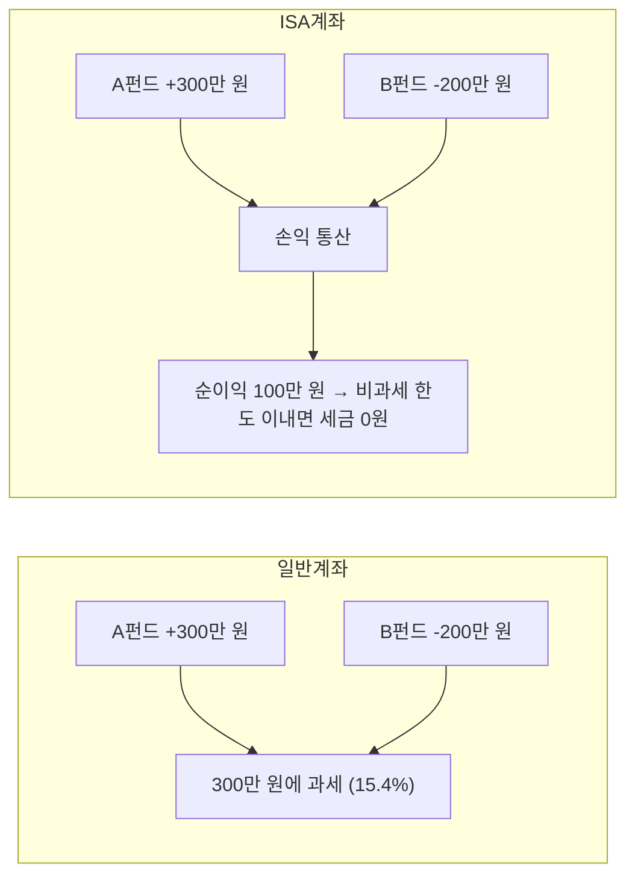
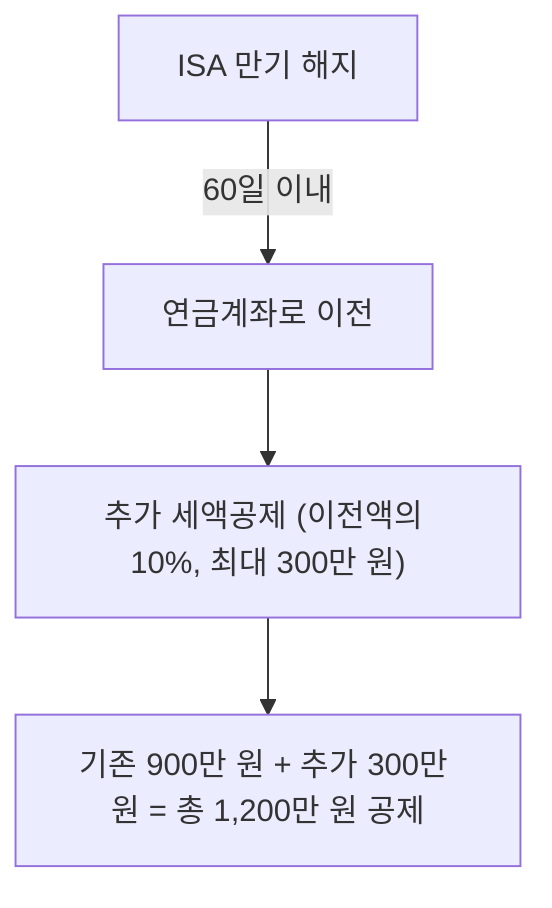
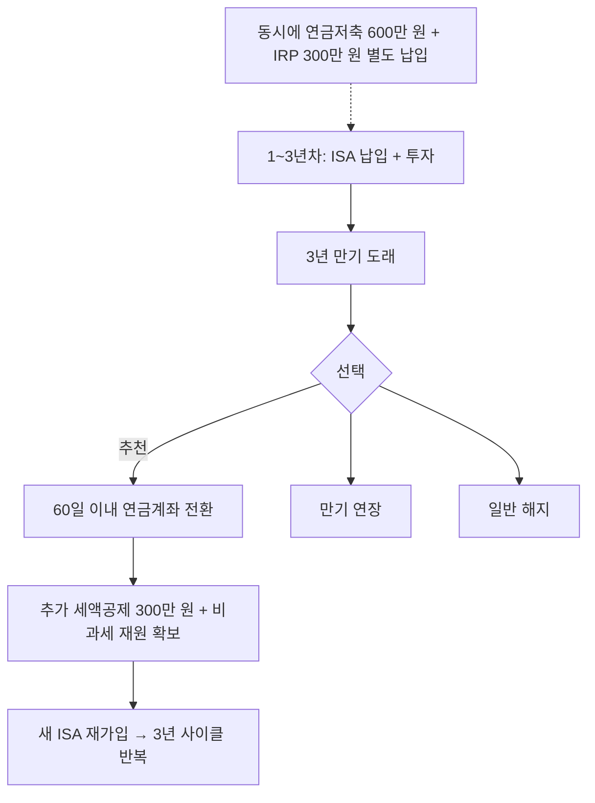
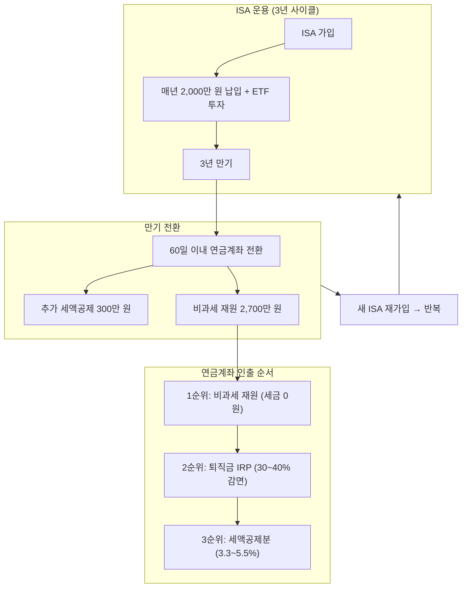

연금저축 글에서 잠깐 언급했던 **ISA → 연금계좌 전환 전략**을 이번 글에서 본격적으로 정리한다. ISA는 단순한 비과세 계좌가 아니라, 연금계좌와 연계하면 절세 효과가 극대화되는 계좌다.

직장인이 연금저축(600만 원) + IRP(300만 원)으로 받을 수 있는 세액공제는 연간 최대 900만 원이다. 여기서 더 늘리는 방법은 없을까? **ISA 만기 후 연금계좌로 전환하면 추가 300만 원, 합산 최대 1,200만 원까지 세액공제가 가능하다.** 이것이 ISA를 "절세 계좌"라고 부르는 진짜 이유다.

**이 글을 읽으면 알 수 있는 것:**
- ISA 계좌의 종류와 비과세·손익 통산 혜택
- ISA 만기 후 연금계좌로 전환하는 구체적인 방법과 추가 세액공제
- 전환 금액 중 비과세 재원이 되는 구조와 인출 전략과의 연결
- 3년 사이클 반복 전략과 전환 시 반드시 지켜야 할 주의사항

> 이전 글: [연금저축, 넣을 때보다 꺼낼 때가 더 중요하다 — 납입부터 인출까지 절세 전략 총정리](/etc/pension-savings-withdrawal-strategy/)

---

# 1. ISA란?

## 1.1 ISA의 정의

ISA(Individual Savings Account, 개인종합자산관리계좌)는 하나의 계좌에서 예금, 펀드, ETF, 리츠 등 다양한 금융상품에 투자할 수 있는 **만능 절세 계좌**다. 2016년에 도입되어 현재까지 631만 명 이상이 가입하고 있다.

일반 증권 계좌에서 ETF에 투자하면 수익에 대해 15.4%의 배당소득세를 낸다. 하지만 ISA 계좌에서 같은 ETF에 투자하면 **일정 금액까지 세금이 0원**이다. 핵심 혜택을 한 줄로 요약하면 이렇다:

> **손익 통산 후 비과세 + 초과분 분리과세 9.9%**

이 혜택만으로도 충분히 매력적이지만, ISA의 진짜 가치는 만기 후 **연금계좌로 전환할 때** 나타난다. 이 부분은 2장에서 자세히 다룬다.

## 1.2 ISA 종류

ISA는 **운용 방식**과 **소득 수준** 두 가지 기준으로 나뉜다. 어떤 유형을 선택하느냐에 따라 투자 자유도와 비과세 한도가 달라지므로, 본인 상황에 맞는 조합을 선택하는 것이 중요하다.

### 운용 방식에 따른 분류

| 유형 | 설명 | 특징 |
|------|------|------|
| 중개형 | 투자자가 직접 국내 상장주식·ETF 거래 | 수수료 최소, 증권사에서 가장 인기 |
| 신탁형 | 정기예금, 펀드 등 금융사에 운용 지시 | 중개형보다 수수료 높음, 은행에서 주로 가입 |
| 일임형 | 투자 전문가에게 전액 위임 | 직접 운용 부담 없음, 수수료 가장 높음 |

> **중개형이 가장 인기 있는 이유**: 2021년 도입된 중개형 ISA는 국내 상장주식과 ETF를 직접 매매할 수 있어 투자 자유도가 가장 높다. 수수료도 가장 낮기 때문에, ETF 위주로 투자하는 사람이라면 중개형을 선택하는 것이 유리하다.

### 소득 수준에 따른 분류

| 구분 | 가입 조건 | 비과세 한도 | 초과분 세율 |
|------|---------|-----------|-----------|
| 일반형 | 만 19세 이상 | **200만 원** | 9.9% 분리과세 |
| 서민형 | 총급여 5,000만 원 이하 | **400만 원** | 9.9% 분리과세 |
| 농어민형 | 농어업 종사자 | **400만 원** | 9.9% 분리과세 |

서민형은 일반형보다 비과세 한도가 2배이므로, 총급여가 5,000만 원 이하라면 반드시 서민형으로 가입해야 한다. 가입 시 소득 요건은 자동으로 검증되므로 별도 서류를 제출할 필요는 없다.

## 1.3 ISA 기본 스펙

| 항목 | 내용 |
|------|------|
| 의무 가입 기간 | 3년 |
| 연간 납입 한도 | 2,000만 원 (미사용분 이월 가능) |
| 총 납입 한도 | 1억 원 (3년간 최대 6,000만 원, 미사용분 이월 시 최대 1억 원) |
| 투자 가능 상품 | 예금, 펀드, ETF, 리츠 등 |
| 계좌 수 | 전 금융기관 통틀어 **1인 1계좌** |
| 중도 인출 | 납입 원금 범위 내에서 인출 가능 (수익금은 만기까지 유지) |

**미사용분 이월이란?** 올해 2,000만 원 한도를 다 채우지 못하면, 남은 금액이 다음 해로 이월된다. 예를 들어 1년차에 1,000만 원만 넣었다면, 2년차에는 최대 3,000만 원(올해 한도 2,000만 원 + 이월분 1,000만 원)까지 납입할 수 있다. 단, 3년 동안 총 납입 한도는 1억 원이다.

**중도 인출 주의사항**: ISA에서 중도 인출하면 인출 금액만큼 **납입 한도가 줄어든다**. 예를 들어 3,000만 원을 넣고 1,000만 원을 인출하면, 이후 추가 납입 가능 금액은 원래 한도에서 1,000만 원을 뺀 금액이 된다. 따라서 만기까지 유지하는 것이 가장 유리하다.

## 1.4 손익 통산이란?

ISA의 가장 큰 장점은 **손익 통산**이다. 일반 계좌에서는 이익이 난 상품에만 세금이 붙지만, ISA에서는 여러 상품에서 발생한 이익과 손실을 합산하여 **순이익에만** 세금을 부과한다. 이 차이가 실제로 얼마나 큰지 예시로 확인해보자.

- **일반 계좌**: B펀드에서 200만 원 손해를 봤지만, 세금은 A펀드 수익 300만 원에 대해 15.4% 부과 → **약 46만 원 세금**. 손실은 세금 계산에 전혀 반영되지 않는다.
- **ISA 계좌**: A펀드 수익 300만 원에서 B펀드 손실 200만 원을 빼고, 순이익 100만 원에 대해서만 과세. 비과세 한도 200만 원 이내이므로 → **세금 0원**

같은 투자를 하더라도 ISA 계좌 하나로 **46만 원의 세금 차이**가 발생한다. 투자 규모가 커지고 투자 기간이 길어질수록 이 차이는 더 벌어진다.

### 비과세 한도를 초과하면?

3년간 운용하다 보면 순이익이 비과세 한도(일반형 200만 원)를 넘는 경우도 있다. 이 경우에도 초과분에 대해 일반 계좌의 15.4%가 아닌 **9.9% 분리과세**가 적용된다.

| 상황 (일반형 기준) | ISA 계좌 | 일반 계좌 |
|---|---|---|
| 순이익 200만 원 이하 | **세금 0원** | 약 31만 원 (15.4%) |
| 순이익 500만 원 | 200만 원 비과세 + 300만 원 × 9.9% = **29.7만 원** | 약 77만 원 (15.4%) |
| 순이익 1,000만 원 | 200만 원 비과세 + 800만 원 × 9.9% = **79.2만 원** | 약 154만 원 (15.4%) |

비과세 한도를 넘기더라도 일반 계좌 대비 세금이 절반 수준이다.

---

# 2. ISA 만기 후 연금계좌 전환 전략

이 부분이 이 글의 **핵심**이다. ISA 자체의 비과세·분리과세 혜택도 좋지만, 만기 후 연금계좌로 전환하면 **추가 절세 효과**까지 누릴 수 있다. 연금저축+IRP의 세액공제 한도 900만 원을 넘어서는 공제를 받을 수 있는 **유일한 방법**이 바로 이 ISA 전환이다.

## 2.1 전환 시 추가 세액공제

ISA 만기 해지 후 **60일 이내**에 연금계좌(연금저축 또는 IRP)로 이전하면:

- 이전 금액의 **10%**, 최대 **300만 원** 추가 세액공제
- 기존 연금저축+IRP 세액공제 900만 원과 **별도로** 적용
- 해당 연도 총 세액공제 한도: **최대 1,200만 원**

여기서 핵심은 "별도로 적용"이라는 점이다. 연금저축에 이미 600만 원, IRP에 300만 원을 납입했더라도, ISA 전환으로 인한 추가 300만 원은 **이와 무관하게** 별도 세액공제가 된다. 즉, 한 해에 총 1,200만 원의 세액공제를 받을 수 있는 것이다.

## 2.2 세액공제 시뮬레이션

### 연간 총 세액공제 시나리오

ISA 만기 전환이 이루어지는 연도에는 세액공제가 어떻게 달라지는지 확인해보자.

| 항목 | 금액 | 비고 |
|------|------|------|
| 연금저축 납입 | 600만 원 | 세액공제 한도 |
| IRP 납입 | 300만 원 | 합산 900만 원 한도 |
| ISA 전환 추가 공제 | 300만 원 | 별도 한도 |
| **합계** | **1,200만 원** | |
| 환급액 (총급여 5,500만 원 이하, 16.5%) | **198만 원** | ISA 전환 없으면 148.5만 원 |
| 환급액 (총급여 5,500만 원 초과, 13.2%) | **158.4만 원** | ISA 전환 없으면 118.8만 원 |

ISA 전환이 없는 해에는 최대 148.5만 원(또는 118.8만 원)이 한도인데, 전환이 있는 해에는 **약 50만 원을 추가로** 돌려받을 수 있다.

### 전환 금액별 추가 세액공제

추가 세액공제는 전환 금액의 10%이므로, 전환 금액이 클수록 공제액도 커진다. 하지만 **300만 원 한도**가 있으므로, 3,000만 원 이상 전환해야 한도를 꽉 채울 수 있다.

| ISA 전환 금액 | 추가 공제 대상 (10%) | 실제 추가 공제 | 추가 환급액 (16.5%) | 추가 환급액 (13.2%) |
|-------------|-------------------|--------------|-------------------|-------------------|
| 1,000만 원 | 100만 원 | 100만 원 | 16.5만 원 | 13.2만 원 |
| 2,000만 원 | 200만 원 | 200만 원 | 33만 원 | 26.4만 원 |
| **3,000만 원 이상** | **300만 원 (한도)** | **300만 원** | **49.5만 원** | **39.6만 원** |

ISA에 매년 2,000만 원씩 3년간 납입하면 원금만 6,000만 원이다. 이 중 3,000만 원 이상을 연금계좌로 전환하면 추가 세액공제 300만 원 한도를 꽉 채울 수 있다. 나머지 금액은 ISA를 재가입하거나 필요에 따라 사용하면 된다.

## 2.3 전환 후 비과세 재원 확보

ISA에서 연금계좌로 이전한 금액 중 **추가 세액공제를 받지 않은 부분**은 연금계좌 내에서 **비과세 재원**이 된다. 이 비과세 재원은 연금 수령 시 세금 없이 인출할 수 있어, 인출 전략에서 매우 중요한 역할을 한다.

예를 들어 3,000만 원을 전환하면:

| 항목 | 금액 | 연금 수령 시 과세 |
|------|------|-----------|
| ISA 전환 총액 | 3,000만 원 | - |
| 세액공제 대상 (10%) | 300만 원 | 연금소득세 3.3~5.5% |
| **비과세 재원** | **2,700만 원** | **세금 없음** |

전환 금액 3,000만 원 중 세액공제를 받은 300만 원은 나중에 연금으로 수령할 때 연금소득세(3.3~5.5%)가 부과된다. 하지만 나머지 **2,700만 원은 이미 ISA에서 세금 처리가 완료된 금액**이므로, 연금계좌에서 꺼내도 세금이 없다.

이 비과세 재원은 연금저축의 인출 순서에서 **1순위**로 빠져나간다. 즉, 만 55세 이후 연금 수령을 시작하면 비과세 재원부터 먼저 인출되므로, 초기 몇 년간은 세금 부담이 거의 없이 연금을 받을 수 있다. ISA 전환을 3년마다 반복하면, 비과세 재원이 계속 쌓여 은퇴 초기 수년간의 생활비를 세금 없이 마련할 수 있다.

> 연금저축 인출 순서에 대한 자세한 내용은 이전 글 [연금저축 납입·인출 절세 전략](/etc/pension-savings-withdrawal-strategy/)의 인출 순서 전략을 참고한다.

---

# 3. ISA 활용 타임라인

## 3.1 가입부터 전환까지 로드맵

ISA는 3년 만기 후 연금계좌로 전환하고, 곧바로 새 ISA를 개설하여 다시 3년을 운용하는 **반복 사이클**이 핵심이다. 이 사이클을 돌릴수록 추가 세액공제와 비과세 재원이 누적된다.

### 연도별 구체적 운용 예시

30세에 ISA를 처음 가입하는 직장인을 기준으로 정리하면 다음과 같다.

| 시기 | ISA | 연금저축 + IRP | 비고 |
|------|-----|--------------|------|
| 1~3년차 (30~32세) | 매년 2,000만 원 납입, ETF 투자 | 매년 900만 원 납입 | ISA와 연금저축은 별도 계좌 |
| 3년차 만기 (32세) | 해지 → 3,000만 원 연금계좌 전환 | 추가 세액공제 300만 원 확보 | 60일 이내 전환 필수 |
| 4~6년차 (33~35세) | 새 ISA 재가입, 매년 2,000만 원 납입 | 매년 900만 원 납입 | 두 번째 사이클 |
| 6년차 만기 (35세) | 해지 → 3,000만 원 연금계좌 전환 | 추가 세액공제 300만 원 확보 | 비과세 재원 누적 |
| ... | 3년 사이클 반복 | 꾸준히 납입 | 은퇴 시점까지 반복 |

**사이클 반복의 누적 효과**: 3년마다 ISA를 전환하면, 매 사이클마다 추가 세액공제 약 40~50만 원(환급 기준)과 비과세 재원 약 2,700만 원이 쌓인다. 30세부터 55세까지 약 8회 반복하면, 추가 세액공제로만 약 **316~396만 원**(환급 기준)을 돌려받고, 비과세 재원은 **약 2억 1,600만 원** 이상 확보할 수 있다.

## 3.2 ISA 만기 시 선택지 비교

만기가 도래하면 세 가지 선택지가 있다. 상황에 따라 최적의 선택이 달라지지만, 대부분의 경우 **연금계좌 전환이 가장 유리하다**.

| 선택지 | 설명 | 적합한 경우 |
|-------|------|-----------|
| **연금계좌 전환** | 추가 세액공제 + 비과세 재원 확보 | 장기 투자자, 노후 자금 마련 목적 |
| **만기 연장** | ISA 비과세 혜택 유지, 기존 투자 계속 | 비과세 한도 미소진, 추가 투자 희망 |
| **일반 해지** | 비과세/분리과세 혜택 후 현금화 | 급전 필요, 다른 투자처 활용 |

### 연금계좌 전환이 가장 유리한 이유

1. **추가 세액공제 300만 원**: 다른 선택지에서는 받을 수 없는 혜택이다. 만기 연장이나 일반 해지를 하면 이 세액공제 기회를 영구적으로 놓치게 된다.
2. **비과세 재원 확보**: 전환 금액 중 세액공제 대상을 제외한 나머지는 연금계좌 내에서 비과세 재원이 된다. 연금 수령 시 세금 없이 인출할 수 있어, 은퇴 후 생활비를 절세하며 확보할 수 있다.
3. **사이클 반복 가능**: 전환 후 새 ISA를 재가입하면 비과세 한도가 리셋된다. 3년마다 이 사이클을 반복하면 매번 추가 세액공제와 비과세 재원을 확보할 수 있다.
4. **납입 한도 별도 인정**: ISA 전환 금액은 연금계좌의 연간 납입 한도(1,800만 원)와 별도로 인정되므로, 기존 납입에 영향을 주지 않는다.

### 만기 연장을 고려할 수 있는 경우

만기 연장은 다음 조건에 해당할 때 검토해볼 수 있다:
- 비과세 한도(200만 원 또는 400만 원)를 아직 다 쓰지 않았고, 투자 수익이 더 쌓일 가능성이 있을 때
- 금융시장이 하락기여서 현재 손실 상태이고, 회복 후 전환하고 싶을 때

단, 만기 연장을 하면 그 기간 동안 추가 세액공제 기회를 놓치고, 새 ISA를 가입할 수 없다는 점을 고려해야 한다.

---

# 4. 전환 시 주의사항

ISA → 연금계좌 전환은 절차를 제대로 지키지 않으면 추가 세액공제 혜택이 완전히 사라질 수 있다. 아래 규칙들을 반드시 확인하고 진행하자.

## 4.1 반드시 지켜야 할 규칙

### 4.1.1 60일 기한

- 만기 해지 후 **60일 이내**에 연금계좌로 이전해야 추가 세액공제 혜택 적용
- 만기일이 지난 후 해지했다면 **해지일이 아닌 만기일** 기준으로 60일 계산
- 기한을 하루라도 넘기면 추가 세액공제 혜택이 **완전히 소멸**

60일은 생각보다 빠르게 지나간다. ISA 보유 상품을 모두 현금화하는 데에도 시간이 걸리고, 금융기관의 이전 처리에도 영업일 기준 3~5일이 소요된다. **만기일 최소 2주 전**부터 준비를 시작하는 것이 안전하다.

> 예시: ISA 만기일이 4월 15일이고, 4월 30일에 해지했다면 → 60일 기한은 만기일(4월 15일)부터 계산하여 **6월 14일**까지다. 해지일(4월 30일) 기준이 아니므로 주의해야 한다.

### 4.1.2 전환 방식

- 반드시 금융기관 앱/창구의 **'연금 전환' 메뉴**를 통해 신청해야 한다
- ISA를 먼저 해지하고 내 통장으로 돈을 받은 뒤 직접 연금계좌로 이체하면, 국세청이 이를 **일반 입금으로 인식**하여 추가 세액공제 혜택이 소멸된다
- ISA 보유 상품은 반드시 **현금화 후 이전** (ETF나 펀드를 실물 그대로 이전하는 것은 불가)

이 부분에서 실수하는 사람이 가장 많다. "ISA 해지 → 내 계좌로 입금 → 연금계좌로 이체"라는 순서로 하면 안 된다. 반드시 **"ISA 해지 → 금융기관이 직접 연금계좌로 이전"**이라는 경로를 따라야 한다.

### 4.1.3 납입 한도 별도 인정

ISA 전환 금액은 연금계좌의 연간 납입 한도(1,800만 원)와 **별도로** 인정된다. 즉, 연금저축에 이미 1,800만 원을 납입했더라도 ISA 전환 금액은 추가로 입금할 수 있다. 이 부분을 몰라서 "연금저축 한도가 차서 전환할 수 없다"고 오해하는 경우가 있는데, 한도와 무관하게 전환 가능하다.

### 4.1.4 같은 금융기관 vs 다른 금융기관

ISA와 연금계좌가 **같은 증권사**에 있으면 전환 절차가 간단하고 처리 시간도 빠르다. 다른 금융기관으로 이전하는 것도 가능하지만, 처리 기간이 더 길어질 수 있으므로 60일 기한에 여유를 두어야 한다. 가능하다면 ISA와 연금저축 계좌를 **같은 증권사**에서 운영하는 것이 편리하다.

## 4.2 전환 후 알아야 할 점

연금계좌로 이전된 금액은 이후 연금계좌의 규칙을 따른다. 전환 전에 이 점을 반드시 이해하고 있어야 한다.

| 항목 | 세금 처리 | 비고 |
|------|---------|------|
| 세액공제 받은 300만 원 | 연금 수령 시 연금소득세(3.3~5.5%) 부과 | 나이별 차등 |
| 세액공제 안 받은 나머지 | **비과세 재원** → 세금 없이 인출 가능 | 인출 순서 1순위 |
| 전환 후 인출 제한 | 연금계좌의 인출 규칙 적용 | 만 55세 이후 연금 수령 |

**중요**: 연금계좌로 이전한 금액은 만 55세 이전에 인출하면 **기타소득세 16.5%**가 부과된다. ISA에서는 원금을 자유롭게 인출할 수 있었지만, 연금계좌로 이전한 순간부터는 연금 규칙이 적용된다는 점을 명심해야 한다. 따라서 당장 사용할 가능성이 있는 자금은 전환하지 않는 것이 좋다.

## 4.3 실수하기 쉬운 케이스

### 4.3.1 ISA 해지 후 개인 계좌를 거쳐 연금계좌로 이체

ISA를 해지하면서 돈을 먼저 본인 계좌로 받고, 이후 연금계좌로 직접 이체하는 경우가 있다. 이렇게 하면 국세청 시스템에서 ISA 전환이 아닌 **일반 납입**으로 인식되어 추가 세액공제 300만 원을 받을 수 없다. 한번 잘못 처리하면 되돌릴 수 없으므로, 반드시 금융기관의 '연금 전환' 전용 메뉴를 사용해야 한다.

### 4.3.2 60일 기한을 넘김

만기일 기준 60일이 지나면 추가 세액공제 혜택이 완전히 소멸한다. ISA에서 보유 중인 ETF나 펀드를 매도하는 데 걸리는 시간, 금융기관의 이전 처리 시간 등을 고려하면 실질적으로 사용할 수 있는 시간은 약 50일 정도다. 만기일이 다가오면 알림을 설정해두고, 최소 2주 전부터 준비를 시작하자.

### 4.3.3 만 55세 이전에 인출 필요한 자금을 전환

연금계좌로 이전한 금액은 만 55세 이전에 꺼내면 16.5%의 기타소득세가 부과된다. 3~5년 내에 사용할 계획이 있는 자금이라면 연금계좌로 전환하지 않고, ISA를 일반 해지하여 비과세/분리과세 혜택만 받는 것이 더 유리할 수 있다.

## 4.4 서민형 계좌 보유자 주의사항

- 만기 연장 시 **소득 재검증**을 거쳐 일반형으로 강등될 수 있다. 총급여가 5,000만 원을 초과하게 되면 비과세 한도가 400만 원에서 200만 원으로 줄어든다.
- 직전 3년 내 금융소득종합과세 대상(연간 이자·배당 2,000만 원 초과)이었으면 ISA 재가입이 불가하다

---

# 5. ISA 개편 동향 (2025~2026년)

ISA 제도 개편안이 추진 중이다. 아직 국회를 통과하지 못한 상태이므로 확정된 내용은 아니지만, 통과되면 ISA의 절세 효과가 크게 확대된다. 참고 수준으로 확인하자.

| 항목 | 현행 | 개편안(추진 중) |
|------|-----|--------------|
| 연간 납입 한도 | 2,000만 원 | **4,000만 원** |
| 총 납입 한도 | 1억 원 | **2억 원** |
| 비과세 한도 (일반형) | 200만 원 | **500만 원** |
| 비과세 한도 (서민형) | 400만 원 | **1,000만 원** |
| 계좌 수 | 1인 1계좌 | **다계좌 허용** |
| 금융소득종합과세자 | 가입 제한 | **국내투자형 ISA 가입 허용** |

### 개편안이 통과되면 어떤 변화가 있을까?

- **비과세 한도 확대**: 일반형 기준 200만 원 → 500만 원으로 2.5배 증가한다. 3년간 운용 수익이 500만 원 이내라면 세금이 아예 없다.
- **납입 한도 상향**: 연간 4,000만 원, 총 2억 원까지 납입 가능해진다. 3년간 최대 1억 2,000만 원을 넣을 수 있으므로, 연금계좌 전환 시 비과세 재원 규모도 훨씬 커진다.
- **다계좌 허용**: 현재는 전 금융기관 통틀어 1계좌만 가능하지만, 개편 후에는 여러 계좌를 개설할 수 있다. 예를 들어 한 계좌는 ETF 투자용, 다른 계좌는 예금 위주로 운용하는 전략이 가능해진다.
- **금융소득종합과세자 가입 허용**: 현재는 연간 이자·배당소득 2,000만 원 초과 시 ISA 가입이 불가하지만, 국내 투자형 ISA에 한해 가입이 허용될 예정이다.

개편안은 2024년부터 추진되어 왔으나 아직 국회 통과가 되지 않은 상태다. 통과 시점에 따라 구체적인 내용이 변경될 수 있으므로, 현행 기준으로 전략을 세우되 개편안 통과 여부를 주시하는 것이 좋다.

---

# 6. 정리 및 체크리스트

ISA를 활용한 절세 전략의 핵심을 체크리스트로 정리한다. ISA 가입부터 만기 전환, 그리고 재가입까지의 전 과정을 순서대로 따라가면 된다.

## 6.1 가입 및 운용 단계

- [ ] ISA 계좌 개설 (중개형 추천, 증권사에서 가입)
- [ ] 매년 가능한 한도까지 납입 (연 2,000만 원, 미사용분 이월 활용)
- [ ] ETF 등으로 분산 투자 (ISA 내 손익 통산 혜택 활용)
- [ ] 동시에 연금저축(600만 원) + IRP(300만 원) 별도 납입

## 6.2 만기 전환 단계

- [ ] 만기일 **2주 전**부터 전환 준비 시작
- [ ] ISA 보유 상품 전량 매도 (현금화)
- [ ] 금융기관 앱/창구의 **'연금 전환' 메뉴**로 신청 (직접 이체 절대 금지)
- [ ] **60일 이내** 전환 완료 확인
- [ ] 최소 **3,000만 원 이상** 전환하여 추가 세액공제 300만 원 한도 달성
- [ ] 연말정산 시 추가 세액공제 반영 확인

## 6.3 재가입 및 반복

- [ ] 전환 완료 후 **새 ISA 즉시 재가입** (비과세 한도 리셋)
- [ ] 3년 사이클 반복
- [ ] 전환된 비과세 재원은 연금 인출 순서 1순위로 활용

## 6.4 한눈에 보는 요약

---

# 7. 참고

- [ISA 만기 자금, 연금 계좌로 옮겨 세액공제 1,200만원 혜택 받는 전략 - Frism](https://www.frism.io/isa-mangi-jageum-yeongeum-gyejwaro-olmgyeo-seaeggongje-1-200manweon-hyetaeg-badneun-mabeobyi-jeonryag/)
- [ISA 만기 해지 후 연금 전환 혜택 세액공제 300만원 더 받기 - WiseHub](https://wisehub.kr/isa-%EB%A7%8C%EA%B8%B0-%ED%95%B4%EC%A7%80-%ED%9B%84-%EC%97%B0%EA%B8%88-%EC%A0%84%ED%99%98-%ED%98%9C%ED%83%9D-%EC%84%B8%EC%95%A1%EA%B3%B5%EC%A0%9C-300%EB%A7%8C%EC%9B%90-%EB%8D%94-%EB%B0%9B%EA%B8%B0/)
- [ISA 계좌 총정리 - 토스피드](https://toss.im/tossfeed/article/isa)
- [ISA 계좌란? - KB Think](https://kbthink.com/main/asset-management/wealth-manage-tip/tutorial/isa/isa-1.html)
- [ISA 연금전환의 모든 것 - 미래에셋증권](https://securities.miraeasset.com/public/mw/blog/html/20210421111202.html)
- [ISA 만기 연장 vs 해지 vs 연금 전환 - 한국투자증권 블로그](https://blog.koreainvestment.com/isa-%EB%A7%8C%EA%B8%B0-%EC%97%B0%EC%9E%A5-vs-%ED%95%B4%EC%A7%80-vs-%EC%97%B0%EA%B8%88-%EC%A0%84%ED%99%98-%EB%82%B4%EA%B2%8C-%EB%A7%9E%EB%8A%94-%EC%84%A0%ED%83%9D%EC%A7%80/)
- [ISA 다계좌 개설 허용, 납입/비과세 한도 상향 재추진 - 서울경제](https://www.sedaily.com/NewsView/2GNJD608O5)
- [연금계좌 세액공제 - 국세청](https://www.nts.go.kr/nts/cm/cntnts/cntntsView.do?cntntsId=7875)
