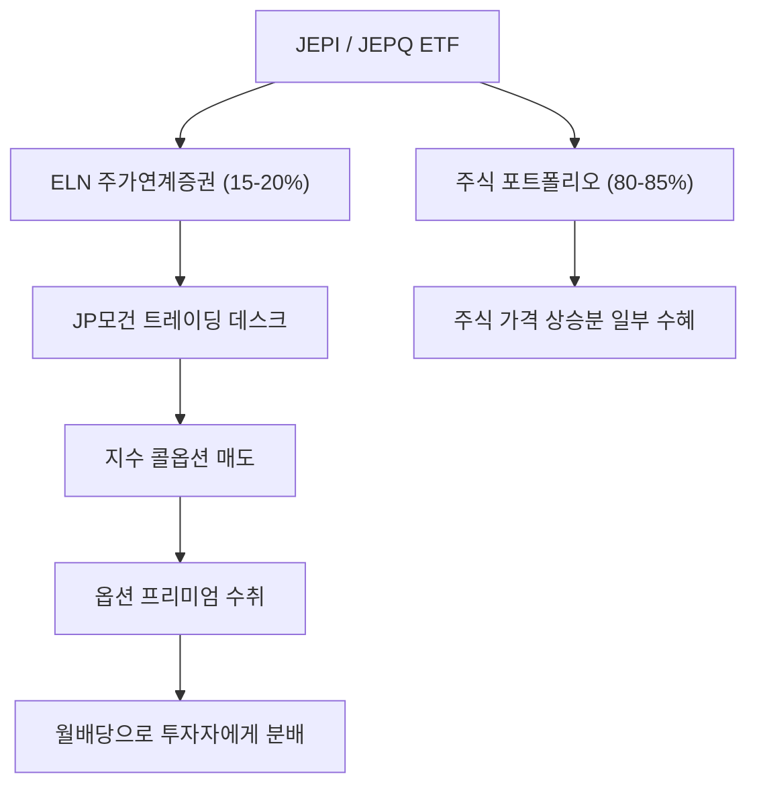
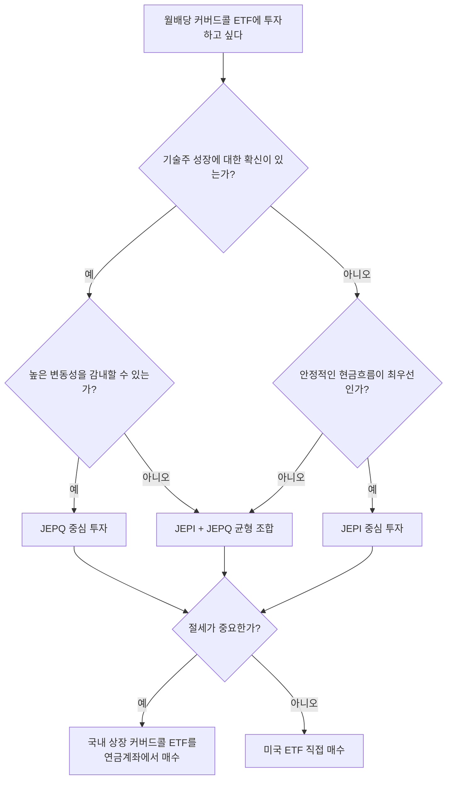

JEPI와 JEPQ는 모두 JP모건이 운용하는 커버드콜 ETF로, 매월 배당을 지급하면서도 주가 상승에 일부 참여할 수 있도록 설계된 상품이다. 합산 운용자산이 약 780억 달러에 달하는 세계 1, 2위 커버드콜 ETF인 만큼, 월배당 투자에 관심 있는 투자자라면 이 두 상품의 차이를 정확히 이해할 필요가 있다. 이 글에서는 투자 전략, 포트폴리오 구성, 배당수익률, 총수익률, 리스크를 비교하고, 투자자 유형별 선택 가이드를 제시한다.

# 1. 개요

## 1.1 JEPI와 JEPQ란 무엇인가

JEPI(JPMorgan Equity Premium Income ETF)와 JEPQ(JPMorgan Nasdaq Equity Premium Income ETF)는 JP모건 자산운용이 만든 커버드콜 ETF다. 둘 다 주식 포트폴리오를 보유하면서 동시에 주가연계증권(Equity-Linked Notes, ELN)을 활용한 옵션 전략을 병행하여 매월 배당금을 지급한다.

- **JEPI**: S&P 500 지수를 벤치마크로 하는 대형 가치주 중심의 포트폴리오
- **JEPQ**: Nasdaq-100 지수를 벤치마크로 하는 대형 성장주 중심의 포트폴리오

## 1.2 왜 이 두 ETF를 비교해야 하는가

같은 운용사가 동일한 ELN 전략을 사용하지만, 기초 자산이 완전히 다르다. JEPI는 안정적인 배당 수익에 초점을 맞추고, JEPQ는 기술주 성장에 베팅하면서 높은 배당을 추구한다. 최근 투자자들이 JEPI에서 JEPQ로 자금을 이동하는 흐름이 뚜렷한데, 이것이 자신에게도 적합한 선택인지 판단하려면 두 ETF의 구조적 차이를 정확히 이해해야 한다.

## 1.3 이 글에서 다루는 범위

이 글에서는 다음 항목을 중심으로 JEPI와 JEPQ를 비교한다.

- 기본 정보 및 상품 구조
- ELN 기반 커버드콜 투자 전략
- 포트폴리오 구성(섹터, 상위 종목)
- 배당수익률 및 월배당 내역
- 총수익률(배당 재투자 포함)
- 리스크 지표(변동성, MDD)
- 한국 투자자를 위한 세금 및 절세 전략
- 국내 상장 커버드콜 ETF와의 비교
- 투자자 유형별 선택 가이드

모든 데이터는 2026년 2월 기준이다.

# 2. 기본 정보 비교

## 2.1 ETF 개요

| 항목 | JEPI | JEPQ |
|------|------|------|
| 정식명칭 | JPMorgan Equity Premium Income ETF | JPMorgan Nasdaq Equity Premium Income ETF |
| 티커 | JEPI | JEPQ |
| 설정일 | 2020년 5월 20일 | 2022년 5월 3일 |
| 운용자산(AUM) | 약 441.5억 달러 | 약 339.3억 달러 |
| 총보수 | 0.35% | 0.35% |
| 벤치마크 | S&P 500 Total Return Index | Nasdaq-100 Index |
| 보유 종목 수 | 약 126개 | 약 108개 |
| 현재 주가 | 약 $59.49 | 약 $58.15 |

JEPI가 약 2년 먼저 상장되어 AUM에서 앞서지만, JEPQ도 상장 후 빠른 속도로 자산을 늘려가고 있다. 총보수는 0.35%로 동일하다.

## 2.2 운용사와 상품 구조

두 ETF 모두 JP모건 자산운용(J.P. Morgan Asset Management)이 운용하며, 액티브 ETF로 분류된다. 패시브 ETF가 지수를 그대로 복제하는 것과 달리, JEPI와 JEPQ는 펀드매니저가 종목 선정과 ELN 비중을 능동적으로 조절한다.

핵심 구조를 정리하면 다음과 같다.

- **주식 포트폴리오** (약 80~85%): 벤치마크 지수의 종목 중 선별하여 보유
- **ELN (약 15~20%)**: 콜옵션 매도 효과를 가진 구조화 상품으로 옵션 프리미엄 수취

이러한 구조 덕분에 지수를 100% 추종하지 않으면서도 옵션 프리미엄 수익을 배당으로 지급할 수 있다.

# 3. 투자 전략 — ELN 기반 커버드콜

## 3.1 커버드콜 전략이란

> 커버드콜(Covered Call)이란 주식을 보유한 상태에서 해당 주식의 콜옵션을 매도하는 전략이다. 옵션 매도 대가로 프리미엄(수수료)을 받고, 그 대신 주가가 일정 수준 이상으로 오를 때 추가 상승분을 포기한다.

쉽게 비유하면, 내가 가진 아파트에 대해 "3개월 안에 5억에 살 수 있는 권리"를 다른 사람에게 팔면서 계약금(프리미엄)을 받는 것과 비슷하다. 아파트 가격이 5억 아래에 머물면 계약금은 그대로 내 수익이 되고, 5억을 넘어 6억이 되더라도 5억에 넘겨야 한다. 커버드콜 전략도 이와 같은 원리로 작동한다.

## 3.2 ELN(Equity-Linked Notes) 구조

JEPI와 JEPQ는 일반 커버드콜 ETF와 달리 ELN(주가연계증권)을 활용한다. ELN은 JP모건의 트레이딩 데스크가 발행하는 구조화 상품으로, 내부적으로 S&P 500 또는 Nasdaq-100 지수에 대한 콜옵션 매도 포지션이 내장되어 있다.

ELN은 보통 1주일~1개월 단위로 만기가 돌아오며, 시장 변동성에 따라 프리미엄 수준이 달라진다. 변동성이 높을수록 옵션 프리미엄이 커지므로 배당금도 늘어나고, 반대로 시장이 안정적이면 배당금이 줄어드는 구조다.

## 3.3 일반 커버드콜 ETF(QYLD 등)와의 차이

기존의 대표적인 커버드콜 ETF인 QYLD(Global X Nasdaq 100 Covered Call ETF)와 비교하면 JEPI/JEPQ의 차별점이 명확해진다.

| 구분 | QYLD | JEPI / JEPQ |
|------|------|-------------|
| 옵션 매도 방식 | ATM(등가격) 콜옵션 100% 매도 | OTM(외가격) 콜옵션을 ELN으로 일부만 매도 |
| 옵션 매도 비중 | 포트폴리오 전체 | 약 15~20% |
| 상승 참여 | 거의 없음 | 일부 가능 |
| 배당 원천 | 옵션 프리미엄 100% | 옵션 프리미엄 + 주식 배당금 |
| 운용 방식 | 패시브 (기계적 매도) | 액티브 (매니저 재량) |

QYLD는 매월 ATM 콜옵션을 100% 매도하므로 프리미엄 수익은 높지만 주가 상승 참여가 사실상 불가능하다. 반면 JEPI/JEPQ는 포트폴리오의 일부(15~20%)만 ELN에 배분하고, OTM(외가격) 옵션을 활용하므로 주가가 오를 때 상승분의 상당 부분을 누릴 수 있다.

## 3.4 옵션 프리미엄과 배당금의 관계

JEPI와 JEPQ의 월배당금은 고정 금액이 아니라 매달 변동한다. 배당금에 영향을 주는 요인은 다음과 같다.

- **시장 변동성(VIX)**: 변동성이 높으면 옵션 프리미엄이 증가하여 배당금이 늘어난다
- **금리 수준**: 금리가 높으면 ELN 이자 수익이 추가되어 배당에 기여한다
- **기초 주식의 배당**: 보유 주식에서 나오는 배당금도 분배 재원에 포함된다
- **옵션 매도 비중**: 펀드매니저가 시장 상황에 따라 ELN 비중을 조절한다

2022년 같은 고변동성 장에서는 배당수익률이 10%를 넘기도 했고, 2023~2024년처럼 시장이 안정되면 배당수익률이 낮아지는 경향이 있다. 이 점에서 JEPI/JEPQ의 배당금은 채권 이자와 달리 예측하기 어렵다는 것을 인지해야 한다.

# 4. 포트폴리오 구성 차이

## 4.1 JEPI — S&P 500 기반 균등 분산

JEPI는 S&P 500 지수에 포함된 대형주 중에서 저변동성, 고배당 성향의 종목을 선별한다. 특정 종목에 집중하지 않고 균등하게 분산하는 것이 특징이다. 상위 10개 종목의 비중 합계가 약 15~18% 수준으로, 개별 종목 리스크가 낮다.

## 4.2 JEPQ — Nasdaq-100 기반 빅테크 집중

JEPQ는 Nasdaq-100 지수를 벤치마크로 하므로 기술주 비중이 압도적이다. 애플, 마이크로소프트, 엔비디아, 아마존 등 빅테크 종목이 포트폴리오 상위를 차지하며, 상위 10개 종목의 비중 합계가 약 40~50%에 달한다. 소수 종목에 대한 의존도가 높은 만큼 해당 종목의 실적에 민감하게 반응한다.

## 4.3 섹터 배분 비교

| 섹터 | JEPI | JEPQ |
|------|------|------|
| 정보기술(IT) | 13.8% | 41.8% |
| 금융 | 14.4% | 0.5% |
| 산업재 | 13.1~15.4% | 2.8% |
| 헬스케어 | 12.1% | 4.1% |
| 커뮤니케이션 서비스 | - | 12.7% |
| 임의소비재 | - | 11.2% |

JEPI는 다양한 섹터에 고르게 분산되어 있다. IT 비중이 13.8%에 불과하고, 금융(14.4%), 산업재(13.1~15.4%), 헬스케어(12.1%) 등이 비슷한 비중을 차지한다.

반면 JEPQ는 IT 섹터가 41.8%로 압도적이며, 커뮤니케이션 서비스(12.7%)와 임의소비재(11.2%)까지 합하면 기술/소비 관련 섹터가 전체의 약 65%를 차지한다.

## 4.4 상위 보유 종목 비교

| 순위 | JEPI 주요 종목 | JEPQ 주요 종목 |
|------|---------------|---------------|
| 1 | AbbVie (헬스케어) | 애플 (IT) |
| 2 | Progressive (금융) | 엔비디아 (IT) |
| 3 | Trane Technologies (산업재) | 마이크로소프트 (IT) |
| 4 | Meta Platforms (커뮤니케이션) | 아마존 (임의소비재) |
| 5 | Amazon (임의소비재) | 메타 (커뮤니케이션) |

JEPI의 상위 종목은 섹터가 다양하게 분포되어 있고, 종목 간 비중 차이가 크지 않다. JEPQ는 빅테크 종목이 상위를 차지하며, 상위 5개 종목만으로 전체 포트폴리오의 약 30%를 차지한다.

이 차이가 결국 배당수익률, 총수익률, 변동성 등 모든 성과 지표의 차이로 이어진다.

# 5. 배당 수익률 비교

## 5.1 현재 배당수익률

| 항목 | JEPI | JEPQ |
|------|------|------|
| 후행 12개월 배당수익률 | 7.97% | 10.56% |
| 30일 SEC 수익률 | 8.13% | 11.58% |

> 후행 12개월 배당수익률은 지난 12개월 동안 지급된 배당금 합계를 현재 주가로 나눈 값이다. 30일 SEC 수익률은 SEC(미국증권거래위원회) 공식에 따라 최근 30일간의 수익을 연환산한 값이다.

JEPQ의 배당수익률이 JEPI보다 약 2.6~3.5%p 높다. 이는 Nasdaq-100 지수의 변동성이 S&P 500보다 높아서 옵션 프리미엄이 더 크기 때문이다. 변동성이 큰 기초 자산에 대한 옵션일수록 프리미엄이 비싸지는 원리가 그대로 반영된 결과다.

## 5.2 월배당 내역 분석 (2025년 기준)

| 항목 | JEPI | JEPQ |
|------|------|------|
| 월배당 범위 | $0.33~$0.54 | $0.44~$0.62 |
| 분배 주기 | 매월 | 매월 |

두 ETF 모두 매월 배당을 지급하지만, 매달 금액이 달라진다. JEPI의 경우 2025년 월배당이 $0.33에서 $0.54까지 약 1.6배의 차이를 보이고, JEPQ는 $0.44에서 $0.62까지 약 1.4배의 범위를 보인다.

## 5.3 배당금 변동성과 예측 가능성

JEPI와 JEPQ 모두 배당금이 고정되지 않는다는 점은 동일하다. 다만, JEPI가 상대적으로 배당금 변동 폭이 더 크다. 이는 JEPI의 기초 자산인 S&P 500의 변동성이 낮아 시장 환경에 따라 프리미엄 수익이 크게 달라지기 때문이다.

배당 투자를 할 때 유의할 점은, 배당수익률이 높다고 무조건 좋은 것이 아니라는 것이다. 배당수익률이 높아 보이더라도 주가가 하락하면서 수익률이 올라간 것일 수 있으므로, 반드시 총수익률(배당 + 주가 변동)까지 함께 살펴봐야 한다.

# 6. 총수익률 비교

## 6.1 연도별 수익률 (배당 재투자 포함)

| 연도 | JEPI | JEPQ |
|------|------|------|
| 2023 | +9.83% | +36.25% |
| 2024 | +12.56% | +24.85% |

2023년에는 AI 열풍으로 기술주가 급등하면서 JEPQ가 JEPI를 약 26%p 앞섰다. 2024년에도 기술주 강세가 이어지며 JEPQ가 약 12%p 높은 수익률을 기록했다.

## 6.2 연환산 수익률

| 항목 | JEPI | JEPQ |
|------|------|------|
| 설정 이후 연환산 | 12.26% | 15.96% |

JEPQ가 설정 이후 연환산 수익률에서도 JEPI를 앞서고 있다. 다만, JEPQ는 2022년 5월에 상장되어 아직 비교 기간이 짧고, 상장 이후 기술주 강세장이 지속되었다는 점을 감안해야 한다. 기술주 약세장에서는 결과가 달라질 수 있다.

## 6.3 벤치마크(VOO, QQQ) 대비 성과

커버드콜 ETF는 구조적으로 주가 상승분의 일부를 포기하는 만큼, 강세장에서는 벤치마크 대비 수익률이 낮을 수밖에 없다.

- **JEPI vs VOO(S&P 500)**: 2023~2024년 강세장에서 VOO가 JEPI를 크게 앞섰다. VOO의 2023년 수익률이 약 26%, 2024년이 약 25%인 점을 감안하면 JEPI는 상당한 상승분을 놓쳤다.
- **JEPQ vs QQQ(Nasdaq-100)**: JEPQ도 QQQ 대비 수익률이 낮지만, JEPI-VOO 격차보다는 차이가 작다. JEPQ가 상승 참여도에서 상대적으로 나은 모습을 보여준다.

다만, 2022년 같은 하락장에서는 반대의 결과가 나타난다. 옵션 프리미엄이 하방 완충 역할을 하여 JEPI와 JEPQ 모두 벤치마크 대비 낙폭이 작았다.

# 7. 리스크 비교

## 7.1 변동성 (월간 표준편차)

| 항목 | JEPI | JEPQ |
|------|------|------|
| 월간 표준편차 | 2.64~3.1% | 4.2~4.63% |

JEPQ의 변동성이 JEPI의 약 1.5배 수준이다. Nasdaq-100의 기술주 특성이 그대로 반영된 결과다.

## 7.2 최대 낙폭(MDD)

| 항목 | JEPI | JEPQ |
|------|------|------|
| 최대 낙폭(MDD) | -13.71% | -20.07% |

> 최대 낙폭(Maximum Drawdown, MDD)이란 특정 기간 동안 최고점에서 최저점까지의 하락 폭을 나타내는 지표다. MDD가 클수록 투자 기간 중 겪을 수 있는 최대 손실이 크다는 의미다.

JEPI의 MDD는 -13.71%로, JEPQ(-20.07%)보다 약 6%p 낮다. 하락장에서 JEPI가 더 안정적이라는 뜻이다.

## 7.3 벤치마크 대비 변동성 감소 효과

| 항목 | JEPI | JEPQ |
|------|------|------|
| 벤치마크 대비 변동성 감소 | 약 34% | 약 26% |

JEPI는 S&P 500 대비 변동성을 약 34% 줄여주고, JEPQ는 Nasdaq-100 대비 약 26% 줄여준다. 두 ETF 모두 벤치마크보다 안정적이지만, JEPI의 변동성 감소 효과가 더 크다. 변동성 축소를 통한 안정적 수익 추구가 목적이라면 JEPI가 더 적합하다.

## 7.4 커버드콜 전략의 구조적 리스크

커버드콜 ETF 투자 시 인지해야 할 구조적 리스크는 다음과 같다.

- **상승 참여 제한**: 기초 자산이 급등할 때 수익이 cap(제한)된다. 특히 강세장이 길어질수록 벤치마크 대비 누적 수익 차이가 커진다.
- **하락장 방어 한계**: 옵션 프리미엄이 완충 역할을 하지만, 대폭락 시에는 주식 포트폴리오의 손실을 프리미엄으로 상쇄하기 어렵다. JEPQ의 MDD가 -20%인 것은 이를 잘 보여준다.
- **배당의 원금 침식 가능성**: 주가가 지속 하락하는데 배당을 계속 받으면, 실질적으로 원금이 줄어드는 효과가 발생한다. 배당수익률만 보고 투자하면 총수익률은 마이너스일 수 있다.
- **변동성 의존성**: 옵션 프리미엄은 변동성에 비례하므로, 저변동성 장기화 시 배당 매력이 크게 떨어진다.

# 8. 한국 투자자를 위한 세금 가이드

## 8.1 배당소득세 (미국 원천징수 + 국내 과세)

JEPI와 JEPQ에서 받는 월배당금에는 미국에서 15%의 원천징수세가 적용된다. 한미 조세조약에 따라 미국에서 원천징수된 세금은 국내에서 외국납부세액공제로 인정받을 수 있다.

- 미국 원천징수: 배당금의 15%
- 국내 배당소득세: 15.4% (원천징수세와 차이분만 추가 납부)

## 8.2 금융소득종합과세 주의사항

해외 ETF에서 받는 배당소득은 다른 금융소득(이자, 배당)과 합산하여 연간 2,000만 원을 초과하면 종합소득세 신고 대상이 된다. JEPI나 JEPQ에 큰 금액을 투자하면 월배당만으로도 연간 배당소득이 2,000만 원을 쉽게 초과할 수 있으므로 주의가 필요하다.

예를 들어, JEPQ에 약 2억 원을 투자하면 배당수익률 10% 기준 연간 약 2,000만 원의 배당소득이 발생한다. 이 금액이 다른 금융소득과 합산되면 종합과세 구간에 진입할 수 있다.

## 8.3 양도소득세

JEPI/JEPQ를 매도하여 발생한 매매차익에는 양도소득세 22%(지방소득세 포함)가 부과된다. 연간 250만 원의 기본공제가 있으며, 초과분에 대해 22%를 납부한다.

- 양도소득세율: 22% (양도소득세 20% + 지방소득세 2%)
- 기본공제: 연간 250만 원
- 신고/납부: 매년 5월 확정 신고

## 8.4 절세 전략 (ISA, 연금저축, IRP)

미국 상장 ETF인 JEPI/JEPQ는 ISA, 연금저축, IRP 계좌에서 직접 매수할 수 없다. 따라서 절세 효과를 누리려면 국내 상장 커버드콜 ETF를 활용해야 한다.

| 절세 계좌 | JEPI/JEPQ 직접 투자 | 국내 상장 커버드콜 ETF |
|----------|-------------------|--------------------|
| 일반 계좌 | 가능 | 가능 |
| ISA | 불가 | 가능 (비과세/9.9% 분리과세) |
| 연금저축 | 불가 | 가능 (3.3~5.5% 연금소득세) |
| IRP | 불가 | 가능 (3.3~5.5% 연금소득세) |

세금 부담이 큰 투자자라면, JEPI/JEPQ 대신 국내 상장된 유사 전략 ETF를 연금계좌에서 매수하는 방법이 효율적일 수 있다. 이에 대해서는 다음 장에서 상세히 비교한다.

# 9. 국내 상장 커버드콜 ETF와 비교

## 9.1 JEPI/JEPQ 대안 — 주요 국내 상장 커버드콜 ETF

JEPI와 JEPQ를 직접 매수하는 대신 국내 시장에 상장된 유사 전략 ETF를 활용할 수 있다. 커버드콜 전략 유형에 따라 크게 세 가지로 분류된다.

- **타겟 커버드콜**: 연간 목표 프리미엄만큼만 옵션을 매도하여 기초자산 상승에 일부 참여 가능
- **데일리 커버드콜**: 매일 단기 옵션을 매도하여 프리미엄을 누적하는 방식
- **월간 ATM 커버드콜**: 매월 ATM(등가격) 콜옵션을 100% 매도하여 가장 높은 프리미엄을 추구

### JEPI 대안 — S&P 500/배당주 기반

| ETF명 | 종목코드 | 운용사 | 총보수 | 목표 분배율 | 분배주기 |
|-------|---------|--------|--------|-----------|---------|
| TIGER 미국배당+7%프리미엄다우존스 | 458760 | 미래에셋 | 0.39% | 연 약 10% | 월배당 |
| TIGER 미국배당다우존스타겟데일리커버드콜 | 0008S0 | 미래에셋 | 0.25% | 연 12% | 월배당 |
| KODEX 미국S&P500배당귀족커버드콜(합성 H) | 276970 | 삼성자산운용 | 0.30% | 연 7.2% | 분기배당 |
| ACE 미국500 15%프리미엄분배(합성) | 480030 | 한국투자신탁운용 | 0.45% | 연 15% | 월배당 |

### JEPQ 대안 — 나스닥/테크 기반

| ETF명 | 종목코드 | 운용사 | 총보수 | 목표 분배율 | 분배주기 |
|-------|---------|--------|--------|-----------|---------|
| TIGER 미국나스닥100커버드콜(합성) | 441680 | 미래에셋 | 0.37% | 연 약 12% | 월배당 |
| TIGER 미국테크TOP10+10%프리미엄 | 474220 | 미래에셋 | 0.50% | 연 10% | 월배당 |
| ACE 미국빅테크7+15%프리미엄분배(합성) | 480020 | 한국투자신탁운용 | 0.45% | 연 15% | 월배당 |

## 9.2 세금 구조 비교 (국내 상장 vs 미국 직접 투자)

| 구분 | 국내 상장 해외주식형 ETF | 미국 상장 ETF (JEPI/JEPQ) |
|------|----------------------|--------------------------|
| 매매차익 과세 | 배당소득세 15.4% | 양도소득세 22% (250만원 공제) |
| 분배금 과세 | 배당소득세 15.4% | 미국 원천징수 15% |
| 금융소득종합과세 | 해당 (2,000만원 초과 시) | 해당 없음 (분리과세) |
| ISA 계좌 | 가능 (비과세/9.9% 분리과세) | 불가 |
| 연금저축/IRP | 가능 (3.3~5.5% 연금소득세) | 불가 |

## 9.3 국내 상장 ETF의 장단점

**장점**:

- 연금계좌(ISA, 연금저축, IRP)에서 매수 가능하여 절세 효과가 크다
- 원화로 거래하므로 환전 수수료가 없다
- 총보수가 JEPI/JEPQ(0.35%)와 비슷하거나 더 낮은 상품도 있다
- 국내 세법에 맞춰 설계되어 세무 관리가 간편하다

**단점**:

- AUM(운용 자산)이 JEPI/JEPQ에 비해 훨씬 작아 유동성 리스크가 있다
- 합성 ETF의 경우 스왑 거래 상대방 리스크가 존재한다
- 트랙 레코드가 짧아 장기 성과를 검증하기 어렵다
- JEPI/JEPQ의 ELN 전략을 정확히 복제하는 상품은 없으므로 수익 구조가 다를 수 있다

## 9.4 어떤 방식이 유리한가 — 투자 규모별 판단 기준

투자 규모와 세금 상황에 따라 유리한 방식이 달라진다.

- **소규모 투자 (1,000만 원 이하)**: 국내 상장 ETF를 연금계좌에서 매수하는 것이 절세 면에서 유리하다. 연금저축 납입한도(연 1,800만 원) 범위에서 활용할 수 있다.
- **중규모 투자 (1,000만~5,000만 원)**: 연금계좌 한도를 최대한 활용하고, 초과분은 JEPI/JEPQ 직접 투자를 고려한다. 양도소득세 250만 원 공제를 활용하면 세금 부담을 줄일 수 있다.
- **대규모 투자 (5,000만 원 이상)**: 금융소득종합과세를 고려해야 한다. 국내 상장 ETF는 분배금이 금융소득에 포함되므로, 금융소득이 이미 2,000만 원에 근접한 투자자는 미국 ETF 직접 투자가 유리할 수 있다(양도소득 분리과세 적용).

# 10. JEPI vs JEPQ 핵심 비교 요약

지금까지 살펴본 내용을 종합하여 핵심 지표를 한눈에 비교한다.

| 항목 | JEPI | JEPQ |
|------|------|------|
| 벤치마크 | S&P 500 | Nasdaq-100 |
| 설정일 | 2020.05 | 2022.05 |
| AUM | 441.5억 달러 | 339.3억 달러 |
| 총보수 | 0.35% | 0.35% |
| 후행 12개월 배당수익률 | 7.97% | 10.56% |
| 30일 SEC 수익률 | 8.13% | 11.58% |
| 설정 이후 연환산 수익률 | 12.26% | 15.96% |
| 월간 변동성 | 2.64~3.1% | 4.2~4.63% |
| 최대 낙폭(MDD) | -13.71% | -20.07% |
| 벤치마크 대비 변동성 감소 | 약 34% | 약 26% |
| 포트폴리오 특성 | 섹터 분산, 저변동성 | 빅테크 집중, 고성장 |
| 핵심 강점 | 안정성, 하방 보호 | 높은 배당, 성장 참여 |

한마디로 요약하면 다음과 같다.

- **JEPI** = 안정적인 월배당 + 하방 보호. "잠 편히 자면서 배당 받겠다"는 투자자에게 적합
- **JEPQ** = 높은 배당 + 기술주 성장 참여. "배당도 받으면서 기술주 상승도 어느 정도 누리겠다"는 투자자에게 적합

# 11. 투자자 유형별 선택 가이드

## 11.1 JEPI가 적합한 투자자

- **은퇴 후 안정적인 현금흐름이 필요한 투자자**: MDD가 낮고 변동성이 작아 원금 보존에 유리하다
- **보수적인 투자 성향**: 기술주 변동에 민감하지 않고, 꾸준한 수익을 추구한다
- **포트폴리오 방어 수단이 필요한 투자자**: 기존 주식 포트폴리오의 변동성을 줄이면서 인컴을 확보하고 싶을 때

## 11.2 JEPQ가 적합한 투자자

- **기술주 장기 성장에 대한 확신이 있는 투자자**: Nasdaq-100의 상승 잠재력에 베팅하면서 배당도 받고 싶을 때
- **높은 배당수익률을 우선시하는 투자자**: 배당수익률 10% 이상의 월배당을 원할 때
- **변동성을 감내할 수 있는 투자자**: MDD -20% 수준의 하락을 감당할 수 있고, 장기 투자 관점에서 접근할 때

## 11.3 두 ETF 조합 전략

반드시 하나만 선택할 필요는 없다. JEPI와 JEPQ를 조합하면 안정성과 성장성의 균형을 맞출 수 있다.

- **안정 중시 (JEPI 70% + JEPQ 30%)**: 기본적으로 안정적인 인컴을 확보하면서, 기술주 성장에 소량 참여
- **균형형 (JEPI 50% + JEPQ 50%)**: 두 ETF의 장단점을 균등하게 혼합
- **성장 중시 (JEPI 30% + JEPQ 70%)**: 높은 배당과 기술주 성장을 추구하되, JEPI로 변동성을 일부 완충

투자자의 연령, 투자 목적, 위험 감내 능력에 따라 비율을 조절하면 된다.

# 12. 마무리

JEPI와 JEPQ는 같은 JP모건의 ELN 전략을 사용하지만, 기초 자산의 차이가 배당수익률, 총수익률, 변동성 등 모든 면에서 확연한 차이를 만들어낸다.

JEPI는 S&P 500 기반의 분산 포트폴리오로 안정성에 강점이 있고, JEPQ는 Nasdaq-100 기반으로 높은 배당과 성장 참여에 강점이 있다. 어느 쪽이 절대적으로 우월한 것이 아니라, 투자자의 목적과 상황에 따라 선택이 달라져야 한다.

한국 투자자라면 세금 구조까지 고려해서 미국 ETF 직접 투자와 국내 상장 커버드콜 ETF 중 어느 것이 유리한지 비교하는 것도 빠뜨리지 말자. 특히 연금계좌를 활용할 수 있는 국내 상장 ETF는 장기 절세 효과가 크므로, 투자 규모와 세금 상황을 종합적으로 판단하는 것이 바람직하다.

# 13. 참고

- [Stock Analysis - JEPI vs JEPQ Comparison](https://stockanalysis.com/etf/compare/jepi-vs-jepq/)
- [JP Morgan JEPI Fact Sheet](https://am.jpmorgan.com/content/dam/jpm-am-aem/americas/us/en/literature/fact-sheet/etfs/FS-JEPI.PDF)
- [JP Morgan JEPQ Fact Sheet](https://am.jpmorgan.com/content/dam/jpm-am-aem/americas/us/en/literature/fact-sheet/etfs/FS-JEPQ.PDF)
- [PortfoliosLab - JEPI vs JEPQ](https://portfolioslab.com/tools/stock-comparison/JEPI/JEPQ)
- [Stock Analysis - JEPI Dividend History](https://stockanalysis.com/etf/jepi/dividend/)
- [Stock Analysis - JEPQ Dividend History](https://stockanalysis.com/etf/jepq/dividend/)
- [FinanceCharts - JEPI Total Return](https://www.financecharts.com/etfs/JEPI/performance/total-return)
- [FinanceCharts - JEPQ Total Return](https://www.financecharts.com/etfs/JEPQ/performance/total-return)
- [ETF.com - Investors Pivot to JEPQ](https://www.etf.com/sections/features/investors-pivot-jepq-returns-outpace-jepi)
