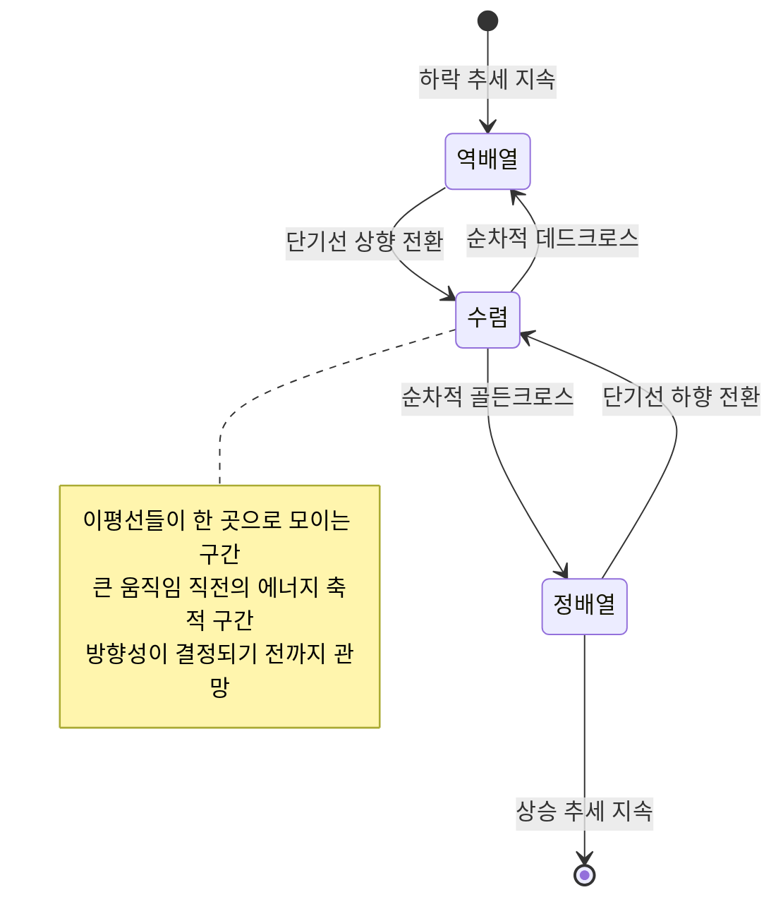
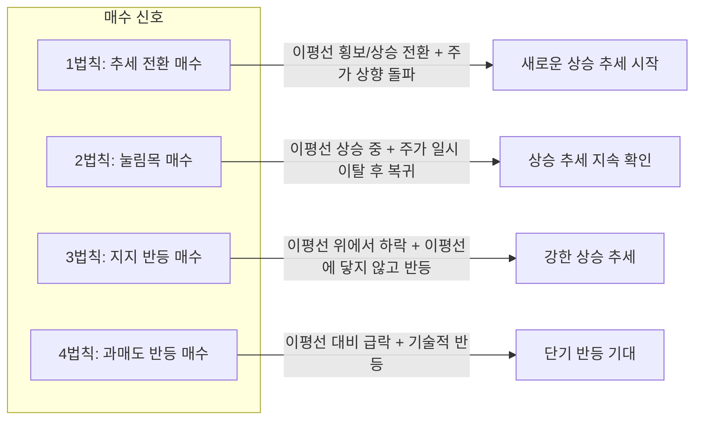
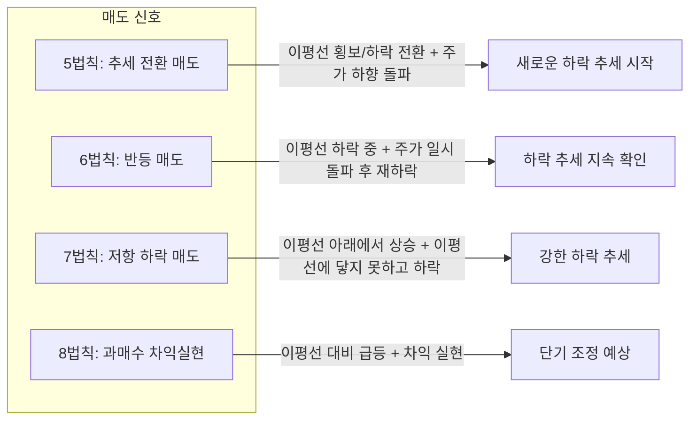

# 1. 개요

주식 차트를 보면 주가 위아래로 여러 색의 곡선이 따라다니는 것을 볼 수 있다. 이것이 바로 `이동평균선`(이평선)이다. 뉴스에서 "골든크로스가 발생했다", "데드크로스 경고" 같은 표현을 자주 접하지만, 단순히 "골든크로스 = 매수", "데드크로스 = 매도"로 해석하면 낭패를 볼 수 있다.

이동평균선은 기술적 분석에서 가장 기본이면서도 가장 널리 사용되는 도구이다. 주가의 추세를 파악하고, 매수/매도 시점을 판단하는 데 핵심적인 역할을 한다.

이 글에서는 이동평균선의 기본 개념부터 정배열/역배열, 골든크로스/데드크로스, 이평선의 지지와 저항, 그랜빌의 8법칙, 그리고 실전 매매 전략까지 체계적으로 정리한다.

------

# 2. 이동평균선의 기본 개념

## 2.1 이동평균선(Moving Average)이란

`이동평균선`은 일정 기간 동안의 주가(종가)를 평균한 값을 연결해 만든 선이다. 미국의 기술적 분석가 그랜빌(J.E. Granville)이 고안한 개념으로, 주가의 방향성과 추세를 한눈에 파악할 수 있게 해준다.

예를 들어 `5일 이동평균선`은 최근 5일 동안의 종가를 더해서 5로 나눈 값을 매일 이어서 그린 선이다. 매일 새로운 종가가 추가되고 가장 오래된 종가가 빠지면서 평균값이 "이동"하기 때문에 이동평균이라고 부른다.

이동평균선이 중요한 이유는 하루하루의 주가 변동에서 오는 노이즈(잡음)를 줄여주기 때문이다. 일별 종가만 보면 오르락내리락해서 방향을 알기 어렵지만, 이동평균선을 함께 보면 전체적인 추세가 상승인지 하락인지 직관적으로 판단할 수 있다.

## 2.2 단기, 중기, 장기 이동평균선

이동평균선은 계산에 사용하는 기간에 따라 단기, 중기, 장기로 나뉜다. 기간이 짧을수록 주가 변화에 민감하게 반응하고, 길수록 느리지만 큰 흐름을 보여준다.

| 구분 | 기간 | 별칭 | 의미 |
|------|------|------|------|
| 단기 | 5일 | 주봉선 | 1주일간의 평균, 매우 민감한 단기 흐름 |
| 단기 | 10일 | - | 2주간의 평균, 단기 매매에 활용 |
| 단기 | 20일 | 세력선 | 약 1개월간의 평균, 세력의 개입 여부 파악 |
| 중기 | 60일 | 수급선 | 약 3개월(1분기)간의 평균, 업황과 실적의 존재 여부 파악 |
| 중기 | 120일 | 경기선 | 약 6개월간의 평균, 업황과 실적의 지속성 파악 |
| 장기 | 240일 | 대세이평선 | 약 1년간의 평균, 대세 상승/하락의 판단 기준 |

<!-- TODO: TradingView에서 5일/20일/60일/120일 이평선이 모두 표시된 차트 캡처 -->

각 이평선은 서로 다른 시간 축의 투자자 심리를 반영한다. 5일선은 이번 주 매수한 투자자의 평균 매입가를, 240일선은 지난 1년간 매수한 투자자의 평균 매입가를 나타낸다고 볼 수 있다.

> 참고: 한국 시장에서는 주로 5/20/60/120일 이평선을 사용하고, 미국 시장에서는 10/50/100/200일 이평선을 많이 사용한다. 차이가 있지만 원리는 동일하다.

## 2.3 이동평균선의 계산 방법

이 글에서 다루는 이동평균선은 `단순이동평균(SMA, Simple Moving Average)`이다. 계산 방법은 매우 간단하다.

**계산 공식:**

```
N일 이동평균 = (최근 N일간의 종가 합계) / N
```

**계산 예시 (5일 이동평균):**

| 거래일 | 종가 |
|--------|------|
| 1일차 | 50,000원 |
| 2일차 | 51,000원 |
| 3일차 | 50,500원 |
| 4일차 | 52,000원 |
| 5일차 | 51,500원 |

5일 이동평균 = (50,000 + 51,000 + 50,500 + 52,000 + 51,500) / 5 = **51,000원**

6일차에 종가가 53,000원이라면, 가장 오래된 1일차(50,000원)를 빼고 6일차(53,000원)를 더한다.

새로운 5일 이동평균 = (51,000 + 50,500 + 52,000 + 51,500 + 53,000) / 5 = **51,600원**

이렇게 매일 새로운 값이 계산되어 연결되면 하나의 곡선, 즉 이동평균선이 만들어진다. 모든 날짜의 종가에 동일한 가중치를 부여하는 것이 단순이동평균의 특징이다.

------

# 3. 이동평균선의 배열 -- 정배열과 역배열

이동평균선 여러 개를 차트에 동시에 표시하면, 이들의 순서(배열)를 통해 현재 시장의 추세를 한눈에 파악할 수 있다.

## 3.1 정배열이란

`정배열`은 위에서부터 주가, 단기 이평선, 중기 이평선, 장기 이평선 순서로 배열된 상태를 말한다.

```
주가 > 5일선 > 20일선 > 60일선 > 120일선
```

<!-- TODO: TradingView에서 정배열 차트 캡처 -->

현재 주가가 지속적으로 상승하면 자연스럽게 나타나는 현상이다. 최근에 매수한 투자자일수록 높은 가격에 샀다는 뜻이며, 모든 시간 축에서 매수자가 수익 구간에 있다는 것을 의미한다.

정배열 상태에서는 상승 추세가 유지되고 있다고 판단할 수 있으며, 대체로 매도 시점이 아직 오지 않았다고 본다. 다만 주가와 단기 이평선이 점차 가까워지거나 단기 이평선끼리 수렴하기 시작하면 추세 약화의 신호이므로 매도 시점을 고려해야 한다.

## 3.2 역배열이란

`역배열`은 정배열과 반대로, 장기 이평선이 가장 위에 있고 그 아래로 중기, 단기 이평선, 주가 순서로 배열된 상태이다.

```
120일선 > 60일선 > 20일선 > 5일선 > 주가
```

<!-- TODO: TradingView에서 역배열 차트 캡처 -->

한마디로 정리하면 모든 시간 축에서 매수자가 손실 구간에 있다는 뜻이며, 앞으로도 더 내려갈 수 있는 하락 추세라는 것이다. 역배열 상태에서 매수하는 것은 "떨어지는 칼날을 잡는 것"에 비유되며, 골든크로스의 기미가 보일 때까지는 관망하는 것이 안전하다.

## 3.3 배열 전환의 의미

정배열과 역배열은 고정된 상태가 아니라 시간이 지나면서 서로 전환된다. 이 전환 과정을 이해하는 것이 실전 매매에서 매우 중요하다.



**역배열에서 정배열로의 전환 과정:**

1. 주가가 바닥을 찍고 5일선 위로 올라선다
2. 5일선이 20일선을 상향 돌파한다 (첫 번째 골든크로스)
3. 20일선이 60일선을 상향 돌파한다
4. 60일선이 120일선을 상향 돌파한다 (완전한 정배열 달성)

이 과정은 하락 추세의 깊이에 따라 수주에서 수개월이 걸릴 수 있다. 정배열에서 역배열로의 전환도 동일한 과정이 반대 방향으로 진행된다.

이평선들이 한 곳으로 수렴하는 구간은 시장이 방향을 정하지 못한 횡보 구간이다. 수렴 이후 이평선들이 다시 벌어지면서 정배열이 되면 강한 상승 추세가, 역배열이 되면 강한 하락 추세가 이어지는 경우가 많다.

------

# 4. 골든크로스와 데드크로스

## 4.1 골든크로스(Golden Cross)

`골든크로스`는 단기 이동평균선이 장기 이동평균선을 아래에서 위로 교차하여 돌파하는 것을 말한다. "황금의 교차"라는 뜻으로, 상승 추세로의 전환을 알리는 매수 신호로 해석된다.

<!-- TODO: TradingView에서 골든크로스 차트 캡처 -->

예를 들어 20일 이평선이 60일 이평선을 아래에서 위로 뚫고 올라가면 골든크로스가 발생한 것이다. 이는 최근 한 달간의 평균 매입가가 최근 3개월간의 평균 매입가보다 높아졌다는 의미로, 단기적으로 매수세가 강해지고 있음을 나타낸다.

주요 골든크로스 조합은 다음과 같다.

| 조합 | 특징 |
|------|------|
| 20일 / 60일 | 한국 시장에서 자주 사용, 비교적 빠른 신호 |
| 50일 / 200일 | 미국 시장 기준 가장 대표적인 조합, 신뢰도가 높지만 후행성이 큼 |
| 5일 / 20일 | 단기 매매용, 신호가 잦고 속임 신호 비율이 높음 |

## 4.2 데드크로스(Dead Cross)

`데드크로스`는 골든크로스의 반대 개념이다. 단기 이동평균선이 장기 이동평균선을 위에서 아래로 교차하여 하락하는 것을 말한다. "죽음의 교차"라는 의미로, 하락 추세로의 전환을 경고하는 매도 신호로 해석된다.

<!-- TODO: TradingView에서 데드크로스 차트 캡처 -->

예를 들어 20일 이평선이 60일 이평선을 뚫고 아래로 내려가면 데드크로스라고 본다. 최근 매수자의 평균 매입가가 이전 매수자보다 낮아졌다는 뜻으로, 매도 압력이 커지고 있음을 시사한다.

## 4.3 크로스 신호의 한계

골든크로스와 데드크로스는 유용한 신호이지만, 맹신하면 안 된다. 몇 가지 중요한 한계가 있다.

**후행 지표라는 본질적 한계**

이동평균선 자체가 과거 데이터를 기반으로 하기 때문에, 크로스 신호는 이미 추세가 상당히 진행된 후에 나타난다. 골든크로스가 발생했을 때는 이미 저점에서 상당히 올라온 상태인 경우가 많다.

**횡보장에서의 속임 신호(Whipsaw)**

주가가 뚜렷한 방향 없이 횡보할 때, 이평선이 서로 교차를 반복하면서 골든크로스와 데드크로스가 번갈아 발생한다. 이 신호를 그대로 따르면 "사자마자 내리고, 팔자마자 오르는" 상황이 반복된다. 연구에 따르면 이동평균선 교차 전략의 속임 신호 비율은 57%에서 76%에 달한다.

**속임 신호를 줄이는 방법:**

- 크로스 발생 후 며칠간 지켜보며 추세가 지속되는지 확인한다
- 거래량이 동반되는지 확인한다 (거래량 증가 없는 크로스는 신뢰도가 낮다)
- 하나의 크로스만 보지 말고, 전체 이평선 배열 상태를 함께 확인한다
- 거래량, RSI 등 다른 보조지표와 함께 종합적으로 판단한다

------

# 5. 이동평균선의 지지와 저항

이동평균선은 단순히 추세를 보여주는 것을 넘어, 주가의 지지선과 저항선 역할도 한다. 고정된 수평선이 아니라 매일 값이 바뀌는 "움직이는 지지/저항선"이라는 점이 특징이다.

## 5.1 이평선이 지지선 역할을 하는 경우

상승 추세에서 주가가 하락하다가 이동평균선 근처에서 반등하는 경우가 자주 발생한다.

<!-- TODO: TradingView에서 이평선 지지 사례 차트 캡처 -->

이런 현상이 발생하는 이유는, 수많은 투자자가 동일한 이평선을 보면서 "이 가격대에서 사야겠다"고 판단하기 때문이다. 20일 이평선이나 60일 이평선 근처로 주가가 내려오면 매수세가 유입되어 실제로 지지 역할을 하게 된다. 일종의 자기실현적 예언인 셈이다.

일반적으로 기간이 긴 이평선일수록 지지력이 강하다.

| 이평선 | 지지/저항 강도 | 비고 |
|--------|---------------|------|
| 5~20일 | 약~중 | 자주 이탈되며 단기 매매에 활용 |
| 60일 | 중~강 | 기관 투자자도 주목하는 수급선 |
| 120일 | 강 | 중장기 추세의 핵심 지지선 |
| 240일(200일) | 매우 강 | 전 세계 기관 투자자의 기준선 |

특히 240일(미국 시장에서는 200일) 이평선은 가장 중요한 지지/저항선으로 꼽힌다. 1960년 이후 S&P 500은 200일 이평선 위에서 거래된 시간이 전체의 약 70%에 달한다. 대형 기관, 연기금, 헤지펀드 등이 이 이평선을 투자 판단의 기준으로 삼기 때문에, 이 선 근처에서의 대규모 매수/매도가 지지와 저항 효과를 더욱 증폭시킨다.

## 5.2 이평선이 저항선 역할을 하는 경우

반대로 하락 추세에서는 이동평균선이 저항선 역할을 한다. 주가가 반등하더라도 위에 있는 이평선에 부딪혀 다시 내려오는 패턴이 반복된다.

<!-- TODO: TradingView에서 이평선 저항 사례 차트 캡처 -->

역배열 상태에서 주가가 일시적으로 반등해도, 20일선이나 60일선에서 매도 물량이 쏟아지면서 다시 하락하는 모습을 자주 볼 수 있다. 이전에 높은 가격에 매수한 투자자들이 손실을 줄이기 위해 이평선 근처에서 매도하기 때문이다.

## 5.3 지지/저항 돌파의 의미

주가가 이동평균선의 지지 또는 저항을 돌파하면 의미 있는 추세 전환 신호가 될 수 있다.

**지지 이탈**: 상승 추세에서 주가가 핵심 이평선(60일선, 120일선 등)을 아래로 이탈하면 추세 전환의 경고 신호이다.

**저항 돌파**: 하락 추세에서 주가가 핵심 이평선을 위로 돌파하면 새로운 상승 추세의 시작 가능성을 시사한다.

이때 중요한 것은 거래량이다. 거래량을 동반한 돌파는 신뢰도가 높고, 거래량 없는 돌파는 속임 신호일 가능성이 높다. 또한 이전에 지지선이었던 이평선이 돌파된 후에는 저항선으로 역할이 바뀌는 경우가 많다. 이를 "역할 전환(Role Reversal)"이라고 한다.

------

# 6. 그랜빌의 이동평균선 8법칙

그랜빌(Joseph Granville)은 1963년에 주가와 이동평균선의 관계를 8가지 법칙으로 정리했다. 이 법칙은 매수 신호 4가지와 매도 신호 4가지로 구성되며, 이동평균선 활용의 핵심이라고 할 수 있다.

> 참고: 그랜빌의 법칙은 일반적으로 200일 이동평균선을 기준으로 설명되지만, 다른 기간의 이평선에도 동일한 원리가 적용된다.

## 6.1 매수 신호 4가지



**1법칙: 추세 전환 매수**

이평선이 하락하다가 횡보 또는 상승으로 전환되는 시점에서, 주가가 이평선을 아래에서 위로 돌파할 때 매수 신호이다.

하락 추세가 끝나고 새로운 상승 추세가 시작되는 가장 이른 신호이다. 가장 큰 수익을 기대할 수 있지만, 추세 전환이 확인되지 않은 상태이므로 위험도 크다.

**2법칙: 눌림목 매수**

이평선이 상승 추세를 유지하는 중에, 주가가 일시적으로 이평선 아래로 하락했다가 다시 이평선 위로 복귀할 때 매수 신호이다.

이미 확립된 상승 추세에서 발생하는 일시적 조정(눌림목)이다. 이평선이 계속 상승하고 있다는 것은 전체 추세가 여전히 건재하다는 뜻이므로, 비교적 안전한 매수 기회로 볼 수 있다.

**3법칙: 지지 반등 매수**

주가가 상승 중인 이평선 위에서 하락하다가, 이평선에 닿지 않고 다시 상승할 때 매수 신호이다.

이평선이 닿기도 전에 반등했다는 것은 매수세가 그만큼 강하다는 뜻이다. 상승 추세가 잘 유지되고 있음을 보여주는 가장 신뢰도 높은 매수 신호 중 하나이다.

**4법칙: 과매도 반등 매수**

주가가 하락 중인 이평선에서 크게 벗어나 급락했을 때, 기술적 반등을 기대하고 매수하는 신호이다.

주가가 이평선으로부터 지나치게 멀어지면(과매도 상태) 평균으로 되돌아가려는 힘이 작용한다. 다만 이것은 추세 전환이 아니라 단기 반등을 노리는 역추세 매매이므로, 가장 공격적이고 위험한 매수 신호이다. 손절 기준을 명확히 설정해야 한다.

> 참고: 주가가 이평선으로부터 얼마나 벗어났는지를 수치로 나타낸 것을 이격도라고 한다. 이격도에 대한 상세한 내용은 별도 글에서 다룰 예정이다.

## 6.2 매도 신호 4가지



**5법칙: 추세 전환 매도**

이평선이 상승하다가 횡보 또는 하락으로 전환되는 시점에서, 주가가 이평선을 위에서 아래로 돌파할 때 매도 신호이다. 1법칙의 정반대 상황으로, 상승 추세가 끝나고 하락 추세가 시작될 수 있음을 경고한다.

**6법칙: 반등 매도**

이평선이 하락 추세를 유지하는 중에, 주가가 일시적으로 이평선 위로 올라갔다가 다시 이평선 아래로 떨어질 때 매도 신호이다. 하락 추세 속의 일시적 반등(속칭 "데드캣 바운스")일 뿐, 전체 추세는 여전히 하락이라는 뜻이다.

**7법칙: 저항 하락 매도**

주가가 하락 중인 이평선 아래에서 상승하다가, 이평선에 닿지 못하고 다시 하락할 때 매도 신호이다. 이평선이 저항선으로 작용하여 주가가 돌파하지 못한 것이며, 하락 추세가 강하게 유지되고 있음을 보여준다.

**8법칙: 과매수 차익실현**

주가가 상승 중인 이평선에서 크게 벗어나 급등했을 때, 차익 실현을 고려하는 매도 신호이다. 주가가 이평선으로부터 지나치게 멀어지면(과매수 상태) 조정이 올 가능성이 높다. 다만 이것은 추세 자체의 전환 신호가 아니라, 과열 구간에서의 이익 실현 기회를 의미한다.

## 6.3 8법칙 정리

| 번호 | 유형 | 이평선 방향 | 주가 움직임 | 신호 |
|------|------|------------|------------|------|
| 1 | 매수 | 하락 후 횡보/상승 전환 | 이평선 상향 돌파 | 추세 전환 매수 |
| 2 | 매수 | 상승 중 | 이평선 아래 이탈 후 복귀 | 눌림목 매수 |
| 3 | 매수 | 상승 중 | 이평선에 닿지 않고 반등 | 지지 반등 매수 |
| 4 | 매수 | 하락 중 | 이평선 대비 급락 | 과매도 반등 매수 |
| 5 | 매도 | 상승 후 횡보/하락 전환 | 이평선 하향 돌파 | 추세 전환 매도 |
| 6 | 매도 | 하락 중 | 이평선 위 돌파 후 재하락 | 반등 매도 |
| 7 | 매도 | 하락 중 | 이평선에 닿지 못하고 하락 | 저항 하락 매도 |
| 8 | 매도 | 상승 중 | 이평선 대비 급등 | 과매수 차익실현 |

------

# 7. 실전 매매 전략

지금까지 배운 이론을 실전에 적용하려면, 개별 신호를 단편적으로 보는 것이 아니라 이평선의 배열 상태와 크로스 신호를 종합적으로 판단해야 한다. 특히 "항상 골든크로스가 매수 신호이고, 모든 데드크로스가 매도 신호"는 아니라는 점이 핵심이다. 정반대로 해석해야 하는 경우도 있다.

## 7.1 매수 시점 판단

### 7.1.1 역배열에서 골든크로스 발생

역배열인 상황에서 모든 이평선이 하락 추세인 상태에서 5일선이 10일선, 20일선을 상향 돌파하고, 이어서 10일선도 20일선을 상향 돌파하면 추세가 상승으로 전환되고 있다는 신호이다. 이는 그랜빌 1법칙에 해당하는 상황으로, 초기 매수 시점으로 판단할 수 있다.

<!-- TODO: TradingView에서 역배열→골든크로스 전환 차트 캡처 -->

다만 장기 이평선(120일, 240일)이 여전히 하락 중이라면 완전한 추세 전환이 아닐 수 있으므로, 장기 이평선이 최소한 횡보로 전환되었는지 확인하는 것이 안전하다.

### 7.1.2 데드크로스이지만 매수해야 하는 경우

일봉에서 5일선과 20일선이 데드크로스를 그리더라도, 120일선이나 240일선이 상승 추세를 이어가고 있다면 상황이 다르다. 이 경우 단기적으로는 조정이지만 큰 그림에서는 상승 추세가 유지되고 있으므로, 데드크로스가 오히려 매수 기회가 될 수 있다.

<!-- TODO: TradingView에서 단기 데드크로스 + 장기선 상승 사례 차트 캡처 -->

이것이 가능한 이유는 상승 추세 중에도 주가는 직선으로 올라가지 않고 파도처럼 오르내리기 때문이다. 단기 이평선의 데드크로스는 이 파도의 일시적 하락 구간(조정)일 뿐이며, 장기 이평선의 상승이 지속되는 한 전체 방향은 여전히 위를 향하고 있다. 그랜빌 2법칙과 동일한 맥락이다.

**핵심 판단 기준:**

| 단기선 (5일, 20일) | 장기선 (120일, 240일) | 해석 |
|-------------------|---------------------|------|
| 데드크로스 | 상승 추세 유지 | 일시적 조정, 매수 기회 가능 |
| 데드크로스 | 횡보 또는 하락 전환 | 추세 전환 경고, 매수 보류 |

## 7.2 매도 시점 판단

### 7.2.1 정배열에서 데드크로스 발생

정배열에서 데드크로스가 발생하는 경우이다. 상승 추세에 있던 이평선 중 5일선이 10일선, 20일선을 하향 돌파하고, 이어서 10일선도 20일선을 하향 돌파하면서 추세가 하락으로 전환되는 것을 확인할 수 있다. 이런 경우에는 매도해야 하는 시점이 왔다고 판단하는 것이 좋다. 그랜빌 5법칙에 해당한다.

<!-- TODO: TradingView에서 정배열→데드크로스 전환 차트 캡처 -->

### 7.2.2 골든크로스이지만 매도해야 하는 경우

전체적으로 역배열인 상태에서 단기 이평선 사이에 골든크로스가 발생하는 경우가 있다. 이때는 매수 신호로 보기 어렵다. 하락 추세 속 일시적 반등(Dead Cat Bounce)일 가능성이 높기 때문이다.

<!-- TODO: TradingView에서 역배열 상태의 단기 골든크로스 차트 캡처 -->

장기 이평선(60일, 120일)이 모두 하락하고 있는 상태에서 5일선과 20일선 사이의 골든크로스는 그랜빌 6법칙에 해당하는 "반등 매도" 신호일 수 있다. 이미 보유 중인 주식이 있다면 이 반등 구간에서 손절 또는 비중 축소를 고려해야 한다.

**핵심 판단 기준:**

| 단기선 (5일, 20일) | 장기선 (60일, 120일) | 해석 |
|-------------------|---------------------|------|
| 골든크로스 | 상승 추세 유지 | 정상적인 매수 신호 |
| 골든크로스 | 하락 추세 유지 | 일시적 반등, 매도 고려 |

## 7.3 이동평균선 활용 시 주의사항

이동평균선은 강력한 도구이지만 만능이 아니다. 실전에서 활용할 때 반드시 염두에 두어야 할 점이 있다.

**후행 지표라는 점을 잊지 말아야 한다.** 이동평균선은 과거 데이터의 평균이므로 확인 신호(confirmation)이지 예측 도구(prediction)가 아니다. 이평선이 상승으로 전환되었을 때는 이미 저점에서 상당히 올라온 상태이며, 하락으로 전환되었을 때는 이미 고점에서 상당히 내려온 상태이다.

**단독으로 사용하지 말고 다른 지표와 함께 판단해야 한다.** 거래량은 이평선 신호의 신뢰도를 판별하는 가장 기본적인 보조 수단이다. RSI(상대강도지수) 등 다른 보조지표와 함께 활용하면 속임 신호를 걸러내는 데 도움이 된다.

**종목의 특성에 따라 적합한 이평선 기간이 다르다.** 변동성이 큰 종목은 단기 이평선이 너무 자주 교차하여 신호가 무의미해질 수 있다. 이런 경우 더 긴 기간의 이평선을 사용하거나, 이평선 간격을 넓게 설정하는 것이 낫다.

**기술적 분석에만 의존하면 안 된다.** 이동평균선을 포함한 모든 기술적 분석 도구는 기업의 실적, 산업 전망, 거시 경제 상황 등 기본적 분석과 함께 활용할 때 비로소 의미가 있다. 차트만 보고 투자 결정을 내리는 것은 위험하다.

------

# 8. 마무리

이동평균선은 주식 투자에서 가장 기본적이면서도 실용적인 기술적 분석 도구이다. 이 글에서 다룬 핵심 내용을 정리하면 다음과 같다.

- **이동평균선의 본질**: 일정 기간의 종가 평균을 연결한 선으로, 주가의 추세를 직관적으로 보여준다
- **배열 상태로 추세 파악**: 정배열이면 상승 추세, 역배열이면 하락 추세이다
- **크로스 신호는 맥락이 중요하다**: 골든크로스가 항상 매수 신호는 아니고, 데드크로스가 항상 매도 신호도 아니다. 장기 이평선의 방향을 함께 봐야 한다
- **이평선은 지지/저항 역할을 한다**: 기간이 긴 이평선일수록 지지와 저항의 강도가 크다
- **그랜빌 8법칙**: 주가와 이평선의 관계를 8가지 패턴으로 체계화한 것으로, 매수 4가지와 매도 4가지로 구성된다
- **이평선은 후행 지표이다**: 확인 도구이지 예측 도구가 아니므로, 다른 지표와 함께 종합적으로 판단해야 한다

------

# 9. 참고

- [이동평균선의 이해 -- 하이투자증권](https://www.hi-ib.com/systemtrade/st02090602.jsp)
- [이동평균선 완벽분석 -- 단기/중기/장기 이평선 개념 총정리](https://post.naver.com/viewer/postView.nhn?volumeNo=19130964&memberNo=36455530)
- [이동평균선(moving average) -- Chart Study](https://zemba.tistory.com/47)
- [Golden Cross vs. Death Cross: What's the Difference? -- Investopedia](https://www.investopedia.com/ask/answers/121114/what-difference-between-golden-cross-and-death-cross-pattern.asp)
- [Simple Moving Average (SMA) -- Investopedia](https://www.investopedia.com/terms/s/sma.asp)
- [Granville's 8 Rules -- Gate.com](https://www.gate.com/learn/articles/detailed-explanation-of-granville-8-rules/403)
- [정배열과 역배열, 골든크로스와 데드크로스](https://kyo0130.tistory.com/15)
- [이동평균선 정복하기 -- TradingView](https://kr.tradingview.com/chart/XBTUSD.P/Fic9SPUl/)
