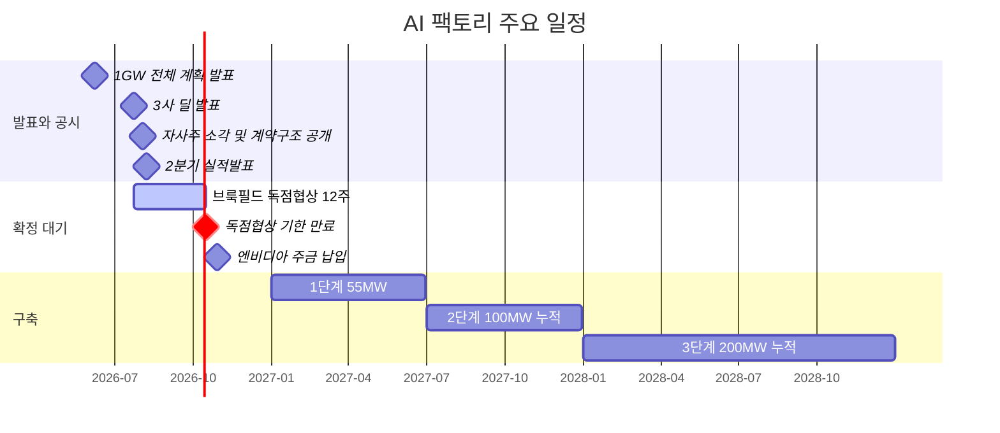
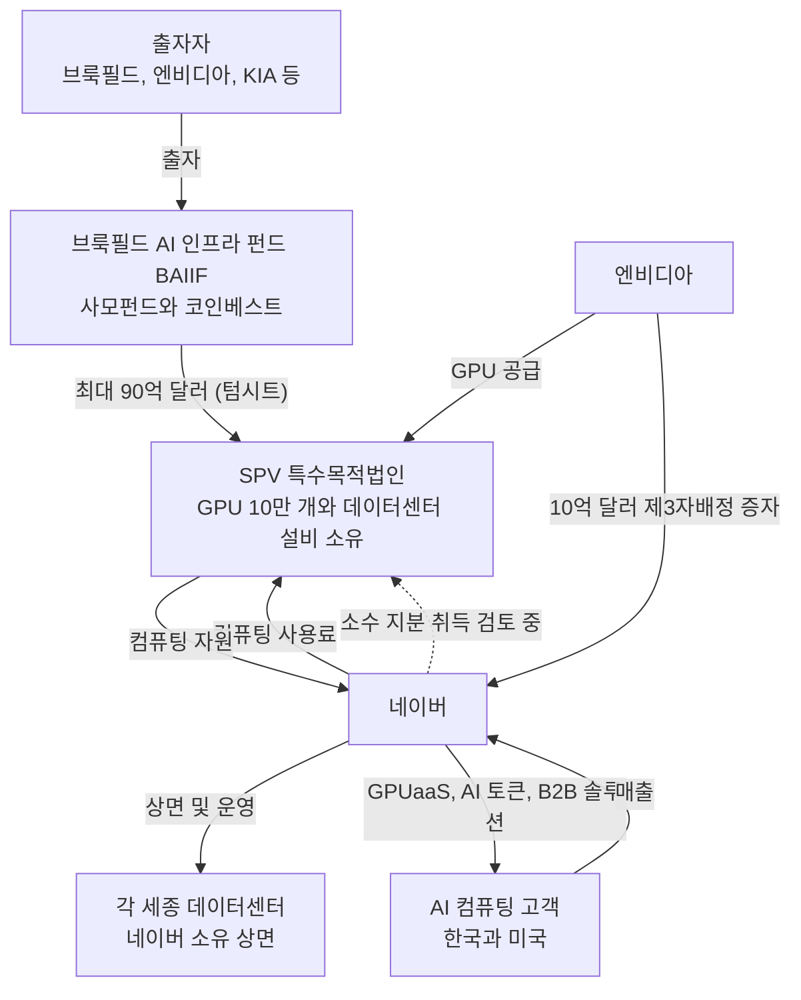
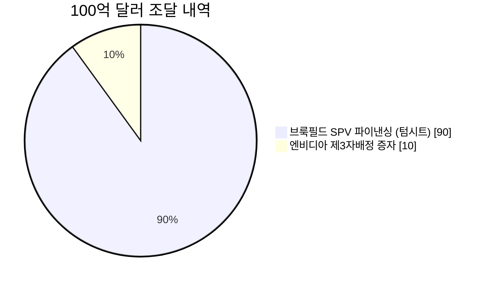
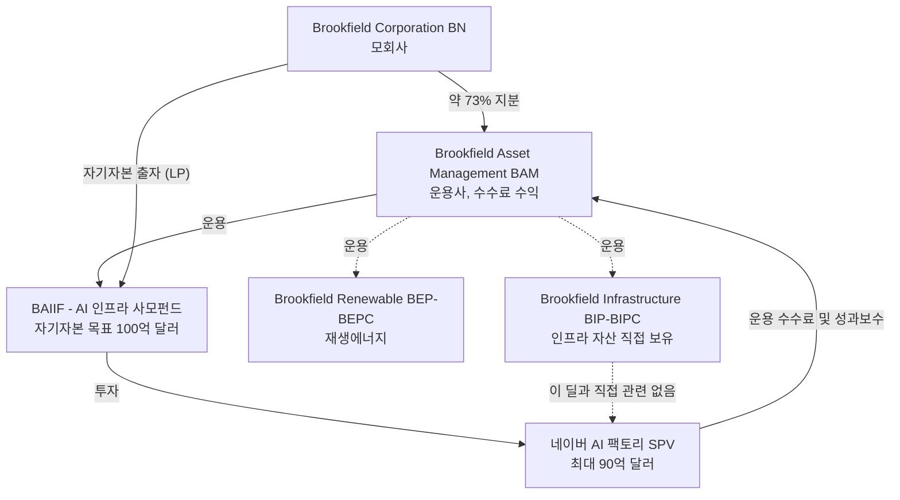
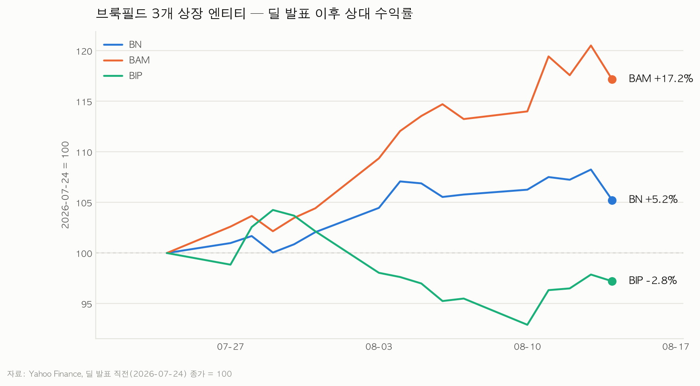
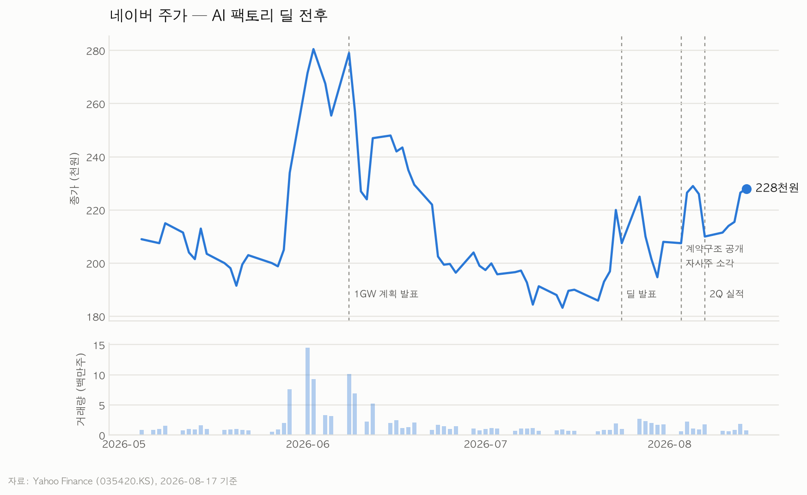
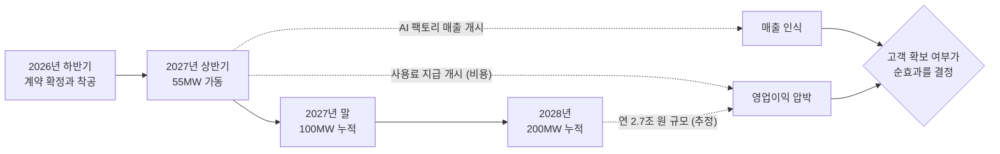
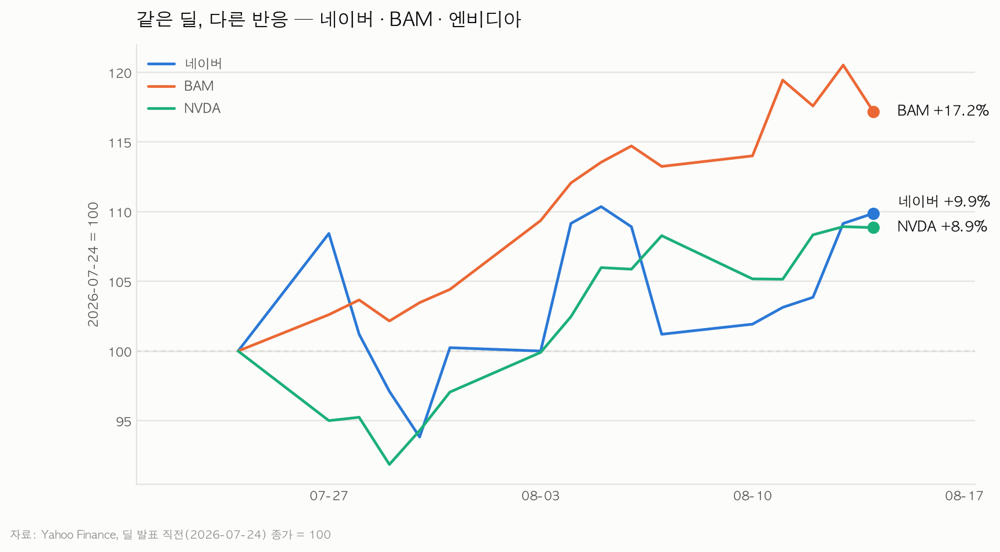
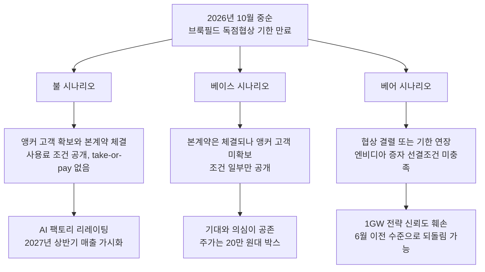

# 네이버-브룩필드 AI 팩토리 딜 — 투자 리서치 메모

작성일: 2026-08-17 | 주가 기준일: 2026-08-14 종가

> 개인 투자 판단용 메모다. 보유 종목은 네이버와 브룩필드, 투자 기간은 6개월~2년, 목적은 신규 진입이 아니라 비중 조절이다.
>
> 출처 등급을 본문에 표기한다. **[확정]** 은 보도자료·공시 등 1차 자료, **[보도]** 는 언론 보도, **[추정]** 은 증권사나 매체 또는 본 메모의 계산이다. 등급이 없는 문장은 앞 문장의 등급을 잇는다.

---

## 요약: 세 줄

1. **브룩필드 90억 달러는 아직 확정된 돈이 아니다.** 구속력 없는 텀시트이고, 독점협상 기한이 2026년 10월 중순에 만료된다. 이 딜의 최대 리스크는 기술도 수요도 아니고 **10월의 계약 성사 여부**다.
2. **네이버 주주가 겁냈던 대규모 희석은 없었다.** 자사주 490만 주 소각과 엔비디아 대상 신주 724만 주를 상계하면 순희석은 **약 1.5%** 다. 진짜 부담은 희석이 아니라 **200MW 완공 후 연 2.7조 원의 컴퓨팅 사용료**다.
3. **브룩필드 주주에게 이 딜은 대차대조표 사건이 아니라 수수료 사건이다.** 자금은 사모펀드 BAIIF에서 나오고, 상장 엔티티가 얻는 건 주로 운용 수수료다. 발표 이후 BAM +17.2%, BIP -2.8% 라는 주가 반응이 이 구조를 그대로 보여준다.

**결론: 네이버는 10월 중순까지 비중을 늘리지 않는다. 브룩필드는 이 딜을 근거로 비중을 조절할 이유가 없다.** 상세는 6장.

---

## 1. 딜 개요

### 1.1 사실관계

2026년 7월 24일 샌프란시스코 AI 서밋에서 발표되고 7월 27일 3사 공동 보도자료로 공식화됐다. **[확정]**

| 항목 | 내용 |
|------|------|
| 총 규모 | 100억 달러 (약 14.6조 원, 1,460원/달러 기준) |
| 브룩필드 | 최대 90억 달러, 독점 자본 파트너 |
| 엔비디아 | 10억 달러 지분 투자 |
| 대상 | 세종 '각 세종' 데이터센터 AI 팩토리 |
| 규모 | 55MW → 200MW, GPU 약 10만 개 |
| 플랫폼 | 엔비디아 DSX (Blackwell, Vera Rubin) |
| 최종 목표 | 1GW (2026년 6월 발표한 전체 계획의 1단계가 이번 200MW) |

세 사람의 발언이 각자의 위치를 정확히 드러낸다. **[확정]**

- 이해진 네이버 창업자 겸 이사회 의장: "엔비디아의 전략적 투자 계획과 브룩필드와의 **인프라 공급 계약**이 네이버의 AI 팩토리 사업 비전을 본격적인 실행 단계로 밀어올렸다"
- 시칸데르 라시드(Sikander Rashid) 브룩필드 AI 인프라 글로벌 총괄: "브룩필드의 글로벌 AI 인프라 **투자 역량**, 네이버의 풀스택 AI·데이터센터 운영 역량, 엔비디아의 가속 컴퓨팅 플랫폼을 결합한다"
- 젠슨 황 엔비디아 CEO: "AI 팩토리는 국가가 지능 시대에 경쟁하고 혁신하기 위해 필요한 인프라다"

네이버는 "공급 계약"이라 부르고 브룩필드는 "투자"라 부른다. **같은 계약을 한쪽은 조달로, 다른 쪽은 자산 취득으로 읽는다.** 이 비대칭이 5장의 주제다.

### 1.2 놓치기 쉬운 두 개의 단서

**단서 1. 90억 달러는 구속력이 없다. [확정]**

엔비디아 뉴스룸 원문은 브룩필드의 자금을 "nonbinding term sheet"로 명시한다. 자금을 대겠다는 **의향**이지 계약된 파이낸싱이 아니다. 국내 보도 다수가 "계약을 체결했다"고 썼지만 원문은 그렇게 읽히지 않는다. **[보도]** 와 **[확정]** 이 갈리는 지점이라 주의가 필요하다.

**단서 2. 엔비디아 투자에는 선결조건이 붙어 있다. [확정]**

> "NVIDIA's investment is subject to customary closing conditions and NAVER finalizing at least $9 billion of committed financing for the project, separate from NVIDIA's planned investment."

엔비디아의 10억 달러는 **네이버가 별도로 90억 달러의 확약된(committed) 파이낸싱을 확보하는 것**이 조건이다. 즉 브룩필드 협상이 깨지면 엔비디아 증자도 자동으로 흔들린다. 두 다리가 독립적이지 않고 직렬로 연결돼 있다.

### 1.3 타임라인

**중기 투자자에게 이 그림의 핵심은 2026년 10월이다.** 2028년 200MW는 너무 멀고, 10월 중순 두 개의 이벤트가 붙어 있다.

---

## 2. 자금 구조 해부

### 2.1 SPV 구조

브룩필드가 최대 90억 달러를 투입해 SPV를 구성하고, **SPV가 GPU와 데이터센터 설비를 구입·소유한다**. 네이버는 설비를 사지 않고 SPV에 컴퓨팅 사용료를 낸다. **[보도]**

이 그림에서 읽어야 할 것.

- **자산은 SPV에, 매출은 네이버에.** 엔비디아가 SPV가 아니라 네이버에 직접 투자한 덕에 AI 팩토리 수익이 네이버 기업가치에 온전히 반영된다는 게 국내 애널리스트들의 해석이다. **[보도]**
- **네이버는 SPV 소수 지분 취득을 검토 중이다.** 컴퓨팅 자원을 안정적으로 확보하기 위해서다. 지분율은 미공개. **[보도]**
- **요금 체계와 계약 기간은 아직 협의 중이다.** take-or-pay(최소 사용 보장) 조항 유무도 공개되지 않았다. 7장 참조.

### 2.2 네이버 부담의 실체 — 희석은 생각보다 작다

"유상증자 + PF 14.6조"라는 표현 때문에 네이버가 14.6조 원어치 증자를 하는 것처럼 읽히기 쉽지만, 실제 내역은 다르다. **[보도]**

네이버가 직접 발행하는 신주는 **엔비디아 몫 10억 달러가 전부**다. 나머지 90억 달러는 브룩필드 SPV가 조달·집행하며 네이버 대차대조표를 거치지 않는다.

**희석률 계산 [추정 — 본 메모]**

| 단계 | 주식수 | 비고 |
|------|--------|------|
| 소각 전 발행주식총수 | 158,099,806주 | 소각분 490만 주 = 3.1% 로 역산 |
| 자사주 소각 (2026-08-03) | -4,901,094주 | 약 1조 원 규모, 실행 완료 **[확정]** |
| 소각 후 | 153,198,712주 | |
| 엔비디아 신주 (2026-10-30 예정) | +7,241,564주 | 약 1조 4,809억 원, 22년 만의 제3자배정 **[확정]** |
| **최종** | **160,440,276주** | |

- 엔비디아 지분율 = 7,241,564 / 160,440,276 = **4.51%**. 보도된 4.5% 와 일치하므로 역산이 맞다고 본다
- 소각 전 대비 순증 = **+1.48%**

**즉 기존 주주의 실질 순희석은 약 1.5% 다.** 자사주 소각이 증자의 3분의 2를 미리 상쇄했다. 엔비디아 지분에는 한국예탁결제원 의무보유 1년 락업이 걸려 있어 단기 오버행도 없다. **[확정]**

엔비디아는 납입 완료 시 국민연금(9.2%), 블랙록(6.12%)에 이은 **3대 주주**가 된다. **[보도]**

### 2.3 브룩필드 90억 달러는 어느 주머니에서 나오나

이 메모를 시작할 때 가장 궁금했던 항목이고, **답이 나왔다.**

보도자료는 BAM(NYSE: BAM) 명의로 배포됐고 "About Brookfield" 문단은 BN과 BAM을 함께 나열할 뿐 특정 엔티티를 지목하지 않는다. **[확정]** 그러나 별도 자료에서 실체가 확인된다.

**브룩필드 AI 인프라 펀드(BAIIF, Brookfield Artificial Intelligence Infrastructure Fund) [확정]**

- 자기자본 목표 100억 달러, 이미 50억 달러 확약
- 출자자: 브룩필드 자신, **엔비디아**, 쿠웨이트투자청(KIA)
- 코인베스트와 레버리지를 더해 **최대 1,000억 달러 규모의 AI 인프라 자산 취득**을 목표
- 브룩필드의 AI 인프라 관련 운용자산은 약 1,000억 달러, 전사 AUM 1조 달러 초과

**따라서 자금 경로는 이렇게 정리된다.**

| 엔티티 | 이 딜과의 관계 | 주주가 얻는 것 |
|--------|---------------|---------------|
| BAM | BAIIF 운용사 | 운용 수수료, 향후 성과보수 |
| BN | BAM 지분 73% + 펀드 LP 출자 | 수수료의 73% + 자기자본 투자 수익 |
| BIP / BIPC | 직접 관련 없음 | 없음 |
| BEP / BEPC | 전력 측면 연결 가능성 있으나 미확인 | 미확인 |

**주가가 이 구조를 그대로 검증해준다.** 딜 발표 직전(7/24) 종가를 100으로 놓았을 때:

BAM +17.2%, BN +5.2%, BIP **-2.8%**. 대차대조표로 자산을 떠안는 BIP는 오히려 빠졌고, 수수료를 먹는 BAM이 가장 크게 올랐다. 자금이 사모펀드에서 나온다는 사실과 정확히 일치하는 반응이다.

**다만 BAM의 +17.2%를 전부 이 딜로 돌리면 안 된다.** 8월 5일 BAM은 2분기 실적을 발표했고 내용이 매우 좋았다. **[확정]**

- 수수료 관련 이익(FRE) 8억 800만 달러, 전년 대비 +20%
- 수수료 창출 자본 6,720억 달러, +19%
- 분기 신규 자금조달 770억 달러로 사상 최대

차트에서 BAM이 8월 5일 전후로 급등하는 구간이 실적 발표 시점과 겹친다. **이 딜의 순수 기여분은 분리해서 볼 수 없다.**

---

## 3. 네이버 주주 관점

### 3.1 주가는 아직 6월 고점을 회복하지 못했다

시간 순서가 중요하다.

- 6월 초 1GW 계획 발표로 **19만 원대에서 28만 원까지** 급등
- 이후 두 달간 되밀려 7월 중순 **18만 5천 원**까지 하락. 1GW 발표 전 수준으로 완전히 반납
- 7월 24일 딜 발표로 반등, 8월 14일 종가 **22만 8천 원**

**즉 이번 딜은 6월의 기대를 되살린 게 아니라 그 절반쯤을 회복시킨 사건이다.** 시장이 1GW 계획에 한 번 열광했다가 자금 조달의 현실성을 의심하며 되돌렸고, 브룩필드가 등장하자 다시 절반을 인정해준 흐름으로 읽힌다.

발표일(7/24) 기준으로는 **+9.9%** 다. 앞서 인용한 "+21.8%"는 발표 소문이 돌던 7월 20일부터 계산한 값이라 딜 자체의 기여를 과대평가한다. 기준일에 따라 숫자가 크게 달라지므로 **7월 24일 종가를 기준으로 삼는다.**

### 3.2 손익 반영 경로 — 비용이 먼저, 매출이 나중

네이버는 2분기 컨퍼런스콜에서 **AI 팩토리 매출이 2027년 상반기부터 발생**할 것이라고 밝혔다. **[확정]** 사용료 지급도 같은 시점에 시작된다고 보는 게 자연스럽다. 즉 **6~24개월 투자 기간 안에는 매출도 비용도 거의 잡히지 않고, 기대만 반영된다.**

이게 중기 투자자에게 중요한 이유는 명확하다. **이 딜은 2027년 이전까지 실적으로 검증할 방법이 없다.** 검증 가능한 것은 계약 성사, 고객 확보, 자금 조달 조건뿐이다.

### 3.3 진짜 부담은 희석이 아니라 사용료

KB증권 추정에 따르면 **200MW 완공 시 연간 사용료는 약 18억 5,000만 달러**다. **[추정]**

| 항목 | 금액 |
|------|------|
| 연간 컴퓨팅 사용료 (200MW 기준) | 약 18.5억 달러 = 약 2.7조 원 |
| 네이버 2025년 영업이익 | 2조 2,081억 원 |
| 네이버 2026년 2분기 영업이익 | 5,203억 원 (연환산 약 2.1조 원) |

**연간 사용료가 현재 영업이익 전체를 웃돈다.** 오프밸런스로 CAPEX를 넘긴 대가는 이 고정비다. 자산을 안 사는 대신 임차료를 무는 구조라 재무제표에는 가볍게 보이지만, 손익에는 무겁게 걸린다.

이 수치가 의미하는 바를 뒤집어 보면 이렇다. **AI 팩토리는 연 2.7조 원 이상을 벌어야 손익분기다.** 메리츠증권이 2032년 매출 14조 원, 영업이익 3조 4,000억 원을 전망한 것 **[추정]** 은 이 손익분기를 한참 넘어선 성숙 단계를 가정한 값이다. **"연매출 14조"를 임박한 숫자로 읽으면 안 된다. 6년 뒤 전망치다.**

### 3.4 리스크

**리스크 1. 앵커 고객이 아직 없다 — 가장 큰 문제**

브룩필드 독점협상 기한인 10월 중순까지 **장기 임차 고객(앵커 고객)을 확보할 수 있느냐가 사업 성패를 가른다**는 게 시장의 공통된 평가다. **[보도]** 현재 외부 고객 확보는 구체화되지 않았다.

논리는 단순하다. 브룩필드는 인프라 투자자이고, 인프라 투자자는 **장기 계약된 현금흐름**에 돈을 댄다. 앵커 고객이 없으면 SPV의 수익은 네이버의 사용료 지급 능력에만 의존하게 되고, 그러면 브룩필드가 요구하는 조건(사용료율, take-or-pay, 담보)이 나빠지거나 딜 자체가 무산된다.

**리스크 2. 엔비디아의 역할이 축소됐다**

6월 최초 공시에서 엔비디아의 역할은 "고객 발굴 및 리스크 공동 부담"이었으나, 7월 수정 공시에서 **"GPU 공급"으로 축소**됐다. **[보도]** 고객 유치 책임이 네이버 단독으로 넘어왔다는 뜻이다. 리스크 1과 직결된다.

**리스크 3. 본업 마진 둔화와 자본 배분 논란**

2026년 2분기 매출은 3조 3,888억 원으로 전년 대비 +16.2% 성장했으나 **영업이익은 5,203억 원으로 -0.2%** 를 기록했다. AI 인프라 투자 때문이다. **[확정]** 메리츠증권은 "기존 사업의 마진이 빠르게 둔화하고 있으며, 네이버는 무엇을 키우고 무엇을 줄 것인지 투자자에게 명확한 답을 제시해야 할 시점"이라고 지적했다. **[추정]**

**리스크 4. 전력과 상면 — 상대적으로 양호**

각 세종은 최대 270MW 공급이 가능하도록 설계돼 있고, 네이버는 컨퍼런스콜에서 **200MW까지의 상면을 거의 대부분 확보했다**고 밝혔다. **[확정]** 200MW 단계에서는 병목이 아니다. 다만 1GW 로드맵으로 가면 전력 조달이 완전히 다른 문제가 된다.

**리스크 5. 하드웨어 사이클**

Blackwell·Vera Rubin 세대에 10만 개 GPU를 묶는 구조다. 감가상각과 진부화 리스크는 SPV가 지지만, 구형 GPU에 대해서도 사용료를 계속 물어야 하는 계약이라면 위험이 네이버로 되돌아온다. **계약 기간과 리프레시 조항이 공개되지 않아 판단 불가.** 7장 참조.

---

## 4. 브룩필드 주주 관점

### 4.1 이 딜은 브룩필드에 얼마나 큰가

결론부터 말하면 **의미는 있지만 주가를 움직일 만한 크기는 아니다.**

| 기준 | 수치 | 90억 달러의 비중 |
|------|------|-----------------|
| 브룩필드 전사 AUM | 1조 달러 초과 | 0.9% 미만 |
| AI 인프라 운용자산 | 약 1,000억 달러 | 약 9% |
| BAIIF 목표 자산 취득 규모 | 최대 1,000억 달러 | 약 9% |
| BAIIF 자기자본 목표 | 100억 달러 | 자기자본만으론 감당 불가, 코인베스트·레버리지 필요 |

AI 인프라 포트폴리오 안에서는 **한 자릿수 후반% 비중의 대형 건**이다. 참고로 브룩필드는 2025년 12월 중동 Qai와 200억 달러 규모 파트너십을 맺은 바 있다. **[보도]** 이 딜은 그 절반 크기다.

### 4.2 수수료 수익 추정

BAM 2026년 2분기 실적 기준. **[확정]**

| 지표 | 수치 |
|------|------|
| 수수료 관련 이익(FRE), 최근 12개월 | 32억 달러 |
| 수수료 창출 자본 | 6,720억 달러 |
| 블렌디드 수수료율 (역산) | 약 0.48% |
| 배당가능이익(DE), 최근 12개월 | 28억 달러 |

**90억 달러가 BAM 실적에 얼마나 기여하나 [추정 — 본 메모]**

| 시나리오 | 가정 | 연간 수수료 | LTM FRE 32억 달러 대비 |
|---------|------|------------|---------------------|
| 최대치 | 90억 달러 전액이 수수료 대상, 인프라 펀드 요율 1.25% | 1.1억 달러 | 약 3.5% |
| 현실치 | 90억 달러 중 20~35%만 펀드 자기자본(나머지는 PF 부채·코인베스트), 요율 1.25% | 0.23~0.39억 달러 | **약 1% 내외** |

**계산 근거**: 인프라 사모펀드의 관리보수는 통상 출자약정액 대비 1.0~1.5% 다. 90억 달러는 SPV의 총 조달 규모이고 여기에는 프로젝트 파이낸싱 부채가 상당 부분 포함될 것으로 보인다. 부채는 수수료 대상이 아니다. 실제 펀드 자기자본 투입액이 공개되지 않아 20~35% 로 가정했다. **가정에 크게 의존하는 추정이며, 실제 수수료 조건은 미공개다.**

**즉 BAM 관점에서 이 딜은 FRE를 1% 남짓 밀어올리는 사건이다.** 성과보수는 자산 매각이나 수익률 확정 시점에 나오므로 6~24개월 안에는 잡히지 않는다.

### 4.3 같은 딜, 다른 반응

BAM +17.2%, 네이버 +9.9%, 엔비디아 +8.9%.

숫자만 보면 BAM이 가장 많이 올랐지만, **4.2절의 추정과 정면으로 충돌한다.** FRE 1% 짜리 딜에 주가가 17% 오를 이유가 없다. 앞서 짚었듯 BAM의 상승은 8월 5일 사상 최대 분기 실적(FRE +20%, 신규 조달 770억 달러)이 주도한 것으로 보는 게 합리적이다.

**이 차트에서 얻을 결론은 "BAM이 이 딜의 승자"가 아니라 "이 딜만으로 브룩필드 상장 주주의 손익을 판단할 수 없다"는 쪽이다.**

### 4.4 리스크

- **자산 집중 리스크는 낮다.** 1조 달러 AUM에서 90억 달러다. 펀드 단위에서도 BAIIF 목표 자산의 9% 수준
- **금리.** 인프라 PF 조달비용에 직결된다. 다만 이건 이 딜 고유 리스크가 아니라 브룩필드 사업 전반의 상수다
- **한국 규제·전력.** 200MW 단계에서는 상면·전력이 확보돼 병목이 아니다 (3.4절)
- **순환 출자 구조에 대한 눈총.** 엔비디아는 BAIIF의 출자자이면서 SPV에 GPU를 팔고, 동시에 네이버 지분 4.5%를 사들인다. **엔비디아 자금이 돌아서 엔비디아 GPU를 사는 구조**라는 비판이 AI 인프라 딜 전반에 제기되고 있다. 브룩필드가 이 논란의 한복판에 서 있다는 점은 밸류에이션 리스크로 인식할 필요가 있다 **[추정 — 본 메모의 해석]**
- **가장 현실적인 리스크는 딜이 무산되는 것.** 그러나 무산돼도 브룩필드는 잃을 게 거의 없다. 텀시트 단계라 자본이 투입되지 않았다

---

## 5. 관계의 비대칭

| 항목 | 네이버 주주 | 브룩필드 주주 |
|------|------------|--------------|
| 이 딜의 성격 | 회사의 미래를 건 사업 전환 | 포트폴리오 내 대형 건 하나 |
| 규모 비중 | 시가총액과 맞먹는 CAPEX 규모 | AUM의 1% 미만, AI 인프라의 약 9% |
| 얻는 것 | AI 팩토리 매출, 소버린 AI 지위, 엔비디아 3대 주주 편입 | 운용 수수료 (FRE 약 +1% 추정), 향후 성과보수 |
| 지는 것 | 연 2.7조 원 사용료 고정비, 고객 확보 책임, 순희석 1.5% | 실질적으로 없음 (텀시트 단계) |
| 자산 소유 | 없음 (SPV 소유, 소수 지분 검토 중) | SPV 통해 GPU·설비 소유 |
| 딜 무산 시 | 1GW 전략 전체가 흔들림, 엔비디아 증자도 연동 | 다른 딜로 자본 배분, 손실 없음 |
| 6~24개월 실적 반영 | 거의 없음 (2027년 상반기부터) | 계약 확정 시 수수료 인식 시작 |
| 주가 민감도 | 매우 높음 | 낮음 |

**한 문장으로: 네이버는 이 딜에 회사를 걸었고, 브룩필드는 포트폴리오 한 칸을 걸었다.**

그래서 같은 뉴스를 봐도 네이버 주주는 계약 조건 하나하나를 따져야 하고, 브룩필드 주주는 이 딜을 거의 무시해도 된다. **두 종목을 같이 들고 있다고 해서 이 딜이 "양쪽 다 호재"인 게 아니다. 사실상 네이버 단독 이벤트다.**

한 가지 덧붙이면, 이 조합은 **의도치 않은 리스크 집중**이기도 하다. 두 종목 모두 AI 인프라 사이클에 노출돼 있다. AI 데이터센터 투자 열기가 식으면 네이버는 사업이 흔들리고 브룩필드는 AI 인프라 펀드 조달과 성과보수가 동시에 나빠진다. **분산이라고 생각했다면 실제로는 같은 테마의 두 다리일 수 있다.**

---

## 6. 시나리오와 트리거

### 6.1 시나리오 (6~24개월)

| 시나리오 | 판단 근거 | 네이버 | 브룩필드 |
|---------|----------|--------|---------|
| **불** | 앵커 고객 확보 + 본계약 | 리레이팅 구간. 사용료 부담이 상쇄될 매출 경로가 보임 | 수수료 인식 시작. 주가 영향은 여전히 미미 |
| **베이스** | 본계약은 되나 고객은 미확보 | 박스권. 2027년 상반기 첫 매출까지 검증 불가 | 변화 없음 |
| **베어** | 협상 결렬 또는 기한 연장 | 엔비디아 증자까지 연동 흔들림. 하방 큼 | 손실 없음. 다른 딜로 이동 |

**개인적으로는 베이스에 가장 높은 확률을 둔다.** 앵커 고객 확보는 12주 안에 끝내기엔 짧고, 브룩필드가 이미 텀시트까지 낸 마당에 완전 결렬 가능성도 높지 않다고 본다. 다만 이건 **[추정]** 이며 근거가 약한 판단이다.

### 6.2 확인해야 할 이벤트

| 시점 | 이벤트 | 무엇을 볼 것인가 |
|------|--------|-----------------|
| 2026-10 중순 | **브룩필드 독점협상 기한 만료** | 본계약 체결 공시 여부. 이 메모에서 가장 중요한 단일 이벤트 |
| 2026-10-30 | 엔비디아 주금 납입 예정 | 납입 완료 = 90억 달러 확약 파이낸싱 조건이 충족됐다는 신호 |
| 2026-11 초 | 네이버 3분기 실적 | 본업 마진 둔화 지속 여부, AI 팩토리 관련 코멘트 |
| 2026-11 초 | BAM 3분기 실적 | BAIIF 조달 진행률, AI 인프라 배포 현황 |
| 미정 | **앵커 고객 발표** | 계약 기간과 규모. 발표 자체보다 계약 조건이 중요 |
| 2027 상반기 | 55MW 가동, AI 팩토리 첫 매출 | 사용료 대비 매출 비율. 손익 구조의 첫 실물 데이터 |

### 6.3 비중 조절 트리거

가격 판단은 하지 않는다. **조건만 정의한다.**

**네이버**

| 트리거 | 대응 |
|--------|------|
| 10월 중순 이전 | **비중 유지. 추가 매수하지 않는다.** 텀시트 단계에서 늘릴 이유가 없다 |
| 본계약 체결 + 앵커 고객 동시 확보 | 비중 확대 검토. 불 시나리오 진입 |
| 본계약만 체결, 앵커 고객 없음 | 비중 유지. 2027년 상반기 첫 매출까지 판단 보류 |
| 협상 결렬 또는 기한 연장 발표 | **비중 축소 검토.** 엔비디아 증자 연동 리스크까지 함께 재평가 |
| 사용료 계약에 take-or-pay 조항 확인 | 부정적으로 해석. 수요 미달 리스크가 전부 네이버로 넘어옴 |
| 본업 영업이익 3개 분기 연속 역성장 | 비중 축소 검토. AI 투자와 무관하게 본업이 무너지는 신호 |

**브룩필드**

| 트리거 | 대응 |
|--------|------|
| 네이버 딜 관련 뉴스 전반 | **대응하지 않는다.** FRE 1% 짜리 사건이다 |
| BAIIF 조달 목표 미달 또는 지연 | 비중 축소 검토. AI 인프라 성장 스토리의 핵심 지표 |
| BAM FRE 성장률 15% 아래로 둔화 | 비중 축소 검토 |
| AI 데이터센터 자산 밸류에이션 급락 | 네이버와 **동시에** 재평가. 5장에서 지적한 리스크 집중 문제 |

**포트폴리오 차원**

두 종목이 같은 AI 인프라 테마에 걸려 있다는 점을 인식하고, **합산 비중**을 별도로 관리한다. 개별 종목 비중이 적정해 보여도 테마 노출은 합쳐서 봐야 한다.

---

## 7. 미확인 항목

공개 자료로 확인하지 못한 것들이다. 향후 공시가 나오면 여기부터 채운다.

| 항목 | 왜 중요한가 | 확인 방법 |
|------|------------|----------|
| **컴퓨팅 사용료 요금 체계** | 3.3절 부담 추정의 정확도를 좌우. 현재는 KB증권 추정치에만 의존 | 본계약 체결 공시, DART |
| **take-or-pay 조항 유무** | 수요 미달 시 손실을 누가 지는지 결정. 네이버 주주에게 가장 중요한 미확인 항목 | 본계약 공시, 컨퍼런스콜 질의 |
| **계약 기간과 GPU 리프레시 조항** | 하드웨어 진부화 리스크의 귀속 주체 | 본계약 공시 |
| **SPV 지분 구조** | 네이버 소수 지분 취득 여부와 비율. 지분법 손익 반영 여부 결정 | 본계약 공시 |
| **BAIIF의 실제 자기자본 투입액** | 4.2절 수수료 추정의 핵심 가정. 현재 20~35% 로 임의 가정 | BAM 분기 실적 자료, 컨퍼런스콜 |
| **BAM 수수료 요율** | 위와 동일 | BAM IR |
| **네이버 자체 부담 금액** | 100억 달러 = 90억(브룩필드) + 10억(엔비디아) 이면 네이버 현금 부담은 0인가. 상면·전력·운영 비용은 별도인가 | 컨퍼런스콜 질의, 3분기 실적 |
| **앵커 고객 후보** | 사업 성패의 핵심 | 계약 발표 대기 |
| **BEP/BEPC 연계 여부** | 전력 공급에 브룩필드 재생에너지가 관여하는지 | 본계약 공시 |

**특히 take-or-pay 조항과 BAIIF 자기자본 투입액 두 가지는 이 메모의 결론을 바꿀 수 있는 항목이다.** 3.3절과 4.2절의 추정은 이 두 가지가 확인되기 전까지 잠정으로 취급한다.

---

## 8. 출처

### 1차 자료

- [NAVER, NVIDIA and Brookfield to Expand Korea's National AI Factory Infrastructure Buildout — NVIDIA Newsroom](https://nvidianews.nvidia.com/news/naver-nvidia-and-brookfield-to-expand-koreas-national-ai-factory-infrastructure-buildout)
- [NAVER Partners with Brookfield and NVIDIA to Expand Korea's National AI Factory Infrastructure Buildout — NAVER Corp.](https://www.navercorp.com/media/pressReleasesDetail?seq=10034517)
- [NAVER, NVIDIA and Brookfield to Expand Korea's National AI Factory Infrastructure Buildout — Brookfield Asset Management](https://bam.brookfield.com/press-releases/naver-nvidia-and-brookfield-expand-koreas-national-ai-factory-infrastructure)
- [네이버 2026년 2분기 실적 발표 — NAVER Corp.](https://navercorp.com/media/pressReleasesDetail?seq=10034577)
- [Brookfield Asset Management Announces Record Second Quarter Results](https://bam.brookfield.com/press-releases/brookfield-asset-management-announces-record-second-quarter-results)
- [Brookfield Launches $100 Billion AI Infrastructure Program — Brookfield Asset Management](https://bam.brookfield.com/press-releases/brookfield-launches-100-billion-ai-infrastructure-program)
- [NAVER, NVIDIA and Brookfield — GlobeNewswire](https://www.globenewswire.com/news-release/2026/07/27/3333489/0/en/naver-nvidia-and-brookfield-to-expand-korea-s-national-ai-factory-infrastructure-buildout.html)

### 2차 자료 (보도)

- [네이버·엔비디아 빅딜 해부 ① 14.6조 조달 셈법, '유상증자+PF' — 블로터](https://www.bloter.net/news/articleView.html?idxno=669029)
- [네이버, AI팩토리 계약구조 공개 — 아시아경제](https://www.asiae.co.kr/article/2026080310290377982)
- [네이버 'AI 팩토리', 연매출 14조원 예상 — 글로벌이코노믹](https://www.g-enews.com/article/ICT/2026/08/2026080310020347233d7a510102_1)
- [네이버 엔비디아 AI 팩토리 모멘텀 확보에도 시장은 '신중' — 허프포스트코리아](https://www.huffingtonpost.kr/article/259435)
- [엔비디아, 네이버 지분 4.5% 확보, 22년 만에 제3자 배정 증자 — 아이티데일리](https://www.itdaily.kr/news/articleView.html?idxno=240603)
- [네이버, 1조원 규모 자사주 소각, 발행주식 3.1% 줄였다 — 알파경제](https://kr.investing.com/news/stock-market-news/article-2051634)
- [네이버 "AI 팩토리 200MW 상면 대부분 확보" — 이데일리](https://www.edaily.co.kr/News/Read?newsId=05602246645545024&mediaCodeNo=257)
- [네이버, 2분기 매출 두자릿수 성장, AI 투자로 영업익은 0.2% 감소 — ZDNet Korea](https://zdnet.co.kr/view/?no=20260807084015)
- [네이버 'AI 동맹' 합류한 브룩필드 — 뉴시스](https://www.newsis.com/view/NISX20260727_0003725296)
- [Brookfield to commit up to $9 billion to expand South Korean AI data centre — BNN Bloomberg](https://www.bnnbloomberg.ca/business/company-news/2026/07/27/brookfield-to-commit-up-to-9-billion-to-expand-south-korean-ai-data-centre/)
- [Brookfield launches $100bn AI infrastructure fund, secures Nvidia and KIA as backers — Data Center Dynamics](https://www.datacenterdynamics.com/en/news/brookfield-launches-100bn-ai-infrastructure-fund-secures-nvidia-and-kia-as-backers/)

### 주가 데이터

Yahoo Finance (035420.KS, BN, BAM, BIP, NVDA), 2026-08-14 종가 기준. 차트 3종은 직접 생성했다.

### 저작권 안내

보도자료 조감도와 매체 인포그래픽은 본 메모에 삽입하지 않았다. 원문 링크로 확인한다.

---

## 부록. 블로그 전환 시

**살릴 것**

- 2장 자금 구조 해부 전체. 특히 2.3절(브룩필드 엔티티 규명)은 국내에서 다룬 곳이 거의 없다. 차별화 지점
- 4장 브룩필드 관점. "브룩필드 주주에게 이 딜이 무슨 의미인가"는 국내 콘텐츠가 비어 있는 영역
- 5장 비대칭 비교표. 글의 핵심 메시지가 될 수 있다
- Mermaid 다이어그램 4종(SPV 구조도, 엔티티 계층도, 조달 파이, 손익 경로)과 주가 차트 3종
- 2.2절 희석률 계산. "14.6조 증자"라는 오해를 숫자로 푸는 대목이라 독자 효용이 크다

**뺄 것**

- 1.3절 "중기 투자자에게" 같은 개인 관점 문장
- 6.3절 비중 조절 트리거 전체. 개인 포지션 전제라 발행에 부적합
- 6.1절의 "개인적으로는 베이스에 확률을 둔다" 판단
- 요약 3번의 투자 결론

**보강할 것**

- AI 팩토리와 소버린 AI 개념 설명. 블로그 독자 눈높이에 맞춘 도입부가 필요하다
- 오프밸런스 조달 구조가 왜 요즘 AI 인프라 딜의 표준이 됐는지 (오라클, 메타 등 유사 사례)
- 10월 이후 전개를 반영해 업데이트. 지금 발행하면 결론 없이 끝난다

**발행 시점 제안**: 10월 중순 브룩필드 협상 결과가 나온 뒤. 그래야 글이 결말을 갖는다.
