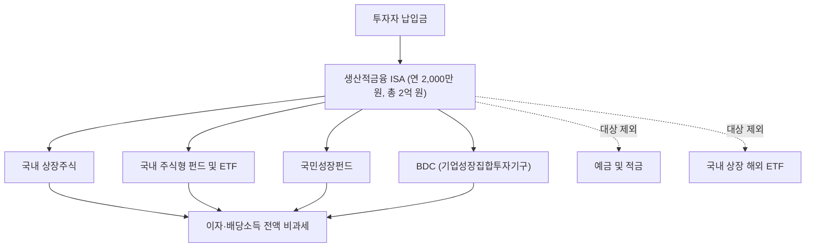

2026년 7월 31일 발표된 세제개편안에 **생산적금융 ISA**라는 새 절세계좌가 담겼다. 국내 자산에만 투자하는 대신 이자·배당소득을 한도 없이 비과세해주는 계좌다. 동시에 지금 쓰고 있는 일반 ISA는 계약기간이 5년으로 묶인다.

이 글은 그 구조를 이해해두는 스터디 노트다. **아직 정부안이고 국회 심의가 남아 있다.** 그래서 "지금 무엇을 하라"는 이야기는 하지 않는다. 2027년에 제도가 시작됐을 때 당황하지 않을 만큼만 구조를 잡아두는 것이 목적이다.

핵심을 한 줄로 요약하면 이렇다:

> **국내 자산만 담으면 이자·배당 전액 비과세, 대신 기존 ISA는 5년으로 묶인다**

**이 글을 읽으면 알 수 있는 것:**
- 생산적금융 ISA의 한도·기간·투자 대상
- "이자·배당 전액 비과세"가 실제로 어디에 작동하는지
- 청년형에 붙는 소득공제와 연금계좌 전환 혜택
- 기존 ISA가 어떻게 바뀌는지 (5년 제한, 이월 폐지, 2029년 일몰)
- 확정된 것과 아직 정해지지 않은 것의 경계

> ISA의 기본 구조(손익 통산, 비과세 한도, 분리과세 9.9%)는 앞 글 [ISA 계좌, 이것만 알면 된다](/etc/isa-basics/)에서 다뤘다. 이 글은 그 위에 2026년 개편 내용을 얹는다.

---

# 1. 개요

## 1.1 무엇이 발표되었나

2026 세제개편안의 ISA 관련 내용은 두 갈래다.

1. **생산적금융 ISA 신설** — 국내 자산 전용, 이자·배당소득 전액 비과세
2. **기존 ISA 정비** — 계약기간 5년 제한, 납입한도 이월 폐지, 2029년 일몰

혜택을 새 계좌에 몰아주는 대신 기존 계좌는 조이는 구조다. 두 갈래를 따로 보면 그림이 안 잡히므로 함께 읽어야 한다.

## 1.2 아직 확정이 아니다

중요한 전제가 하나 있다. **이것은 정부안이며 국회 심의를 거쳐야 한다.**

전례가 있다. 2024년에도 ISA 납입한도를 연 4,000만 원으로, 비과세 한도를 500만 원으로 늘리는 개편안이 발표됐지만 국회를 통과하지 못했다. 당시 내용은 [2024년 ISA 계좌 개편안 총 정리](/stock/2024-isa-account-reform-plan-summary/)에 남겨두었다. 2년이 지난 지금 ISA의 한도는 여전히 연 2,000만 원, 총 1억 원이고 비과세는 200만 원(서민형 400만 원)이다. 발표와 시행은 다른 이야기다.

그래서 이 글은 세금 계산이나 연도별 실행 계획을 담지 않는다. 숫자가 바뀔 수 있는 상태에서 정교한 계산을 붙이면 그 계산이 먼저 틀린다. 대신 **확정된 것과 미확정인 것을 갈라놓는 데 지면을 쓴다**. 7장이 그 부분이다.

---

# 2. 생산적 금융이란 무엇인가

## 2.1 '생산적 금융'이라는 말의 배경

정부가 이번 개편의 이름에 붙인 '생산적 금융'은 **시중 자금이 국내 자본시장과 혁신기업 쪽으로 흘러가도록 만들겠다**는 정책 기조를 가리킨다. 세제 혜택을 넓게 뿌리는 대신 특정 방향으로 집중시키는 방식이다.

여기서 '생산적'의 반대편에 놓인 것은 두 가지로 읽힌다.

| 구분 | 성격 | 이번 개편에서의 취급 |
|------|------|---------------------|
| 국내 상장주식, 국내 주식형 펀드 | 국내 기업에 자본 공급 | 혜택 집중 |
| 국민성장펀드, BDC | 혁신·성장 기업에 자본 공급 | 혜택 집중 |
| 예금·적금 | 자금이 머무르는 형태 | 대상 제외 |
| 국내 상장 해외 ETF | 자금이 국외로 나가는 형태 | 대상 제외 |

BDC는 기업성장집합투자기구(Business Development Company)로, 비상장 성장기업에 투자하는 상장 펀드다. 국민성장펀드와 함께 이번 계좌의 투자 대상에 들어간 것은, 이 계좌가 단순한 절세 수단이 아니라 **자금 공급 통로로 설계되었다**는 뜻이다.

## 2.2 왜 혜택을 국내 자산에만 몰아주나

기존 ISA는 투자 대상에 제한이 거의 없었다. 예금도 되고, 국내 상장된 해외 ETF도 됐다. 그래서 절세계좌의 상당 부분이 S&P500이나 나스닥100 같은 미국 지수 추종 상품으로 채워졌다.

세금을 깎아주는 목적이 국내 자본시장 활성화였다면, 그 혜택이 국외로 나가는 자금에 붙는 것은 정책 의도와 맞지 않는다. 이번에 투자 대상을 국내로 못 박은 것은 그 어긋남을 좁히려는 조치로 보인다.

사실 이 구상은 처음이 아니다. 2024년 개편안에도 **국내투자형 ISA**라는 유형이 들어 있었다. 국내 상장주식과 국내 주식형 펀드만 담는 대신 세금을 덜 내게 하고, 금융소득종합과세 대상자에게도 가입을 열어주자는 안이었다. 통과되지 않았지만 문제의식은 같았다. 절세계좌의 혜택을 국내 자본시장으로 향하게 만들자는 것이다.

생산적금융 ISA는 그 구상이 더 강한 형태로 돌아온 것으로 볼 수 있다. 2024년 안이 "세율을 낮춰준다"였다면 이번은 "아예 비과세한다"이고, 대신 투자 대상 제한은 더 촘촘해졌다.

이 판단이 타당한지는 별개의 문제다. 그 논란은 7.3절에서 다룬다.

---

# 3. 생산적금융 ISA의 구조

## 3.1 핵심 스펙

| 항목 | 내용 |
|------|------|
| 연간 납입한도 | 2,000만 원 |
| 총 납입한도 | 2억 원 |
| 계약기간 | 최소 3년, 3년 단위 연장으로 최대 10년 |
| 비과세 | 이자·배당소득 **전액** (한도 없음) |
| 농어촌특별세 | 비과세 |
| 가입 대상 | 19세 이상 거주자 (근로소득이 있으면 15세 이상) |
| 가입 제한 | 직전 3개 과세기간 중 1회 이상 금융소득종합과세 대상자였다면 제외 |
| 계좌 수 | 1인 1계좌, 단 기존 ISA와 **중복 보유 가능** |
| 중도해지 | 3년 내 원금을 넘겨 인출하면 해지로 간주, 비과세분 소득세 추징 |
| 시행 | 2027년 1월 1일 이후 신규 가입분 |
| 가입 마감 | 2029년 12월 31일 |

기존 ISA와 중복 보유가 된다는 점이 눈에 띈다. 기존 ISA는 전 금융기관 통틀어 1인 1계좌인데, 생산적금융 ISA는 그와 별개로 하나 더 열 수 있다. 두 계좌를 함께 쓰면 절세계좌에 넣을 수 있는 금액이 **연 4,000만 원**까지 늘어난다.

자금 흐름으로 보면 구조가 이렇다.

## 3.2 투자 대상 — 국내 자산으로 한정

투자할 수 있는 것과 없는 것을 갈라보면 이렇다.

| 담을 수 있음 | 담을 수 없음 |
|-------------|-------------|
| 국내 상장주식 | 예금·적금 |
| 국내 주식형 펀드 | 국내 상장 해외 ETF (S&P500, 나스닥100 등) |
| 국내 주식형 ETF | 해외 직접투자 |
| 국민성장펀드 | |
| BDC | |

기존 ISA를 써온 사람에게 가장 크게 걸리는 부분은 **국내 상장 해외 ETF가 빠진 것**이다. TIGER 미국S&P500이나 KODEX 미국나스닥100 같은 상품은 국내 거래소에 상장되어 있지만 담고 있는 자산이 해외라서 이 계좌의 대상이 아니다.

예금·적금이 빠진 것도 성격이 다른 제약이다. 기존 ISA는 시장이 불안할 때 예금으로 잠시 피할 수 있었는데, 생산적금융 ISA에는 그 대피소가 없다.

한편 "국내 주식형 펀드"의 범위가 어디까지인지는 아직 명확하지 않다. 채권형이나 혼합형, 리츠의 취급도 발표에는 나오지 않았다. 7.2절에서 다시 짚는다.

## 3.3 '전액 비과세'가 실제로 의미하는 것

이 절이 이 글에서 가장 중요하다. "이자·배당소득 전액 비과세"라는 문구를 그대로 받아들이면 오해가 생긴다.

**국내 상장주식의 매매차익은 원래 비과세다.** 대주주가 아닌 개인 투자자라면 삼성전자를 사서 두 배에 팔아도 양도소득세를 내지 않는다. 이건 ISA가 아니라 일반 증권 계좌에서도 마찬가지다.

그렇다면 이 계좌의 비과세는 어디에 작동하는가.

| 대상 | 일반 계좌 | 생산적금융 ISA | 실익 |
|------|----------|---------------|------|
| 국내 개별주식 매매차익 | 비과세 | 비과세 | 없음 |
| 국내 개별주식 배당금 | 15.4% 원천징수 | 비과세 | 있음 |
| 국내 주식형 ETF 분배금 | 15.4% 배당소득세 | 비과세 | 있음 |
| 국내 주식형 펀드 매매차익 | 15.4% 배당소득세 | 비과세 | 있음 |
| 금융소득종합과세 합산 | 합산 대상 | 제외 | 있음 |

정리하면 **개별 국내주식만 담는다면 실익은 배당금 하나뿐**이다. 혜택이 크게 작동하는 쪽은 오히려 배당주와 국내 상장 펀드·ETF다. 펀드나 ETF는 매매차익까지 배당소득으로 과세되기 때문에, 그 과세분이 통째로 사라진다.

기존 ISA와 비교하면 차이가 이렇다.

| 항목 | 기존 ISA | 생산적금융 ISA |
|------|---------|---------------|
| 비과세 한도 | 200만 원 (서민형 400만 원) | 한도 없음 |
| 한도 초과분 | 9.9% 분리과세 | 과세 없음 |
| 금융소득종합과세 | 제외 | 제외 |

기존 ISA는 순이익 200만 원까지만 세금이 0이고 넘어가는 부분은 9.9%를 냈다. 생산적금융 ISA는 그 구분 자체가 없다. 총 2억 원을 채우고 배당을 받는 규모까지 가면 차이가 상당히 벌어진다.

## 3.4 청년형 생산적금융 ISA

청년에게는 별도 유형이 붙는다.

| 항목 | 내용 |
|------|------|
| 대상 연령 | 15~34세 |
| 소득 요건 | 총급여 7,500만 원 이하 (종합소득금액 6,300만 원 이하) |
| 납입한도 | 연 2,000만 원 / 총 2억 원 (일반형과 동일) |
| 추가 혜택 | 납입액의 **10% 소득공제** |
| 소득공제 한도 | 연 2,000만 원을 채우면 연 200만 원 |
| 중도해지 | 비과세분에 더해 **소득공제분까지 회수** |

비과세에 소득공제가 얹히는 구조다. 이자·배당에 세금이 없는 것과 별개로, 납입한 금액의 10%를 그해 소득에서 빼준다.

기존 청년 대상 상품의 만기 자금을 이 계좌로 옮기는 것도 허용된다.

- 청년 일반 ISA
- 청년미래적금
- 청년도약계좌

만기가 돌아온 목돈을 과세계좌로 빼지 않고 절세계좌 안에서 이어 굴릴 수 있다는 뜻이다.

## 3.5 만기 후 연금계좌 전환

기존 ISA에도 있던 혜택이 확장된다.

| 항목 | 내용 |
|------|------|
| 추가납입 | 연금계좌 1,800만 원 한도와 **별개로** 추가납입 가능 |
| 세액공제 추가한도 | 전환금의 10% |
| 합산 상한 | 기존 ISA 전환분과 합산해 **300만 원** |

기존 ISA는 만기 자금을 연금계좌로 옮기면 전환금의 10%를 세액공제 추가한도로 인정받았다. 생산적금융 ISA도 같은 방식이 적용되고, 두 계좌의 전환분을 합해 상한이 300만 원까지 올라간다.

절세계좌에서 굴린 자금을 연금계좌로 넘겨 은퇴 재원으로 이어붙이는 동선이 유지되는 셈이다.

---

# 4. 기존 ISA는 무엇이 바뀌나

## 4.1 계약기간 5년 제한

가장 체감이 큰 변경이다.

| 구분 | 현행 | 개정안 |
|------|------|--------|
| 계약기간 | 최소 3년, 이후 **무제한 연장** | 총 **5년까지만** |

지금은 3년을 채운 뒤 계속 연장하면 계좌를 무기한 유지할 수 있다. 그래서 ISA를 "오래 굴려서 복리를 쌓는 그릇"으로 쓰는 방식이 통했다. 개정안이 통과되면 그 방식이 막힌다. 5년이 지나면 계좌를 정리하거나 연금계좌로 넘겨야 한다.

만기 처리 방식 자체는 지금과 같다. 연장·해지·연금 전환의 선택 기준은 [ISA 만기, 연장할까 해지할까?](/stock/isa-maturity-extension-or-termination-guide/)에서 정리했다.

## 4.2 납입한도 이월 폐지

두 번째 변경은 이월이다.

| 구분 | 현행 | 개정안 |
|------|------|--------|
| 연간 납입 가능액 | 2,000만 원 × (1 + 경과연수) − 누적 납입액 | 연 2,000만 원 고정 |
| 총 납입한도 | 1억 원 | 1억 원 (동일) |

현행은 올해 한도를 다 못 채우면 남은 금액이 다음 해로 넘어간다. 1년차에 1,000만 원만 넣었으면 2년차에 3,000만 원까지 넣을 수 있었다. 개정안은 이 이월을 없앤다. 못 채운 한도는 그해에 사라진다.

총 납입한도 1억 원은 그대로다. 다만 이월이 없어지면 1억 원을 채우는 데 최소 5년이 걸리고, 계약기간도 5년으로 묶이므로 **두 제약이 맞물린다**.

## 4.3 2029년 일몰

기존 ISA에 없던 일몰 기한이 붙는다.

| 항목 | 내용 |
|------|------|
| 가입 마감 | 2029년 12월 31일 |

생산적금융 ISA도 같은 날짜로 가입 마감이 설정되어 있다. 정부는 두 제도의 운영 성과를 평가한 뒤 추가 개선 여부를 검토한다는 입장이다.

---

# 5. 세 계좌 비교

지금까지 내용을 한 표에 모으면 이렇다.

| 항목 | 생산적금융 ISA | 기존 ISA (개정안) | 일반 증권 계좌 |
|------|---------------|------------------|---------------|
| 연간 납입한도 | 2,000만 원 | 2,000만 원 (이월 없음) | 없음 |
| 총 납입한도 | 2억 원 | 1억 원 | 없음 |
| 계약기간 | 최대 10년 | 최대 5년 | 없음 |
| 비과세 한도 | 한도 없음 | 200만 원 (서민형 400만 원) | 없음 |
| 한도 초과분 | 과세 없음 | 9.9% 분리과세 | 15.4% |
| 손익 통산 | 계좌 내 | 계좌 내 | 없음 |
| 국내 주식 | 가능 | 가능 | 가능 |
| 국내 상장 해외 ETF | 불가 | 가능 | 가능 |
| 예금·적금 | 불가 | 가능 | 해당 없음 |
| 금융소득종합과세 | 제외 | 제외 | 합산 |
| 청년 소득공제 | 있음 (청년형) | 없음 | 없음 |
| 가입 마감 | 2029-12-31 | 2029-12-31 | 없음 |

세 열을 나란히 놓으면 생산적금융 ISA의 성격이 드러난다. **세제 혜택은 가장 크고 투자 자유도는 가장 낮은 계좌**다.

---

# 6. 구조적으로 누구에게 유리한가

여기서는 유불리의 구조만 짚는다. 제도가 확정되지 않았으므로 무엇을 하라는 제안은 하지 않는다.

## 6.1 혜택이 큰 쪽

| 유형 | 이유 |
|------|------|
| 국내 배당주 중심 투자자 | 배당금 15.4%가 사라지고 금융소득종합과세에서도 빠진다 |
| 국내 주식형 ETF·펀드 투자자 | 분배금과 매매차익이 모두 배당소득으로 과세되던 것이 통째로 비과세된다 |
| 금융소득이 연 2,000만 원에 근접한 투자자 | 종합과세 합산에서 제외되는 효과가 세율 절감보다 클 수 있다 |
| 15~34세 청년 | 비과세에 소득공제 10%가 추가로 붙는다 |

## 6.2 혜택이 작거나 없는 쪽

| 유형 | 이유 |
|------|------|
| 국내 개별주식만 담는 투자자 | 매매차익은 원래 비과세라 실익이 배당금뿐이다 |
| 국내 상장 해외 ETF 중심 투자자 | 투자 대상이 아니다. 게다가 기존 ISA도 5년으로 묶인다 |
| 예금·적금 파킹 용도로 ISA를 쓰던 사람 | 담을 수 없다 |
| 금융소득종합과세 대상자 | 가입 자체가 제한된다 |

## 6.3 짚어둘 만한 지점

메인 독자층인 "국내외를 섞어 굴리는 투자자"에게 이번 개편은 혜택과 제약이 동시에 온다.

국내 자산 몫은 생산적금융 ISA로 옮기면 세금이 줄어든다. 그런데 해외 ETF 몫은 갈 곳이 기존 ISA뿐이고, 그 기존 ISA가 5년으로 묶인다. **기존 ISA를 장기 복리 그릇으로 쓰던 방식이 깨진다**는 뜻이다. 이 부분은 뉴스에서 잘 다루지 않는데, 두 변경을 함께 놓고 봐야 보인다.

다만 이것을 어떻게 다룰지는 제도가 확정된 뒤에 판단할 문제다. 지금은 구조를 알아두는 데서 멈춘다.

---

# 7. 아직 정해지지 않은 것들

이 장이 이 글에서 가장 유효기간이 짧고, 그래서 가장 지금 필요한 부분이다.

## 7.1 국회 심의라는 변수

발표된 것은 정부안이다. 국회 심의 과정에서 한도, 계약기간, 투자 대상, 청년 요건 모두 바뀔 수 있다.

앞서 언급한 2024년 개편안이 참고가 된다. 당시에는 납입한도를 연 4,000만 원, 비과세 한도를 500만 원까지 늘리는 안이 발표됐지만 국회를 통과하지 못했다. 발표와 시행 사이의 간격이 이 정도로 벌어질 수 있다.

## 7.2 시행령 미확정 사항

법이 통과되어도 세부는 시행령에서 정해진다. 현재 발표만으로는 알 수 없는 것들이다.

| 항목 | 현재 상태 |
|------|----------|
| 중개형 / 신탁형 / 일임형 구분 | 발표에 언급 없음. 중개형이 없으면 ETF 직접 매수가 어려워진다 |
| 손익 통산 방식 | 미공개. 기존 ISA처럼 계좌 내 통산으로 예상되나 확인 필요 |
| 중도인출 세부 규정 | "3년 내 원금 초과 인출 시 추징"만 발표됨. 원금 범위 내 인출 취급은 불명확 |
| "국내 주식형 펀드"의 범위 | 채권형·혼합형·리츠의 취급이 불명확 |
| 국민성장펀드·BDC 상품 라인업 | 실제로 어떤 상품이 나올지 미정 |

이 중 **중개형 여부**는 실무에서 가장 크게 갈리는 항목이다. 기존 ISA에서 중개형이 압도적으로 많이 선택된 이유가 ETF를 직접 매매할 수 있다는 점이었기 때문이다.

## 7.3 해외 ETF 배제를 둘러싼 논란

투자 대상을 국내로 한정한 것에 대해 나오는 지적들이다.

**절세계좌가 사실상 국내 주식 전용이 되었다는 반응.** 기존 ISA로 미국 지수 ETF를 굴려온 투자자에게 이번 개편은 혜택 추가가 아니라 유인 이동으로 읽힌다. 새 계좌의 혜택을 받으려면 포트폴리오를 국내로 옮겨야 한다.

**국내 주식 양도차익은 이미 비과세라는 점.** 3.3절에서 본 대로, 개별 국내주식의 매매차익에는 원래 세금이 없다. 그런데 국내 투자 전용 비과세 계좌를 따로 만든 것을 두고 혜택의 실체가 무엇인지 묻는 목소리가 있다. 실제로 작동하는 부분은 배당과 펀드·ETF 과세분이므로, 계좌 이름이 주는 인상보다 대상이 좁다.

**한도를 채울 수 있는 사람이 제한적이라는 점.** 두 계좌를 합해 연 4,000만 원을 넣을 수 있는 투자자가 많지 않다. 실제 자금 유입 규모와 혜택이 돌아가는 계층은 시행 후에야 확인된다.

**예금·적금 배제.** 시장이 불안할 때 절세계좌 안에서 안전자산으로 피할 방법이 없다. 대피가 필요하면 계좌 밖으로 나가야 한다.

---

# 8. 마무리

## 8.1 확정된 것

| 항목 | 내용 |
|------|------|
| 무엇 | 국내 자산 전용 절세계좌 신설 |
| 혜택 | 이자·배당소득 전액 비과세, 농특세 비과세 |
| 한도 | 연 2,000만 원 / 총 2억 원 |
| 기간 | 3년 의무, 최대 10년 |
| 대상 | 국내 상장주식, 국내 주식형 펀드·ETF, 국민성장펀드, BDC |
| 청년 | 15~34세, 총급여 7,500만 원 이하는 납입액 10% 소득공제 |
| 중복 | 기존 ISA와 함께 보유 가능 (합산 연 4,000만 원) |
| 기존 ISA | 계약기간 5년 제한, 이월 폐지, 2029년 일몰 |
| 일정 | 2027년 1월 1일 시행, 2029년 12월 31일 가입 마감 |

## 8.2 아직 모르는 것

- 국회 심의 결과
- 중개형 여부
- 손익 통산과 중도인출 세부 규정
- 투자 대상의 정확한 경계
- 국민성장펀드·BDC의 실제 상품

## 8.3 지금 기억해둘 한 가지

"이자·배당소득 전액 비과세"라는 문구만 보면 혜택이 무한해 보인다. 그러나 국내 개별주식의 매매차익은 원래 비과세이므로, 이 계좌의 실제 혜택은 **배당금과 국내 펀드·ETF 과세분**에 걸린다. 이 구분을 잡아두면 앞으로 세부가 바뀌어도 무엇이 달라졌는지 읽을 수 있다.

세부는 국회와 시행령을 지나며 달라질 것이다. 이 글도 그때 다시 손봐야 한다.

---

# 9. 참고

- [‘국내투자 전용 비과세’ 생산적금융 ISA 신설…일반 ISA는 5년 제한 - 헤럴드경제](https://biz.heraldcorp.com/article/10829468)
- [생산적금융 ISA 신설, 기존 ISA는 5년으로 묶인다 - 택스넷](https://www.taxnet.co.kr/contents/taxnetpost/post-detail?id=4904)
- [국내 투자 이자·배당 전액 비과세…청년 ISA는 납입액 10% 공제 - 아주경제](https://www.ajunews.com/view/20260803101556407)
- [생산적금융 ISA 신설...국내 투자 땐 이자·배당 전액 '비과세' - 뉴스핌](https://www.newspim.com/news/view/20260731001283)
- [ISA, 4000만원까지 넣을 수 있다지만…실효성 가를 변수는 - 조세일보](https://m.joseilbo.com/news/view.htm?newsid=573290)
- [새로 나오는 생산적금융 ISA 혜택과 기존 ISA 달라지는 점 정리 - 카카오페이](https://contents.kakaopay.com/contents/2406)
