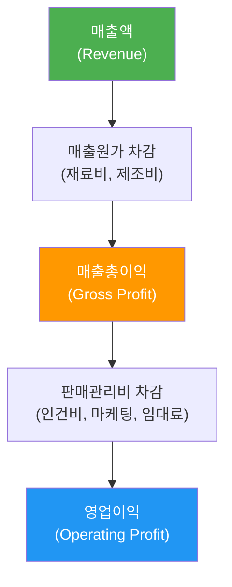
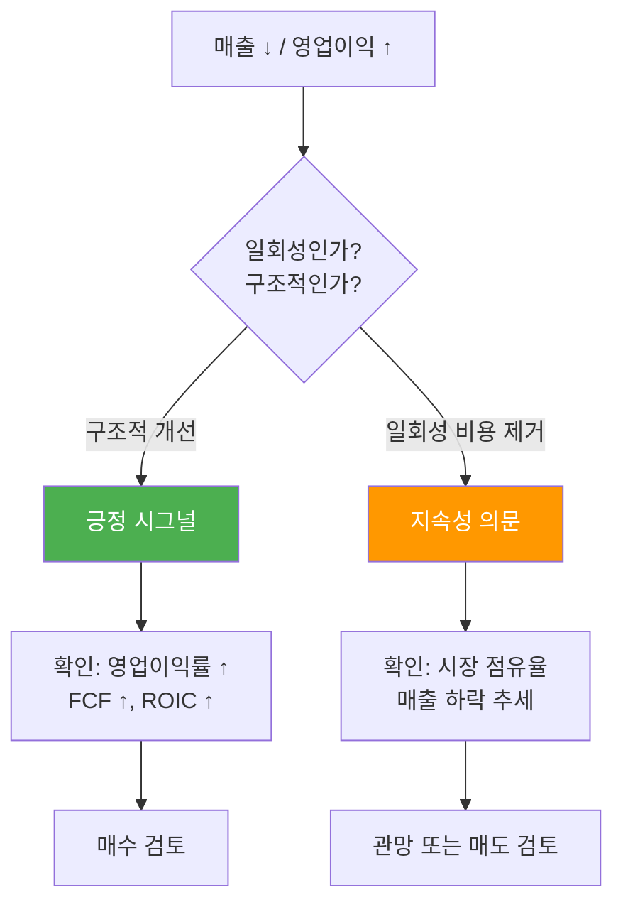
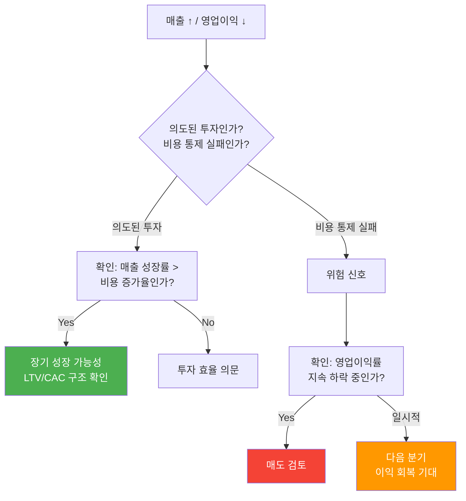
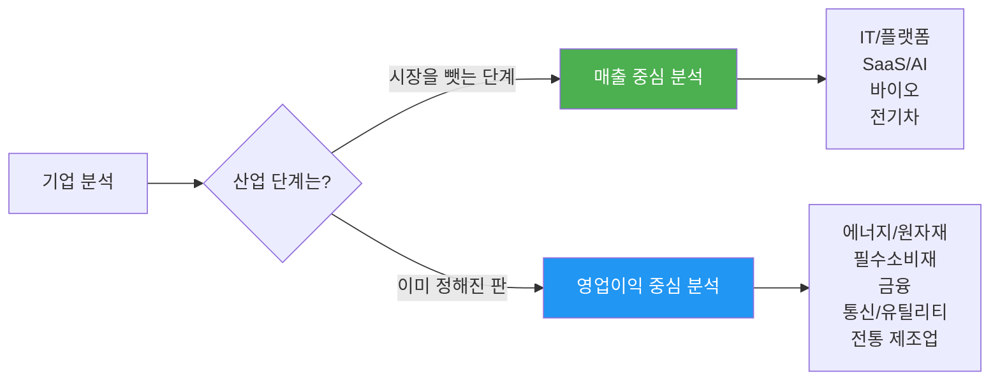
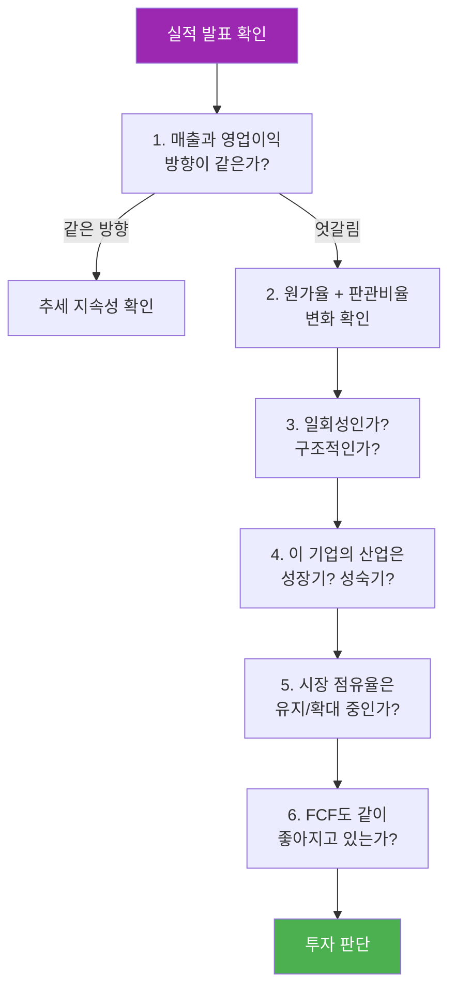

# 1. 개요

실적 시즌이 되면 뉴스에서 이런 제목을 자주 보게 된다.

> "A사, 매출 역대 최고인데 영업이익은 반토막"
>
> "B사, 매출 줄었지만 이익은 오히려 늘었다"

매출이 늘면 이익도 당연히 늘어야 할 것 같은데, 실제로는 그렇지 않은 경우가 꽤 많다. 이 현상을 이해하지 못하면 좋은 실적을 보고 매수했다가 주가가 빠지거나, 나쁜 실적에 겁먹고 팔았다가 반등하는 상황을 겪게 된다.

이 글에서는 매출과 영업이익의 기본 개념부터 시작해서, 두 지표가 엇갈리는 4가지 패턴별 원인과 해석법, 그리고 산업별로 어떤 지표에 더 무게를 둬야 하는지까지 정리한다.

**이 글을 읽으면 알 수 있는 것:**

- 매출과 영업이익의 차이와 관계
- 손익계산서의 기본 구조
- 매출/영업이익 4가지 조합별 발생 원인과 투자 해석
- 원가율과 판관비율로 기업 건강 상태를 빠르게 판단하는 법
- 섹터(산업)별로 매출 vs 영업이익 중 무엇을 더 봐야 하는지

# 2. 매출과 영업이익, 뭐가 다른가?

## 2.1 매출(Revenue) — "얼마나 팔았는가"

매출은 회사가 제품이나 서비스를 팔아서 벌어들인 **총 금액**이다. 아직 비용을 빼기 전 금액이기 때문에, 매출이 크다고 해서 반드시 돈을 잘 벌고 있다는 의미는 아니다.

매출은 회사의 **규모와 성장성**을 보여주는 지표다. "이 회사가 얼마나 많이 팔고 있는가?"에 대한 답이다.

## 2.2 영업이익(Operating Profit) — "본업으로 얼마나 남겼는가"

영업이익은 매출에서 **영업 활동에 들어간 비용(매출원가 + 판매관리비)**을 뺀 금액이다. 즉, 본업으로 실제로 남긴 이익이다.

영업이익에 **포함되지 않는 것**:

- 이자 비용 (재무활동)
- 세금
- 일회성 투자 손익 (자산 매각 등)

## 2.3 손익계산서 구조

매출에서 영업이익까지의 흐름을 그림으로 보면 이렇다.



공식으로 정리하면 다음과 같다.

```
매출액 - 매출원가 = 매출총이익
매출총이익 - 판매관리비(SG&A) = 영업이익
```

## 2.4 치킨집으로 이해하기

개념이 헷갈리면 치킨집을 떠올려보자.

| 항목 | 치킨집 예시 | 재무제표 용어 |
|------|------------|--------------|
| 하루에 치킨 100마리 판매 | 100마리 x 2만 원 = **200만 원** | 매출 |
| 닭, 기름, 양념 등 재료비 | **80만 원** | 매출원가 |
| 판매 후 남는 돈 | 200 - 80 = **120만 원** | 매출총이익 |
| 알바비, 월세, 배달비, 광고비 | **80만 원** | 판매관리비 |
| 사장님 손에 남는 돈 | 120 - 80 = **40만 원** | 영업이익 |

> **핵심 한 문장**: 매출은 "스토리"를 만들고, 영업이익은 "현금"을 만든다.

# 3. 원가율과 판관비율 — 이익의 질을 판단하는 도구

매출과 영업이익 사이에는 **비용**이 있다. 이 비용 구조를 이해하면, 왜 매출이 늘어도 이익이 줄 수 있는지 바로 알 수 있다.

## 3.1 비용 구조 핵심 지표

- **원가율** = 매출원가 / 매출액 — 물건을 만드는 데 매출의 몇 %가 들어가는가?
- **판관비율** = 판매관리비 / 매출액 — 팔고 관리하는 데 매출의 몇 %가 들어가는가?
- **원가율 + 판관비율 = 90% 이내**면 건강한 기업

이 두 숫자만 계산해도 기업의 비용 구조가 건강한지 한눈에 파악할 수 있다.

## 3.2 산업별 비용 구조 비교 (매출 100억 원 기준)

### 3.2.1 반도체 (고마진) — 삼성전자

```
매출액:       100억 원
├─ 매출원가:   40억 원 (원가율 40%)  ← 첨단 공정 효율
├─ 매출총이익:  60억 원
└─ 판관비:     25억 원 (판관비율 25%) ← R&D 집중
   └─ 영업이익: 35억 원 (영업이익률 35%)
```

원가율(40%) + 판관비율(25%) = **65%** → 남는 돈 35%.

반도체는 초기 설비 투자(팹 건설)에 수십조 원이 들어가지만, 일단 공정이 안정되면 웨이퍼 한 장에서 수백 개의 칩을 찍어내기 때문에 **개당 제조원가가 매우 낮다**. 원가율 40%대는 이 공정 효율에서 나온다. 판관비의 대부분은 R&D 비용인데, 차세대 공정 개발을 멈추면 경쟁에서 바로 밀리기 때문에 필수적인 지출이다. 결과적으로 **기술력 = 마진**인 산업이고, 기술 격차가 벌어질수록 영업이익률은 더 높아진다.

### 3.2.2 제조업 (보통) — 현대차

```
매출액:       100억 원
├─ 매출원가:   65억 원 (원가율 65%)  ← 부품/원자재
├─ 매출총이익:  35억 원
└─ 판관비:     20억 원 (판관비율 20%) ← 판매/관리
   └─ 영업이익: 15억 원 (영업이익률 15%)
```

원가율(65%) + 판관비율(20%) = **85%** → 남는 돈 15%.

자동차 같은 전통 제조업은 수만 개의 부품을 조립하기 때문에 **원자재와 부품 매입 비용**이 매출의 상당 부분을 차지한다. 원가율 65%는 업종 평균 수준이며, 여기서 1~2%p만 줄여도 수천억 원의 이익 차이가 난다. 현대차가 최근 영업이익률 10%대를 유지하는 건 SUV/전기차 등 고부가가치 차종 비중을 늘리고, 글로벌 생산 거점을 최적화한 결과다. 제조업에서는 **원가 절감 능력**이 곧 경쟁력이다.

### 3.2.3 유통업 (저마진) — 이마트

```
매출액:       100억 원
├─ 매출원가:   78억 원 (원가율 78%)  ← 상품 매입가
├─ 매출총이익:  22억 원
└─ 판관비:     22억 원 (판관비율 22%) ← 임대료/인건비
   └─ 영업이익:  0억 원 (영업이익률 0%)
```

원가율(78%) + 판관비율(22%) = **100%** → 남는 돈 0%.

유통업은 직접 물건을 만드는 게 아니라 **매입해서 되파는** 구조이기 때문에 원가율이 태생적으로 높다. 매입가 자체가 매출의 75~80%를 차지하고, 여기에 대형 매장 임대료, 수많은 직원 인건비, 물류비까지 더하면 남는 게 거의 없다. 이마트 같은 대형마트가 적자에 시달리는 이유가 여기에 있다. 유통업에서 이익을 내려면 **PB(자체 브랜드) 상품**으로 원가율을 낮추거나, 온라인 전환으로 임대료/인건비를 줄이는 구조 변화가 필요하다. 쿠팡이 물류 자동화에 투자하는 것도 이 판관비를 줄이기 위한 전략이다.

## 3.3 비용 구조 진단 기준

| 항목 | 우량 기업 | 보통 기업 | 문제 기업 |
|------|-----------|-----------|-----------|
| 원가율 | 40~60% | 60~70% | 75% 이상 |
| 판관비율 | 15~20% | 20~25% | 25% 이상 |
| 합계 | 65~80% | 80~90% | 95% 이상 |
| 영업이익률 | 20~35% | 10~20% | 5% 이하 |

> **실전 팁**: 재무제표에서 **원가율 + 판관비율** 합계만 보면 기업의 이익 구조를 90% 파악할 수 있다. 합계가 90%를 넘으면 비용 구조에 문제가 있다는 신호다.

# 4. 매출/영업이익 4가지 조합별 해석

매출과 영업이익의 방향 조합은 4가지가 있다. 각 조합이 발생하는 원인과 투자자가 어떻게 해석해야 하는지 정리한다.

| | 매출 감소 | 매출 증가 |
|---|---|---|
| **영업이익 증가** | 효율 개선 / 구조조정 | 이상적인 성장 |
| **영업이익 감소** | 사업 위축 경고 | 성장 비용 / 질 나쁜 성장 |

## 4.1 매출 ↑ / 영업이익 ↑ — 이상적인 성장

매출이 늘면서 이익도 함께 늘어나는 **가장 이상적인 상태**다.

**발생 원인:**

- 시장 수요 증가와 함께 규모의 경제 효과 발생
- 매출 성장에 비해 비용 증가가 작음
- 가격 인상 + 판매량 증가가 동시에 발생

**실제 사례 — Apple (2023년 서비스 부문)**

Apple은 하드웨어 매출이 정체된 상황에서도 서비스 부문(App Store, Apple Music, iCloud 등)의 매출이 꾸준히 성장했다. 서비스는 한번 개발하면 추가 원가가 거의 없기 때문에, 매출이 늘수록 영업이익이 더 빠르게 늘어나는 구조다. 서비스 부문의 영업이익률은 약 70%에 달한다.

**투자 해석:** 가장 좋은 시그널이지만, 이 성장이 **지속 가능한지** 확인이 필요하다. 일시적 특수(코로나 수혜 등) 때문이 아닌지 점검하자.

## 4.2 매출 ↓ / 영업이익 ↑ — 효율 개선 · 구조조정 국면

매출이 줄었는데 오히려 이익이 늘어난 경우다. 직관적으로 이해가 안 될 수 있지만, 비용 구조의 변화를 생각하면 설명이 된다.

### 4.2.1 발생 원인

**1) 고마진 사업 집중, 저마진 사업 정리**

적자를 내거나 수익성이 낮은 사업부를 매각하고, 남은 고마진 사업에 집중하는 경우다.

> 매출 100 → 70으로 감소했지만, 영업이익률 5% → 15%로 개선
>
> 질 나쁜 매출을 버린 것

**2) 비용 구조 개선**

인력 감축, 생산 자동화, 물류/원가 절감, 클라우드 전환(IT 비용 절감) 등으로 매출이 줄어든 것보다 **고정비가 더 크게 감소**한 경우다.

**3) 가격 인상 성공**

판매량은 줄었지만 단가를 올려서 이익률이 증가한 경우. 프리미엄 브랜드나 필수 소비재에서 자주 나타난다.

**4) 일회성 비용 제거**

전년도에 구조조정 비용, 소송비용 등 일회성 비용이 있었고, 올해 그 비용이 사라지면서 이익이 늘어난 경우다.

### 4.2.2 실제 사례

**KT&G — 비핵심 사업 정리 후 이익 개선**

KT&G는 국내 담배 시장 축소로 매출이 줄었지만, 해외 고마진 시장 확대와 비용 구조 개선으로 영업이익은 오히려 증가했다. 저마진 내수 물량이 줄고 고마진 해외 수출이 늘면서 영업이익률이 개선된 대표적 사례다.

**HMM (구 현대상선) — 운임 하락기 비용 절감**

해운업은 운임 하락으로 매출이 줄어도, 선박 운영비 절감과 고정비 구조 개선으로 영업이익을 방어하거나 늘리는 경우가 있다.

### 4.2.3 투자 해석



- **긍정 시그널**: 영업이익률 상승, FCF(잉여현금흐름) 증가, ROIC 개선
- **위험 시그널**: 매출 감소 추세 장기화, 시장 점유율 하락
- **핵심**: 일회성인지 구조적인지 구분이 중요하다

## 4.3 매출 ↑ / 영업이익 ↓ — 성장 비용 또는 질 나쁜 성장

매출은 늘어나는데 이익은 줄어드는 경우다. **가장 주의해서 분석해야 하는 패턴**이다. "의도된 투자"인지 "비용 통제 실패"인지에 따라 해석이 완전히 달라진다.

### 4.3.1 발생 원인

**1) 공격적인 성장 투자 (의도된 이익 희생)**

마케팅 비용 급증, 신규 인력 채용, R&D 확대, 해외 진출 초기 비용 등으로 의도적으로 이익을 희생하는 경우다. 스타트업이나 테크 기업에서 흔히 나타난다.

**2) 저마진 제품 판매 증가**

할인 판매, 프로모션 강화, 가격 경쟁 심화로 매출 볼륨은 늘었지만 개당 마진이 줄어든 경우. 매출의 "질"이 나빠진 것이다.

**3) 원가 상승 전가 실패**

원자재 가격 상승, 환율 악화, 인건비 상승에도 불구하고 제품 가격을 올리지 못하는 경우. **가격 결정력(Pricing Power)**이 부족하다는 의미다.

**4) 경쟁 심화**

경쟁사 진입으로 점유율 방어를 위해 출혈 경쟁을 벌이는 경우.

### 4.3.2 실제 사례

**쿠팡 — 의도된 성장 투자**

쿠팡은 수년간 매출이 급성장했지만 영업이익은 지속 적자였다. 로켓배송 인프라 구축, 물류센터 확대, 인력 채용 등에 막대한 비용을 투자했기 때문이다. 이는 시장 선점을 위한 **의도된 이익 희생**이었고, 실제로 2023년부터 흑자 전환에 성공했다.

**국내 IT/전자 업종 — 원가 상승 전가 실패**

반도체 다운사이클에서 삼성전자, SK하이닉스는 매출이 유지되거나 소폭 증가해도 메모리 반도체 가격 하락으로 영업이익이 급감하는 경우가 있었다. 공급 과잉으로 가격 결정력이 떨어진 상황이다.

### 4.3.3 투자 해석



- **긍정적 경우**: 매출 성장률이 비용 증가율보다 높고, 영업이익률 하락이 일시적
- **위험 신호**: 영업이익률 지속 하락, 판관비 비중 급증, 가격 인상 능력 없음
- **참고**: 매출이 좋아졌는데 비용이 일시적 문제로 많이 나온 것이라면, 다음 분기부터 이익이 증가할 가능성이 있다

## 4.4 매출 ↓ / 영업이익 ↓ — 사업 위축 경고

매출과 이익이 모두 줄어드는 **가장 위험한 상태**다. 사업 자체가 축소되고 있다는 신호이며, 구조적 문제인지 일시적 경기 하강인지를 판단해야 한다.

**실제 사례 — 인텔 (2022~2023년)**

인텔은 PC 수요 감소와 데이터센터 경쟁 심화로 매출이 줄었고, 동시에 파운드리 투자 비용 증가로 영업이익도 급감했다. 시장 점유율도 AMD와 NVIDIA에 빼앗기면서 매출과 이익 모두 악화되는 전형적인 사업 위축 패턴을 보였다.

**투자 해석:** 산업 전체가 침체인지(사이클 하강), 해당 기업만의 문제인지 구분이 핵심이다. 산업 사이클 때문이라면 바닥에서 매수 기회가 될 수 있지만, 기업 고유의 경쟁력 상실이라면 회복이 어렵다.

## 4.5 한눈에 정리

| 상황 | 보통 의미 | 투자 관점 | 실제 사례 |
|------|-----------|-----------|-----------|
| 매출 ↑ / 이익 ↑ | 이상적인 성장 | 최고 (지속성 확인) | Apple 서비스 부문 |
| 매출 ↓ / 이익 ↑ | 구조조정, 효율화 | 질적 개선 가능 (일회성 vs 구조적) | KT&G, HMM |
| 매출 ↑ / 이익 ↓ | 성장 비용 또는 출혈 경쟁 | 구조 확인 필수 (의도 vs 실패) | 쿠팡, 삼성전자(다운사이클) |
| 매출 ↓ / 이익 ↓ | 사업 위축 | 경고 (사이클 vs 구조적 문제) | 인텔 |

# 5. 섹터별로 매출 vs 영업이익, 뭘 더 봐야 할까?

같은 숫자라도 산업에 따라 의미가 다르다. 성장 초기의 테크 기업과 배당을 주는 통신 기업에게 같은 잣대를 들이대면 안 된다.



## 5.1 매출이 더 중요한 섹터 (성장 중심)

이 섹터들은 시장을 **얼마나 빠르게 장악하느냐**가 핵심이다. 초기에 적자거나 이익이 작아도 정상이며, 규모의 경제나 네트워크 효과가 작동하면 나중에 이익이 폭발적으로 늘어나는 구조다.

### 5.1.1 IT / 플랫폼 / 인터넷

**왜 매출이 더 중요한가?**

플랫폼 비즈니스는 사용자가 늘수록 네트워크 효과로 가치가 기하급수적으로 증가한다. 초기에는 서버비와 마케팅비 때문에 적자가 나지만, 시장을 선점하면 독점적 위치에서 수익화가 가능하다.

**핵심 지표:**

- 매출 성장률 (YoY)
- 사용자 수 (MAU, DAU)
- ARPU (사용자당 평균 매출)

**대표 기업:**

| 기업 | 특징 | 초기 전략 |
|------|------|-----------|
| Amazon | 20년간 적자를 감수하며 시장 장악 | 이익보다 매출/점유율 우선 |
| Google | 검색 광고 시장 독점 후 수익화 | 무료 서비스로 사용자 확보 |
| Meta | 소셜 네트워크 선점 후 광고 수익화 | MAU 30억 명 확보 후 광고 매출 폭발 |
| Coupang | 로켓배송으로 한국 이커머스 장악 | 물류 투자 → 적자 → 흑자 전환 |

**Amazon 사례**: Amazon은 1994년 창업 후 약 20년간 의도적으로 이익을 최소화하면서 매출 성장과 인프라 투자에 집중했다. 이 전략 덕분에 이커머스, 클라우드(AWS), 물류 등에서 압도적 시장 지위를 확보했고, 현재 AWS만으로 연간 영업이익 200억 달러 이상을 벌고 있다.

### 5.1.2 SaaS / 클라우드 / AI

**왜 매출이 더 중요한가?**

구독(Subscription) 기반 비즈니스는 초기에 개발비와 마케팅비가 크지만, 고객이 유지되면 시간이 지날수록 자동으로 이익 구조가 개선된다. **LTV(고객 생애가치) > CAC(고객 획득비용)** 구조가 핵심이다.

**핵심 지표:**

- ARR (연간 반복 매출)
- 매출 성장률
- 이탈률(Churn Rate) — 낮을수록 좋음
- Rule of 40 — 매출 성장률 + 영업이익률 > 40%

**대표 기업:**

| 기업 | 특징 |
|------|------|
| Salesforce | CRM SaaS 1위, 매출 성장 후 이익률 개선 |
| Snowflake | 데이터 클라우드, 높은 매출 성장률 우선 |
| ServiceNow | IT 서비스 관리 SaaS, 꾸준한 ARR 성장 |
| Palantir | AI/데이터 분석, 정부/기업 고객 기반 확대 중 |

### 5.1.3 바이오 / 헬스케어 (신약 중심)

**왜 매출이 더 중요한가?**

신약 개발 기업은 임상시험 성공 전까지 매출이 거의 없고, 영업이익은 당연히 적자다. 임상 3상 성공 → FDA 승인 → 매출 폭발이라는 이진법적 구조이기 때문에, 영업이익보다는 **파이프라인의 가치**와 **승인 후 예상 매출 규모**가 핵심이다.

**핵심 지표:**

- 파이프라인 (임상 단계별 약물 수)
- TAM (목표 시장 규모)
- 임상 성공 확률
- 승인 후 피크 매출 추정치

**대표 기업:**

| 기업 | 특징 |
|------|------|
| Moderna | mRNA 기술, 코로나 백신으로 매출 폭발 → 다음 파이프라인이 관건 |
| BioNTech | Pfizer와 협업, 암 치료 mRNA 파이프라인 확대 |
| Eli Lilly | 비만/당뇨 신약(Mounjaro)으로 매출 급성장 |

### 5.1.4 전기차 / 신기술 제조업

**왜 매출이 더 중요한가?**

기술 표준 선점과 생산량 확대(Scale-up)가 핵심이다. 초기에는 공장 건설, 배터리 기술 투자 등으로 이익이 나지 않지만, 생산량이 늘면 단위당 비용이 급격히 떨어지는 구조다.

**핵심 지표:**

- 매출 성장률
- 생산/인도량
- 수주 잔고 (Backlog)
- 생산원가 추이

**대표 기업:**

| 기업 | 특징 |
|------|------|
| Tesla | 초기 적자 → 생산량 확대 → 흑자 전환, 매출 50%+ 성장이 관건이었음 |
| Rivian | 전기 트럭/SUV, 아직 대규모 적자지만 생산 램프업이 핵심 |
| CATL | 배터리 제조, 규모의 경제로 원가 경쟁력 확보 |

**Tesla 사례**: Tesla는 Model 3 출시 전까지 대규모 적자였다. 기가팩토리 건설과 생산 효율화에 막대한 자금을 투입했고, 생산량이 연 50만 대를 넘기면서 규모의 경제가 작동하여 흑자로 전환했다. 투자자들이 본 것은 이익이 아니라 **매출 성장률과 인도 대수**였다.

## 5.2 영업이익이 더 중요한 섹터 (수익 중심)

이 섹터들은 사업 모델이 이미 안정적이고 시장이 성숙해 있다. "얼마나 빨리 커지느냐"보다 **"얼마나 효율적으로 돈을 버느냐"**가 핵심이며, 현금 창출력과 배당이 투자의 주요 포인트다.

### 5.2.1 에너지 / 원자재

**왜 영업이익이 더 중요한가?**

에너지/원자재 기업의 매출은 유가, 원자재 가격에 따라 크게 좌우된다. 유가가 오르면 매출이 자동으로 늘지만, 그것 자체가 기업의 경쟁력은 아니다. 중요한 건 **유가가 변동해도 원가를 얼마나 잘 통제하느냐**, 즉 마진이다.

**핵심 지표:**

- 영업이익률
- Free Cash Flow (잉여현금흐름)
- 원가 구조 (손익분기 유가)
- 배당 수익률

**대표 기업:**

| 기업 | 특징 |
|------|------|
| ExxonMobil | 세계 최대 석유 기업, 유가 변동에 강한 비용 구조 |
| Chevron | 안정적 배당, 비용 절감 역량이 핵심 |
| BHP | 광산업, 원자재 가격과 무관한 원가 경쟁력 |
| Rio Tinto | 철광석 중심, 영업이익률이 경쟁력 지표 |

**ExxonMobil 사례**: 유가가 배럴당 40달러일 때와 100달러일 때 매출 차이는 2배 이상이지만, 투자자가 보는 건 "유가 40달러에서도 흑자를 낼 수 있는가?"다. 손익분기 유가가 낮은 기업이 사이클을 견디는 진짜 강자다.

### 5.2.2 필수소비재 (담배, 식품, 음료)

**왜 영업이익이 더 중요한가?**

필수소비재는 시장이 이미 성숙해서 매출 성장률이 낮다. 대신 **가격 인상 능력(Pricing Power)**이 핵심이다. 원가가 올라도 소비자에게 가격을 전가할 수 있는 브랜드력이 있으면 영업이익률이 유지/개선된다.

**핵심 지표:**

- 영업이익률 추이
- 배당 수익률과 배당 성장률
- 가격 인상률 vs 판매량 변동
- FCF (잉여현금흐름)

**대표 기업:**

| 기업 | 특징 |
|------|------|
| Coca-Cola | 60년 이상 연속 배당 증가, 브랜드 파워 = Pricing Power |
| PepsiCo | 음료 + 스낵, 안정적 이익 구조 |
| Philip Morris | 담배, 중독성 = 가격 결정력, 높은 영업이익률 |
| Procter & Gamble | 생활용품, 가격 인상해도 수요 감소 적음 |

**Coca-Cola 사례**: Coca-Cola는 매출 성장률이 한 자릿수에 불과하지만, 전 세계 어디서나 가격을 올릴 수 있는 브랜드 파워 덕분에 영업이익률이 꾸준히 25~30%를 유지한다. 워런 버핏이 코카콜라를 장기 보유하는 이유도 이 **안정적인 이익 창출력** 때문이다.

### 5.2.3 금융 (은행 / 보험)

**왜 영업이익(순이익/ROE)이 더 중요한가?**

금융업은 "매출" 개념이 일반 기업과 다르다. 은행의 매출은 이자수익인데, 이건 금리 환경에 따라 변동한다. 중요한 건 **리스크를 관리하면서 얼마나 효율적으로 돈을 버느냐**다.

**핵심 지표:**

- ROE (자기자본이익률) — 주주 자본 대비 수익성
- 순이자마진(NIM) — 예대마진, 은행의 핵심 수익력
- 대손충당금 — 부실 대출에 대한 준비
- CET1 비율 — 자본 건전성

**대표 기업:**

| 기업 | 특징 |
|------|------|
| JPMorgan | 미국 최대 은행, ROE 15% 이상 유지 |
| Bank of America | 금리 민감도 높음, NIM 추이가 핵심 |
| Berkshire Hathaway | 보험 + 투자, 종합 수익력으로 판단 |
| 삼성생명/KB금융 | 국내 금융, ROE와 배당 성향 확인 |

### 5.2.4 통신 / 유틸리티

**왜 영업이익이 더 중요한가?**

통신과 유틸리티는 성장이 거의 없는 산업이다. 가입자 수가 더 이상 크게 늘지 않고, 요금도 규제를 받는다. 투자자가 이 섹터를 보는 이유는 **안정적인 현금흐름과 배당** 때문이다.

**핵심 지표:**

- 영업이익 / EBITDA
- 현금흐름
- 배당 커버리지 (배당을 유지할 수 있는 여력)
- CAPEX (설비투자) 부담

**대표 기업:**

| 기업 | 특징 |
|------|------|
| AT&T | 높은 배당 수익률, 현금흐름 안정 |
| Verizon | 5G 투자 부담 vs 안정적 가입자 기반 |
| NextEra Energy | 유틸리티지만 재생에너지 성장 스토리 |
| SK텔레콤/KT | 국내 통신, 안정적 배당주 |

### 5.2.5 전통 제조업 (성숙 단계)

**왜 영업이익이 더 중요한가?**

전통 제조업의 매출은 경기 사이클에 따라 변동한다. 호황일 때 매출이 늘고 불황일 때 줄어드는 건 당연한 일이다. 중요한 건 **경기가 나빠져도 얼마나 남기느냐**, 즉 고정비를 통제하고 가동률을 유지하는 능력이다.

**핵심 지표:**

- 영업이익률
- 고정비 구조
- 가동률
- 경기 사이클 내 위치

**대표 기업:**

| 기업 | 특징 |
|------|------|
| 3M | 다각화 제조업, 마진 관리가 핵심 |
| Caterpillar | 건설장비, 경기 사이클에 민감 |
| Toyota | 자동차, 원가 절감의 교과서 (도요타 생산방식) |
| 현대차 | 국내 제조업, 글로벌 점유율 + 이익률 동시 관리 |

## 5.3 섹터별 판단 공식 정리

| 구분 | 매출이 중요한 섹터 | 영업이익이 중요한 섹터 |
|------|-------------------|----------------------|
| 핵심 질문 | 얼마나 빨리 커지나? | 얼마나 잘 남기나? |
| 산업 단계 | 성장기 | 성숙기 |
| 투자 포인트 | 시장 점유율, 사용자 수 | 현금 창출, 배당 |
| 리스크 | 적자 지속, 경쟁 탈락 | 성장 정체, 시장 축소 |
| 대표 섹터 | IT, SaaS, 바이오, 전기차 | 에너지, 소비재, 금융, 통신, 제조 |

> **핵심 한 문장**: 성장 산업은 매출을 보고, 성숙 산업은 영업이익을 본다.

같은 기업이라도 시기에 따라 보는 지표가 바뀐다. Tesla는 초기에 매출 성장률이 핵심이었지만, 흑자 전환 후에는 영업이익률과 마진 추이가 더 중요해졌다.

# 6. 실전 체크리스트

실적 발표를 볼 때 아래 질문을 순서대로 던져보자.



**체크리스트 요약:**

1. 이익 증가가 **원가 구조 개선**인가, **일회성 요인**인가?
2. **영업이익률 추세**는 어떤가? (개선 중 vs 악화 중)
3. **원가율 + 판관비율** 합계가 90%를 넘는가?
4. **FCF(잉여현금흐름)**도 같이 좋아지고 있는가?
5. **시장 점유율**은 유지/확대 중인가?
6. 이 기업이 속한 산업은 **성장기인가, 성숙기인가**?

# 7. 마무리

실적 발표를 볼 때 매출과 영업이익 숫자만 보고 "좋다/나쁘다"를 판단하기 쉽다. 하지만 두 지표가 엇갈리는 순간이야말로 기업의 진짜 상태를 읽을 수 있는 기회다. 이 글에서 다룬 핵심을 다시 정리한다.

- **매출**은 "얼마나 팔았는가", **영업이익**은 "본업으로 얼마나 남겼는가"
- 매출과 영업이익 사이에는 **비용(원가 + 판관비)**이 있고, 이 비용 구조의 변화가 두 지표를 엇갈리게 만든다
- **원가율 + 판관비율 합계**로 기업의 비용 구조를 빠르게 진단할 수 있다 (90% 초과 시 위험 신호)
- 매출/영업이익이 엇갈릴 때는 "숫자"보다 **"왜 그런지"**에 집중하자
  - 매출 ↓ 이익 ↑: 구조적 개선인지, 일회성인지 확인
  - 매출 ↑ 이익 ↓: 의도된 투자인지, 비용 통제 실패인지 확인
- **섹터에 따라** 매출과 영업이익의 중요도가 다르다. 성장 산업은 매출, 성숙 산업은 영업이익이 핵심

결국 투자에서 중요한 건 숫자 자체가 아니라 **숫자 뒤의 이야기**다. "왜 매출이 줄었는데 이익은 늘었지?", "매출은 좋은데 왜 이익이 안 따라오지?"라는 질문을 던지는 습관을 들이면, 실적 발표 시즌마다 남들보다 한 발 앞선 판단을 할 수 있을 것이다.

# 8. 참고

- [기업의 매출과 이익을 해석하는 5가지 관점 — 똑똑한 투자전략](https://screener.co.kr/blog/revenue)
- [영업이익 뜻, 계산방법, 당기순이익 차이점, 주식투자 활용법 — 알파스퀘어](https://alphasquare.co.kr/home/insight/posts/0ec4f761-4843-41f2-bfea-83bd6ac47ab9)
- [영업이익, 순이익, 영업활동으로인한현금흐름 해석 — 브런치](https://brunch.co.kr/@jongsiksong/5)
- [매출·이익만 보면 하수…재무제표에서 꼭 체크할 지표는? — 사이다경제](https://cidermics.com/contents/detail/1252)
- [매출 줄고 영업익 늘고… 1분기 대기업 불황형 흑자 — 한국경제](https://www.hankyung.com/economy/article/2022052223777)
- [매출 증가했지만 영업이익은 뚝… '호황형 적자' 대기업 늘어나 — 스트레이트뉴스](https://www.straightnews.co.kr/news/articleView.html?idxno=226655)
- [매출과 영업이익이 감소하는 이유와 해결방법 — Finex](https://www.finex.ceo/en/article/why-profit-decline)
- [재무제표 보는 법 — 초보 투자자를 위한 해설 — KB Think](https://kbthink.com/investment/101/financial-statements.html)
