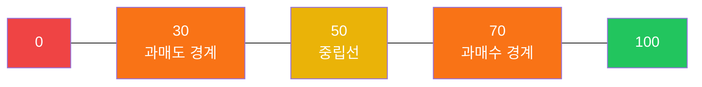
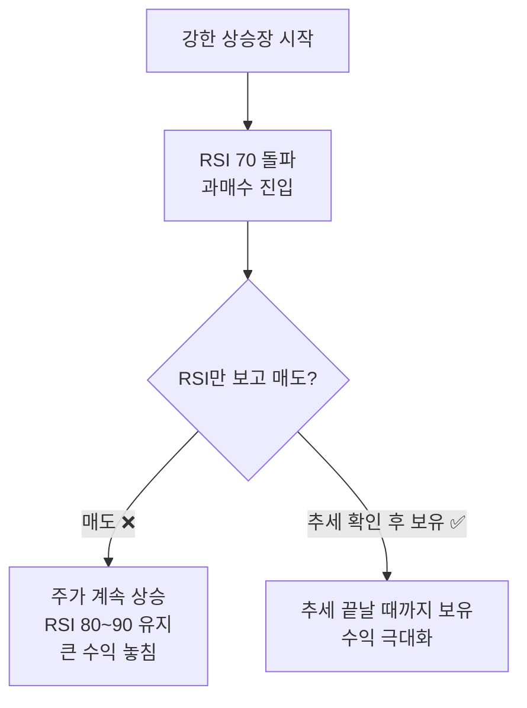
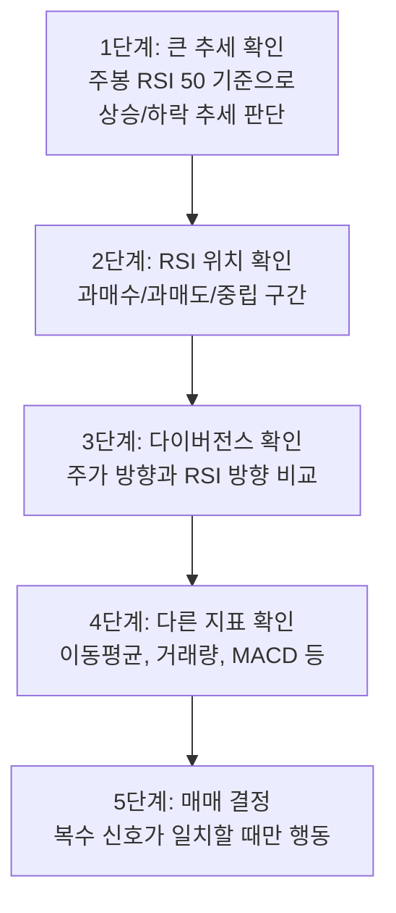

# 1. 개요

## 1.1 RSI란 무엇인가

RSI(Relative Strength Index, 상대강도지수)는 주가의 **상승 압력과 하락 압력의 상대적 크기**를 측정하는 모멘텀 오실레이터다. 값은 0에서 100 사이를 움직이며, 현재 가격이 최근 추세 대비 얼마나 강하게(또는 약하게) 움직이고 있는지를 수치로 보여준다.

쉽게 말하면, RSI는 "최근 14일 동안 올랐던 날과 내렸던 날을 비교해서, 지금 시장이 과열 상태인지 침체 상태인지"를 알려주는 지표다.

## 1.2 왜 RSI를 알아야 하는가

RSI는 전 세계에서 가장 널리 사용되는 기술적 지표 중 하나다. TradingView, 증권사 HTS/MTS 어디서든 기본 제공되고, 초보 투자자부터 전문 트레이더까지 활용한다. 그런데 대부분은 "70 이상이면 팔고, 30 이하면 사라" 정도로만 알고 있다.

이 글을 읽으면 알 수 있는 것:

- RSI 계산 원리와 숫자의 의미
- 과매수/과매도를 올바르게 해석하는 법 (70 넘었다고 무조건 매도가 아니다!)
- 다이버전스를 통한 추세 전환 포착
- RSI + 다른 지표 조합을 활용한 실전 전략

## 1.3 RSI의 탄생

RSI는 **J. Welles Wilder Jr.**가 1978년 자신의 저서 《New Concepts in Technical Trading Systems》에서 처음 소개했다. Wilder는 RSI 외에도 ATR(Average True Range), ADX(Average Directional Index), Parabolic SAR 등 기술적 분석의 핵심 지표들을 다수 개발한 인물이다.

RSI가 50년 가까이 살아남은 이유는 단순하다. **직관적이면서도 실전에서 효과적**이기 때문이다.

# 2. RSI 계산 원리

RSI를 제대로 활용하려면 숫자가 어떻게 만들어지는지 이해해야 한다. 공식 자체는 간단하다.

## 2.1 핵심 공식

$$
RSI = 100 - \frac{100}{1 + RS}
$$

여기서 **RS(Relative Strength)**는:

$$
RS = \frac{\text{평균 상승폭 (Average Gain)}}{\text{평균 하락폭 (Average Loss)}}
$$

- **평균 상승폭**: 일정 기간 동안 가격이 **오른 날들의 상승폭 평균**
- **평균 하락폭**: 일정 기간 동안 가격이 **내린 날들의 하락폭 평균** (절댓값)
- **기본 기간**: 14일 (Wilder 권장)

## 2.2 단계별 계산 예시 (14일 기준)

실제 숫자로 계산 과정을 따라가 보자. 아래는 가상의 주가 데이터 14일치다.

| 일차 | 종가 | 변동폭 | 상승 | 하락 |
|------|------|--------|------|------|
| 1 | 50,000 | — | — | — |
| 2 | 50,500 | +500 | 500 | 0 |
| 3 | 50,300 | -200 | 0 | 200 |
| 4 | 51,000 | +700 | 700 | 0 |
| 5 | 51,800 | +800 | 800 | 0 |
| 6 | 51,500 | -300 | 0 | 300 |
| 7 | 52,000 | +500 | 500 | 0 |
| 8 | 51,700 | -300 | 0 | 300 |
| 9 | 52,200 | +500 | 500 | 0 |
| 10 | 52,800 | +600 | 600 | 0 |
| 11 | 52,500 | -300 | 0 | 300 |
| 12 | 53,000 | +500 | 500 | 0 |
| 13 | 53,500 | +500 | 500 | 0 |
| 14 | 53,200 | -300 | 0 | 300 |
| 15 | 53,800 | +600 | 600 | 0 |

**Step 1: 14일간의 평균 상승폭 / 평균 하락폭 구하기 (2일~15일, 14개 변동)**

- 상승한 날: 500 + 700 + 800 + 500 + 500 + 600 + 500 + 500 + 600 = **5,200** (9일)
- 하락한 날: 200 + 300 + 300 + 300 + 300 = **1,400** (5일)

> 주의: 평균은 상승/하락 일수가 아니라 **전체 기간(14일)**로 나눈다.

- 평균 상승폭 = 5,200 ÷ 14 = **371.4**
- 평균 하락폭 = 1,400 ÷ 14 = **100.0**

**Step 2: RS 계산**

$$
RS = \frac{371.4}{100.0} = 3.714
$$

**Step 3: RSI 계산**

$$
RSI = 100 - \frac{100}{1 + 3.714} = 100 - \frac{100}{4.714} = 100 - 21.2 = 78.8
$$

**결과: RSI = 78.8** → 70 이상이므로 과매수 구간에 진입했다.

## 2.3 이후 날의 RSI (지수이동평균 방식)

15일째부터는 이전 평균값을 활용하여 **스무딩(smoothing)**을 적용한다. Wilder의 원래 방식은 지수이동평균(EMA)과 유사하다.

$$
\text{평균 상승폭} = \frac{(\text{이전 평균 상승폭} \times 13) + \text{당일 상승폭}}{14}
$$

$$
\text{평균 하락폭} = \frac{(\text{이전 평균 하락폭} \times 13) + \text{당일 하락폭}}{14}
$$

이 스무딩 덕분에 RSI는 극단적인 값으로 갑자기 튀지 않고, 부드럽게 움직인다.

## 2.4 기간 설정에 따른 차이

Wilder가 14일을 권장한 이유는 당시 주 6일 거래 기준으로 약 2주에 해당했기 때문이다. 하지만 목적에 따라 기간을 조정할 수 있다.

| 기간 | 특성 | 적합한 트레이딩 스타일 |
|------|------|----------------------|
| **9일** | 민감하게 반응, 신호 빈번 | 단기 트레이딩, 스캘핑 |
| **14일** (기본) | 균형 잡힌 민감도 | 스윙 트레이딩, 일반 투자 |
| **25일** | 둔감하게 반응, 신호 적음 | 중장기 투자, 노이즈 필터링 |

기간이 짧을수록 RSI가 과매수/과매도 구간에 자주 진입하므로 **거짓 신호(false signal)**가 많아진다. 반대로 기간이 길면 진짜 신호를 놓칠 수 있다.


# 3. RSI 읽는 법 — 기본

## 3.1 RSI 범위와 기준선

RSI는 0에서 100 사이의 값을 가진다. 절대 이 범위를 벗어나지 않는다.



| RSI 구간 | 의미 | 해석 |
|----------|------|------|
| **70~100** | 과매수(Overbought) | 최근 상승 압력이 강함. 단기 과열 가능성 |
| **50~70** | 상승 우세 | 매수세가 매도세보다 강한 상태 |
| **50** | 중립 | 상승폭과 하락폭이 동일 |
| **30~50** | 하락 우세 | 매도세가 매수세보다 강한 상태 |
| **0~30** | 과매도(Oversold) | 최근 하락 압력이 강함. 반등 가능성 |

## 3.2 50 기준선의 의미

RSI 50은 간과하기 쉽지만 중요한 기준선이다.

- **RSI > 50**: 최근 기간 동안 상승폭이 하락폭보다 크다 → **상승 추세**
- **RSI < 50**: 최근 기간 동안 하락폭이 상승폭보다 크다 → **하락 추세**
- **RSI가 50을 돌파하는 순간**: 추세 전환의 힌트가 될 수 있다

단순히 과매수/과매도만 보지 말고, RSI가 50 위에서 주로 움직이는지 아래에서 움직이는지를 관찰하면 현재 추세의 방향을 가늠할 수 있다.

## 3.3 ⚠️ 과매수 = 무조건 매도가 아니다!

이것이 RSI를 사용할 때 가장 많이 저지르는 실수다.

> **"RSI가 70을 넘었으니까 팔아야지!"** → ❌ 위험한 판단

강한 상승 추세에서는 RSI가 70 이상을 **몇 주, 심지어 몇 달간 유지**할 수 있다. 이런 상황에서 RSI 70 돌파만 보고 매도하면 큰 상승장을 통째로 놓치게 된다.

**실제 사례로 이해하기:**

| 상황 | RSI | 올바른 해석 |
|------|-----|------------|
| 테슬라가 2020년 하반기 폭등할 때 | 80~90 유지 | 과매수지만 추세가 강력하므로 매도 신호 아님 |
| 횡보하던 주식이 잠깐 70 터치 후 하락 | 70 → 60 | 이때가 진짜 과매수 후 조정 |
| 코스피가 급락 후 RSI 20 | 20 | 과매도지만 추가 하락 가능 (공포 구간) |

**핵심 원칙:**
- 과매수/과매도는 **"주의하라"는 신호**이지 **"지금 당장 행동하라"는 신호가 아니다**
- RSI가 과매수 구간에 진입한 뒤 **다시 70 아래로 떨어지는 시점**이 더 의미 있는 매도 타이밍
- 과매도도 마찬가지. RSI 30 이하에서 **다시 30을 회복하는 시점**이 매수 타이밍으로 더 신뢰할 수 있다
- **추세의 강도를 함께 봐야 한다** — 강한 추세에서는 기준선 자체를 조정해야 할 수도 있다 (예: 상승 추세에서 80/40, 하락 추세에서 60/20)


# 4. RSI 다이버전스

다이버전스(Divergence)는 RSI 활용법 중 가장 강력하면서도 자주 오해받는 개념이다. **주가의 방향과 RSI의 방향이 서로 다르게 움직이는 현상**을 말한다.

## 4.1 상승 다이버전스 (Bullish Divergence)

**정의:** 주가는 저점을 낮추는데(더 깊이 빠지는데), RSI는 저점을 높이는 현상

텍스트로 시각화하면:

```
주가:   저점 A (40,000원)  →  저점 B (38,000원)   ↘ 하락
RSI:    저점 A (25)        →  저점 B (32)          ↗ 상승
```

**해석:** 주가는 더 떨어졌지만, 하락의 **모멘텀(힘)**은 약해지고 있다는 뜻이다. 매도세가 소진되고 있으므로 **반등 가능성**이 높아진다.

**실전 시나리오:**
어떤 종목이 1차 급락으로 40,000원까지 떨어졌고, 이때 RSI가 25까지 내려갔다. 이후 반등했다가 다시 하락하여 38,000원까지 빠졌다. 그런데 이번에 RSI를 보니 32까지만 내려갔다. 주가는 더 낮은 저점을 찍었지만, RSI 저점은 이전보다 높다. 이것이 상승 다이버전스다. "가격은 더 빠졌지만 하락 에너지는 줄어들고 있다"는 신호이므로, 반등을 준비해볼 수 있는 구간이다.


## 4.2 하락 다이버전스 (Bearish Divergence)

**정의:** 주가는 고점을 높이는데(더 올라가는데), RSI는 고점을 낮추는 현상

```
주가:   고점 A (60,000원)  →  고점 B (63,000원)   ↗ 상승
RSI:    고점 A (78)        →  고점 B (72)          ↘ 하락
```

**해석:** 주가는 더 올랐지만, 상승의 **모멘텀(힘)**은 약해지고 있다. 매수세가 소진되고 있으므로 **조정 가능성**이 높아진다.

**실전 시나리오:**
어떤 종목이 강하게 올라 60,000원 고점을 찍었고, RSI가 78이었다. 이후 소폭 조정 후 다시 상승하여 63,000원으로 신고가를 경신했다. 그런데 RSI를 확인하니 72까지만 올라갔다. 주가는 더 높은 고점인데 RSI는 오히려 낮아졌다. "가격은 신고가지만 상승 에너지는 줄고 있다"는 경고 신호다. 이때부터 익절이나 비중 축소를 고려할 수 있다.


## 4.3 다이버전스 정리

| 유형 | 주가 | RSI | 의미 | 예상 움직임 |
|------|------|-----|------|------------|
| **상승 다이버전스** | 저점 ↘ | 저점 ↗ | 하락 모멘텀 약화 | 반등 가능성 |
| **하락 다이버전스** | 고점 ↗ | 고점 ↘ | 상승 모멘텀 약화 | 조정 가능성 |
| **히든 상승 다이버전스** | 저점 ↗ | 저점 ↘ | 상승 추세 지속 확인 | 상승 지속 |
| **히든 하락 다이버전스** | 고점 ↘ | 고점 ↗ | 하락 추세 지속 확인 | 하락 지속 |

> **히든 다이버전스**는 기존 추세의 **지속**을 확인하는 신호이고, 일반 다이버전스는 추세 **전환**을 암시하는 신호다. 초보자는 먼저 일반 다이버전스를 익힌 후 히든 다이버전스로 넘어가는 것을 추천한다.

## 4.4 다이버전스가 실패하는 경우

다이버전스는 강력한 신호지만 **항상 맞는 것은 아니다**. 특히 다음 상황에서 실패할 수 있다:

- **매우 강한 추세장**: 강한 상승장에서 하락 다이버전스가 나타나도 주가가 계속 오르는 경우가 흔하다. 추세의 힘이 다이버전스 신호보다 강하기 때문이다.
- **다이버전스가 너무 오래 지속**: 다이버전스가 발생한 후 실제 전환까지 시간이 오래 걸리면, 그 사이에 추세가 더 진행될 수 있다.
- **외부 이벤트**: 실적 발표, 금리 결정, 지정학적 이벤트 등이 기술적 신호를 무력화할 수 있다.

**따라서 다이버전스 단독으로 매매 결정을 내리지 말고, 반드시 다른 지표나 가격 패턴과 함께 확인해야 한다.**

# 5. RSI 실전 활용 전략

## 5.1 추세 확인 도구로 사용하기

RSI를 과매수/과매도 판단에만 쓰는 것은 절반만 활용하는 것이다. RSI 50 기준선을 활용한 추세 확인이 오히려 더 실용적인 경우가 많다.

| RSI 위치 | 추세 판단 | 전략 |
|----------|-----------|------|
| RSI > 50 지속 | 상승 추세 | 눌림목(조정) 매수 유리 |
| RSI < 50 지속 | 하락 추세 | 반등 시 매도(손절) 고려 |
| RSI가 50을 상향 돌파 | 추세 전환 (상승) | 매수 진입 검토 |
| RSI가 50을 하향 이탈 | 추세 전환 (하락) | 포지션 정리 검토 |

## 5.2 Failure Swing (실패 스윙)

Wilder가 직접 강조한 패턴으로, 다이버전스보다도 **더 강력한 신호**로 평가했다.

### Bullish Failure Swing (매수 신호)

```
① RSI가 30 아래로 하락 (과매도 진입)
② RSI가 반등하여 30 위로 복귀 → 중간 고점 형성 (예: RSI 38)
③ RSI가 다시 하락하지만 30을 깨지 않음 (예: RSI 33에서 지지)
④ RSI가 ②의 중간 고점(38)을 상향 돌파 → 매수 신호!
```

**핵심:** RSI가 과매도 구간에서 빠져나온 뒤, 다시 과매도로 빠지지 않고 이전 고점을 돌파하는 패턴이다. 하락 에너지가 완전히 소진되었다는 강한 반등 신호다.

### Bearish Failure Swing (매도 신호)

```
① RSI가 70 위로 상승 (과매수 진입)
② RSI가 하락하여 70 아래로 복귀 → 중간 저점 형성 (예: RSI 65)
③ RSI가 다시 상승하지만 70을 돌파하지 못함 (예: RSI 68에서 저항)
④ RSI가 ②의 중간 저점(65)을 하향 이탈 → 매도 신호!
```

## 5.3 RSI + 이동평균 조합

RSI 단독 사용보다 이동평균선과 함께 사용하면 신호의 신뢰도가 크게 높아진다.

| 조합 전략 | 매수 조건 | 매도 조건 |
|-----------|-----------|-----------|
| RSI + 20일선 | RSI 30 이하 + 주가가 20일선 부근 지지 | RSI 70 이상 + 주가가 20일선 이탈 |
| RSI + 60일선 | RSI 50 상향 돌파 + 주가가 60일선 위 | RSI 50 하향 이탈 + 주가가 60일선 아래 |
| RSI + 골든크로스 | RSI > 50 + 20일선이 60일선 상향 돌파 | RSI < 50 + 데드크로스 발생 |

**실전 팁:** RSI가 과매도에서 반등할 때, 해당 주가가 주요 이동평균선(20일, 60일, 120일) 부근에서 지지를 받고 있다면 신뢰도가 높다. 반대로 이동평균선을 이탈한 상태에서 RSI만 과매도라면 **추가 하락 가능성**이 있다.


## 5.4 RSI + 거래량

과매수/과매도 구간에서 거래량을 함께 확인하면 신호의 질을 높일 수 있다.

| RSI 상태 | 거래량 | 해석 |
|----------|--------|------|
| 과매수 + 거래량 급감 | 📉 | 매수세 약화 → 조정 임박 가능성 높음 |
| 과매수 + 거래량 유지/증가 | 📈 | 매수세 여전히 강함 → 추세 지속 가능 |
| 과매도 + 거래량 급증 | 📈 | 공포 매도 클라이맥스 → 반등 임박 가능성 |
| 과매도 + 거래량 미미 | 📉 | 관심 없는 하락 → 추가 하락 가능성 |

## 5.5 기간 설정 가이드

| 트레이딩 스타일 | 권장 RSI 기간 | 과매수/과매도 기준 | 비고 |
|----------------|---------------|-------------------|------|
| 데이트레이딩 | 9일 | 80/20 | 민감하게 반응, 빠른 진입/청산 |
| 스윙 트레이딩 | 14일 (기본) | 70/30 | 가장 범용적 |
| 포지션 트레이딩 | 21~25일 | 70/30 | 큰 추세만 포착 |
| 장기 투자 | 14일 (주봉) | 70/30 | 주봉 RSI로 대세 판단 |

> **팁**: 일봉 RSI로 단기 타이밍을 잡되, 주봉 RSI로 큰 추세 방향을 먼저 확인하는 **멀티 타임프레임 분석**이 효과적이다. 주봉 RSI가 상승 추세(50 이상)일 때 일봉 RSI 과매도에서 매수하면 승률이 높아진다.

# 6. RSI의 한계와 주의사항

## 6.1 강한 추세장에서의 함정

RSI의 가장 큰 약점은 **강한 추세장에서 속임 신호가 많다**는 것이다.



- **상승 추세**: RSI가 70~90에서 오래 머물 수 있다. 이때 RSI 기준을 80/40으로 조정하는 것이 현실적이다.
- **하락 추세**: RSI가 10~30에서 오래 머물 수 있다. 이때는 60/20으로 조정한다.

## 6.2 RSI 단독 사용의 위험

| 시나리오 | RSI 신호 | 실제 결과 | 교훈 |
|----------|----------|-----------|------|
| 악재 발생 후 급락 | RSI 20 (과매도 → 매수?) | 추가 50% 하락 | 과매도에서도 더 빠질 수 있다 |
| 실적 서프라이즈 | RSI 75 (과매수 → 매도?) | 추가 30% 상승 | 펀더멘탈이 뒷받침되면 과매수가 지속된다 |
| 횡보장에서 진동 | RSI 70 터치 후 60으로 | 별 의미 없는 움직임 | 추세가 없으면 RSI 신호도 약하다 |

**결론:** RSI는 **보조지표**다. 주가, 거래량, 이동평균, 추세선, 펀더멘탈 분석 등과 반드시 병행해야 한다.

## 6.3 종목별 기준 조정

모든 종목에 70/30을 일률적으로 적용하면 안 된다.

- **변동성이 큰 종목** (성장주, 소형주): RSI가 극단값에 자주 도달 → 80/20으로 기준 조정
- **변동성이 작은 종목** (대형 가치주, ETF): RSI가 좁은 범위에서 움직임 → 65/35로 조정
- **지수(코스피, S&P 500)**: 기본 70/30이 잘 작동하는 편

해당 종목의 과거 RSI 패턴을 확인한 후, 실제로 반전이 잘 일어나는 RSI 레벨을 찾는 것이 가장 좋다.

# 7. 다른 보조지표와 비교

RSI를 효과적으로 활용하려면, 비슷한 역할을 하는 다른 지표들과의 차이를 알아야 한다. 어떤 상황에서 어떤 지표가 더 유용한지 비교해보자.

## 7.1 비교 표

| 항목 | RSI | MACD | 스토캐스틱 | 볼린저 밴드 | CCI |
|------|-----|------|-----------|------------|-----|
| **유형** | 모멘텀 오실레이터 | 추세 추종형 | 모멘텀 오실레이터 | 변동성 채널 | 모멘텀 오실레이터 |
| **값 범위** | 0~100 (고정) | 무제한 | 0~100 (고정) | 밴드 폭 변동 | 무제한 |
| **기본 기간** | 14일 | 12, 26, 9 | 14, 3 | 20일, 2σ | 20일 |
| **주요 용도** | 과매수/과매도, 다이버전스 | 추세 방향, 매매 타이밍 | 단기 과매수/과매도 | 변동성 + 가격 위치 | 평균 대비 이탈 정도 |
| **민감도** | 보통 | 느림 | 빠름 | 보통 | 빠름 |
| **횡보장** | ★★★★ | ★★ | ★★★★ | ★★★★★ | ★★★ |
| **추세장** | ★★ | ★★★★★ | ★★ | ★★★ | ★★★ |
| **거짓 신호** | 보통 | 적음 | 많음 | 적음 | 보통 |

## 7.2 RSI vs MACD

MACD(Moving Average Convergence Divergence)는 두 이동평균의 차이를 추적하여 **추세의 방향과 강도**를 파악한다.

- **MACD**: "지금 추세가 상승인가 하락인가, 그리고 추세가 강해지고 있는가 약해지고 있는가"에 답한다
- **RSI**: "최근 가격 변동이 과열인가 침체인가"에 답한다

**언제 뭘 써야 하나:**
- 추세가 명확할 때 → MACD가 더 유용 (추세 방향을 따라가며 매매)
- 횡보나 박스권일 때 → RSI가 더 유용 (과매수/과매도에서 반전 매매)
- 둘을 함께 쓰면 최고: **MACD로 추세 방향을 확인하고, RSI로 진입 타이밍을 잡는다**

## 7.3 RSI vs 스토캐스틱 (Stochastic)

스토캐스틱도 RSI처럼 0~100 사이의 모멘텀 오실레이터지만, 계산 방식이 다르다. 스토캐스틱은 **현재 가격이 일정 기간의 최고가-최저가 범위에서 어디에 위치하는지**를 보여준다.

| 비교 | RSI | 스토캐스틱 |
|------|-----|-----------|
| 반응 속도 | 보통 | 빠름 |
| 신호 빈도 | 적절함 | 많음 (노이즈 포함) |
| 다이버전스 | 명확함 | 자주 발생하지만 신뢰도 낮음 |
| 추세장 성능 | 보통 | 약함 (자주 과매수에 머뭄) |
| 추천 조합 | RSI + MACD | 스토캐스틱 + RSI |

**실전 팁:** 스토캐스틱은 RSI보다 더 빠르게 반응하므로, **RSI로 큰 방향을 잡고 스토캐스틱으로 세밀한 진입 타이밍**을 잡는 조합이 효과적이다.

## 7.4 RSI vs 볼린저 밴드

볼린저 밴드는 RSI와 성격이 다르지만, **함께 사용하면 시너지가 크다.**

- 볼린저 밴드 하단 터치 + RSI 30 이하 → **강력한 과매도 신호**
- 볼린저 밴드 상단 터치 + RSI 70 이상 → **강력한 과매수 신호**

한 지표만으로는 확신하기 어려운 신호를, 두 지표가 동시에 같은 방향을 가리키면 신뢰도가 크게 높아진다.

## 7.5 조합 추천

| 투자 스타일 | 추천 조합 | 이유 |
|------------|-----------|------|
| 단기 트레이딩 | RSI + 스토캐스틱 + 거래량 | 빠른 진입/청산, 민감한 신호 포착 |
| 스윙 트레이딩 | RSI + MACD + 이동평균 | 추세 확인 + 타이밍 + 필터 |
| 장기 투자 | RSI(주봉) + 볼린저 밴드 | 큰 과매도 구간에서 분할 매수 |
| 역추세 매매 | RSI 다이버전스 + 볼린저 밴드 | 반전 신호의 이중 확인 |

# 8. 정리 & 참고

## 8.1 핵심 정리

RSI는 단순하지만 깊이 있는 지표다. 핵심만 요약하면:

| 항목 | 내용 |
|------|------|
| **정의** | 상승/하락 모멘텀의 상대적 크기를 0~100으로 표현 |
| **공식** | RSI = 100 - 100/(1+RS), RS = 평균상승폭/평균하락폭 |
| **기본 설정** | 14일, 과매수 70, 과매도 30 |
| **가장 큰 오해** | 과매수 = 매도, 과매도 = 매수 (❌) |
| **올바른 사용법** | 추세 확인 + 다이버전스 + 다른 지표 조합 |
| **가장 강력한 신호** | Failure Swing, 다이버전스 |
| **최대 약점** | 강한 추세장에서 속임 신호 |

## 8.2 RSI 체크리스트

매매 전 RSI를 확인할 때 다음 순서를 따라보자.



## 8.3 참고

- Wilder, J.W. (1978). *New Concepts in Technical Trading Systems*
- [RSI - Investopedia](https://www.investopedia.com/terms/r/rsi.asp)
- [RSI 지표 - 나무위키](https://namu.wiki/w/RSI)
- [TradingView RSI 공식 문서](https://www.tradingview.com/support/solutions/43000502338-relative-strength-index-rsi/)
- [RSI Divergence — How to Use It - BabyPips](https://www.babypips.com/learn/forex/divergence-cheat-sheet)
