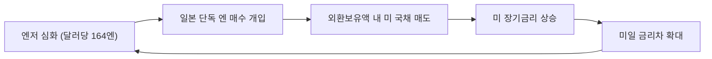
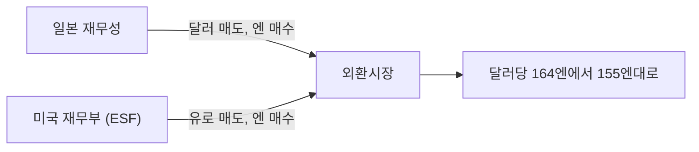

# 1. 들어가며

2026년 7월 30일, 일본 당국이 하루에만 8조 4,500억 엔을 외환시장에 쏟아부었다. 일본 역사상 하루 개입 규모로는 최대다. 다음 날인 31일에는 5조 3,300억 엔을 추가로 투입했고, 이번에는 미국 재무부가 함께 들어왔다.

여기서 눈여겨볼 지점이 있다. 미국이 **엔화를 사는 쪽**으로 시장에 들어온 것은 1998년 아시아 외환위기 이후 28년 만이다. 미국은 통상 다른 나라의 환율 개입에 시큰둥하거나 오히려 견제하는 쪽이었다. 그런 미국이 자국 돈을 써가며 남의 나라 통화를 떠받쳐 준 것이다.

왜일까. 결론부터 말하면, 미국은 엔화를 구하려던 게 아니었다. 자국 국채 시장을 구하려던 것이다.

이 글에서는 다음을 정리한다.

- 2026년 7~8월 미일 공동 개입의 사실관계와 규모
- 엔화가 40년 만의 최저치까지 밀린 구조적 원인
- 미국이 이례적으로 참여한 진짜 이유
- 개입 방식에 숨어 있는 미국의 속내
- 2주가 지난 지금의 성적표와 투자자 관점의 시사점

# 2. 무슨 일이 있었나

## 2.1 사건 타임라인

| 일자 | 내용 |
|------|------|
| 2025.09.11 | 미일 재무장관 공동성명 발표. 개입 조건과 공표 원칙 합의 |
| 2026.04.30 | 일본 단독 개입 재개. 4월 한 달간 11조 7,300억 엔 |
| 2026.07.29 | 달러당 164엔 육박. 1986년 이후 40년 만의 최저 |
| 2026.07.30 | 일본 단독 개입 8조 4,500억 엔. 일일 기준 역대 최대 |
| 2026.07.31 | 일본 5조 3,300억 엔 추가 투입, 미국 재무부 공동 참여 |
| 2026.08.03 | 양국이 공동 개입 사실을 공식 확인 |
| 2026.08.10 | 엔화 159엔대로 재하락. 개입 효과 절반 반납 |

## 2.2 규모

이틀간 일본이 투입한 금액은 13조 7,800억 엔이다. 원화로 약 126조 원, 달러로 868억 달러 규모다. 4월 한 달 기록(11조 7,300억 엔)을 이틀 만에 넘어섰다.

미국의 참여 규모는 훨씬 작다. 시장에서는 50억~100억 달러 수준으로 추정한다. 일본이 쓴 돈의 10분의 1 남짓이다. 금액만 보면 상징적 참여에 가깝다.

그런데도 시장이 크게 반응한 이유는 금액이 아니라 **주체**에 있었다. 세계 최대 기축통화국이 특정 통화의 방향에 명시적으로 편을 들었다는 사실 자체가 신호였다.

## 2.3 개입의 근거

이번 개입은 즉흥적인 것이 아니었다. 2025년 9월 11일 발표된 미일 재무장관 공동성명이 근거다. 이 성명에서 양국은 두 가지에 합의했다.

- 외환시장 개입은 **과도한 변동성이나 무질서한 시장 상황**에 한정한다
- 모든 개입 실시 상황을 **최소 월 1회 이상 공표**한다

개입의 명분과 절차를 미리 만들어 둔 것이다. 일본 입장에서는 미국의 사전 양해를 문서로 확보한 셈이고, 미국 입장에서는 개입에 조건을 걸어 남용을 막은 셈이다.

# 3. 엔화는 왜 164엔까지 밀렸나

## 3.1 벌어진 금리차

가장 직접적인 원인은 미일 금리차다.

| 구분 | 정책금리 |
|------|---------|
| 미국 연방기금금리 | 3.50~3.75% |
| 일본 정책금리 | 1.00% |

2.5%포인트 넘는 차이가 유지되는 한, 엔을 빌려 달러 자산에 투자하는 엔 캐리 트레이드는 계속 돈이 된다. 이 거래가 돌아갈 때마다 엔은 팔리고 달러는 사진다.

## 3.2 통화와 재정의 엇박자

더 근본적인 문제는 일본 내부의 정책 충돌이다.

일본은행은 금리를 올려 긴축 방향으로 가고 있다. 그런데 다카이치 정부는 18조 엔 규모의 추가경정예산으로 돈을 푼다. 한쪽이 조이고 한쪽이 푼다.

정부의 기조 전환은 문서로도 확인된다. 다카이치 정부는 '경제 재정 운영과 개혁의 기본 방침'에서 해마다 써 오던 **'재정 건전화'**라는 표현을 빼고, 대신 **'지속 가능성'**과 **'책임 있는 적극 재정'**을 명문화했다. 기술·국방·소비 진작에 지출을 늘리겠다는 선언이다.

시장은 이를 재정 규율의 후퇴로 읽었다. 통화당국이 아무리 조여도 재정이 반대 방향으로 밀면 통화가치는 버티기 어렵다.

## 3.3 외부 요인

여기에 에너지 수입 부담이 겹쳤다. 이란 전쟁으로 에너지 가격이 흔들리는 상황에서, 에너지의 대부분을 수입하는 일본은 무역수지 측면에서도 엔 매도 압력을 받았다.

IMF는 일본의 2026년 성장률 전망치를 4월의 0.7%에서 0.6%로 낮췄다. 성장이 둔화되는 상황에서 금리를 공격적으로 올리기도 어렵다.

# 4. 진짜 이유 — 미국이 구한 건 엔화가 아니었다

여기가 이번 사건의 핵심이다. 미국은 왜 나섰을까.

## 4.1 일본은 미 국채 최대 보유국이다

2026년 5월 말 기준, 일본이 보유한 미 국채는 **1조 1,431억 달러**다. 전 세계에서 가장 많다.

이 사실이 왜 중요한지는 개입의 작동 방식을 보면 드러난다. 일본이 엔화를 사려면 달러를 팔아야 한다. 그런데 그 달러는 어디서 나오는가. 외환보유액이다. 그리고 일본 외환보유액의 상당 부분은 현금이 아니라 **미 국채**로 들어 있다.

즉 일본이 대규모로 단독 개입을 하면, 그만큼 미 국채를 팔아야 한다.

## 4.2 악순환의 구조

이 연결고리가 만들어내는 순환이 미국 입장에서 골치 아프다.

엔저를 막으려는 개입이 오히려 엔저의 원인인 금리차를 키운다. 일본이 스스로를 돕는 행동이 미국을 아프게 하고, 그 결과가 다시 일본에 돌아온다.

숫자로 보면 압력은 이미 현실이었다.

- 2026년 1분기 일본 투자자의 미 국채 순매도: **4조 6,700억 엔** (2022년 이후 분기 기준 최대)
- TD이코노믹스 추산: 이 속도가 유지되면 미 10년물 금리에 **20~50bp 상승 압력**
- 7월 29일 기준 미 10년물 금리: **4.7% 이상** (연초 4.1%)
- 미 30년물 금리: **5.21%**, 2007년 7월 이후 19년 만의 최고치

미국 재무부 입장에서 일본의 국채 매도는 남의 일이 아니었다. 미국이 개입에 직접 참여하면 일본이 팔아야 할 국채 물량이 줄어든다. **자국 돈을 조금 써서 자국 장기금리를 지킨 것**이다.

## 4.3 다른 계산들

국채 방어 외에도 미국의 이해가 걸린 지점이 몇 개 더 있다.

**무역적자 방어.** 엔이 싸지면 일본산 제품의 가격 경쟁력이 올라가고 대일 무역적자가 벌어진다. 관세로 적자를 줄이겠다는 정책 기조와 정면으로 충돌한다. 관세로 막은 것을 환율이 도로 열어주는 셈이다.

**아시아 통화 전반의 도미노 차단.** 엔이 무너지면 위안, 원 등 아시아 통화가 동반 약세로 간다. 아시아 통화가 약해지면 이들 국가의 미 국채 수요도 함께 흔들린다. 4.2절의 문제가 일본 하나가 아니라 아시아 전체로 확산되는 것이다.

**동맹 관리.** 엔저는 수입 물가를 밀어 올려 일본 국민의 실질소득을 깎는다. 다카이치 정권에 정치적 부담이 된다. 미국 입장에서 동맹국 정권의 안정도 계산에 들어간다.

정리하면, 이번 개입은 미국의 선의가 아니라 **이해관계의 일치**에서 나왔다. 이 구분은 중요하다. 이해가 어긋나는 순간 공조도 끝나기 때문이다.

# 5. 개입 방식이 말해주는 것

개입의 세부 방식에 미국의 속내가 드러난다. 세 가지가 특히 눈에 띈다.

## 5.1 미국은 달러가 아니라 유로를 팔았다

미국은 엔을 사면서 달러를 팔지 않았다. 보유 중이던 유로를 팔아 엔을 샀다.

이 선택은 두 가지를 동시에 말한다. 첫째, 미국은 달러 약세를 유도할 생각이 전혀 없다. 둘째, 그래서 달러·엔 환율에 미치는 직접적 압력은 구조적으로 약할 수밖에 없다. 달러 공급이 늘지 않는데 달러 가격이 크게 내릴 이유가 없다.

시장 참여자들이 개입 직후 곧바로 되팔기에 나선 배경에는 이 한계가 있다. 미국은 참여했지만, 자기 통화는 건드리지 않는 선까지만 참여했다.

## 5.2 연준이 빠졌다

역사적으로 미국의 외환 개입은 재무부와 연방준비제도가 50대 50으로 분담해 왔다. 이번에는 재무부 산하 외환안정기금(ESF)만 움직였고 연준은 참여하지 않았다.

통화정책 당국이 환율 개입에 발을 담그지 않겠다는 선 긋기로 읽힌다. 개입 규모의 상한도 이 지점에서 정해진다. ESF 단독으로는 동원할 수 있는 화력이 제한적이다.

## 5.3 국채 대신 FIMA 레포

일본 재무상은 향후 달러 매도가 필요할 때 미 국채를 시장에 파는 대신 **연준의 FIMA 레포 창구**를 활용하겠다고 언급했다. 국채를 담보로 맡기고 달러를 빌리는 방식이다.

4.2절의 악순환을 끊는 장치다. 국채가 시장에 실제로 쏟아지지 않으니 미 장기금리에 주는 충격이 줄어든다. 이 대목에서 이번 공조의 실제 목적이 다시 한번 확인된다.

# 6. 개입은 통했나

2주가 지난 지금의 성적표는 절반의 성공이다.

**통한 부분.**

- 달러당 164엔에서 장중 155.20엔까지, 3개월 만의 최고치
- 투기 포지션이 실제로 흔들렸다. 8월 4일까지 한 주간 엔 순매도 포지션이 88억 6,500만 달러 줄어 36억 400만 달러로 축소. 절대 규모로는 2014년 3월 이후 최대 감소폭
- 원·달러 환율도 동반 하락해 1,420원대까지 내려옴

**통하지 않은 부분.**

- 8월 10일 다시 159엔대로 후퇴. 되찾은 강세분의 절반가량을 반납
- 8월 중순에도 159엔 언저리에서 횡보
- 시장은 개입을 "더 비싸게 팔 기회"로 해석하는 분위기

되돌림의 원인은 두 가지다.

첫째, **155엔 저항선을 확실히 깨지 못했다.** 심리적 저항선을 명확히 돌파해야 숏 포지션에 충분한 손실을 강제할 수 있는데, 155엔 초반에서 멈추면서 그 압박이 부족했다. 오히려 차익 실현 매물이 나왔다.

둘째, **원인이 그대로다.** 금리차와 재정 우려는 개입으로 해결되지 않는다. 당국이 엔을 사도 구조가 바뀌지 않으면 투자자는 다시 판다. 개입은 가격을 옮길 뿐 방향을 바꾸지 못한다.

# 7. 과거 사례가 말해주는 개입의 한계

일본의 엔 매수 개입은 이번이 처음이 아니다.

| 시기 | 규모 | 형태 |
|------|------|------|
| 2022년 | 약 9조 1,000억 엔 | 단독 |
| 2024년 | 약 15조 2,000억 엔 (4차례) | 단독 |
| 2026년 4월 | 11조 7,300억 엔 | 단독 |
| 2026년 7~8월 | 13조 7,800억 엔 (이틀) | 미국 공조 |

규모는 계속 커지고 있고, 개입 간격은 짧아지고 있다. 그리고 매번 엔은 다시 밀렸다.

여기서 읽어야 할 것은 개입의 성격이다. 개입은 **속도 조절 장치이지 방향 전환 장치가 아니다.** 급격한 변동을 완화해 시장이 질서를 회복할 시간을 벌어줄 뿐, 통화의 균형 수준 자체를 바꾸지는 못한다.

2025년 9월 공동성명에서 개입 조건을 "과도한 변동성과 무질서한 시장 상황"으로 한정한 것도 같은 인식에서 나왔다. 수준(level)이 아니라 속도(volatility)를 다루겠다는 뜻이다.

엔화의 방향이 실제로 바뀌려면 다음 중 하나가 필요하다.

- 일본은행의 실질적인 금리 인상 가속
- 다카이치 정부의 재정 확장 기조 후퇴
- 미국의 금리 인하로 인한 금리차 축소

셋 중 어느 것도 아직 확인되지 않았다. 일본은행은 시장의 인상 기대에도 불구하고 금리를 동결했다.

# 8. 한국 투자자 관점의 시사점

## 8.1 엔저는 한국 수출에 직접적인 부담이다

원·엔 재정환율은 100엔당 907원대까지 내려왔다. 2024년 11월 이후 최저 수준이다.

일본과 해외 시장에서 직접 경쟁하는 업종이 타격을 받는다.

| 영향 | 업종 |
|------|------|
| 부정적 | 자동차, 철강, 기계, 석유화학, 조선 기자재, 전기전자 부품 |
| 긍정적 | 일본산 원자재·부품·설비 수입 비중이 높은 기업, 엔화 표시 부채 보유 기업 |

경쟁 업종은 가격 경쟁력과 마진이 함께 눌린다. 반대로 일본에서 소재·장비를 들여오는 기업은 조달 비용이 줄고, 엔화 부채가 있다면 상환 부담이 가벼워진다.

## 8.2 원화는 엔화에 동조한다

개입 직후 원·달러가 1,420원대로 함께 내려온 데서 보듯, 원화는 엔화와 같은 방향으로 움직이는 구간에 있다. 아시아 통화가 하나의 묶음으로 거래되기 때문이다.

이 말은 두 가지를 뜻한다. 엔화 개입 이벤트는 원화에도 단기 되돌림을 만든다. 하지만 같은 이유로 그 되돌림의 지속성도 엔화와 함께 짧다.

## 8.3 실무적으로 볼 레벨

- **155엔** — 당국이 방어 의지를 드러낸 레벨. 이 아래로 강하게 내려가면 개입이 성공 궤도에 들었다는 신호
- **160엔** — 일본 정부가 마지노선으로 인식해 온 레벨. 재돌파 시 추가 개입 경계감이 올라감
- **164엔** — 7월 고점. 이 위로 가면 개입 실패가 확인되는 구간

# 9. 앞으로 확인할 것

개입 뉴스 자체보다 아래 지표들이 실제 방향을 결정한다.

**일본 쪽**

- 일본은행 금융정책결정회의의 금리 결정과 성명 문구
- 18조 엔 추경의 실제 집행 규모와 국채 발행 계획
- 일본 재무성의 월간 개입 실적 공표 (공동성명에 따라 최소 월 1회 공표)

**미국 쪽**

- 미 10년물·30년물 국채 금리. 4.2절의 악순환이 완화되는지를 보는 창
- 연준의 금리 인하 시점. 금리차가 좁혀지는 유일한 미국발 경로
- 일본의 미 국채 보유 잔고 추이 (미 재무부 TIC 데이터, 월간 발표)

**시장 쪽**

- CFTC 투기적 엔 포지션. 순매도가 다시 쌓이면 엔저 재개 신호
- 원·엔 재정환율 900원선

# 10. 마무리

이번 미일 공동 개입은 28년 만의 사건이지만, 그 본질은 통화 협력보다 **채권 시장 방어**에 가깝다. 미국은 엔화를 도운 것이 아니라 자국 장기금리를 지켰다. 일본의 국채 매도를 막는 대가로 소액을 지불한 거래였다.

이 해석이 맞다면 따라오는 결론도 분명하다. 미 장기금리 압력이 완화되면 미국의 참여 동기도 약해진다. 이 공조는 이해가 겹치는 동안만 유지된다.

투자자 입장에서 기억할 것은 하나다. 개입은 원인을 바꾸지 않는다. 미일 금리차와 일본의 통화·재정 엇박자가 그대로인 한, 개입은 되돌림을 만들 뿐 추세를 되돌리지 못한다. 다음 개입 뉴스가 나왔을 때 가격이 아니라 **일본은행 회의록과 추경 규모**를 먼저 확인하는 편이 낫다.

# 11. 참고

- [Japan and U.S. confirm joint yen intervention - The Japan Times](https://www.japantimes.co.jp/business/2026/08/03/markets/japan-us-joint-yen-intervention/)
- [U.S., Japan confirm coordinated yen intervention, signal readiness for more - CNBC](https://www.cnbc.com/2026/08/03/yen-intervention-us-japan-trump-bessent-katayama.html)
- [Japan's yen intervention and the US's unusual support - OMFIF](https://www.omfif.org/2026/08/japans-yen-intervention-and-the-us-unusual-support/)
- [A 'weaponized' yen: How the U.S.-Japan intervention may reshape global currency markets - CNBC](https://www.cnbc.com/2026/08/07/japan-us-yen-intervention-global-currency-markets.html)
- [외환시장 개입한 미 재무부, 엔화가 아닌 미 국채를 구했다 - 머니투데이](https://www.mt.co.kr/world/2026/08/16/2026081516404755179)
- [일본, 엔화 방어에 이틀 동안 125조원 투입 - 경향신문](https://www.khan.co.kr/article/202608040940001/)
- [美·日이 함께 샀는데도 엔화는 왜 못 오르나 - 한국경제](https://www.hankyung.com/article/202608055269i)
- [미일 공조에도 엔화 강세 반납, "개입 효과 벌써 소진" - 뉴스핌](https://www.newspim.com/news/view/20260811000003)
- [미일 개입에도 엔화 159엔대로 - 뉴스핌](https://www.newspim.com/news/view/20260814001239)
- [美日, 환율 긴밀 공조 "엔화 매수 개입 용인" - 뉴스핌](https://www.newspim.com/news/view/20260512000849)
- [엔화 끝없는 약세, 달러·엔 환율 164엔 목전 - 이데일리](https://edaily.co.kr/News/Read?mediaCodeNo=257&newsId=03680166645518784)
- [이러다 엔화 800원대 가겠네, '슈퍼 엔저'에 코스피 하락 - 한국일보](https://www.hankookilbo.com/news/article/A2026072213350002044)
