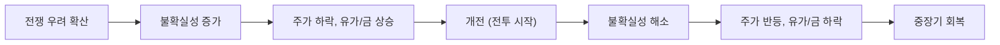
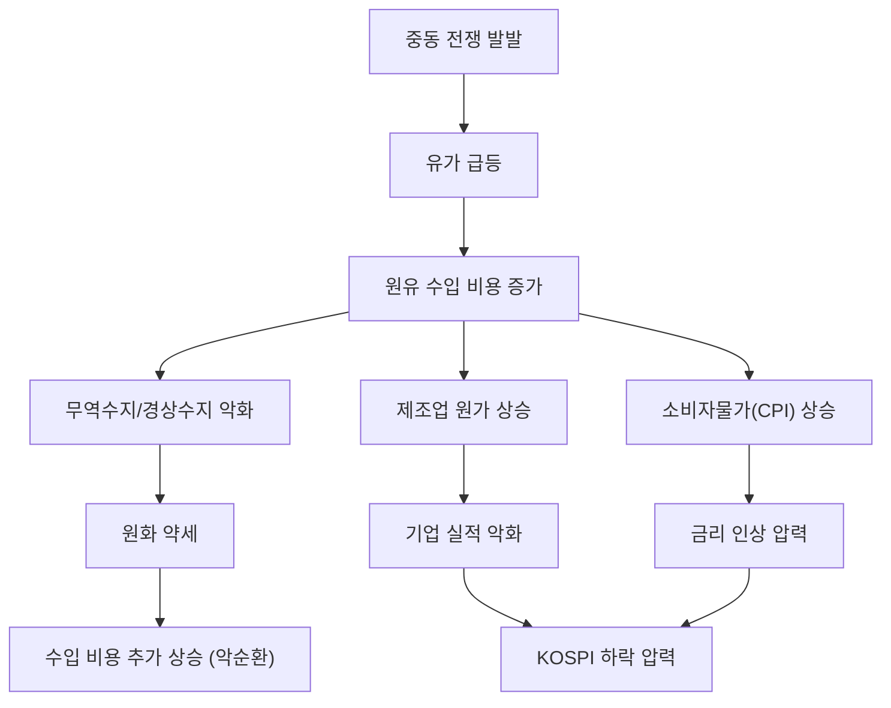

# 1. 들어가며

"전쟁이 나면 주식을 사라"는 월가의 오래된 격언이 있다. 실제로 과거 데이터를 살펴보면, 이 격언이 단순한 속설이 아니라 상당한 근거를 가지고 있다는 것을 확인할 수 있다.

중동 지역은 전 세계 원유 공급의 핵심 거점이다. 이 지역에서 군사적 충돌이 발생하면 유가, 주가, 안전자산인 금 가격이 동시에 요동친다. 이 글에서는 미국이 중동과 군사적으로 충돌했던 주요 사례를 중심으로, S&P 500, 나스닥(미국 주가지수), WTI(유가), 금, KOSPI(한국 주가지수) 다섯 가지 자산이 어떻게 반응했는지를 역사적 데이터로 분석한다.

# 2. 분석 대상 전쟁 개요

미국이 중동에서 벌인 주요 군사적 충돌을 시간순으로 정리하면 다음과 같다.

| 사건 | 시기 | 규모 |
|------|------|------|
| 걸프전 (사막의 폭풍 작전) | 1990.8 ~ 1991.2 | 대규모 전면전 |
| 이라크전 (충격과 공포 작전) | 2003.3 ~ 2011.12 | 대규모 전면전 |
| 시리아 미사일 공습 | 2017.4 | 제한적 공습 |
| 사우디 아람코 드론 공격 | 2019.9 | 비국가 행위자 공격 |
| 미-이란 긴장 (솔레이마니 사건) | 2020.1 | 제한적 충돌 |

이 중 시장에 가장 큰 영향을 미친 걸프전, 이라크전, 미-이란 긴장 세 가지를 중심으로 상세히 분석한다.

# 3. 사례 1 -- 걸프전 (1990\~1991)

## 3.1 배경과 주요 일지

1990년 8월 2일, 이라크의 사담 후세인이 쿠웨이트를 침공했다. 이에 미국 주도의 다국적군이 편성되어 1991년 1월 17일 사막의 폭풍 작전(Operation Desert Storm)이 시작되었고, 약 6주 만인 2월 28일 휴전이 선언되었다.

| 날짜 | 사건 |
|------|------|
| 1990.8.2 | 이라크, 쿠웨이트 침공 |
| 1990.8.6 | UN, 이라크에 경제 제재 부과 |
| 1990.11.29 | UN, 무력 사용 승인 |
| 1991.1.17 | 사막의 폭풍 작전 개시 (공중전) |
| 1991.2.24 | 지상전 개시 |
| 1991.2.28 | 휴전 선언 |

## 3.2 자산별 반응

**S&P 500**: 쿠웨이트 침공 이후 불확실성이 커지면서 S&P 500은 1990년 7월 고점 대비 **-18.4%** 하락했다. 그러나 사막의 폭풍 작전이 시작된 1991년 1월 17일, S&P 500은 하루 만에 +3.7% 급등했다. 개전 이후 4주간 +17.6% 반등하며 전쟁 전 하락분을 모두 만회했고, 1991년 연간으로는 +30.5% 수익률을 기록했다.

**나스닥**: 나스닥은 S&P 500보다 훨씬 큰 폭으로 움직였다. 1990년 연간 **-17.8%** 하락해 S&P 500(-3.1%)의 약 5.7배 낙폭을 기록했다. 그러나 반등도 더 강력해서 1991년 연간 **+56.8%**를 기록하며 S&P 500(+30.5%)의 약 1.9배 수익률을 보였다. 기술주 중심의 나스닥이 불확실성에 더 민감하지만, 회복기에는 더 공격적으로 반등하는 고베타 특성을 뚜렷이 보여준 사례다.

**유가 (WTI)**: 유가는 전쟁에 가장 민감하게 반응한 자산이었다. 침공 전 배럴당 $17 수준이던 유가는 쿠웨이트 침공 후 급등하기 시작해 1990년 10월 $46(+170%)까지 치솟았다. 그러나 사막의 폭풍 작전이 시작되자 하루 만에 -33% 폭락했고, 전쟁 종료 후 $20 수준으로 원점 복귀했다.

**금**: 금은 침공 직후 온스당 $384에서 $404로 약 +5% 상승하며 안전자산 역할을 했다. 그러나 다국적군의 빠른 군사적 성공이 확인되면서 가격은 다시 침공 전 수준으로 되돌아갔다.

**KOSPI**: 유가가 $17에서 $46으로 급등하면서 한국 경제는 직격탄을 맞았다. 경상수지가 1989년 GDP 대비 +1.5%에서 1991년 -2.4%로 급반전했고, 소비자물가 상승률은 5.7%에서 9.3%로 치솟았다. 원유 수입 비용 급증이 무역수지를 악화시키고 물가를 끌어올린 전형적인 사례다. KOSPI는 이미 경기 둔화 국면에서 하락세를 이어가고 있었는데, 유가 충격이 추가적인 하방 압력으로 작용했다.

## 3.3 핵심 교훈

걸프전은 "개전 시점이 저점"이라는 패턴을 가장 극명하게 보여준 사례다. 침공 이후 5개월간 이어진 불확실성이 시장을 짓눌렀지만, 실제 전투가 시작되자 불확실성이 해소되면서 시장은 빠르게 반등했다.

# 4. 사례 2 -- 이라크전 (2003\~2011)

## 4.1 배경과 주요 일지

2001년 9.11 테러 이후 미국은 이라크에 대량살상무기(WMD)가 있다는 명분으로 침공을 준비했다. 2003년 3월 20일 "충격과 공포(Shock and Awe)" 작전이 시작되었고, 4월 9일 바그다드가 함락되었다.

| 날짜 | 사건 |
|------|------|
| 2002.9 | 부시, UN에서 이라크 문제 연설 |
| 2003.2.5 | 콜린 파월, UN에 WMD 증거 제출 |
| 2003.3.17 | 부시, 사담 후세인에 48시간 최후통첩 |
| 2003.3.20 | 이라크 침공 개시 |
| 2003.4.9 | 바그다드 함락, 사담 동상 철거 |
| 2003.5.1 | 부시, "전투 종료" 선언 |

## 4.2 자산별 반응

**S&P 500**: 전쟁 불확실성이 고조되던 2002년 12월부터 2003년 3월까지 S&P 500은 **-14.7%** 하락했다. 그러나 침공이 시작된 후 1개월간 +10.5% 반등했고, 12개월 후에는 +26.7% 상승을 기록했다. 2003년 3월 저점 대비 연말까지 약 30% 상승하며, "소문에 팔고 뉴스에 사라(Sell the rumor, buy the news)" 패턴의 전형적 사례가 되었다.

**나스닥**: 닷컴 버블 붕괴(2000년 고점 대비 -78%)의 여파 속에서 이라크전 불확실성까지 겹친 상황이었다. 2002년 연간 -31.5%로 S&P 500(-22.1%)보다 더 큰 폭으로 하락했다. 그러나 2003년 3월 저점 이후 연말까지 **+57.6%** 급등하며, 연간 수익률 **+50.0%**를 기록했다. S&P 500(+28.7%)의 약 1.7배에 달하는 수익률로, 전쟁 불확실성 해소와 기술주 회복이 동시에 작용한 결과다.

**유가 (WTI)**: 침공 전 배럴당 $26이던 유가는 2003년 2월 $39(+45%)까지 상승했다. 그러나 미군의 빠른 진격으로 공급 차질 우려가 해소되면서 침공 후 오히려 하락했다. 단, 장기적으로는 이라크 불안정과 글로벌 수요 증가가 맞물려 2008년 7월 $145까지 상승하는 원유 슈퍼사이클이 이어졌다.

**금**: 금은 개전 전 불확실성 구간에서 온스당 $370까지 올랐다가, 침공 직후 $339로 하락했다. 전형적인 "전쟁 프리미엄 해소" 패턴이다. 그러나 2003년 말 $400을 돌파하며 1988년 이후 최고가를 기록했고, 이후 양적완화와 달러 약세에 힘입어 2011년 $1,900까지 장기 상승세를 이어갔다.

**KOSPI**: 2003년 KOSPI는 이라크전과 국내 신용카드 대란이 동시에 덮쳤다. 인구의 약 10%인 400만 명이 카드 채무불이행에 빠지면서 내수가 붕괴했고, KOSPI는 고점 대비 **-46%** 폭락했다. 유가 상승에도 불구하고 경상수지가 오히려 개선(+0.6% → +1.6%)된 것은, 내수 붕괴로 수입 자체가 줄었기 때문이다. 전쟁의 직접적 영향과 국내 위기의 영향을 분리하기 어렵지만, 국내 요인이 훨씬 지배적이었다.

## 4.3 핵심 교훈

이라크전은 걸프전과 마찬가지로 "불확실성 구간에서 하락, 개전 후 반등"이라는 패턴을 따랐다. 또한 KOSPI 사례는 외부 충격보다 국내 경제 상황이 한국 시장에 더 큰 영향을 미친다는 점을 보여준다.

# 5. 사례 3 -- 미-이란 긴장 (2020)

## 5.1 배경과 주요 일지

2020년 1월 3일, 미국이 이란 혁명수비대 쿠드스군 사령관 카셈 솔레이마니를 드론 공습으로 제거했다. 이란은 1월 8일 이라크 주둔 미군 기지에 탄도미사일을 발사해 보복했으나, 양측 모두 전면전 확대를 원하지 않으면서 며칠 만에 긴장이 완화되었다.

| 날짜 | 사건 |
|------|------|
| 2020.1.3 | 미국, 솔레이마니 드론 공습으로 제거 |
| 2020.1.8 | 이란, 이라크 미군 기지에 미사일 보복 공격 |
| 2020.1.8 | 트럼프, "All is well" 트윗으로 긴장 완화 시사 |
| 2020.1.9 | 양측 추가 확전 없이 사태 진정 |

## 5.2 자산별 반응

**S&P 500**: 솔레이마니 제거 당일 S&P 500은 **-0.7%** 하락에 그쳤다. 이란의 미사일 보복 직후 선물 시장이 급락했지만, 트럼프의 긴장 완화 발언 이후 빠르게 회복했다. 시장은 약 1주일 만에 충격 전 수준을 되찾았다.

**나스닥**: 나스닥도 당일 **-0.8%** 하락으로 S&P 500과 비슷한 수준이었다. 1월 6일에는 +0.6% 반등하며 이전 최고치에 근접했고, 이란 보복 미사일이 발사된 1월 8일에도 +0.6% 상승으로 마감했다. 제한적 충돌에서는 나스닥과 S&P 500의 차이가 거의 나타나지 않았다.

**유가 (WTI)**: 솔레이마니 제거 당일 WTI는 **+3.8%** 상승해 배럴당 $63.5를 기록했다. 이란 보복 미사일 이후 추가 상승했으나, 전면전이 회피되면서 수일 내 하락했다. 이후 유가는 코로나19 팬데믹으로 인한 수요 붕괴로 급락하는 다른 경로를 걸었다.

**금**: 금은 당일 **+1.6%** 상승해 온스당 $1,549를 기록했고, 이란 보복 공격 시점에 잠시 $1,600을 돌파했다. 그러나 긴장 완화 이후 상승분의 상당 부분을 반납했다.

**KOSPI**: KOSPI는 이란 미사일 공격 당일(한국 시간 1월 8일) **-1.1%** 하락해 2,151포인트를 기록했으나, 다음 날 **+1.6%** 반등해 2,186포인트로 올라서며 하루 만에 회복했다.

## 5.3 핵심 교훈

전면전으로 확대되지 않는 제한적 군사 충돌은 시장에 미치는 영향이 매우 단기적이고 제한적이다. 불확실성의 크기와 지속 기간이 시장 충격의 규모를 결정한다.

# 6. 기타 사례 요약

| 사건 | 시기 | S&P 500 | 유가 | 금 | 특이사항 |
|------|------|---------|------|------|----------|
| 시리아 미사일 공습 | 2017.4 | 거의 변동 없음 | +2% | +1% | 24시간 내 정상화 |
| 사우디 아람코 드론 공격 | 2019.9 | 이후 2개월 +4% | 장중 +20% 급등 | 소폭 상승 | 사우디 생산 빠르게 복구 |
| 아랍의 봄/리비아 개입 | 2011 | 이후 2개월 +1.4% | $92→$120 (+30%) | 상승 | 실제 공급 차질로 유가 지속 상승 |

제한적 군사 행동은 시장에 거의 영향을 주지 않았다. 다만 아람코 드론 공격처럼 실제 원유 공급에 타격을 준 사건은 유가에 큰 단기 충격을 주었고, 리비아처럼 장기간 공급이 차질을 빚은 경우에는 유가 상승이 지속되었다.

# 7. 종합 분석 -- 과거 데이터가 말해주는 패턴

## 7.1 자산별 반응 패턴 비교

| 전쟁 | S&P 500 | 나스닥 | 유가 변동 | 금 변동 | KOSPI |
|------|------|------|------|------|------|
| 걸프전 (1990) | -18.4% → 연간 +30.5% | -17.8% → 연간 +56.8% | +170% → 원점 복귀 | +5% → 원점 복귀 | 하락 추세 지속 |
| 이라크전 (2003) | -14.7% → 연간 +28.7% | -31.5% → 연간 +50.0% | +45% → 개전 후 하락 | 개전 직후 하락 → 연말 최고가 | -46% (카드 대란 복합) |
| 미-이란 (2020) | -0.7% → 1주 회복 | -0.8% → 1일 회복 | +3.8% → 수일 회복 | +1.6% → 수일 회복 | -1.1% → 1일 회복 |

## 7.2 공통 패턴: "불확실성에 팔고, 개전에 사라"

시장이 가장 두려워하는 것은 전쟁 자체가 아니라 "전쟁이 날지 안 날지 모르는 상태"다. 과거 사례를 종합하면 다음과 같은 수치가 나온다.

| 지표 | 수치 |
|------|------|
| S&P 500 평균 하락폭 (지정학적 쇼크) | -4.7% |
| 나스닥 평균 하락폭 (추정) | -7% ~ -8% (S&P 500의 1.4~1.6배) |
| 평균 저점 도달 기간 | 약 19일 |
| 평균 회복 기간 | 약 42일 |
| 1년 내 회복 비율 | 7건 중 6건 (86%) |

나스닥은 기술주 중심 구성으로 S&P 500보다 변동성이 크다. 전쟁 전에는 더 크게 하락하지만(1990년 -17.8% vs -3.1%), 회복기에는 더 강하게 반등한다(1991년 +56.8% vs +30.5%). 다만 제한적 충돌(2020년)에서는 두 지수의 차이가 거의 나타나지 않았다.

대규모 전면전(걸프전, 이라크전)은 불확실성 기간이 수개월에 달하면서 하락폭이 컸지만, 제한적 충돌(솔레이마니 사건 등)은 며칠 내 해소되었다.

## 7.3 유가 -- 단기 급등, 장기는 수급이 결정

유가는 중동 전쟁에 가장 민감하게 반응하는 자산이다. 공급 차질 우려로 단기 급등하지만, 실제 공급 영향이 제한적이면 빠르게 복귀한다.

- 걸프전(1990)은 실제 쿠웨이트·이라크 원유 공급이 중단되면서 유일하게 장기간 유가가 급등한 사례다
- 이후 전략비축유(SPR) 방출 체계, 셰일 혁명 등으로 현대 충돌의 유가 충격은 점점 축소되는 추세다
- 유가의 장기 방향은 전쟁보다 글로벌 수급(중국 경제, OPEC 정책 등)에 의해 결정된다

## 7.4 금 -- 안전자산 수요는 일시적

금은 위기 초기 2\~5% 상승하며 안전자산 역할을 하지만, 긴장이 완화되면 상승분을 되돌린다.

- 전쟁 자체보다 전쟁 이후의 통화정책(양적완화, 금리 인하)과 달러 약세가 금의 장기 방향을 결정한다
- 2003년 이후 금의 $400 → $1,900 장기 상승은 이라크전 자체보다 글로벌 유동성 확대의 영향이 컸다

## 7.5 KOSPI -- 수출 강국의 구조적 취약점

KOSPI의 단기 반응만 보면 지정학적 충격의 영향은 제한적으로 보인다. 2020년 솔레이마니 사건 때는 하루 만에 회복했다. 그러나 한국 경제의 구조적 특성을 고려하면, 중동 전쟁의 실질적 영향은 "유가 급등 → 경제 전반 악화"라는 경로를 통해 수개월에 걸쳐 나타난다.

한국은 에너지의 92\~95%를 수입에 의존하며, 원유 수입의 약 70%가 중동산이다. 세계 5위의 원유 순수입국이자, 호르무즈 해협을 통과하는 원유의 주요 소비국이기도 하다. 유가가 배럴당 $10 상승하면 한국의 경상수지는 GDP 대비 약 **0.6%p** 악화되는 것으로 추정된다.

유가 급등이 한국 경제에 미치는 전달 경로는 다음과 같다.

걸프전 당시 이 경로가 가장 뚜렷하게 작동했다.

| 지표 | 1989년 (전쟁 전) | 1991년 (전쟁 중) | 변화 |
|------|----------------|----------------|------|
| 경상수지 (GDP 대비) | +1.5% | -2.4% | -3.9%p 악화 |
| 소비자물가 상승률 | 5.7% | 9.3% | +3.6%p |

한국의 수출 중심 산업 구조도 취약점이다. 자동차, 철강, 석유화학 등 주력 수출 산업은 원유와 원자재를 대량 투입하는 에너지 집약적 제조업이다. 유가가 오르면 생산 원가가 직접 상승하고, 이 비용을 수출 가격에 즉시 전가하기 어렵다. 특히 항공(대한항공 연료비 비중 39%), 해운, 석유화학 업종이 유가 급등에 가장 취약하다.

다만, 유가 급등이 모든 한국 기업에 부정적인 것은 아니다. 정유사(SK에너지, S-Oil 등)는 정제 마진 확대로 수혜를 받을 수 있고, 조선업체(HD현대중공업 등)는 유조선 발주 증가로 수혜를 입는다. 방산업체(한화에어로스페이스, LIG넥스원 등)도 중동 방산 수출 확대의 수혜 업종이다.

결론적으로, 중동 전쟁이 KOSPI에 미치는 영향은 단기적 주가 변동보다 유가 급등이 6\~12개월에 걸쳐 기업 실적과 거시경제에 스며드는 중장기 경로가 더 중요하다.

# 8. 전쟁 시기별 섹터 전략

전쟁의 국면에 따라 강세를 보이는 섹터가 다르다. 과거 데이터를 기반으로 전쟁 전, 전쟁 중, 전쟁 후 세 국면별로 어떤 섹터가 유리했는지 정리한다.

## 8.1 전쟁 전 (긴장 고조기)

불확실성이 커지는 구간에서는 원유 공급 차질 우려와 안전자산 선호가 동시에 나타난다.

- **에너지 (강세)**: 걸프전 당시 ExxonMobil(XOM)은 1990년 +3.5%, Chevron(CVX)은 +7.2%를 기록하며 S&P 500(-3.1%)을 크게 앞섰다. 유가 급등이 직접적으로 실적에 반영되기 때문이다
- **금/금광주 (강세)**: 안전자산 수요로 금이 상승하며 금광주도 동반 강세를 보인다. 2020년 미-이란 긴장 때 주니어 금광주 ETF(GDXJ)는 약 2개월간 +20.7% 상승했다
- **방산 (혼조)**: 직관과 달리, 방산주는 전쟁 전 구간에서 반드시 강세를 보이지는 않았다. 걸프전 당시 GD(General Dynamics)는 1990년 -43.7%를 기록했는데, 이는 냉전 종식 후 국방예산 삭감이라는 구조적 요인이 겹쳤기 때문이다
- **필수소비재/유틸리티/헬스케어 (상대적 강세)**: 경기 방어 섹터는 불확실성 구간에서 S&P 500 대비 상대적으로 선방한다
- **항공/여행/소비재 (약세)**: 여행 수요 감소와 소비 심리 위축으로 약세를 보인다

## 8.2 전쟁 중 (군사 작전기)

개전과 동시에 불확실성이 해소되면서 시장 전체가 반등하는 구간이다.

- **시장 전반 (강세)**: 걸프전 개전 후 4주간 S&P 500이 +17.6% 반등했다. 이라크전 개전 후 1개월간 +10.5% 상승했다
- **에너지 (하락 전환)**: 의외로 개전 후에는 에너지주가 약세로 전환하는 경우가 많다. 공급 차질 우려가 해소되면서 유가가 하락하기 때문이다
- **금 (하락 전환)**: 금도 개전과 함께 안전자산 프리미엄이 빠지면서 하락한다. 걸프전에서 금은 개전 후 상승분을 전부 반납했다
- **방산 (보합~강세)**: NBER 연구에 따르면 방산주는 전쟁 초기에는 반응이 "의외로 미온적"이었다. 진짜 수혜는 이후 국방예산 증가가 반영되는 시점에 나타난다
- **기술/금융/소비재 (반등)**: 리스크 오프 해소로 전쟁 전 약세를 보였던 성장 섹터가 반등하기 시작한다

## 8.3 전쟁 후 (1\~4년)

장기적으로 가장 뚜렷한 섹터 차별화가 나타나는 구간이다.

- **방산 (가장 강한 아웃퍼폼)**: 이라크전 이후 S&P 항공우주·방산 지수는 2003~2007년 약 3배 상승했다. 미국 국방예산이 2001년 $3,050억에서 $6,000억 이상으로 급증한 영향이다. 개별 종목으로는 Halliburton(HAL)이 이라크 침공 시점 $20에서 12개월 만에 $66(+230%)으로 급등했다

| 종목 | 2004~2007년 누적 수익률 | S&P 500 동기간 |
|------|----------------------|---------------|
| HAL (할리버튼) | +180% | +42% |
| XOM (엑슨모빌) | +125% | +42% |
| LMT (록히드마틴) | +107% | +42% |
| RTN (레이시온) | +101% | +42% |
| GD (제너럴다이나믹스) | +95% | +42% |

- **에너지 (장기 강세)**: 중동 불안정이 장기화되면서 유가가 구조적으로 상승한 영향이다. ExxonMobil은 2004~2007년 +125%를 기록했다
- **기술/성장주 (회복)**: 불확실성 해소 후 성장 섹터로 자금이 돌아오며 강한 회복세를 보인다
- **금 (점진적 약세)**: 전쟁 프리미엄이 빠지면서 단기적으로 약세를 보이지만, 양적완화 등 통화정책 변화가 동반되면 장기 강세로 전환하기도 한다

CNBC/Kensho의 분석에 따르면, 중동 위기 이후 6개월간 방산주의 평균 수익률은 +6.7%로 S&P 500(+3.3%)의 약 2배에 달했다.

## 8.4 섹터별 요약

| 섹터 | 전쟁 전 | 전쟁 중 | 전쟁 후 (1~4년) |
|------|--------|--------|----------------|
| 방산/항공우주 | 혼조 | 보합~소폭 강세 | 강한 아웃퍼폼 |
| 에너지 (정유/탐사) | 강세 | 하락 전환 | 장기 강세 |
| 에너지 서비스 | 강세 | 혼조 | 강한 아웃퍼폼 |
| 금/금광주 | 강세 | 하락 전환 | 약세 (통화정책 따라 상이) |
| 필수소비재/유틸리티 | 상대적 강세 | 보합 | 보합 |
| 헬스케어 | 상대적 강세 | 보합 | 보합 |
| 기술 | 약세 | 반등 시작 | 강한 회복 |
| 소비재 (임의소비재) | 약세 | 반등 시작 | 회복 |
| 항공/여행 | 강한 약세 | 약세 | 회복 |
| 금융 | 약세 | 반등 시작 | 회복 |

# 9. 투자자 시사점

과거 데이터에서 도출할 수 있는 시사점을 정리하면 다음과 같다.

**첫째, 전쟁 뉴스에 공포 매도는 역사적으로 손해였다.** 지정학적 쇼크 이후 S&P 500이 1년 내 회복하지 못한 경우는 7건 중 1건에 불과했다. 공포에 매도한 투자자는 대부분 반등을 놓쳤다.

**둘째, 평소에 자산배분을 점검해야 한다.** 전쟁이 터진 뒤 금이나 에너지주를 급하게 매수하는 것은 이미 늦다. 포트폴리오에 금, 원자재 등 안전자산을 일정 비중 유지하는 것이 지정학적 리스크에 대한 사전 대비다.

**셋째, 진짜 위험은 "전쟁 + 경기침체"의 동시 발생이다.** 1990년 걸프전은 미국 경기침체와 겹치면서 하락폭이 컸다. 전쟁 단독보다 전쟁이 기존의 경제적 취약성을 심화시킬 때 시장 충격이 크다.

**넷째, 단기 변동성 활용보다 중장기 관점 유지가 유리하다.** 전쟁 기간의 저점을 정확히 맞추기는 어렵다. 적립식 투자를 유지하거나, 분할 매수로 접근하는 것이 현실적인 전략이다.

**다섯째, 섹터 로테이션은 전쟁 국면에 맞춰야 한다.** 전쟁 전에는 에너지·금이, 전쟁 후에는 방산·에너지 서비스가 강세를 보였다. 다만 방산주의 진짜 수혜는 개전 시점이 아니라 국방예산이 본격적으로 증가하는 1~4년 후에 나타난다는 점을 기억할 필요가 있다.

# 10. 마무리

마크 트웨인은 "역사는 반복되지 않지만, 운율을 맞춘다"고 했다. 과거 미국-중동 전쟁 사례를 분석해보면, 시장은 놀라울 정도로 일관된 패턴을 보여왔다. 불확실성 구간에서 하락하고, 개전과 함께 반등하며, 대부분 1년 이내에 회복했다.

물론 과거의 패턴이 미래에도 반드시 반복될 것이라는 보장은 없다. 핵 보유국 간의 충돌이나 호르무즈 해협 봉쇄 같은 극단적 시나리오에서는 과거와 다른 결과가 나올 수 있다. 그러나 역사적 데이터는 최소한, 패닉 상황에서 냉정한 판단을 내리는 데 유용한 근거가 된다.

지정학적 리스크는 제거할 수 없지만, 포트폴리오의 일부로 관리할 수 있다.

# 11. 참고 자료

- [Dunham - Emotional Market Timing: Operation Desert Storm](https://dunham.com/FA/Blog/Posts/operation-desert-storm)
- [TrendSpider - The Gulf War Recession 1990-1991](https://trendspider.com/learning-center/the-gulf-war-recession-1990-1991/)
- [ProShares - Gulf Conflicts and Markets](https://www.proshares.com/browse-all-insights/insights-commentary/quick-take-gulf-conflicts-and-markets)
- [LPL Research - How Geopolitical Shocks Affect Stock Markets](https://www.lpl.com/research/blog/middle-east-conflict-how-stocks-react-to-geopolitical-shock.html)
- [JP Morgan - Iran US Tensions Market Effect](https://www.jpmorgan.com/insights/global-research/commodities/iran-us-tensions-market-effect)
- [MSCI - Middle East Conflicts Through a Historical Lens](https://www.msci.com/research-and-insights/quick-take/middle-east-conflicts-through-a-historical-lens)
- [Fisher Investments - On Middle Eastern Conflict and Stocks](https://www.fisherinvestments.com/en-us/insights/market-commentary/on-middle-eastern-conflict-and-stocks)
- [CNBC - Defense stocks double the S&P 500's return six months after Middle East turmoil](https://www.cnbc.com/2020/01/06/defense-stocks-double-the-sp-500s-gains-months-after-crisis-events.html)
- [NBER - What Do Financial Markets Think of War in Iraq?](https://www.nber.org/system/files/working_papers/w9587/w9587.pdf)
- [Dr Wealth - Do defence stocks do well during wars?](https://drwealth.com/do-defence-stocks-do-well-during-wars/)
- [KEIA - Korea's Energy Exposure to the Middle East Conflict](https://keia.org/the-peninsula/what-is-koreas-energy-exposure-to-the-conflict-in-the-middle-east/)
- [EIA - South Korea Country Analysis](https://www.eia.gov/international/analysis/country/KOR)
- [World Bank - Current Account Balance Korea](https://data.worldbank.org/indicator/BN.CAB.XOKA.GD.ZS?locations=KR)
