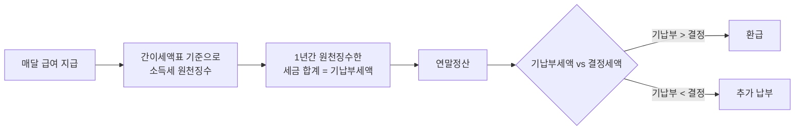
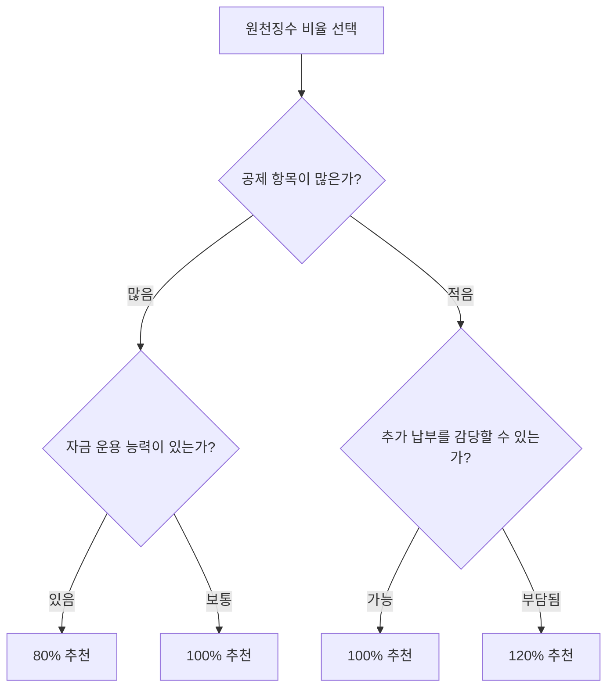

# 1. 개요

직장인은 매달 급여에서 소득세를 원천징수당한다. 그런데 이 원천징수 금액을 **80%, 100%, 120%** 중에서 선택할 수 있다는 사실을 아는 사람은 의외로 적다.

대부분 100%(기본값)로 설정되어 있지만, 비율을 변경하면 **매달 실수령액**과 **연말정산 결과**가 달라진다. 80%를 선택하면 매달 더 많이 받고 연말에 토해낼 수 있고, 120%를 선택하면 매달 적게 받지만 연말에 "13월의 월급"을 받을 가능성이 높아진다.

이 글에서는 각 비율의 장단점을 정리하고, **간이세액표 실제 데이터**를 기반으로 어떤 상황에서 어떤 비율이 유리한지 시뮬레이션해본다.

**이 글을 읽으면 알 수 있는 것:**

- 원천징수 비율 80%, 100%, 120%의 의미와 차이
- 간이세액표 실제 데이터로 본 월급별 원천징수 금액
- 각 비율 선택 시 월 실수령액과 연말정산 결과에 미치는 영향
- 본인 상황에 맞는 최적의 비율 선택 기준
- 원천징수 비율 변경 방법

> 연말정산 기본 개념이 필요하다면 [연말정산 절세 가이드](/etc/year-end-tax-settlement-preparation-guide/)를 먼저 참고하자.

# 2. 원천징수란?

## 2.1 원천징수의 개념

원천징수란 회사(원천징수의무자)가 급여를 지급할 때 **소득세를 미리 떼서** 국세청에 대신 납부하는 제도다.

직장인은 매달 **간이세액표** 기준으로 소득세가 원천징수된다. 간이세액표는 국세청이 월급 수준과 부양가족 수에 따라 정한 "대략적인" 세금 기준이다. 실제 내야 할 세금(결정세액)과 차이가 발생하기 때문에 연말정산을 통해 정산하게 된다.

## 2.2 간이세액표와 원천징수 비율

간이세액표의 기본 금액(100%)을 기준으로, 근로자는 원천징수 비율을 선택할 수 있다.

- **80%**: 간이세액의 80%만 원천징수 → 매달 세금을 적게 뗌
- **100%**: 간이세액 그대로 원천징수 → 기본값
- **120%**: 간이세액의 120%를 원천징수 → 매달 세금을 많이 뗌

> **간이세액표 기준 월급 400만 원(부양가족 1인=본인)의 경우:**
>
> | 비율 | 월 소득세 | 월 지방소득세 | 월 합계 |
> |:---:|:---:|:---:|:---:|
> | 80% | 156,760원 | 15,670원 | **172,430원** |
> | 100% | 195,960원 | 19,590원 | **215,550원** |
> | 120% | 235,150원 | 23,510원 | **258,660원** |
>
> → 80%와 120%의 월 세금 차이: **약 86,230원**
>
> *(2024년 3월 개정 간이세액표 기준)*

## 2.3 간이세액표 주요 구간 데이터

아래는 2024년 3월 개정 간이세액표의 주요 급여 구간별 원천징수 소득세다 (지방소득세 별도).

**100% 기준 월 원천징수 소득세:**

| 월급여(비과세 제외) | 부양가족 1인(본인) | 2인(본인+배우자) | 3인(본인+배우자+자녀) |
|:---:|:---:|:---:|:---:|
| 300만 원 | 74,350원 | 56,850원 | 31,940원 |
| 400만 원 | 195,960원 | 167,950원 | 109,590원 |
| 500만 원 | 335,470원 | 306,710원 | 237,850원 |

**80%/120% 선택 시 월 원천징수 소득세 (400만 원 기준):**

| 비율 | 부양가족 1인 | 2인 | 3인 |
|:---:|:---:|:---:|:---:|
| 80% | 156,760원 | 134,360원 | 87,670원 |
| 100% | 195,960원 | 167,950원 | 109,590원 |
| 120% | 235,150원 | 201,540원 | 131,500원 |

주요 포인트:

- 부양가족 수가 많을수록 원천징수 소득세가 줄어든다
- "전체 공제대상 가족 수"는 본인을 포함한 기본공제대상자 수다
- 8세 이상 20세 이하 자녀가 있으면 추가로 자녀 1명당 12,500원이 공제된다
- 간이세액표 조회: [홈택스 근로소득 간이세액표](https://hometax.go.kr/websquare/websquare.html?w2xPath=/ui/pp/index_pp.xml&tmIdx=41&tm2lIdx=4106000000&tm3lIdx=4106030000)

# 3. 비율별 장단점 비교

## 3.1 80% 선택 시

**장점:**

- 매달 실수령액이 늘어남 → 현금 흐름이 좋아진다
- 여유 자금을 투자(연금저축, IRP, 예적금 등)에 활용 가능
- 기회비용 확보 — 세금으로 묶여 있을 돈을 미리 운용할 수 있다

**단점:**

- 연말정산 때 **추가 납부(토해내기)** 가능성이 높아진다
- 추가 납부 시 한꺼번에 큰 금액을 내야 하는 심리적 부담
- 공제 항목이 적은 사람(무주택, 미혼, 부양가족 없음)에게는 추가 납부가 거의 확정적

**적합한 사람:**

- 자금 운용 능력이 있고, 여유 자금을 투자나 저축에 활용할 수 있는 사람
- 공제 항목이 충분한 사람 (부양가족, 월세, 연금저축 등)
- 현금 흐름을 중시하는 사람

## 3.2 100% 선택 시

**장점:**

- 기본값이므로 별도 설정이 필요 없다
- 대부분의 경우 환급/추가 납부 금액이 크지 않아 무난하다
- 공제 항목이 적당히 있으면 소액 환급 가능

**단점:**

- 공제가 많은 사람은 불필요하게 많은 세금을 미리 내는 셈
- 공제가 적은 사람은 여전히 추가 납부 가능

**적합한 사람:**

- 세금 관리에 크게 신경 쓰고 싶지 않은 일반 직장인
- 평균적인 공제 항목을 가진 사람

## 3.3 120% 선택 시

**장점:**

- 연말정산 때 **환급**(13월의 월급)을 많이 받을 가능성이 높다
- 강제 저축 효과 — 매달 세금을 더 내서 연말에 목돈으로 돌려받는다
- 추가 납부 걱정이 거의 없다

**단점:**

- 매달 실수령액이 줄어든다
- 기회비용 상실 — 미리 낸 세금에 대한 이자/수익을 포기하는 셈
- 국가에 무이자 대출을 해주는 것과 같다 (환급금에 이자 없음)

**적합한 사람:**

- 목돈 관리가 어려워 강제 저축이 필요한 사람
- 연말 환급의 심리적 만족감을 중시하는 사람
- 추가 납부를 절대 원하지 않는 사람

## 3.4 비교 요약표

| 구분 | 80% | 100% | 120% |
|------|-----|------|------|
| 월 실수령액 | 많음 | 보통 | 적음 |
| 연말정산 결과 | 추가 납부 가능성 ↑ | 중립 | 환급 가능성 ↑ |
| 기회비용 | 확보 (투자 가능) | 보통 | 상실 (무이자 대출) |
| 심리적 요인 | 연말 토해내기 스트레스 | 무난 | 13월의 월급 기쁨 |
| 적합한 사람 | 자금 운용 능력 있는 사람 | 일반 직장인 | 강제 저축 원하는 사람 |

# 4. 시뮬레이션: 비율별 연간 현금 흐름

총급여 5,000만 원(월급 약 417만 원, 비과세 제외) 기준으로, 간이세액표 실제 데이터를 적용해 시뮬레이션해보자.

> **핵심**: 어떤 비율을 선택하든 연간 총 세금(결정세액)은 동일하다. 납부 시점만 다를 뿐이다.

## 4.1 공제 항목이 적은 경우

**조건**: 미혼, 부양가족 본인 1명, 카드 소비 적음

**월별 원천징수 소득세 (간이세액표 실제 데이터):**

| 비율 | 월 소득세 | 월 지방소득세 | 월 합계 | **연간 기납부세액 (×12)** |
|:---:|:---:|:---:|:---:|:---:|
| 80% | 173,850원 | 17,380원 | 191,230원 | **2,294,760원** |
| 100% | 217,320원 | 21,730원 | 239,050원 | **2,868,600원** |
| 120% | 260,780원 | 26,070원 | 286,850원 | **3,442,200원** |

→ 80%와 120%의 연간 기납부세액 차이: **약 115만 원**

**결정세액 약 250만 원으로 가정 시 (공제 적은 경우):**

| 비율 | 연간 기납부세액 | 결정세액 | 연말정산 결과 |
|:---:|:---:|:---:|:---:|
| 80% | 2,294,760원 | 2,500,000원 | **추가 납부 약 20.5만 원** |
| 100% | 2,868,600원 | 2,500,000원 | **환급 약 36.9만 원** |
| 120% | 3,442,200원 | 2,500,000원 | **환급 약 94.2만 원** |

공제가 적으면 80% 선택 시 추가 납부 가능성이 높다. 다만 추가 납부 금액은 월 1~2만 원 수준을 1년간 미리 쓴 것이므로, 그 자금을 투자에 활용했다면 기회비용으로 상쇄 가능하다.

## 4.2 공제 항목이 많은 경우

**조건**: 기혼, 부양가족 3명(본인+배우자+자녀), 연금저축 900만 원 납입

**월별 원천징수 소득세 (간이세액표 실제 데이터):**

| 비율 | 월 소득세 | 월 지방소득세 | 월 합계 | **연간 기납부세액 (×12)** |
|:---:|:---:|:---:|:---:|:---:|
| 80% | 103,320원 | 10,330원 | 113,650원 | **1,363,800원** |
| 100% | 129,150원 | 12,910원 | 142,060원 | **1,704,720원** |
| 120% | 154,980원 | 15,490원 | 170,470원 | **2,045,640원** |

→ 80%와 120%의 연간 기납부세액 차이: **약 68만 원**

**결정세액 약 120만 원으로 가정 시 (연금저축·부양가족 공제 등 반영):**

| 비율 | 연간 기납부세액 | 결정세액 | 연말정산 결과 |
|:---:|:---:|:---:|:---:|
| 80% | 1,363,800원 | 1,200,000원 | **환급 약 16.4만 원** |
| 100% | 1,704,720원 | 1,200,000원 | **환급 약 50.5만 원** |
| 120% | 2,045,640원 | 1,200,000원 | **환급 약 84.6만 원** |

공제가 많으면 **80%를 선택해도 환급**을 받을 수 있다. 80% 선택 시 매달 약 2.8만 원(100% 대비)을 더 받으면서도 연말에 소액 환급까지 가능하다.

> **참고**: 결정세액은 개인별 소득공제·세액공제 항목에 따라 크게 달라진다. 위 시뮬레이션은 이해를 돕기 위한 대략적인 예시이며, 정확한 금액은 [홈택스 연말정산 미리보기](https://www.hometax.go.kr)를 통해 확인할 수 있다.

# 5. 나에게 맞는 비율은?

## 5.1 선택 기준 플로우차트

## 5.2 실전 팁

- **10월 홈택스 연말정산 미리보기**를 활용하면 올해 예상 결정세액을 미리 볼 수 있다
- 미리보기 결과를 보고 남은 2~3개월의 전략을 조정할 수 있다
- 80%를 선택한 경우, 여유 자금으로 **연금저축/IRP에 추가 납입**하면 세액공제까지 챙길 수 있다
- "추가 납부 = 손해"가 아니다 — 그 돈을 1년간 내가 먼저 쓴 것이므로, 기회비용을 고려하면 오히려 이득일 수 있다

# 6. FAQ

**Q. 원천징수 비율은 어떻게 변경하나요?**

회사마다 다르다. 사내 급여 시스템(포털, ERP 등)에서 직접 변경하거나, 인사/급여 담당자에게 요청하면 된다. 변경은 연중 언제든 가능하며, 변경한 달의 다음 급여부터 적용된다.

**Q. 비율을 변경하면 연간 총 세금이 달라지나요?**

아니다. 어떤 비율을 선택하든 연간 총 세금(결정세액)은 동일하다. 납부 시점만 달라질 뿐이다.

**Q. 변경 시기는 언제가 좋은가요?**

연초에 변경하면 1년 내내 효과를 볼 수 있다. 매년 연초에 작년 연말정산 결과를 보고 비율을 조정하는 것을 추천한다. 연말에 변경하면 이미 대부분 원천징수가 완료된 상태라 효과가 크지 않다.

# 7. 마무리

원천징수 비율 선택은 세금을 줄이는 것이 아니라, 납부 시점을 조절하는 것이다. 본인의 공제 상황과 자금 관리 스타일에 맞춰 선택하면 된다.

- 원천징수 비율은 **세금 납부 시점**만 바꾸는 것이지, 연간 총 세금은 동일하다
- **80%**: 매달 실수령액 ↑, 연말 추가 납부 가능성 ↑ → 자금 운용 능력 있는 사람에게 유리
- **100%**: 무난한 기본값 → 대부분의 직장인에게 적합
- **120%**: 매달 실수령액 ↓, 연말 환급 ↑ → 강제 저축 효과를 원하는 사람에게 유리
- 핵심은 **본인의 공제 항목**과 **자금 관리 성향**에 맞는 비율을 선택하는 것이다

# 8. 참고

- [국세청 근로소득 원천징수방법(간이세액표)](https://www.nts.go.kr/nts/cm/cntnts/cntntsView.do?mi=6583&cntntsId=7862)
- [홈택스 근로소득 간이세액표 조회](https://hometax.go.kr/websquare/websquare.html?w2xPath=/ui/pp/index_pp.xml&tmIdx=41&tm2lIdx=4106000000&tm3lIdx=4106030000)
- [근로소득세 계산기](https://incometax.calculate.co.kr/earned-income-tax-calculator)
