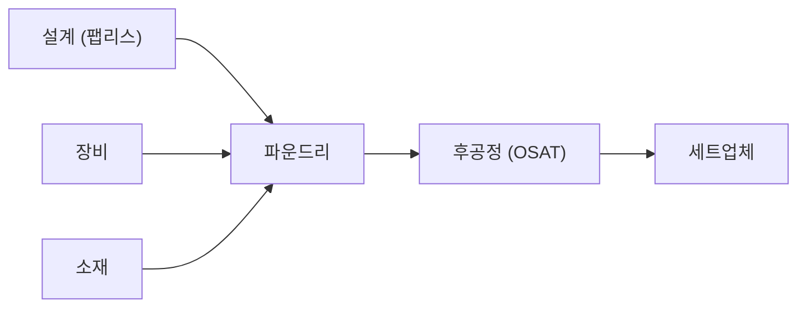

# Claude 금융 스킬 블로그 시리즈 구현 계획

> **For agentic workers:** REQUIRED SUB-SKILL: Use superpowers:subagent-driven-development (recommended) or superpowers:executing-plans to implement this plan task-by-task. Steps use checkbox (`- [ ]`) syntax for tracking.

**Goal:** Claude Code의 금융 스킬을 실제로 돌려 미국 반도체 섹터 리포트와 구글 피어 비교를 만들고, 그 경험을 정리한 도구 가이드까지 블로그 글 3편을 발행한다.

**Architecture:** 스킬 실행 → 원본 산출물 보관 → 수치 검증 → 블로그 글 작성의 4단계를 글마다 반복한다. 원본 산출물과 검증 기록은 `docs/superpowers/artifacts/`에 남겨 글의 근거를 추적할 수 있게 한다. 글 2·3을 먼저 만들고, 거기서 나온 실제 경험으로 글 1(가이드)을 쓴다.

**Tech Stack:** Claude Code 스킬(`equity-research:sector-overview`, `financial-analysis:comps-analysis`), SEC EDGAR API, WebSearch/WebFetch, Next.js 15 정적 빌드, Mermaid

**설계 문서:** `docs/superpowers/specs/2026-07-26-claude-finance-skills-blog-design.md`

**브랜치:** `feature/claude-finance-skills-blog` (이미 생성됨)

---

## 이 계획의 검증 방식

코드가 아니라 콘텐츠를 만드는 작업이므로 단위 테스트 대신 아래를 검증 수단으로 쓴다.

| 검증 항목 | 수단 |
|---|---|
| 인코딩 | `file -I` 로 `charset=utf-8` 확인 |
| 이모지 없음 | Python 정규식 스캐너 (아래 스니펫) |
| 목차 번호 체계 | Python 검증기 (아래 스니펫) |
| 수치 정확성 | SEC EDGAR 원문과 1:1 대조, 검증 표에 기록 |
| 빌드 | `npm run check` + `npm run build` |
| 렌더링 | `npm run start` 후 브라우저 확인 |

**`k:humanizer`를 적용하지 않는다.** 글 2·3은 스킬이 생성한 결과물임을 상단에 명시하는 글이라, 문체를 사람이 쓴 것처럼 다듬으면 글의 취지와 충돌한다. 글 1도 같은 방침이다. 다만 이모지 금지 등 `CLAUDE.md`의 다른 작성 규칙은 3편 모두 그대로 적용한다. 근거는 설계 문서 9.1절에 있다.

### 공용 검증 스니펫 A — 이모지 스캔

```bash
python3 - "$TARGET" <<'EOF'
import re, sys
pat = re.compile('[\U0001F1E6-\U0001F1FF\U0001F300-\U0001FAFF☀-➿⬀-⯿️]')
f = sys.argv[1]
bad = False
for i, l in enumerate(open(f, encoding='utf-8'), 1):
    if pat.search(l):
        print(f"{f}:{i}: {l.rstrip()}")
        bad = True
print("EMOJI FOUND" if bad else "NO EMOJI - OK")
EOF
```

이 정규식은 검증을 마쳤다. 국기 이모지(U+1F1E6~U+1F1FF)는 잡고, 본문에 정상적으로 쓰이는 화살표 `→`(U+2192)는 통과시킨다. 화살표 범위를 넣으면 기존 글 대부분이 오탐으로 걸린다.

### 공용 검증 스니펫 B — 목차 번호 체계

```bash
python3 - "$TARGET" <<'EOF'
import re, sys
h1 = re.compile(r'^# \d+\. \S')
h2 = re.compile(r'^## \d+\.\d+ \S')
h3 = re.compile(r'^### \d+\.\d+\.\d+ \S')
f = sys.argv[1]
ok, inblock = True, False
for i, l in enumerate(open(f, encoding='utf-8'), 1):
    if l.startswith('```'):
        inblock = not inblock
        continue
    if inblock:
        continue
    if l.startswith('### ') and not h3.match(l):
        print(f"L{i} H3 형식 오류: {l.strip()}"); ok = False
    elif l.startswith('## ') and not h2.match(l):
        print(f"L{i} H2 형식 오류: {l.strip()}"); ok = False
    elif l.startswith('# ') and not h1.match(l):
        print(f"L{i} H1 형식 오류: {l.strip()}"); ok = False
print("HEADING OK" if ok else "HEADING FAIL")
EOF
```

---

## Task 1: 반도체 섹터 스킬 실행 및 원본 산출물 보관

**Files:**
- Create: `docs/superpowers/artifacts/2026-07-26-sector-overview-raw.md`
- Create: `docs/superpowers/artifacts/2026-07-26-sector-overview-runlog.md`

- [ ] **Step 1: 실행 전 수용 기준을 런로그에 먼저 적는다**

`docs/superpowers/artifacts/2026-07-26-sector-overview-runlog.md`를 만들고 아래를 채운다. 실행 결과를 보고 기준을 바꾸는 것을 막기 위해 먼저 적는다.

```markdown
# sector-overview 스킬 실행 로그

- 실행일: 2026-07-26
- 스킬: `equity-research:sector-overview`
- 대상: 미국 반도체 섹터

## 수용 기준 (실행 전 작성)

- [ ] 밸류체인 단계별 대표 기업이 나온다
- [ ] 세그먼트 구분(로직 / 메모리 / 아날로그)이 나온다
- [ ] 기업별 밸류에이션 멀티플이 최소 5개사 이상 나온다
- [ ] 리스크 요인이 지정학·사이클 양쪽으로 나온다
- [ ] 각 수치에 출처가 붙어 있다

## 실행 명령

## 소요 시간

## 산출물 형태

## 관찰된 문제
```

- [ ] **Step 2: 스킬을 실행한다**

Skill 도구로 `equity-research:sector-overview`를 호출한다. args에 아래 내용을 넣는다.

```
US semiconductor sector overview. Data as of 2026-07-26.
No paid MCP connectors (FactSet/CapIQ/Daloopa) are available — use SEC EDGAR
filings, company IR pages, and web search instead. Cite a source for every
number. If a figure cannot be sourced, mark it UNSOURCED rather than estimating.
Output as markdown.
```

마지막 두 문장이 중요하다. 이게 없으면 스킬이 출처 없는 추정치를 채워 넣는다.

- [ ] **Step 3: 원본 산출물을 그대로 저장한다**

스킬이 뱉은 마크다운을 **한 글자도 고치지 않고** `docs/superpowers/artifacts/2026-07-26-sector-overview-raw.md`에 저장한다. 이게 나중에 "AI 초안에서 무엇이 바뀌었는지" 비교 기준이 된다.

- [ ] **Step 4: 런로그를 채운다**

Step 1에서 만든 파일의 빈 섹션을 채운다. 수용 기준 체크박스를 실제 결과에 맞게 표시하고, 실행 명령·소요 시간·산출물 형태(md인지 xlsx인지 등)·관찰된 문제를 적는다. 여기서 나온 "관찰된 문제"가 글 1의 재료가 된다.

- [ ] **Step 5: 인코딩 확인**

```bash
file -I docs/superpowers/artifacts/2026-07-26-sector-overview-raw.md \
       docs/superpowers/artifacts/2026-07-26-sector-overview-runlog.md
```

Expected: 두 파일 모두 `charset=utf-8`

- [ ] **Step 6: 커밋**

```bash
git add docs/superpowers/artifacts/
git commit -m "docs: 반도체 섹터 스킬 원본 산출물 및 실행 로그 추가

* equity-research:sector-overview 스킬 실행 결과 원본 보관
* 수용 기준 대비 실행 결과 및 관찰된 문제 기록"
```

---

## Task 2: 반도체 섹터 수치 검증

**Files:**
- Create: `docs/superpowers/artifacts/2026-07-26-sector-overview-verification.md`
- Read: `docs/superpowers/artifacts/2026-07-26-sector-overview-raw.md`

- [ ] **Step 1: 원본에서 검증 대상 수치를 모두 뽑는다**

`2026-07-26-sector-overview-raw.md`를 읽고 등장하는 모든 정량 수치(매출, 점유율, 멀티플, 시장 규모, 성장률)를 목록으로 만든다.

- [ ] **Step 2: 검증 문서 뼈대를 만든다**

```markdown
# sector-overview 산출물 검증

- 검증일: 2026-07-26
- 대상: `2026-07-26-sector-overview-raw.md`
- 원칙: 출처를 확인하지 못한 수치는 블로그 글에 싣지 않는다

## 검증 결과

| 항목 | 스킬이 제시한 값 | 확인된 값 | 출처 | 판정 |
|---|---|---|---|---|

판정 값: 일치 / 근사(오차 5% 이내) / 불일치 / 출처확인불가
```

- [ ] **Step 3: 기업 재무 수치를 SEC EDGAR와 대조한다**

각 기업의 CIK를 조회한 뒤 XBRL 재무 데이터를 가져온다. NVIDIA 예시다.

```bash
curl -s -H "User-Agent: kenshin579@gmail.com" \
  "https://data.sec.gov/api/xbrl/companyconcept/CIK0001045810/us-gaap/Revenues.json" \
  | python3 -c "import json,sys; d=json.load(sys.stdin); [print(u['end'], u['val'], u.get('form')) for u in d['units']['USD'][-8:]]"
```

CIK 조회가 필요하면 `https://www.sec.gov/files/company_tickers.json`을 받아 티커로 찾는다. SEC는 User-Agent 헤더를 요구하므로 반드시 붙인다.

- [ ] **Step 4: 시장 규모·점유율은 WebSearch로 교차 확인한다**

공시에 없는 항목(시장 규모, 점유율, 컨센서스)은 WebSearch로 최소 2개 출처를 확인한다. 두 출처가 크게 다르면 범위로 표기하고 그 사실을 검증 표에 남긴다.

- [ ] **Step 5: 검증 표를 완성하고 제외 목록을 만든다**

판정이 `불일치` 또는 `출처확인불가`인 항목을 문서 하단에 "블로그 글에서 제외할 항목" 목록으로 따로 모은다. Task 3에서 이 목록을 그대로 배제한다.

- [ ] **Step 6: 검증 결과 요약을 계산한다**

```
전체 수치 N개 중 일치 A개, 근사 B개, 불일치 C개, 출처확인불가 D개
```

이 숫자가 글 2의 `# 7. 스킬 결과를 검증해보니` 섹션과 글 1의 `## 7.2 자주 나오는 환각 패턴`에 그대로 들어간다.

- [ ] **Step 7: 커밋**

```bash
git add docs/superpowers/artifacts/2026-07-26-sector-overview-verification.md
git commit -m "docs: 반도체 섹터 산출물 수치 검증 결과 추가

* SEC EDGAR 및 웹 검색으로 스킬 산출 수치 대조
* 블로그 글에서 제외할 항목 목록 확정"
```

---

## Task 3: 글 2 작성 — 미국 반도체 섹터 리포트

**Files:**
- Create: `contents/stock/us-semiconductor-sector-overview/index.md`
- Read: `docs/superpowers/artifacts/2026-07-26-sector-overview-raw.md`
- Read: `docs/superpowers/artifacts/2026-07-26-sector-overview-verification.md`

- [ ] **Step 1: 디렉토리 생성 및 frontmatter 작성**

```bash
mkdir -p contents/stock/us-semiconductor-sector-overview
```

frontmatter는 아래 그대로 쓴다. `category: Stock`은 기존 61개 글과 동일한 표기다.

```yaml
---
title: "Claude로 반도체 섹터 리포트를 뽑고 수치 62개를 검증해봤다"
description: "Claude Code의 equity-research:sector-overview 스킬로 미국 반도체 섹터 리포트를 생성한 뒤, 등장하는 수치 62개를 SEC 공시와 원문 출처에 하나씩 대조했습니다. 무엇이 정확했고 어떤 종류의 수치가 왜 틀리는지 정리했습니다."
date: 2026-07-26
update: 2026-07-26
series: "Claude 금융 스킬"
category: Stock
tags:
  - 반도체
  - 미국주식
  - 섹터분석
  - AI투자
  - SEC공시
  - Claude Code
  - 투자리서치
---
```

제목이 "섹터 리포트"가 아니라 "검증해봤다"인 것이 의도다. 설계 문서 5.1의 변경 근거를 참고하라.

- [ ] **Step 2: 상단 고지 블록을 넣는다**

frontmatter 바로 다음, 본문 맨 위에 아래를 그대로 넣는다.

```markdown
> 이 글은 Claude Code의 `equity-research:sector-overview` 스킬로 미국 반도체 섹터 리포트를 생성한 뒤, 거기 등장하는 수치 62개를 하나씩 검증한 기록이다.
>
> - **사용 스킬**: `equity-research:sector-overview` ([anthropics/financial-services](https://github.com/anthropics/financial-services))
> - **데이터 출처**: SEC EDGAR 공시, 각 사 IR 자료, 웹 검색
> - **데이터 기준일**: 2026년 7월 26일
>
> 본문에는 검증을 통과한 수치만 실었다. 판정이 `불일치` 또는 `출처확인불가`인 38건은 제외했다. 그래도 투자 판단에 쓰기 전 출처를 직접 확인하기 바란다.
```

- [ ] **Step 3: 본문을 목차대로 작성한다**

본문은 Task 1의 원본 산출물과 Task 2의 검증 문서에서 가져온다. **Task 2 검증 표에서 `불일치`/`출처확인불가`로 판정된 항목과 UNSOURCED 11건, 총 38건은 하나도 싣지 않는다.**

```
# 1. 이 글은 이렇게 만들었다
# 2. 스킬이 내놓은 것
## 2.1 산출물 개요
## 2.2 검증 통과분으로 본 반도체 섹터
### 2.2.1 시장 규모와 세그먼트
### 2.2.2 밸류체인
### 2.2.3 주요 기업 실적
# 3. 62개 수치를 검증한 결과
## 3.1 판정 기준
## 3.2 집계
## 3.3 정확했던 구간과 틀린 구간
# 4. 출처가 있는데 틀린 수치들
## 4.1 인용된 기사에 그 숫자가 없다
## 4.2 1년 묵은 데이터를 현재로 인용
## 4.3 이상치는 잡았지만 원인 진단이 틀렸다
# 5. 무료 데이터로 어디까지 되나
## 5.1 EDGAR로 되는 것
## 5.2 EDGAR로 안 되는 것
# 6. 스킬 결과를 검증해보니
# 7. 마무리
# 8. 참고
```

`# 1`에는 Task 1 런로그의 실행 명령·소요 시간·산출물 형태를 넣는다.

`## 2.2`에는 **검증을 통과한 수치만** 싣는다. 살아남은 재료는 WSTS 원문 11개 수치, SIA 릴리스, TrendForce Q4 2025 DRAM 점유율, TSMC 6-K(EDGAR), EDGAR 재무 14개사다.

`# 3`에는 Task 2 Step 6의 집계(62개 중 일치 31 / 근사 4 / 불일치 13 / 출처확인불가 14)와 판정 기준을 넣는다. UNSOURCED 11건을 더해 제외 대상은 38건이다.

**SEMI 장비 수치 주의** — Task 2에서 정정된 항목이다. 반드시 $145B(2026 총 장비) / $156B(2027) / $126.1B(2026 WFE)로 쓴다. `raw.md`의 $139B(2024-12-08 구판 수치)와 $135.2B(2027년 WFE를 2026년으로 오독)는 **둘 다 쓰면 안 된다.** `## 4.2`의 "묵은 데이터 인용" 사례로는 쓸 수 있다.

`# 4`가 이 글의 핵심이다. Task 2에서 나온 세 가지 실패 유형을 각각 한 절로 다룬다.

- `## 4.1` 하이퍼스케일러 capex $600B — 인용된 Sourceability 기사 본문에 해당 수치가 없다. 원문 97,823바이트를 받아 본문 14,351자 전수 검색으로 확인
- `## 4.2` TSMC 파운드리 점유율 67.6% — Q1 2025 기사를 2026년 데이터로 인용. 스킬은 이를 "출처 충돌"로 서술했으나 실제로는 연도 오류
- `## 4.3` NXP 47.3%(MEMS 매각 일회성 차익 $627M 포함), QCOM 순이익 > 영업이익(스킬 진단 "영업외 이익"은 오류, 실제는 이연법인세 평가충당금 환입 $5.7B)

`# 6`은 종합 평가다. 검증 *방법론*은 설명하지 말고 글 1로 링크한다(글 1이 아직 없으므로 링크 URL은 Task 8에서 채운다).

`# 8. 참고`에는 SEC EDGAR 링크, 각 사 IR 페이지, 검증에 사용한 웹 출처를 나열한다.

- [ ] **Step 4: 밸류체인 Mermaid 다이어그램을 넣는다**

`### 2.2.2` 안에 아래 형식으로 넣는다. 산출물 원본(`raw.md:58-72`)은 ASCII art이므로 반드시 변환한다. 노드 라벨에 `%`, `~`, `/`, `(`, `)`가 들어가면 반드시 쌍따옴표로 감싼다.

````markdown

````

실제 노드는 검증된 대표 기업으로 채운다.

- [ ] **Step 5: 인코딩 확인**

```bash
file -I contents/stock/us-semiconductor-sector-overview/index.md
```

Expected: `text/plain; charset=utf-8`

`charset=binary`가 나오면 Bash heredoc(`cat > file << 'EOF'`)으로 다시 만든다.

- [ ] **Step 6: 이모지 스캔**

```bash
TARGET=contents/stock/us-semiconductor-sector-overview/index.md
```

공용 검증 스니펫 A를 실행한다.

Expected: `NO EMOJI - OK`

- [ ] **Step 7: 목차 번호 체계 검증**

같은 `$TARGET`으로 공용 검증 스니펫 B를 실행한다.

Expected: `HEADING OK`

- [ ] **Step 8: 커밋**

```bash
git add contents/stock/us-semiconductor-sector-overview/
git commit -m "feat: 미국 반도체 섹터 리포트 블로그 글 추가

* equity-research:sector-overview 스킬 산출물 기반
* 검증 실패 항목 제외, 밸류체인 Mermaid 다이어그램 포함"
```

---

## Task 4: 구글 comps 스킬 실행 및 원본 산출물 보관

**Files:**
- Create: `docs/superpowers/artifacts/2026-07-26-comps-analysis-raw.md`
- Create: `docs/superpowers/artifacts/2026-07-26-comps-analysis-runlog.md`

- [ ] **Step 1: 실행 전 수용 기준을 런로그에 먼저 적는다**

```markdown
# comps-analysis 스킬 실행 로그

- 실행일: 2026-07-26
- 스킬: `financial-analysis:comps-analysis`
- 대상: Alphabet (GOOGL), 피어 MSFT / AMZN / META, 참고 AAPL

## 수용 기준 (실행 전 작성)

- [ ] 피어 4개사 + 대상 1개사의 매출·영업이익률이 나온다
- [ ] P/E, EV/EBITDA, EV/Sales 세 가지 멀티플이 모두 나온다
- [ ] 중앙값·평균 등 통계 요약이 나온다
- [ ] 구글이 피어 대비 할증인지 할인인지 판정이 나온다
- [ ] 각 수치에 출처가 붙어 있다

## 실행 명령

## 소요 시간

## 산출물 형태

## 관찰된 문제
```

- [ ] **Step 2: 스킬을 실행한다**

Skill 도구로 `financial-analysis:comps-analysis`를 호출한다.

```
Comparable company analysis for Alphabet (GOOGL).
Peer set: MSFT, AMZN, META. Include AAPL as a reference only.
Data as of 2026-07-26.
No paid MCP connectors are available — use SEC EDGAR filings and company IR.
Cite a source for every number. If a figure cannot be sourced, mark it
UNSOURCED rather than estimating. Output the comps table as markdown.
```

`Output the comps table as markdown` 지시가 없으면 스킬이 xlsx로만 뱉을 수 있다. xlsx가 나오면 그것도 산출물 형태로 런로그에 기록하고, 표 내용을 마크다운으로 옮긴다.

- [ ] **Step 3: 원본 산출물을 그대로 저장한다**

`docs/superpowers/artifacts/2026-07-26-comps-analysis-raw.md`에 수정 없이 저장한다. xlsx가 나왔다면 파일도 같은 디렉토리에 함께 둔다.

- [ ] **Step 4: 런로그를 채운다**

Step 1 파일의 빈 섹션을 채우고 수용 기준 체크박스를 결과에 맞게 표시한다.

- [ ] **Step 5: 인코딩 확인 및 커밋**

```bash
file -I docs/superpowers/artifacts/2026-07-26-comps-analysis-raw.md \
       docs/superpowers/artifacts/2026-07-26-comps-analysis-runlog.md
git add docs/superpowers/artifacts/
git commit -m "docs: 구글 comps 스킬 원본 산출물 및 실행 로그 추가

* financial-analysis:comps-analysis 스킬 실행 결과 원본 보관
* 피어 그룹 MSFT/AMZN/META, 참고 AAPL"
```

---

## Task 5: 구글 comps 수치 검증

**Files:**
- Create: `docs/superpowers/artifacts/2026-07-26-comps-analysis-verification.md`
- Read: `docs/superpowers/artifacts/2026-07-26-comps-analysis-raw.md`

- [ ] **Step 1: 5개사 CIK를 확보한다**

```bash
curl -s -H "User-Agent: kenshin579@gmail.com" \
  https://www.sec.gov/files/company_tickers.json \
  | python3 -c "
import json,sys
d=json.load(sys.stdin)
want={'GOOGL','MSFT','AMZN','META','AAPL'}
for v in d.values():
    if v['ticker'] in want:
        print(v['ticker'], str(v['cik_str']).zfill(10), v['title'])
"
```

- [ ] **Step 2: 각 사 재무 항목을 XBRL로 가져온다**

매출, 영업이익, 순이익, 발행주식수를 대조한다. 항목별 태그는 아래를 쓴다.

| 항목 | XBRL 태그 |
|---|---|
| 매출 | `Revenues` 또는 `RevenueFromContractWithCustomerExcludingAssessedTax` |
| 영업이익 | `OperatingIncomeLoss` |
| 순이익 | `NetIncomeLoss` |
| 발행주식수 | `CommonStockSharesOutstanding` |

```bash
CIK=0001652044   # GOOGL
curl -s -H "User-Agent: kenshin579@gmail.com" \
  "https://data.sec.gov/api/xbrl/companyconcept/CIK${CIK}/us-gaap/OperatingIncomeLoss.json" \
  | python3 -c "import json,sys; d=json.load(sys.stdin); [print(u['end'], u['val'], u.get('form')) for u in d['units']['USD'][-6:]]"
```

기업마다 사용하는 태그가 다르므로 404가 나면 `https://data.sec.gov/api/xbrl/companyfacts/CIK${CIK}.json`을 받아 실제 태그를 확인한다.

- [ ] **Step 3: 주가와 시가총액은 별도 출처로 확인한다**

멀티플 계산에 쓰인 주가·시가총액은 공시에 없다. WebSearch로 2026-07-26 기준 종가를 확인하고, 확인한 날짜와 출처를 검증 표에 명시한다. 확인이 안 되면 해당 멀티플은 글에서 제외한다.

- [ ] **Step 4: 멀티플을 직접 재계산한다**

스킬이 준 멀티플을 그대로 믿지 않고, 확인한 재무 수치와 주가로 다시 계산해 대조한다.

```
P/E        = 시가총액 / 순이익(TTM)
EV         = 시가총액 + 총부채 - 현금성자산
EV/EBITDA  = EV / (영업이익 + 감가상각비)
EV/Sales   = EV / 매출(TTM)
```

계산값과 스킬 제시값의 차이가 5%를 넘으면 `불일치`로 판정한다.

- [ ] **Step 5: 검증 표를 완성한다**

Task 2 Step 2와 동일한 표 형식을 쓴다. 하단에 "블로그 글에서 제외할 항목" 목록을 만든다.

- [ ] **Step 6: 요약 숫자를 계산하고 커밋**

```bash
git add docs/superpowers/artifacts/2026-07-26-comps-analysis-verification.md
git commit -m "docs: 구글 comps 산출물 수치 검증 결과 추가

* 5개사 XBRL 재무 데이터로 멀티플 직접 재계산
* 오차 5% 초과 항목을 불일치로 판정하고 제외 목록 확정"
```

---

## Task 6: 글 3 작성 — 구글 피어 비교

**Files:**
- Create: `contents/stock/alphabet-comps-analysis/index.md`
- Read: `docs/superpowers/artifacts/2026-07-26-comps-analysis-raw.md`
- Read: `docs/superpowers/artifacts/2026-07-26-comps-analysis-verification.md`

- [ ] **Step 1: 디렉토리 생성 및 frontmatter 작성**

```bash
mkdir -p contents/stock/alphabet-comps-analysis
```

```yaml
---
title: "구글은 지금 비싼가 - Claude comps 스킬로 빅테크 피어 비교"
description: "Claude Code의 financial-analysis:comps-analysis 스킬로 알파벳(구글)을 마이크로소프트, 아마존, 메타와 비교했습니다. P/E, EV/EBITDA, EV/Sales 멀티플을 공시 데이터로 직접 재계산해 검증했습니다."
date: 2026-07-26
update: 2026-07-26
series: "Claude 금융 스킬"
category: Stock
tags:
  - 구글
  - 알파벳
  - GOOGL
  - 미국주식
  - 밸류에이션
  - 상대가치평가
  - Claude Code
  - 투자리서치
---
```

제목에 `?` 대신 `-`를 쓴 이유는 기존 글 제목이 물음표를 쓰지 않기 때문이다.

- [ ] **Step 2: 상단 고지 블록을 넣는다**

```markdown
> 이 글은 Claude Code의 `financial-analysis:comps-analysis` 스킬로 작성한 알파벳(구글) 피어 비교 분석이다.
>
> - **사용 스킬**: `financial-analysis:comps-analysis` ([anthropics/financial-services](https://github.com/anthropics/financial-services))
> - **데이터 출처**: SEC EDGAR 공시, 각 사 IR 자료, 웹 검색
> - **데이터 기준일**: 2026년 7월 26일
>
> 스킬이 생성한 초안을 검증·보완한 최종본이다. 멀티플은 공시 데이터로 직접 재계산해 대조했으나, 투자 판단에 쓰기 전 출처를 직접 확인하기 바란다.
```

- [ ] **Step 3: 본문을 목차대로 작성한다**

```
# 1. 이 글은 이렇게 만들었다
# 2. 비교 대상 선정
## 2.1 피어 그룹을 어떻게 고르나
## 2.2 선정한 기업들
# 3. 사업 구조 비교
# 4. 실적 지표 비교
## 4.1 매출 성장률
## 4.2 수익성
# 5. 밸류에이션 멀티플 비교
## 5.1 P/E · EV/EBITDA · EV/Sales
## 5.2 구글은 할인받고 있나
# 6. 멀티플 차이를 만드는 요인
# 7. 스킬 결과를 검증해보니
# 8. 마무리
# 9. 참고
```

`## 2.1`에는 하이퍼스케일러 묶음을 고른 이유를 적는다. 광고 묶음은 표본이 얇고, 빅테크 7 전체는 애플·테슬라가 섞여 비교가 흐려진다는 점을 쓴다.

`# 5`의 멀티플 표는 Task 5에서 **직접 재계산해 검증한 값**만 싣는다.

`# 6`에서 반도체 섹터 글과 연결한다. 구글이 브로드컴과 TPU를 공동 설계하는 지점이 글 2의 커스텀 ASIC 이야기와 이어진다.

- [ ] **Step 4: 검증 스크립트 3종 실행**

```bash
TARGET=contents/stock/alphabet-comps-analysis/index.md
file -I $TARGET
```

이어서 공용 검증 스니펫 A, B를 같은 `$TARGET`으로 실행한다.

Expected: `charset=utf-8`, `NO EMOJI - OK`, `HEADING OK`

- [ ] **Step 5: 커밋**

```bash
git add contents/stock/alphabet-comps-analysis/
git commit -m "feat: 구글 피어 비교 분석 블로그 글 추가

* financial-analysis:comps-analysis 스킬 산출물 기반
* 멀티플 직접 재계산으로 검증한 값만 게재"
```

---

## Task 7: 글 1 작성 — Claude Code 금융 스킬 가이드

**Files:**
- Create: `contents/etc/claude-code-finance-skills-guide/index.md`
- Read: `docs/superpowers/artifacts/2026-07-26-sector-overview-runlog.md`
- Read: `docs/superpowers/artifacts/2026-07-26-comps-analysis-runlog.md`
- Read: `docs/superpowers/artifacts/2026-07-26-sector-overview-verification.md`
- Read: `docs/superpowers/artifacts/2026-07-26-comps-analysis-verification.md`

- [ ] **Step 1: 디렉토리 생성 및 frontmatter 작성**

```bash
mkdir -p contents/etc/claude-code-finance-skills-guide
```

```yaml
---
title: "Claude Code로 투자 리서치하기 - 금융 스킬 설치부터 검증까지"
description: "Anthropic이 공개한 금융 스킬 마켓플레이스를 설치하고 실제로 돌려봤습니다. 21개 플러그인의 구성, 유료 데이터 없이 쓰는 방법, AI가 뽑은 리포트를 검증하는 절차를 정리했습니다."
date: 2026-07-26
update: 2026-07-26
series: "Claude 금융 스킬"
category: Etc
tags:
  - Claude Code
  - Anthropic
  - AI 투자
  - 투자리서치
  - 금융스킬
  - MCP
  - SEC EDGAR
---
```

- [ ] **Step 2: 본문을 목차대로 작성한다**

```
# 1. 들어가며
# 2. Claude 금융 스킬이란
## 2.1 anthropics/financial-services 저장소
## 2.2 스킬 · 에이전트 · 커넥터 3층 구조
# 3. 설치하기
## 3.1 마켓플레이스 등록
## 3.2 플러그인 설치
## 3.3 설치 확인
# 4. 어떤 스킬이 있나
## 4.1 업종별 스킬 묶음
## 4.2 전문 에이전트
## 4.3 파트너 제작 스킬
# 5. 사용하는 방법
## 5.1 스킬 호출하기
## 5.2 에이전트에 맡기기
## 5.3 산출물 형태
# 6. 유료 데이터라는 벽, 그리고 우회
## 6.1 스킬이 전제하는 MCP 커넥터
## 6.2 SEC EDGAR로 대체하기
## 6.3 한국 종목은 왜 더 어려운가
# 7. AI 리포트 검증하기
## 7.1 숫자는 반드시 원문과 대조한다
## 7.2 자주 나오는 환각 패턴
## 7.3 검증 체크리스트
# 8. 실제로 돌려본 결과
# 9. 마무리
# 10. 참고
```

- [ ] **Step 3: `## 3.1`~`## 3.3`에 실제 명령어를 넣는다**

```bash
# 마켓플레이스 등록
/plugin marketplace add anthropics/financial-services

# 플러그인 설치
/plugin install equity-research@claude-for-financial-services
/plugin install financial-analysis@claude-for-financial-services

# 설치 확인
/plugin
```

- [ ] **Step 4: `## 4.1`~`## 4.3`에 플러그인 분류표를 넣는다**

21개 플러그인을 세 갈래로 나눈 표를 만든다.

- 업종별(vertical) 7개: `financial-analysis`, `equity-research`, `investment-banking`, `private-equity`, `wealth-management`, `fund-admin`, `operations`
- 에이전트(agent) 10개: `pitch-agent`, `market-researcher`, `earnings-reviewer`, `meeting-prep-agent`, `model-builder`, `gl-reconciler`, `kyc-screener`, `valuation-reviewer`, `month-end-closer`, `statement-auditor`
- 파트너 제작 2개: `lseg`, `sp-global`

각 항목에 대표 스킬 2~3개와 한 줄 설명을 붙인다.

- [ ] **Step 5: `## 6.1`에 MCP 커넥터 목록을 넣는다**

Daloopa, Morningstar, S&P Global, FactSet, Moody's, MT Newswires, Aiera, LSEG, PitchBook, Chronograph, Egnyte, Box를 표로 정리하고, 대부분 유료 구독이 필요하다는 점을 명시한다.

- [ ] **Step 6: `## 7.2`에 실제 관찰된 환각 패턴을 넣는다**

Task 2·5의 검증 표에서 `불일치` 판정을 받은 항목들을 유형별로 묶는다. 여기에 **실제로 관찰한 것만** 쓴다. 일반론으로 채우지 않는다.

- [ ] **Step 7: `# 8`에 글 2·3 링크를 넣는다**

```markdown
- [Claude 스킬로 뽑아본 미국 반도체 섹터 리포트](/stock/us-semiconductor-sector-overview)
- [구글은 지금 비싼가 - Claude comps 스킬로 빅테크 피어 비교](/stock/alphabet-comps-analysis)
```

Task 1·4 런로그의 소요 시간과 관찰된 문제를 여기 요약한다.

- [ ] **Step 8: 검증 스크립트 3종 실행**

```bash
TARGET=contents/etc/claude-code-finance-skills-guide/index.md
file -I $TARGET
```

이어서 공용 검증 스니펫 A, B를 실행한다.

Expected: `charset=utf-8`, `NO EMOJI - OK`, `HEADING OK`

- [ ] **Step 9: 커밋**

```bash
git add contents/etc/claude-code-finance-skills-guide/
git commit -m "feat: Claude Code 금융 스킬 가이드 블로그 글 추가

* anthropics/financial-services 설치 및 사용법 정리
* 유료 MCP 없이 SEC EDGAR로 대체하는 방법
* 실행 경험 기반 AI 리포트 검증 절차"
```

---

## Task 8: 상호 링크 연결 및 시리즈 정합성 확인

**Files:**
- Modify: `contents/stock/us-semiconductor-sector-overview/index.md`
- Modify: `contents/stock/alphabet-comps-analysis/index.md`

- [ ] **Step 1: 글 2의 `# 7`에서 글 1로 링크를 건다**

Task 3 Step 3에서 비워둔 링크를 채운다.

```markdown
검증 방법은 [Claude Code로 투자 리서치하기](/etc/claude-code-finance-skills-guide)의 "AI 리포트 검증하기" 절에 정리했다.
```

- [ ] **Step 2: 글 3의 `# 7`에도 같은 링크를 건다**

- [ ] **Step 3: 시리즈 값이 3편 모두 동일한지 확인한다**

```bash
grep -h "^series:" \
  contents/etc/claude-code-finance-skills-guide/index.md \
  contents/stock/us-semiconductor-sector-overview/index.md \
  contents/stock/alphabet-comps-analysis/index.md
```

Expected: `series: "Claude 금융 스킬"` 3줄

- [ ] **Step 4: 커밋**

```bash
git add contents/
git commit -m "docs: 시리즈 3편 상호 링크 연결"
```

---

## Task 9: 빌드 검증 및 로컬 렌더링 확인

- [ ] **Step 1: 타입 검사**

```bash
npm run check
```

Expected: 에러 없음

- [ ] **Step 2: 정적 데이터 생성 및 빌드**

```bash
npm run build
```

Expected: 빌드 성공. 실패하면 로그의 마크다운 파싱 오류 위치를 확인한다.

- [ ] **Step 3: 생성된 JSON에 3편이 들어갔는지 확인**

```bash
python3 -c "
import json
d=json.load(open('public/data/posts.json'))
posts = d if isinstance(d, list) else d.get('posts', [])
want={'us-semiconductor-sector-overview','alphabet-comps-analysis','claude-code-finance-skills-guide'}
found={p.get('slug') for p in posts} & want
print('found:', sorted(found))
print('missing:', sorted(want - found))
"
```

Expected: `missing: []`

- [ ] **Step 4: 시리즈 데이터 확인**

```bash
python3 -c "
import json
d=json.load(open('public/data/series.json'))
s=json.dumps(d, ensure_ascii=False)
print('시리즈 등록됨' if 'Claude 금융 스킬' in s else '시리즈 누락')
"
```

Expected: `시리즈 등록됨`

- [ ] **Step 5: 로컬 서버 실행 후 렌더링 확인**

```bash
npm run start
```

브라우저로 아래 3개 URL을 열어 확인한다.

- `http://localhost:3000/etc/claude-code-finance-skills-guide`
- `http://localhost:3000/stock/us-semiconductor-sector-overview`
- `http://localhost:3000/stock/alphabet-comps-analysis`

확인 항목:
- 한글이 깨지지 않는다
- 글 2의 Mermaid 밸류체인 다이어그램이 도형으로 렌더링된다(코드 블록으로 남아 있으면 실패)
- 시리즈 네비게이션에 3편이 모두 보인다
- 상호 링크가 404가 아니다

- [ ] **Step 6: 3편 전체 최종 검증 스크립트 실행**

```bash
for TARGET in \
  contents/etc/claude-code-finance-skills-guide/index.md \
  contents/stock/us-semiconductor-sector-overview/index.md \
  contents/stock/alphabet-comps-analysis/index.md
do
  echo "=== $TARGET"
  file -I "$TARGET"
done
```

이어서 각 파일에 공용 검증 스니펫 A, B를 실행한다.

Expected: 3편 모두 `charset=utf-8`, `NO EMOJI - OK`, `HEADING OK`

---

## Task 10: PR 생성

- [ ] **Step 1: 브랜치를 푸시한다**

```bash
git push -u origin feature/claude-finance-skills-blog
```

- [ ] **Step 2: PR을 생성한다**

`gh` CLI와 HEREDOC을 쓴다. 리뷰어는 지정하지 않는다.

```bash
gh pr create --title "Claude 금융 스킬 블로그 시리즈 3편 추가" --body "$(cat <<'EOF'
## Summary

Anthropic의 `anthropics/financial-services` 금융 스킬을 실제로 돌려보고 결과를 블로그 글 3편으로 정리했다.

- `contents/etc/claude-code-finance-skills-guide` - 설치 · 사용법 · 검증 절차 가이드
- `contents/stock/us-semiconductor-sector-overview` - `equity-research:sector-overview` 산출물
- `contents/stock/alphabet-comps-analysis` - `financial-analysis:comps-analysis` 산출물

3편은 `series: "Claude 금융 스킬"`로 묶었다.

## 데이터 조달 방식

유료 MCP 커넥터(FactSet, Capital IQ, Daloopa)는 사용하지 않았다. SEC EDGAR XBRL API와 각 사 IR 자료, 웹 검색으로 대체했고, 모든 수치를 원문과 대조했다. 검증 기록은 `docs/superpowers/artifacts/`에 남겼다.

출처를 확인하지 못한 수치는 글에서 제외했다.

## Test plan

- [ ] `npm run check` 통과
- [ ] `npm run build` 통과
- [ ] `posts.json`에 3편 모두 포함
- [ ] 3편 모두 UTF-8, 이모지 없음, 목차 번호 체계 준수
- [ ] Mermaid 밸류체인 다이어그램 렌더링 확인
- [ ] 시리즈 네비게이션 및 상호 링크 동작 확인

🤖 Generated with [Claude Code](https://claude.com/claude-code)
EOF
)"
```

---

## 중간 확인 지점

아래 시점에 진행을 멈추고 결과를 공유한다.

1. **Task 2 완료 후** — 검증 결과가 나쁘면(불일치 비율이 높으면) 글 2·3의 구성을 조정해야 한다. 스킬 성능이 기대 이하일 경우 "쓸 만하다" 대신 "이 정도 한계가 있다"로 글의 각도가 바뀐다.
2. **Task 3 완료 후** — 글 2의 실제 분량과 밀도를 보고 글 3의 범위를 조정한다. 설계 문서에서 분량을 미정으로 남긴 이유가 이것이다.
3. **Task 9 완료 후** — PR 생성 전 최종 확인.
